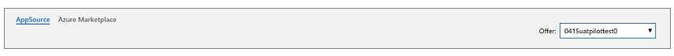

# Marketplace Insights dashboard in Partner Center

This article provides information on the Marketplace Insights dashboard in Partner Center. This dashboard displays a summary of marketplace web analytics, which enables publishers to measure customer engagement for their respective product detail pages listed on the marketplace storefronts: Microsoft AppSource and Azure Marketplace.

## Marketplace Insights dashboard

To access the **Marketplace Insights dashboard** in Partner Center, open the **[Analyze tab](https://partner.microsoft.com/dashboard/commercial-marketplace/analytics/summary)** under Commercial Marketplace.

You can view graphical representations of the following items:  

- [Marketplace Insights summary](#marketplace-insights-summary)
- [Page visits by geography](#page-visits-by-geography)  
- [Page visits versus unique visitors trend](#page-visits-versus-unique-visitors-trend)
- [Call to action versus unique visitors with CTAs](#call-to-action-versus-unique-visitors-with-ctas)
- [Page visits and call to action by offers](#page-visits-and-calls-to-action-by-offers)
- [Call to action percentage trend](#call-to-action-percentage-trend)
- [Page visits and calls to action by referral domains](#page-visits-and-calls-to-action-by-referral-domains)
- [Marketplace Insights details table](#marketplace-insights-details-table)

>[!NOTE]
> For detailed definitions of analytics terminology, see [Frequently asked questions and terminology for commercial marketplace analytics](./faq-terminology.md).

### Insights dashboard layout

You can view the Marketplace metrics in a variety of ways:

- Storefront tabs
- Page filters
- Date filters

**Storefront tabs**: You can view the metrics of your offers separately via the AppSource & Azure Marketplace tabs. Select the offer(s) from the offer dropdown list on the right to see a visualization of the metrics for the selected offer(s). By default, all offers are selected.

**Insights page filters**: These filters are applied at the offer (product detail page) level. You can select multiple filters for the criteria you would like to view. This filter applies to the entire Marketplace Insights section including charts and details.

- Offer Names are listed only for the offers that have page visits in the selected date range.  
- The default selection is 'All' for each of the filter options
- Applied filters show the count of selection(s) for the choices made. Applied filters will not be displayed for the default 'All' selection.

**Insights date filters**: This filter applies to the entire Marketplace Insights section. Filters can include pre-determined date ranges or a custom date range.

## Marketplace Insights summary

The Marketplace insights summary section displays a count of **Page visits**, **Calls to action**, and **Unique visitors** for the selected date range.

### Page visits

This number represents the count of distinct user sessions on the offer page (product detail page) for a selected date range. The red/green percentage indicator represents the growth % of page visits. The trend chart represents the month-to-month count of page visits.

### Unique visitors

This number represents the distinct visitor count during the selected date range for the offer(s) selected in the page filter. A visitor who has visited one or more product detail pages will be counted as one unique visitor.

### Call to action

This number represents the count of **Call to Action** button clicks completed on the offer page (product detail page). **Calls to action** are counted when the **Get it now**, **Free trial**, **Contact me**, and **Test drive** buttons are selected.

## Page visits by geography

The heatmap below displays the count of **Page visits**, **Calls to action**, and **Unique visitors according to customer country**. Higher page visits are represented by darker map colors and lower page visits are represented by lighter map colors.

The heatmap includes the following capabilities:

- The heatmap has a supplementary grid to view the details of **Page visits**, **Calls to action** and **Unique visitors** in a specific location; you can zoom into a specific location if preferred.  
- **Countries/regions spread** is the count of all countries/regions from where your customers have reported page visits during the selected date range.
- You can search and select a country in the grid to zoom into the location in the map. Revert to the original view by selecting **Home** on the map.

## Page visits versus unique visitors trend

The columns below represent the count of monthly page visits, which are displayed on the Y-axis (axis on the left side of the chart). The trend line represents the monthly trend of unique visitors, which is displayed on the secondary Y-Axis (axis on the right side of the chart), for your offers published in the storefronts: Azure Marketplace and AppSource.

## Call to action versus unique visitors with CTAs

The stacked columns represent monthly calls to action (CTA), which are broken down by CTA types (**Get it now**, **Contact me**, and **Free Trial**) and plotted on the Y-axis (axis on the left side of the page). The trend line represents the monthly trend of unique visitors with CTAs, which is displayed on the secondary Y-Axis (axis on the right side of the chart), for your offers published in Azure Marketplace and AppSource.

## Page visits and calls to action by offers

The outer pie chart represents the breakdown of **Page visits** based on offers you have published in the marketplace and selected in the filter. The inner chart represents the **Calls to action** breakdown for the same offers.

## Call to action percentage trend

The **Call to action percentage trend** presents the CTA percentage for the offers published in the marketplace. CTA % = (CTAs/page visits) * 100.

## Page visits and calls to action by referral domains

The graph below presents the top 50 referral domains. Selecting a specific referral domain shows the monthly trend of page visits and calls to action on the chart to the right.

## Marketplace Insights details table

This table provides a list view of the page visits and the calls to action of your selected offers sorted by date.

- The data can be extracted to a CSV file if the count of records is less than 1000.
- If the count of records is over 1000, exported data will be asynchronously placed in a downloads page for the next 30 days.
- Filters can be applied to display the data that you are interested in. Data can be filtered by Offer names and Campaign names.  

## Next steps

- For an overview of analytics reports available in the Partner Center commercial marketplace, see [Analytics for the commercial marketplace in Partner Center](./analytics.md).
- For graphs, trends, and values of aggregate data that summarize marketplace activity for your offer, see [Summary Dashboard in commercial marketplace analytics](./summary-dashboard.md).
- For information about your orders in a graphical and downloadable format, see [Orders Dashboard in commercial marketplace analytics](./orders-dashboard.md).
- For Virtual Machine (VM) offers usage and metered billing metrics, see [Usage Dashboard in commercial marketplace analytics](./usage-dashboard.md).
- For detailed information about your customers, including growth trends, see [Customer Dashboard in commercial marketplace analytics](./customer-dashboard.md).
- For a list of your download requests over the last 30 days, see [Downloads Dashboard in commercial marketplace analytics](./downloads-dashboard.md).
- To see a consolidated view of customer feedback for offers on Azure Marketplace and AppSource, see [Ratings and reviews dashboard in commercial marketplace analytics](./ratings-reviews.md).
- For frequently asked questions about commercial marketplace analytics and for a comprehensive dictionary of data terms, see [Frequently asked questions and terminology for commercial marketplace analytics](./faq-terminology.md).
