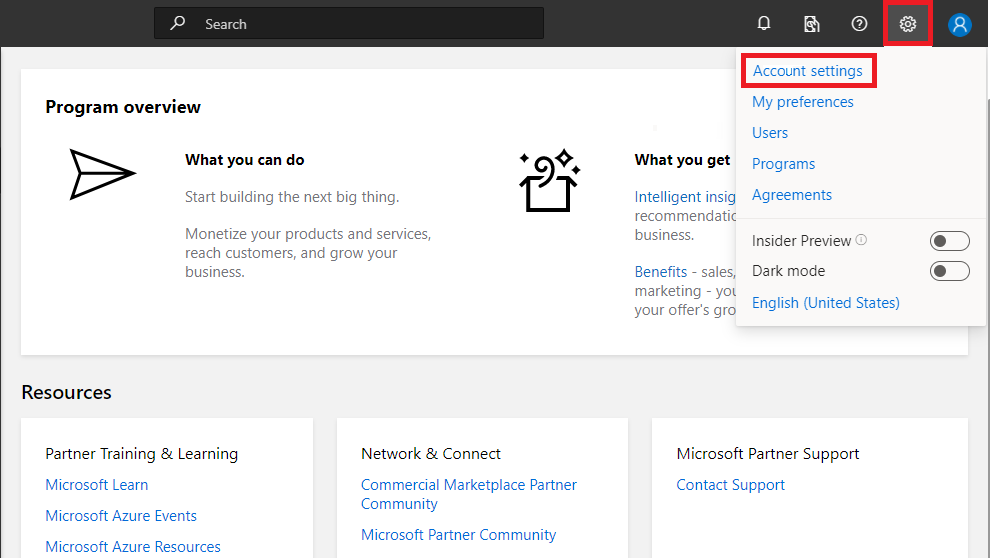

# How to manage your Commercial Marketplace account in Partner Center 

Once you've [created a Partner Center account](./create-account.md), you can manage your account and offers using the [Commercial Marketplace dashboard](https://partner.microsoft.com/dashboard/commercial-marketplace/overview).

In this article, we'll dive into how to manage your Partner Center account, including how to: 

- [Access your Partner Center account settings](#access-your-account-settings)
- [Find your Publisher ID, Seller ID, User ID, and Azure AD tenants](#account-details)
- [Update contact information](#contact-info)
- [Manage financial details (payout account, tax profile, payout hold status)](#financial-details)
- [Set up Tracking GUIDs for monitoring customer usage](#tracking-guids)
- [Manager users](#manage-users)
- [Manager groups](#manage-groups)
- [Manager Azure AD applications](#manage-azure-ad-applications)
- [Define user roles and permissions](#define-user-roles-and-permissions)
- [Manage Azure AD tenants (work accounts)](#manage-tenants)
- [Manager Partner Center Agreements](#agreements)

## Access your account settings

If you have not already done so, you (or your organization's administrator) should access the [account settings](https://partner.microsoft.com/dashboard/account/management) for your Partner Center account in order to:
- check your company's account verification status
- confirm your Seller ID, MPN ID, Publisher ID, and contact information, including the company approver and seller contact
- set up your company’s financial details, including tax exemptions if appropriate
- create user accounts for anyone who will use your business account in Partner Center

### Open developer settings

Account settings is located at the upper right corner of your [Commercial Marketplace dashboard](https://partner.microsoft.com/dashboard/commercial-marketplace) in Partner Center. Select the gear icon (near the upper right corner of the dashboard) and then select **Developer settings**. 

Inside **Account settings**, you will be able to view your:
- **Account details**: Account type and Account status
- **Publisher IDs**: Seller ID, User ID, Publisher ID, Azure AD tenants, etc.
- **Contact info**: Publisher display name, Seller contact name, email, phone, and address
- **Financial details**: Payout account, Tax profile, and Payout hold status
- **Devices**: Any testing devices associated with your account
- **Tracking GUIDs**: Any tracking GUIDs associate with your account

### Account details

In the Account details section, you can see basic info, like your **Account type** (Company or Individual) and the **Verification status** of your account. During your account verification process, these settings will display each step required, including email verification, employment verification, and business verification. You can also update your email here and resend the verification if needed. 

### Publisher IDs

In the Publisher IDs section, you can see your **Seller ID**, **MPN ID**, and **Publisher ID**. These values are assigned by Microsoft to uniquely identify your developer account and can't be edited.

### Contact info

In the Contact info section, you can see your **Publisher display name**, **Seller contact info** (the contact name, email, phone number, and address for the company seller), and the **Company approver** (the name, email, and phone number of the individual with authority to approve decisions for the company). 

### Financial details

In the Financial details section, you can provide or update your financial information if you publish paid apps, add-ins, or services. 

If you only plan to list free offers, you don't need to set up a payout account or fill out any tax forms. If you change your mind later, and decide you do want to sell through Microsoft, you can set up your payout account and fill out tax forms at that time. 

#### Payout account

A payout account is the bank account to which proceeds are sent from your sales. This bank account must be in the same country where you registered your Partner Center account.

To setup your payout account, you need to **associate your Microsoft Account**:
1. In **Account settings**, under the **Financial details** section, select **Associate your Microsoft Account**. 
2. When prompted, sign in with your Microsoft Account (MSA). This account cannot already be associated with another Partner Center account. 
3. To complete the setup of your payout account, log completely out of Partner Center, then log back in with your Microsoft Account (rather than your work account). 

Now that your Microsoft Account is associated, to add a payout account, you will need to:
- **Choose a payment method**: Bank account or PayPal
- **Add payment information**: This may include choosing an account type (checking or savings), entering the account holder name, account number, and routing number, billing address, phone number, or PayPal email address. *For more information about using PayPal as your account payment method and to find out whether it is supported in your market region, see [PayPal info](https://docs.microsoft.com/windows/uwp/publish/setting-up-your-payout-account-and-tax-forms#paypal-info).

> [!IMPORTANT]
> Changing your payout account can delay your payments by up to one payment cycle. This delay occurs because we need to verify the account change, just as we do when first setting up the payout account. You'll still get paid for the full amount after your account has been verified; any payments due for the current payment cycle will be added to the next one.  

#### Tax profile

Review your current tax profile status, confirming the correct **Entity type** and **Tax Certificate Information** is displayed. Select **Edit** to update or complete any required forms.

In order to establish your tax status, you must specify your country of residence and citizenship and complete the appropriate tax forms associated with your country/region.

Regardless of your country of residence or citizenship, you must fill out United States tax forms to sell any offers through Microsoft. Partners who satisfy certain United States residency requirements must fill out an IRS W-9 form. Other partners outside the United States must fill out an IRS W-8 form. You can fill out these forms online as you complete your tax profile.

A United States Individual Taxpayer Identification Number (or ITIN) is not required to receive payments from Microsoft or to claim tax treaty benefits.

You can complete and submit your tax forms electronically in Partner Center; in most cases, you don't need to print and mail any forms.

Different countries and regions have different tax requirements. The exact amount that you must pay in taxes depends on the countries and regions where you sell your offers. Microsoft remits sales and use tax on your behalf in some countries. These countries will be identified in the process of listing your offer. In other countries, depending on where you are registered, you may need to remit sales and use tax for your sales directly to the local taxing authority. In addition, the sales proceeds you receive may be taxable as income. We strongly encourage you to contact the relevant authority for your country or region that can best help you determine the right tax info for your Microsoft sales transactions.

##### Withholding rates
The info you submit in your tax forms determines the appropriate tax withholding rate. The withholding rate applies only to sales that you make into the United States; sales made into non-US locations are not subject to withholding. The withholding rates vary, but for most developers registering outside the United States, the default rate is 30%. You have the option of reducing this rate if your country has agreed to an income tax treaty with the United States.

##### Tax treaty benefits
If you are outside the United States, you may be able to take advantage of tax treaty benefits. These benefits vary from country to country, and may allow you to reduce the amount of taxes that Microsoft withholds. You can claim tax treaty benefits by completing Part II of the W-8BEN form. We recommend that you communicate with the appropriate resources in your country or region to determine whether these benefits apply to you.

[Learn more about tax details for Windows app/game developers and Azure Marketplace publishers](https://docs.microsoft.com/windows/uwp/publish/tax-details-for-paid-apps).

#### Payout hold status

By default, Microsoft sends payments on a monthly basis. However, you have the option to put your payouts on hold, which will prevent sending payments to your account. If you choose to put your payouts on hold, we’ll continue to record any revenue that you earn and provide the details in your **Payout summary**. However, we won’t send any payments to your account until you remove the hold. 

To place your payments on hold, go to **Account settings**. Under **Financial details**, in the **Payout hold status** section, toggle the slider to **On**. You can change your payout hold status at any time, but be aware that your decision will impact the next monthly payout. For example, if you want to hold April’s payout, make sure to set your payout hold status to **On** before the end of March.

Once you have set your payout hold status to **On**, all payouts will be on hold until you toggle the slider back to **Off**. When you do so, you’ll be included during the next monthly payout cycle (provided any applicable payment thresholds have been met). For example, if you’ve had your payouts on hold, but would like to have a payout generated in June, then make sure to toggle the payout hold status to **Off** before the end of May.

> [!NOTE]
> Your **Payout hold status** selection applies to **all** revenue sources that are paid through Microsoft Partner Center, including Azure Marketplace, AppSource, Microsoft Store, advertising, etc.). You cannot select different hold statuses for each revenue source.

### Devices

The device management settings apply only to UWP publishing. [Learn more](https://docs.microsoft.com/windows/uwp/publish/manage-account-settings-and-profile#additional-settings-and-info).

### Tracking GUIDs

Globally Unique Identifiers (GUIDs) are unique reference numbers (with 32 hexadecimal digits) that can be used for tracking your Azure usage. 

To create GUIDs for tracking, you should use a GUID generator. The Azure Storage team has created a [GUID generator form](https://aka.ms/StoragePartners) that will email you a GUID of the correct format and can be reused across the different tracking systems.

We recommend you create a unique GUID for every offer and distribution channel for each product. You can opt to use a single GUID for the product's multiple distribution channels if you do not want reporting to be split.

If you deploy a product by using a template and it is available on both the Azure Marketplace and on GitHub, you can create and register 2 distinct GUIDS:

*	Product A in Azure Marketplace
*	Product A on GitHub

Reporting is done by the partner value (Microsoft Partner ID) and the GUIDs. You can also track GUIDs at a more granular level aligning to each plan within your offer.

For more information, see the [Tracking Azure customer usage with GUIDs FAQ](https://docs.microsoft.com/azure/marketplace/azure-partner-customer-usage-attribution#faq).

## Multi-user account management

Partner Center leverages [Azure Active Directory](https://docs.microsoft.com/azure/active-directory/fundamentals/active-directory-whatis) (Azure AD) for multi-user account access and management. Your organization's Azure AD is automatically associated with your Partner Center account as part of the enrollment process. 

## Manage Users

The **Users** section of Partner Center (under **Account Settings**) let's you use Azure AD to manage the users, groups, and Azure AD applications that have access to your Partner Center account. Note that in order to manage users, you must be signed in with your [work account](./company-work-accounts.md) (the associated Azure AD tenant). To manage users within a different work account / tenant, you will need to sign out and then sign back in as a user with **Manager** permissions on that work account / tenant. 

Once you are signed in with your work account (Azure AD tenant), you can:
- [Add or remove users](#add-or-remove-users)
- [Change a user password](#change-a-user-password)
- [Add or remove groups](#add-or-remove-users)
- [Add or remove Azure AD applications](#add-new-azure-ad-applications)
- [Manage keys for an Azure AD application](#manage-keys-for-an-azure-ad-application)
- [Define user roles and permissions](#define-user-roles-and-permissions)

Keep in mind that all Partner Center users (including groups and Azure AD applications) must have an active work account in an [Azure AD tenant](#manage-tenants) that is associated with your Partner Center account. 

### Add or remove users

Your account must have [**Manager-level**](#define-user-roles-and-permissions) permissions for the [work account (Azure AD tenant)](./company-work-accounts.md) in which you want to add or edit users.

#### Add existing users

To add users to your Partner Center account that already exist in your company's [work account (Azure AD tenant)](./company-work-accounts.md):

1. Go to **Users** (under **Account settings**) and select **Add users**.
2. Select one or more users from the list that appears. You can use the search box to search for specific users.
*If you select more than one user to add to your Partner Center account, you must assign them the same role or set of custom permissions. To add multiple users with different roles/permissions, repeat these steps for each role or set of custom permissions.
3.	When you are finished choosing users, click **Add selected**.
5.	In the **Roles** section, specify the role(s) or customized permissions for the selected user(s).
6.	Select **Save**.

#### Create new users

To create brand new user accounts, you must have an account with [**Global administrator**](https://docs.microsoft.com/azure/active-directory/users-groups-roles/directory-assign-admin-roles) permissions. 

1. Go to **Users** (under **Account settings**), select **Add users**, then choose **Create new users**.
1. Enter a first name, last name, and username for each new user. 
1. If you want the new user to have a global administrator account in your organization's directory, check the box labeled **Make this user a Global administrator in your Azure AD, with full control over all directory resources**. This will give the user full access to all administrative features in your company's Azure AD. They'll be able to add and manage users in your organization's work account (Azure AD tenant), though not in Partner Center, unless you grant the account the appropriate role/permissions. 
1. If you checked the box to **Make this user a Global administrator**, you'll need to provide a **Password recovery email** for the user to recover their password if necessary.
1. In the **Group membership** section, select any groups to which you want the new user to belong.
1. In the **Roles** section, specify the role(s) or customized permissions for the user.
1. Select **Save**.

Creating a new user in Partner Center will also create an account for that user in the work account (Azure AD tenant) to which you are signed in. Making changes to a user's name in Partner Center will make the same changes in your organization's work account (Azure AD tenant).

#### Invite new users by email

To invite users that are not currently a part of your company work account (Azure AD tenant) via email, you must have an account with [**Global administrator**](https://docs.microsoft.com/azure/active-directory/users-groups-roles/directory-assign-admin-roles) permissions. 

1. Go to **Users** (under **Account settings**), select **Add users**, then choose **Invite users by email**.
2. Enter one or more email addresses (up to ten), separated by commas or semicolons.
3. In the **Roles** section, specify the role(s) or customized permissions for the user.
4. Select **Save**.

The users you invited will get an email invitation to join your Partner Center account. A new guest-user account will be created in your work account (Azure AD tenant). Each user will need to accept their invitation before they can access your account.

If you need to resend an invitation, visit the **Users** page, find the invitation in the list of users, select their email address (or the text that says *Invitation pending*). Then, at the bottom of the page, select **Resend invitation**.
 

> [!NOTE]
> If your organization uses [directory integration](https://go.microsoft.com/fwlink/p/?LinkID=724033) to sync the on-premises directory service with your Azure AD, you won't be able to create new users, groups, or Azure AD applications in Partner Center. You (or another admin in your on-premises directory) will need to create them directly in the on-premises directory before you'll be able to see and add them in Partner Center.

#### Remove a user

To remove a user from your work account (Azure AD tenant), go to **Users** (under **Account settings**), select the user that you would like to remove using the checkbox in the far right column, then choose **Remove** from the available actions. A pop-up window will appear for you to confirm that you want to remove the selected user(s).

#### Change a user password

If one of your users needs to change their password, they can do so themselves if you provided a **Password recovery email** when creating the user account. You can also update a user's password by following the steps below. To change a user's password in your company work account (Azure AD tenant), you must be signed in on an account with [**Global administrator**](https://docs.microsoft.com/azure/active-directory/users-groups-roles/directory-assign-admin-roles) permissions. Note that this will change the user's password in your Azure AD tenant, along with the password they use to access Partner Center.

1.	From the **Users** page (under **Account settings**), select the name of the user account that you want to edit.
2.	Select the **Reset password** button at the bottom of the page.
3.	A confirmation page will appear showing the login information for the user, including a temporary password. Be sure to print or copy this info and provide it to the user, as you won't be able to access the temporary password after you leave this page.

## Manage Groups

Groups allow you to control multiple user roles and permissions all together.

#### Add an existing group

To add a group that already exists in your organization's work account (Azure AD tenant) to your Partner Center account: 

1.	From the **Users** page (under **Account settings**), select **Add groups**.
2.	Select one or more groups from the list that appears. You can use the search box to search for specific groups.
If you select more than one group to add to your Partner Center account, you must assign them the same role or set of custom permissions. To add multiple groups with different roles/permissions, repeat these steps for each role or set of custom permissions.
3.	When you are finished choosing groups, click **Add selected**.
4.	In the **Roles** section, specify the role(s) or customized permissions for the selected group(s). All members of the group will be able to access your Partner Center account with the permissions you apply to the group, regardless of the roles and permissions associated with their individual account.
5.	Select **Save**.

When you add an existing group, every user who is a member of that group will be able to access your Partner Center account, with the permissions associated with the group's assigned role.

#### Add a new group

To add a brand-new group to your Partner Center account: 

1.	From the **Users** page (under **Account settings**), select **Add groups**.
2.	On the next page, select **New group**.
3.	Enter the display name for the new group.
4.	Specify the role(s) or customized permissions for the group. All members of the group will be able to access your Partner Center account with the permissions you apply here, regardless of the roles/permissions associated with their individual account.
5.	Select user(s) for the new group from the list that appears. You can use the search box to search for specific users.
6.	When you are finished selecting users, click **Add selected** to add them to the new group.
7.	Select **Save**.

Note that this new group will be created in your organization's work account (Azure AD tenant) as well, not just in your Partner Center account.

#### Remove a group

To remove a group from your work account (Azure AD tenant), go to **Users** (under **Account settings**), select the group that you would like to remove using the checkbox in the far right column, then choose **Remove** from the available actions. A pop-up window will appear for you to confirm that you want to remove the selected group(s).

## Manage Azure AD applications

You can allow applications or services that are part of your company's Azure AD to access your Partner Center account. 

#### Add existing Azure AD applications 

To add applications that already exist in your company's Azure Active Directory: 

1.	From the **Users** page (under **Account settings**), select **Add Azure AD applications**.
2.	Select one or more Azure AD applications from the list that appears. You can use the search box to search for specific Azure AD applications. If you select more than one Azure AD application to add to your Partner Center account, you must assign them the same role or set of custom permissions. To add multiple Azure AD applications with different roles/permissions, repeat these steps for each role or set of custom permissions.
3.	When you are finished selecting Azure AD applications, click **Add selected**.
5.	In the **Roles** section, specify the role(s) or customized permissions for the selected Azure AD application(s).
6.	Select **Save**.

#### Add new Azure AD applications 

If you want to grant Partner Center access to a brand-new Azure AD application account, you can create one in the **Users** section. Note that this will create a new account in your company work account (Azure AD tenant), not just in your Partner Center account. If you are primarily using this Azure AD application for Partner Center authentication, and don't need users to access it directly, you can enter any valid address for the **Reply URL** and **App ID URI**, as long as those values are not used by any other Azure AD application in your directory.

1.	From the **Users** page (under **Account settings**), select **Add Azure AD applications**.
2.	On the next page, select **New Azure AD application**.
3.	Enter the **Reply URL** for the new Azure AD application. This is the URL where users can sign in and use your Azure AD application (sometimes also known as the App URL or Sign-On URL). The **Reply URL** can't be longer than 256 characters and must be unique within your directory.
4.	Enter the **App ID URI** for the new Azure AD application. This is a logical identifier for the Azure AD application that is presented when a single sign-on request is sent to Azure AD. Note that the **App ID URI** must be unique for each Azure AD application in your directory. This ID can't be longer than 256 characters. For more info about the App ID URI, see [Integrating applications with Azure Active Directory](https://docs.microsoft.com/azure/active-directory/develop/quickstart-modify-supported-accounts#change-the-application-registration-to-support-different-accounts).
5.	In the **Roles** section, specify the role(s) or customized permissions for the Azure AD application.
6.	Select **Save**.

After you add or create an Azure AD application, you can return to the **Users** section and select the application name to review settings for the application, including the Tenant ID, Client ID, Reply URL, and App ID URI.

#### Remove an application

To remove an application from your work account (Azure AD tenant), go to **Users** (under **Account settings**), select the application that you would like to remove using the checkbox in the far right column, then choose **Remove** from the available actions. A pop-up window will appear for you to confirm that you want to remove the selected application(s).

#### Manage keys for an Azure AD application

If your Azure AD application reads and writes data in Microsoft Azure AD, it will need a key. You can create keys for an Azure AD application by editing its information in Partner Center. You can also remove keys that are no longer needed.

1.	From the **Users** page (under **Account settings**), select the name of the Azure AD application. You'll see all of the active keys for the Azure AD application, including the date on which the key was created and when it will expire. 
2. To remove a key that is no longer needed, select **Remove**.
3.	To add a new key, select **Add new key**.
4.	You will see a screen showing the **Client ID** and **Key values**. Be sure to print or copy this information, as you won't be able to access it again after you leave this page.
4.	If you want to create more keys, select **Add another key**.

### Define user roles and permissions

Your company's users can be assigned the following roles and permissions in the Commercial Marketplace program on Partner Center. 

Note
Azure Active Directory (AAD) tenant roles include global admin, user admin, and CSP roles. Non-AAD roles are those roles that do not manage the tenant and they include MPN admin, business profile admin, referral admin, incentive admin, and incentive user.

|**Role**|**Permissions**|
|----------------------------------|:---------------------------------|
|Global admin|•	Can access all Microsoft account/services with full privileges
|      |•	Create support tickets for the Partner Center
||•	View agreements, price lists, and offers
||•	View, create, and manage partner users|
|Manager|•	Can access all Microsoft account features except tax and payout settings
|      |•	Can manage users, roles, and work accounts (tenants)|
|Developer|•	Can upload packages, submit apps and add-ons, and view the Usage report for telemetry details
|      |•	Can't access financial info or account settings|
|Business Contributor|•	Can access financial information and set pricing details
|      |•	Can't create or submit new apps and add-ons|
|Financial Contributor|•	Can view payout reports
|      |•	Can't make changes to apps or settings|
|Marketer|•	Can respond to customer reviews and non-financial reports
|      |•	Can't make changes to apps or settings|

For more information about managing roles and permissions in other areas of Partner Center, such as Azure Active Directory (AD), Cloud Solution Provider (CSP), Control Panel Vendor (CPV),Guest users, or Microsoft Partner Network (MPN), see [Assign users roles and permissions in Partner Center](https://docs.microsoft.com/partner-center/permissions-overview).

## Manage Tenants

An Azure Active Directory (AD) tenant, also referred to as your "work account" throughout this documentation, is a representation of your organization set up in the Azure portal and helps you to manage a specific instance of Microsoft cloud services for your internal and external users. If your organization subscribed to a Microsoft cloud service, such as Azure, Microsoft Intune, or Office 365, an Azure AD tenant was established for you. 

You can set up multiple tenants to use with Partner Center. Any user with the **Manager** role in the Partner Center account will have the option to add and remove Azure AD tenants from the account.  

### Add an existing tenant

To associate another Azure AD tenant with your Partner Center account:

1.	From the **Tenants** page (under **Account settings**), select **Associate another Azure AD tenant**.
2. Enter your Azure AD credentials for the tenant that you want to associate.
3. Review the organization and domain name for your Azure AD tenant. To complete the association, select **Confirm**.

If the association is successful, you will then be ready to add and manage account users in the **Users** section in Partner Center.

### Create a new tenant

To create a brand new Azure AD tenant with your Partner Center account:

1.	From the **Tenants** page (under **Account settings**), select **Create a new Azure AD tenant**.
2. Enter the directory information for your new Azure AD:
    - **Domain name**: The unique name that we’ll use for your Azure AD domain, along with “.onmicrosoft.com”. For example, if you entered “example”, your Azure AD domain would be “example.onmicrosoft.com”.
    - **Contact email**: An email address where we can contact you about your account if necessary.
    - **Global administrator user account info**: The first name, last name, username, and password that you want to use for the new global administrator account.
3. Select **Create** to confirm the new domain and account info.
4. Sign in with your new Azure AD global administrator username and password to begin [adding and managing users](#manage-users).

For more information about creating new tenants inside your Azure portal, rather than via the Partner Center portal, see the article [Create a new tenant in Azure Active Directory](https://docs.microsoft.com/azure/active-directory/fundamentals/active-directory-access-create-new-tenant).

### Remove a tenant

To remove a tenant from your Partner Center account, find its name on the **Tenants** page (in **Account settings**), then select **Remove**. You’ll be prompted to confirm that you want to remove the tenant. Once you do so, no users in that tenant will be able to sign into the Partner Center account, and any permissions you have configured for those users will be removed.

When you remove a tenant, all users that were added to the Partner Center account from that tenant will no longer be able to sign in to the account.

> [!TIP]
> You can’t remove a tenant if you are currently signed into Partner Center using an account in the same tenant. To remove a tenant, you must sign in to Partner Center as an **Manager** for another tenant that is associated with the account. If there is only one tenant associated with the account, that tenant can only be removed after signing in with the Microsoft account that opened the account.

## Agreements

The **Agreements** section of Partner Center (under **Account Settings**) let's you view a list of the publishing agreements that you've authorized. These agreements are listed according to name and version number, including the date it was accepted and the name of the user that accepted the agreement. 

**Actions needed** may appear at the top of this page if there are agreement updates that need your attention. To accept an updated agreement, first read the linked Agreement Version, then select **Accept agreement**. 

For information about Cloud Solution Provider (CSP) agreements in Partner Center, visit [Microsoft Cloud Agreements by region and language](https://docs.microsoft.com/partner-center/agreements).

## Next steps

- [Create a new SaaS offer](./create-new-saas-offer.md)
