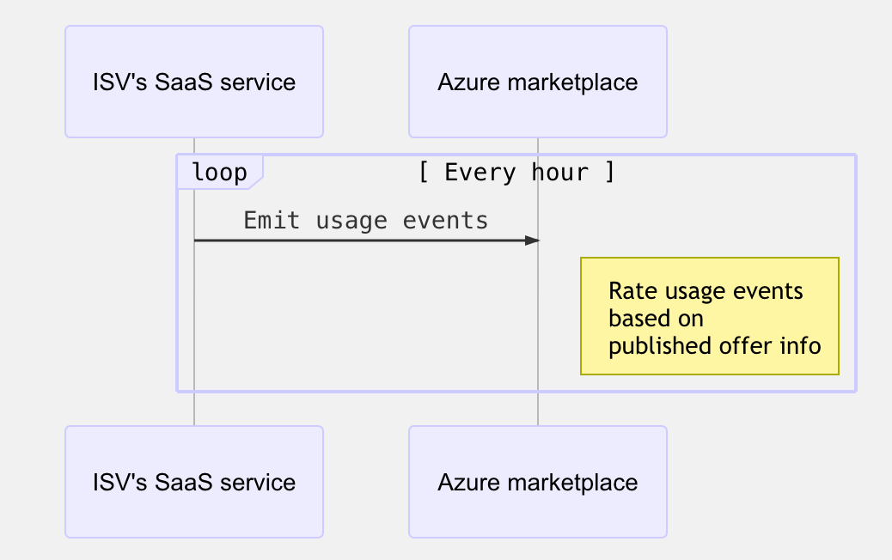

# Marketplace metering service APIs - FAQ

Once an Azure user subscribes to a SaaS service that includes metered billing, you will track consumption for each billing dimension being used by the customer. If the consumption exceeds the included quantities set for the term selected by the customer, your service will emit usage events to Microsoft.

## Emit usage events

>[!Note]
>This section is applicable only for SaaS offers, where at least one of the plans has metering service dimensions defined at the time of publishing the offer.

See the [SaaS batch usage event API](./marketplace-metering-service-apis.md#batch-usage-event) for information on the API contract for emitting usage events.

### How often is it expected to emit usage?

Ideally, you are expected to emit usage every hour for the past hour, only if there is usage in the previous hour.

### What is the maximum delay between the time an event occurs, and the time a usage event is emitted to Microsoft?

Ideally, usage event is emitted every hour for events that occurred in the past hour. However, delays are expected. The maximum delay allowed is 24 hours, after which usage events will not be accepted.

For example, if a usage event occurs at 1 PM on a day, you have until 1 PM on the next day to emit a usage event associated with this event. This means in the case of the system emitting usage has a down time, it can recover and then send the usage event for the hour interval in which the usage happened, without loss of fidelity.

### What happens when you send more than one usage event on the same hour?

Only one usage event is accepted for the hour interval. The hour interval starts at minute 0 and ends at minute 59.  If more than one usage event is emitted for the same hour interval, any subsequent usage events are dropped as duplicates.

### What happens when you emit usage for a SaaS subscription that has been unsubscribed already?

Any usage event emitted to marketplace platform will not be accepted after a SaaS subscription has been deleted.

### Can you get a list of all SaaS subscriptions, including active and unsubscribed subscriptions?

Yes, when you call the `GET /saas/subscriptions` API it includes a list of all SaaS subscriptions. The status field in the response for each SaaS subscription captures whether the subscription is active or unsubscribed. The call to list Subscriptions returns a maximum of 100 subscriptions at the time.

## Next steps

- See [Marketplace metering service APIs](./marketplace-metering-service-apis.md) for more information.
