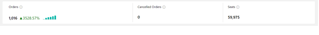
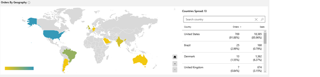
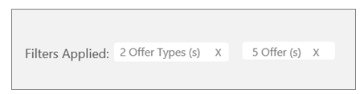
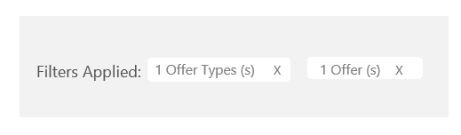

# Orders dashboard in commercial marketplace analytics

This article provides information on the **Orders dashboard** in Partner Center. This dashboard displays information about your orders in a graphical and downloadable format.

To access the **Orders dashboard** in the Partner Center analytics tools, open the **[Analyze dashboard](https://partner.microsoft.com/dashboard/commercial-marketplace/analytics/summary)** under Commercial Marketplace.

>[!NOTE]
> For detailed definitions of analytics terminology, see [Frequently asked questions and terminology for commercial marketplace analytics](./faq-terminology.md).

## Orders dashboard

The **Orders dashboard** of the **Analyze** menu displays the current orders for all of your SaaS offers. You can view graphical representations of the following items:

- [Order summary](#order-summary)
- [Orders by geography](#orders-by-geography)
- [Orders by offers](#orders-by-offers)
- [Orders trend per site versus per seat](#orders-trend-per-site-versus-per-seat)
- [Orders by SKUs](#orders-by-skus)
- [Orders and seats trend](#orders-and-seats-trend)
- [Order details table](#order-details-table)

> [!NOTE]
> There are differences between how analytics reports display in the Cloud Partner Portal (CPP) and the new commercial marketplace program in Partner Center. One specific way is that the **Seller Insights** in CPP has an **Orders & Usage** tab, which displays data for usage-based offers and non-usage-based offers. In Partner Center, the **Orders** page has a separate tab for SaaS Offers.

## Order dashboard details

This section describes the analytics reports in more detail.

### Order Summary

The Order Summary section displays a count of all purchased orders (excluding canceled orders), canceled orders, and seats.

The percentage value next to Total Orders represents the amount of growth the selected date range.

- A green triangle pointing upward indicates a positive growth trend.
- A red triangle pointing downward indicates a negative growth trend relative to the previous month.
- Growth trends are represented by micro bar graphs. You can display the value for each month by hovering over the columns within the chart.
- Canceled orders are a count of orders that were previously purchased and then canceled during the selected date range.
- Seats are a count of seats created during the selected date range.

### Orders by geography

The **Orders by geography** heatmap displays a count of your orders on a world map and shows seats mapped based on Customer Country/Region. This heatmap functions the same as the **[Customer by geography heatmap](./customer-dashboard.md#customer-by-geography)**.

### Orders by offers

The **Orders by offers** donut graph organizes orders (including canceled orders) according to their offer names.

- The top offers are displayed in the graph and the rest of the offers are grouped as 'Rest All'.
- You can select specific offers in the legend to display only those offers in the graph.
- Hovering over a slice in the graph will display the number of orders and percentage of that offer compared to your total number of orders across all offers.
- The **orders by offers trend** displays month-by-month growth trends. The month column represents the number of orders by offer name. The line chart displays the growth percentage trend plotted on a z-axis.
- You can use the slider on the top of the chart to scroll right and left along the x-axis and focus on specific data points.
- You can display the trend chart by selecting a specific item on the legend.
- You can also choose to display trends and data for **canceled orders**. The graph will function in the same way as the **orders by offers** graph.

### Orders Trend per site versus per seat

The **per site versus per seat** donut chart represents the breakdown of per site SaaS and per seat SaaS orders purchased by customers (this chart includes canceled orders). The column chart represents the trend of per site SaaS and per seat SaaS orders purchased by customers (this chart includes canceled orders).

### Orders by SKUs

The **Orders by SKUs** chart represents the trend of orders at the Stock Keeping Unit (SKU) level for all your offers (this includes canceled orders). The donut chart represents the breakdown of the top five SKU orders and the column chart represents the trend of orders for the top five SKUs.

### Orders and Seats Trend

The **orders and seats trend** chart presents the top 50 offers with the highest number of orders. These are displayed on a leader board and are sorted by highest order count and order percentage.

- **Orders by SKUs**: Select an offer to view the breakdown of order count for the top five SKUs in the chart.
- **Seats by SKUs**: The monthly trend of seats for the top five SKUs. If the offer you select is not a per seat offer, you will not see any data in this area chart.

### Canceled orders by offers

The **Canceled orders by offers** pie chart organizes all of your canceled orders according to their offer names. The top offers are displayed in the graph and the rest of the offers are grouped as "Rest All." You can select specific offers in the legend to display in the graph.

- Hovering over a slice in the graph will display the number of orders and percentage of the selected offer compared to the total number of orders across all offers.
- The column chart displays month-by-month trends. The columns represent the number of canceled orders by offer name. You can use the slider on top of the chart to scroll right and left along the x-axis and focus on specific data points. You can display the trend chart by selecting a specific item on the legend.

### Order details table

The Order details table displays a numbered list of the 1000 top orders sorted by date of acquisition.

- Each column in the grid is sortable.
- The data can be extracted to a TSV file if the count of the records is less than 1000.
- If records number over 1000, exported data will be asynchronously placed in a downloads page for the next 30 days.
- Filters can be applied to the **Order details table** to display only the data that you're interested in. Data can be filtered by Country/Region, Azure license type, Marketplace license type, Offer type, Order status, Free trails, Marketplace subscription ID, Customer ID, and Company name.
- Because SaaS offers purchased through Azure Marketplace or AppSource do not require an Azure Subscription, the Marketplace Subscription ID will appear as 00000000-0000-0000-0000-000000000000 in the **Detailed orders data** section.

#### Orders Page filters

These filters are applied at the page level.

You can select multiple filters to render the chart for the criteria you choose to view and the data you want displayed in the **Detailed Order Data** grid/export. Filters are applied on the data extracted for the data range you've selected on the top right corner of the orders page.

- Offer types and offer names are only listed for offers you have orders for during the selected date range. Offer names in the list are displayed for offers types you've selected in the list.
- Applied filters show the total metrics within each selection(s) for each filter selected. Applied filters aren't displayed when the default selection is chosen.
- If **All** is selected for one of the dropdown lists, then all metrics in the page selected will be aggregated. For example: "All" in the offer types filter option means that all offer types have been selected. This is the default selection for the dropdown lists. Applied filters displays won't show anything when **All** is selected.
- **Multiple value selection**: All metrics in the page will be aggregated for all the selections made under the dropdown list. If multiple selections are made, the applied filter will show the count of all selections made. See the image below for reference.

    

- **Single value selection**: If one value is selected, the applied filter will show the count of the one filter that was selected. See below image for reference.

     

## Next steps

- For an overview of analytics reports available in the Partner Center commercial marketplace, see [Analytics for the commercial marketplace in Partner Center](./analytics.md).
- For graphs, trends, and values of aggregate data that summarize marketplace activity for your offer, see [Summary dashboard in commercial marketplace analytics](./summary-dashboard.md).
- For Virtual Machine (VM) offers usage and metered billing metrics, see [Usage dashboard in commercial marketplace analytics](./usage-dashboard.md).
- For detailed information about your customers, including growth trends, see [Customer dashboard in commercial marketplace analytics](./customer-dashboard.md).
- For a list of your download requests over the last 30 days, see [Downloads dashboard in commercial marketplace analytics](./downloads-dashboard.md).
- To see a consolidated view of customer feedback for offers on Azure Marketplace and AppSource, see [Ratings and reviews dashboard in commercial marketplace analytics](./ratings-reviews.md).
- For frequently asked questions about commercial marketplace analytics and for a comprehensive dictionary of data terms, see [Frequently asked questions and terminology for commercial marketplace analytics](./faq-terminology.md).
