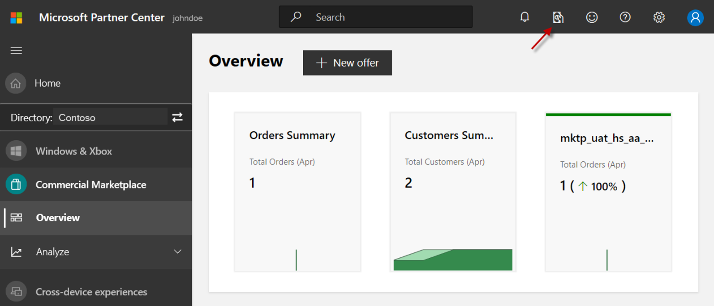

# Payout policy details

This article discusses Microsoft's payout process, payout schedule, where to find the status of a payout, and recoupment policy.

## Where to find upcoming payouts

In Partner Center, select **Payout** at the upper-right of the portal:

> [!TIP]
> Not all account roles have access to payout information. For details, see [Roles and permissions to access the payout report](./payout-summary.md).

## Payment schedules

The following sections describe our payouts process.

### Enterprise Agreement transactions after May 1, 2020

#### Update to our Commercial Marketplace publisher payout model

Beginning May 1, 2020, we are updating our payouts policy relating to products purchased in Azure Marketplace or AppSource by customers with a Microsoft Enterprise Agreement. When a customer purchases a product from Azure Marketplace or AppSource using their existing Microsoft Enterprise Agreement for transactions after May 1, 2020 we will begin issuing payouts in the next payout cycle 30-days post customer invoice. Transactions where a customer uses a credit card are unchanged and will continue to have a 30-day holding period prior to payout. This tables shows details on the payout schedule.

> [!NOTE]
> See [Process for customer non-payment](#process-for-customer-non-payment) below for the actions we take if the customer fails to pay but we have already issued a payout to you.

| Event  | Date  | Partner visibility: Partner Center payout report  |  Partner visibility: Partner Center analytics\* |
| --- | --- | --- | --- |
| Transaction or month of usage | 8/1/2020 – 8/31/2020 | N/A | **Usage report**: new consumption shown (refreshed every four hours) **Order report**: N/A |
| Term ending (month) | 8/31/2020 | N/A | **Usage report**: month end consumption shown **Order report**: N/A |
| Order generated | 9/3/2020 – 9/7/2020 | N/A | **Usage report**: consumption shown with OrderID/OrderLineItemID **Order report**: customer orders shown as ACTIVE |
| Calculate payout earning | 9/4/2020 – 9/10/2020 | Marked as **Unprocessed** in Transaction History on the Payout Dashboard | **Usage report**: consumption shown with OrderID/OrderLineItemID **Order report**: customer orders shown as ACTIVE |
| Monthly payout | 10/5/2020 | Marked as **Upcoming** in transaction History on the Payout Dashboard | **Usage report**: consumption shown with OrderID/OrderLineItemID **Order report**: customer orders shown as ACTIVE |
| Payout date | 10/15/2020 | Marked as **Sent** in Transaction History and in the Payments section of the Payout Dashboard | **Usage report**: consumption shown with OrderID/OrderLineItemID **Order report**: customer orders shown as ACTIVE |
| Customer invoice collected | 12/1/2020 | Marked as **Sent** in Transaction History and in the Payments section of the Payout Dashboard | **Usage report**: consumption shown with OrderID/OrderLineItemID **Order report**: customer orders shown as ACTIVE  |
|  |  |  |  |

\* Usage and Order reports are accessible in the Analyze section in Partner Center.

### Customers who pay using credit card or invoice

All purchases with a credit card or monthly invoice have a 30-day holding period to ensure that funds are cleared and there are no chargebacks or suspected fraud.

| Event  | Date  | Partner visibility: Partner Center payout report  |  Partner visibility: Partner Center analytics\*  |
| --- | --- | --- | --- |
| Transaction or month of usage | 8/1/2019 - 8/31/2019 | N/A | **Usage report**: new consumption shown (refreshed every four hours) **Order report**: N/A |
| Term ending (month) | 8/31/2019 | N/A | **Usage report**: month end consumption shown **Order report**: N/A |
| Order generated | 9/3/2019 – 9/7/2019 | N/A | **Usage report**: consumption shown with OrderID/OrderLineItemID **Order report**: customer orders shown as ACTIVE |
| Customer invoice collected | 9/7/2019 – 9/10/2019 | N/A | **Usage report**: consumption shown with OrderID/OrderLineItemID **Order report**: customer orders shown as ACTIVE |
| Calculate payout | 9/8/2019 -9/12/2019 | Marked as **Unprocessed** in the Transaction History on the Payout Dashboard | **Usage report**: consumption shown with OrderID/OrderLineItemID **Order report**: customer orders shown as ACTIVE |
| Monthly payout | 11/5/2019\* | Marked as **Upcoming** in the Transaction History on the Payout Dashboard | **Usage report**: consumption shown with OrderID/OrderLineItemID **Order report**: customer orders shown as ACTIVE |
| Payout date | 11/15/2019 | Marked as **Sent** in the Transaction History and in the Payments section on the Payout Dashboard | **Usage report**: consumption shown with OrderID/OrderLineItemID **Order report**: customer orders shown as ACTIVE |
|  |  |  |  |

\* Usage and Order reports are accessible in the Analyze section in Partner Center.

### Enterprise Agreement transactions prior to May 1, 2020

All purchases occurring before this date are processed and paid per the schedule below after Microsoft has collected payment from customers and processed the marketplace fee.

| Event  | Date  | Partner visibility: Partner Center payout report  |  Partner visibility: Partner Center analytics\*  |
| --- | --- | --- | --- |
| Transaction or month of usage | 8/1/2019 – 8/31/2019 | N/A | **Usage report**: new consumption shown (refreshed every four hours) **Order report**: N/A |
| Term ending (month) | 8/31/2019 | N/A | **Usage report**: month end consumption shown **Order report**: N/A |
| Order generated | 9/3/2019 – 9/7/2019 | N/A | **Usage report**: consumption shown with OrderID/OrderLineItemID **Order report**: customer orders shown as ACTIVE |
| Customer invoice collected | 12/1/2019 | N/A | **Usage report**: consumption shown with OrderID/OrderLineItemID **Order report**: customer orders shown as ACTIVE |
| Calculate payout | 12/5/2019 –12/7/2019 | Marked as **Unprocessed** in the Transaction History on the Payout Dashboard | **Usage report**: consumption shown with OrderID/OrderLineItemID **Order report**: customer orders shown as ACTIVE |
| Monthly payout | 1/5/2019 | Marked as **Upcoming** in the transaction History on the Payout Dashboard | **Usage report**: consumption shown with OrderID/OrderLineItemID **Order report**: customer orders shown as ACTIVE |
| Payout date | 1/15/2019 | Marked as **Sent** in Transaction History and in the Payments section on the Payout Dashboard | **Usage report**: consumption shown with OrderID/OrderLineItemID **Order report**: customer orders shown as ACTIVE |
|  |  |  |  |

\* Usage and Order reports are accessible in the Analyze section in Partner Center.

## Process for customer non-payment

On rare occasions, Microsoft is unable to collect payments from customers for their commercial marketplace purchases. When a customer fails to pay Microsoft according to their billing schedule, we begin the collections process. This process takes approximately four months and involves persistent communication from Microsoft. If payment is not received by the end of this process, Microsoft writes off the funds as uncollectable.

Per the payout process articulated here, Microsoft may have already paid out funds to publishers (you) that are ultimately uncollectable. Therefore, we have a process for reconciling these amounts. To ensure you have warning that your (already received) payment may be reconciled, you will be notified when a customer is in the collections process and purchases are likely to be written off.

Microsoft will recoup any payouts already paid to you using one of the following methods: (1) Microsoft may subtract the unpaid amounts from future payouts; for example, if $1,000 in payouts are deemed uncollectable and written off, your future payouts will be withheld until the $1,000 is recovered, or (2) Microsoft may request a refund or invoice publishers for any uncollected amounts.

The following is an example schedule:

| Event | Approximate date | Partner visibility |
| --- | --- | --- |
| Example payout date | 10/15/2020 | Marked as **Sent** in Transaction History and in Payments section in Payout Dashboard |
| If customer does not pay Microsoft | 12/2/2020 – 12/5/2020 | No change, same as above |
| Customer receives first late payment email | 12/6/2020 | None |
| Customer receives regular emails of increasing urgency | 12/7/2020 – 1/31/2021 | None |
| Publisher is notified write-off is likely | 1/7/2021 | Email notification sent to publisher that their customer has not yet sent payment. Transaction ID and dollar amount are included. |
| Customer receives termination notice | 2/1/2021 | None |
| Collection process ends / funds are written off | 2/15/2021 | Email notification sent to publisher that funds have been written off. Transaction ID and dollar amount are included. |
| Payout is deducted | 3/1/2021 | Publisher will see negative transaction in Partner Center Payout Statement |
| Payout is withheld | 3/15/2021 | Future payouts will be shown in Partner Center Payout Statement. Publisher will not receive payment until balance is no longer negative.  |
|||

## Next Step

- [Tax details](./tax-details-paid-transactions.md)
