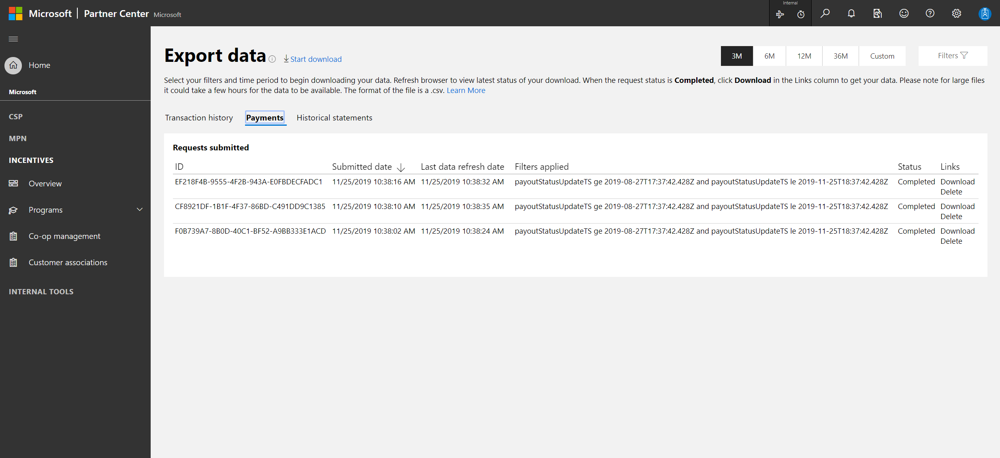
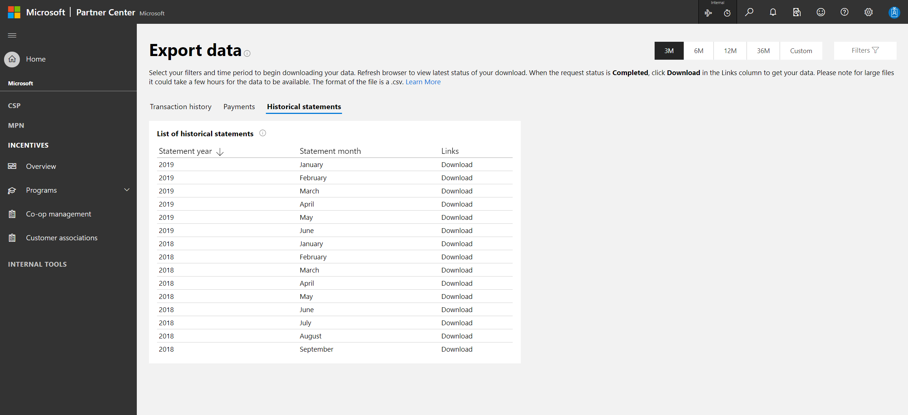

# Payout summaries

The Payout summary shows you details about the money you've earned with Microsoft. It also lets you know when you'll receive payments and how much you'll be paid.

If you sell products in the Azure Marketplace, you'll also see info on successful payouts in the Payout summary. For details, see [Microsoft Azure Marketplace Participation Policies](https://docs.microsoft.com/legal/marketplace/participation-policy) and the [Microsoft Azure Marketplace Publisher Agreement](https://query.prod.cms.rt.microsoft.com/cms/api/am/binary/RE3ypvt).

> [!NOTE]
> To be eligible for payout, your proceeds must reach the [payment threshold](payment-thresholds-methods-timeframes.md) of $50. For details about the payment threshold see this page and review the app developer agreement.

> [!NOTE]
> If you're looking for support regarding payouts, including configuring payout accounts, missing payouts, putting payouts on hold, or anything else, contact support [here](https://developer.microsoft.com/windows/support).

## Access the payout summary pages

To open one of the payout summary pages:

1. Select the Payout icon in the upper-right corner.
2. Select Transaction history, Payments, or Export data.

## Transaction history page

This page displays all of your individual earnings, including the date, type, and earning for each. You can select a time period to view, and you can also filter by Enrollment ID, Program, Payment ID, Earning type, Lever, and Status. Data is available for the current fiscal year (July 1 – June 30) and the previous two fiscal years.

To see more details about an earning, select the down arrow at the right-hand side of the page. This will display the lever, revenue amount, and product. If any of this data is unavailable but you need access to it, contact [support](https://developer.microsoft.com/windows/support). If the earning is the result of an adjustment and not a transaction, the product fields will not be displayed.

To export any of the transaction data on this page, use the **Export data** page.

## Payments page

The totals on this page represent all of the programs you participate in. You can filter by Participant ID, Program, Payment ID, and Earning type. Amounts are given in US dollars. The paid value is also displayed in pay to currency.

| Area                   | Description                                                                                |
|------------------------|---------------------------------------------------------------------------------------------|
| Total paid this year   | The combined total paid out to you this year, in US dollars, for all of your programs       |
| Next estimated payment | The single next payment coming to you (even if there are others coming soon), in US dollars |
| Last payment           | The amount (in US dollars), program name, and program of your most recent payment           |
| Payments by source     | Amount of payments (in US dollars) represented by program over the last 12 months           |
| Payments               | Select **Paid** or **Pending** and then sort as desired. For additional details of a specific payment select **View**. To download a copy of the payment remittance statement, select **Download**. Because transaction history data can take up to 24 hours to appear, you may not see associated earnings right away. |
|||

To export any of the data on this page, select **Export** and follow directions on the Export data page.

## Transaction history page

This page displays all of your individual earnings, including the date, type, and earning for each. You can select a time period to view and you can filter by Enrollment ID, Program, Payment ID, Earning type, Lever, and Status. Data is available for the current fiscal year (July 1 – June 30) and the previous two fiscal years.

To see more details about an earning, select the down arrow at the right side of the page. This will display the lever, revenue amount, and product. If any of this data is unavailable but you need access to it, contact [support](https://developer.microsoft.com/windows/support)]. If the earning is the result of an adjustment and not a transaction, the product fields will not be displayed.

To export any of the transaction data on this page, select **Export** and follow directions on the Export data page. Files exported from the Transaction History page show data in transaction currency, earnings in both transaction currency and US dollars, and the paid value in pay to currency.

## Payment status

| Earning status           | Reason                                                                                                                                      | Partner action required?                                   |
|--------------------------|---------------------------------------------------------------------------------------------------------------------------------------------|------------------------------------------------------------|
| Unprocessed              | The earning is eligible for payment. It stays in this state for a cooling period as defined in the program guide for the Incentive program. | No                                                         |
| Upcoming                 | Payment order generated pending internal reviews before payment is processed                                                               | No                                                         |
| Pending tax invoice      | Your tax invoice is incomplete or invalid                                                                                                  | You need to update your tax invoice before you can be paid |
| Rejected during review   | The payment was rejected during review                                                                                                     | Contact [Microsoft support](https://developer.microsoft.com/windows/support) for details                      |
| Failed                   | The payment failed due to a Microsoft system error                                                                                         | Contact [Microsoft support](https://developer.microsoft.com/windows/support)  for details                      |
| In progress              | The payment is in progress                                                                                                                 | No                                                         |
| Incorrect payment        | The payment recouping is in progress                                                                                                       | No                                                         |
| Sent                     | The payment has been sent to your bank                                                                                                     | No                                                         |
| Reprocessing             | The payment encountered a Microsoft system error and is being reprocessed                                                                  | No                                                         |
| Reversed                 | The payment was reversed by your bank and will be sent again in the next payment cycle                                                     | No                                                         |
| Tax invoice rejected     | Your tax invoice was rejected during review. All pending payments will be on hold until the tax invoice review is complete.                 | Contact [Microsoft support](https://developer.microsoft.com/windows/support)  for details                      |
| Tax invoice under review | Your tax invoice is being reviewed. Your payment will be released once the tax invoice has been approved.                                   | No                                                         |
| Rejected                 | The payment was rejected by your bank                                                                                                      | Contact your bank for details.                             |
|||

## Export data page

Follow these instructions to export data.

The Export data page does not refresh on its own. You may need to refresh the page manually to see the most recent data.

Your filter may result in a **No data available** error. This probably means you've left the default time period selected at three months and then selected a Payment ID from an earning that's outside of that period. Expand your time period and try again.

## Payments

This option provides a download of the payments you received in your bank for a given program, the associated tax, and aggregated earning amount. This report is used for many Partner Center programs, so some columns may be inapplicable to your report. Those columns are marked below.

| Column name              | Description                                                                                                                               |
|--------------------------|-----------------------------------------------------------------------------------------------------------------------------------------  |
| participantID            | The primary identity of the partner earning under the program                                                                             |
| participantIDType        | Usually program ID for Incentive programs and Seller ID for Store programs                                                                |
| participantName          | Name of the earning partner                                                                                                               |
| programName              | Incentive/store program name                                                                                                              |
| earned                   | Amount earned in the Pay To currency for that program/participantID                                                                       |
| earnedUSD                | Amount earned for the program/participant ID, in USD                                                                                      |
| withheldTax              | Amount of tax withheld in the Pay To currency for the program/participantID                                                               |
| salesTax                 | Total amount of sales tax in the Pay To currency for the program/participantID (applicable for incentive programs only)                   |
| serviceFeeTax            | Total amount of serviceFeeTax in Pay To currency for the program/participantID (applicable for store programs and Azure Marketplace only) |
| totalPayment             | Total payment in local currency excluding the withholding tax and including the sales tax (if applicable) for the program/participantID   |
| currencyCode             | Pay To currency code                                                                                                                      |
| paymentMethod            | The method used to pay the partner, for example, electronic bank transfer, credit note                                                     |
| paymentID                | Unique identifier for the payment. This number is usually visible in your bank statement (applicable for SAP payments only).              |
| paymentStatus            | Payment status                                                                                                                            |
| paymentStatusDescription | Friendly description of payment status                                                                                                    |
| paymentDate              | Date payment was sent from Microsoft                                                                                                      |
|||

## Transaction history

This option provides a download of each earning line item you see in the Transaction history page, earning type, date, associated transaction amount, customer, product, and other transactional details applicable to your programs.

| Column name                    | Description                                                                                                                              | Applicability for Incentives/Store/Azure Marketplace           |
|--------------------------------|------------------------------------------------------------------------------------------------------------------------------------------|----------------------------------------------------------------|
| earningId                      | Unique identifier for each earning                                                                                                       | All                                                            |
| participantId                  | The primary identity of the partner earning under the program                                                                            | All                                                            |
| participantIdType              | Mostly program ID for Incentive programs and Seller IF for Store programs and Azure Marketplace                                          | All                                                            |
| participantName                | Name of the earning partner                                                                                                              | All                                                            |
| partnerCountryCode             | Location/country/region of the earning partner                                                                                                  | All                                                            |
| programName                    | Incentive/store program name                                                                                                             | All                                                            |
| transactionId                  | Unique identifier for the transaction                                                                                                    | All                                                            |
| transactionCurrency            | Currency in which the original customer transaction occurred (this is not partner location currency)                                     | All                                                            |
| transactionDate                | Date of the transaction. Useful for programs where many transactions contribute to one earning                                           | All                                                            |
| transactionExchangeRate        | Exchange rate date used to show the corresponding transaction USD amount                                                                 | All                                                            |
| transactionAmount              | Transaction amount in the original transaction currency based on which earning is generated                                              | All                                                            |
| transactionAmountUSD           | Transaction amount in USD                                                                                                                | All                                                            |
| lever                          | Indicates business rule for the earning                                                                                                  | All                                                            |
| earningRate                    | Incentive rate applied on transaction amount to generate an earning                                                                      | All                                                            |
| quantity                       | Varies based on program. Indicates billed quantity for transactional programs                                                            | All                                                            |
| quantityType                   | Indicates type of quantity, for example, Billed quantity, MAU                                                                             | All                                                            |
| earningType                    | Indicates if it is fee, rebate, co-op, sell, and so on                                                                                          | All                                                            |
| earningAmount                  | Earning Amount in the original transaction currency                                                                                      | All                                                            |
| earningAmountUSD               | Earning Amount in USD                                                                                                                    | All                                                            |
| earningDate                    | Date of the earning                                                                                                                      | All                                                            |
| calculationDate                | Date the earning was calculated in the system                                                                                            | All                                                            |
| earningExchangeRate            | Exchange rate used to show the corresponding USD amount                                                                                  | All                                                            |
| exchangeRateDate               | Exchange rate date used to calculate EarningAmount USD                                                                                   | All                                                            |
| paymentAmountWOTax             | Earning amount (without tax) in Pay To currency for "Sent" payments only                                                                 | All                                                            |
| paymentCurrency                | Pay to currency chosen by partner in the Payment profile. Shown only for sent payments                                                   | All                                                            |
| paymentExchangeRate            | Exchange rate used to calculate paymentAmountWOTax in payment currency using ExchangeRateDate                                            | All                                                            |
| claimId                        | Unique identifier for claim                                                                                                              | Incentives - some programs only                                |
| planId                         | Unique identifier for plan                                                                                                               | Incentives - some programs only                                |
| paymentId                      | Unique identifier for the payment. This number is usually visible in your bank statement                                                 | SAP payments only                                              |
| paymentStatus                  | Payment status                                                                                                                           | All                                                            |
| paymentStatusDescription       | Friendly description of payment status                                                                                                   | All                                                            |
| customerId                     | Will always be blank                                                                                                                     | Incentive programs only (exception: OEM) and Azure Marketplace |
| customerName                   | Will always be blank                                                                                                                     | Incentive programs only (exception: OEM) and Azure Marketplace |
| partNumber                     | Will always be blank                                                                                                                     | Some Incentive and Store programs and Azure Marketplace        |
| productName                    | Product name linked to transaction                                                                                                       | All                                                            |
| productId                      | Unique product identifier                                                                                                                | Store and Azure Marketplace                                    |
| parentProductId                | Unique parent product identifier. If there isn't a parent product for the transaction, then Parent Product ID = Product ID. | Store and Azure Marketplace                                    |
| parentProductName              | Name of the parent product. If there isn't a parent product for the transaction, then Parent Product Name = Product Name.   | Store and Azure Marketplace                                    |
| productType                    | Type of product, such as App, Add-on, or Game                                                                                        | Store and Azure Marketplace                                    |
| invoiceNumber                  | Invoice number (applicable for EA only)                                                                                                  | Incentive and Azure Marketplace - some programs only           |
| subscriptionId                 | Subscription identifier associated with customer                                                                                         | Incentive - some programs only                                 |
| subscriptionStartDate          | Subscription start date                                                                                                                  | Incentive - some programs only                                 |
| subscriptionEndDate            | Subscription end date                                                                                                                    | Incentive - some programs only                                 |
| resellerId                     | Reseller identifier                                                                                                                      | Incentive - some programs only                                 |
| resellerName                   | Reseller name                                                                                                                            | Incentive - some programs only                                 |
| distributorId                  | Distributor identifier                                                                                                                   | Incentive - some programs only                                 |
| distributorName                | Distributor name                                                                                                                         | Incentive - some programs only                                 |
| agreementNumber                | Agreement number                                                                                                                         | Incentive - some programs only                                 |
| agreementStartDate             | Agreement start date                                                                                                                     | Incentive - some programs only                                 |
| agreementEndDate               | Agreement end date                                                                                                                       | Incentive - some programs only                                 |
| workload                       | Workload                                                                                                                                 | Incentive - some programs only                                 |
| transactionType                | Type of transaction, such as purchase, refund, reversal, or chargeback                                                               | Store and Azure Marketplace                                    |
| localProviderSeller            | Local provider/seller of record                                                                                                          | Store only                                                     |
| taxRemitted                    | Amount of tax remitted (sales, use, or VAT/GST taxes)                                                                                   | Store and Azure Marketplace                                    |
| taxRemitModel                  | Party responsible for remitting taxes (sales, use, or VAT/GST taxes)                                                                    | Store only                                                     |
| storeFee                       | The amount retained by Microsoft as a fee for making the app or add-on available in the Store                                           | Store only                                                     |
| transactionPaymentMethod       | Customer payment instrument used for the transaction, such as Card, Mobile Carrier Billing, or PayPal                                | Store and Azure Marketplace                                    |
| tpan                           | Indicates the third-party ad network                                                                                                     | Store - Ads only                                               |
| customerCountry                | Customer country/region                                                                                                                         | Store and Azure Marketplace                                    |
| customerCity                   | Customer city                                                                                                                            | Store and Azure Marketplace                                    |
| customerState                  | Customer state                                                                                                                           | Store and Azure Marketplace                                    |
| customerZip                    | Customer zip/postal code                                                                                                                 | Store and Azure Marketplace                                    |
| purchaseTypeCode               | Will always be blank                                                                                                                     | Incentive program - CRI                                        |
| purchaseOrderType              | Will always be blank                                                                                                                     | Incentive program - CRI                                        |
| purchaseOrderCoverageStartDate | Will always be blank                                                                                                                     | Incentive program - CRI                                        |
| purchaseOrderCoverageEndDate   | Will always be blank                                                                                                                     | Incentive program - CRI                                        |
| programOfferingLevel           |                                                                                                                                          | Incentive program - CRI                                        |
| TenantID                       |                                                                                                                                          | Incentive programs                                             |
| externalReferenceId            | Unique identifier for the program                                                                                                        | Direct Pay programs (Incentive and Store)                      |
| externalReferenceIdLabel       | Unique identifier label                                                                                                                  | Direct Pay programs (Incentive and Store)                      |
|||

## Historical statements

Transaction history from before July 1 2019 is handled separately. Statements will use the following fields instead of the current ones.

> [!NOTE]
> Legacy transaction history has a column called "Reserved" which corresponds to the "Earnings" column in the modern history, except that it excludes all earnings with status = "Payment Sent".

> [!NOTE]
> Filters such as 3M, 6M, or 12M will not apply to the **Historical statements** section.

| Field name              | Description                                                                                                                                                             |
|-------------------------|-------------------------------------------------------------------------------------------------------------------------------------------------------------------------|
| Revenue Source          | The source of your revenue based on where the transaction occurred, such as Microsoft Store, Windows Phone Store, Windows Store 8, or advertising                  |
| Order ID                | Unique order identifier. This ID allows you to identify purchase transactions with their respective non-purchase transactions, such as refunds or chargebacks. Both will have the same Order ID. Also, in the case of a split charge where multiple payment methods were used for a single purchase, it allows you to link the purchase transactions. |
| Transaction ID          | Unique transaction identifier.                                                                                                                                          |
| Transaction Date Time   | The date and time the transaction occurred (UTC).                                                                                                                       |
| Parent Product ID       | Unique parent product identifier. If there isn't a parent product for the transaction, then Parent Product ID = Product ID.                                |
| Product ID              | Unique product identifier.                                                                                                                                              |
| Parent Product Name     | Name of the parent product. If there isn't a parent product for the transaction, then Parent Product Name = Product Name.                                  |
| Product Name            | Name of the product                                                                                                                                                    |
| Product Type            | Type of product, such as App, Add-on, or Game                                                                                                                       |
| Quantity                | When the Revenue Source is Microsoft Store for Business, the Quantity represents the number of licenses purchased. For all other Revenue Sources, the Quantity will always be 1. Even when a single transaction is split into two line items because two different payment methods were used, each line item will show a Quantity of 1. |
| Transaction Type        | Type of transaction, such as purchase, refund, reversal, or chargeback                                                                                              |
| Payment Method          | Customer payment instrument used for the transaction, such as Card, Mobile Carrier Billing, or PayPal                                                               |
| Country / Region        | Country/region where the transaction occurred                                                                                                                          |
| Local Provider / Seller | Local provider/seller of record                                                                                                                                        |
| Transaction Currency    | Currency of the transaction                                                                                                                                            |
| Transaction Amount      | Amount of the transaction                                                                                                                                              |
| Tax Remitted            | Amount of tax remitted (sales, use, or VAT/GST taxes)                                                                                                                  |
| Net Receipts            | Transaction amount less tax remitted                                                                                                                                   |
| Store Fee               | The percentage of Net Receipts retained by Microsoft as a fee for making the app or add-on available in the Store                                                      |
| App Proceeds            | Net receipts minus the Store Fee                                                                                                                                       |
| Taxes Withheld          | Amount of income tax withheld (ot included in **Reserved** CSV file)                                                                                                |
| Payment                 | App Proceeds less any applicable income tax withholding (amount shown in Transaction Currency). Not included in **Reserved** CSV file.                               |
| FX Rate                 | Foreign exchange rate used to convert Transaction Currency to Payment Currency                                                                                         |
| Payment Currency        | Currency in which your payment is made                                                                                                                                       |
| Converted Payment       | Payment amount converted to Payment Currency using the FX Rate                                                                                                         |
| Tax Remit Model         | Party responsible for remitting taxes (sales, use, or VAT/GST taxes)                                                                                                   |
| Eligibility Date Time   | The date and time when transaction proceeds become eligible for payout (UTC). When a payout is created, it includes transaction proceeds with an Eligibility Date Time prior to the payout creation date (only included in **Reserved** CSV file). |
| Charges                 | Shows a breakdown of all the charge details aggregated in the Transaction Amount column (only included for Azure Marketplace; not included in **Reserved** CSV file). |
|||

## Next Step

- [Payout policy details](./payout-policy-details.md)
