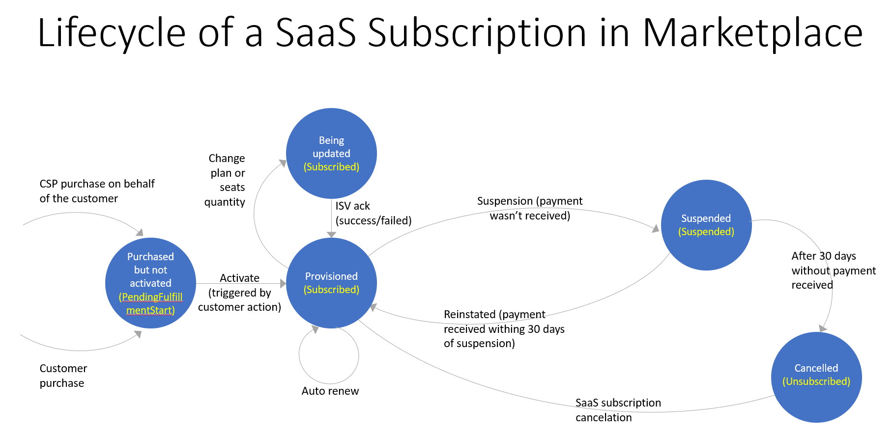
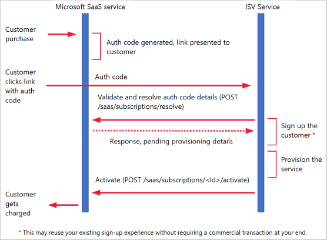
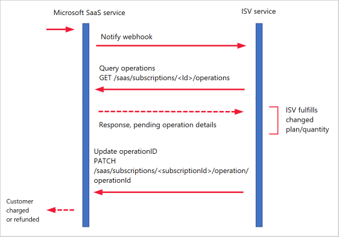
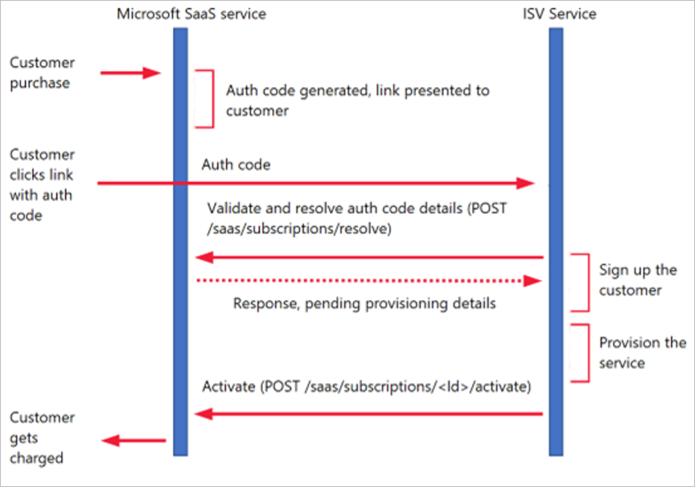

# SaaS fulfillment APIs, version 2 

This article details the APIs that enable partners to sell their SaaS applications in the AppSource marketplace and the Azure Marketplace. These APIs are a requirement for transactable SaaS offers on the AppSource and Azure Marketplace.

## Managing the SaaS subscription life cycle

Azure SaaS manages the entire life cycle of a SaaS subscription purchase. It uses the fulfillment APIs as a mechanism to drive the actual fulfillment, changes to plans, and deletion of the subscription with the partner. The customer's bill is based on the state of the SaaS subscription that Microsoft maintains. The following diagram depicts the states and the operations that drive the changes between states.




### States of a SaaS subscription

The following table lists the provisioning states for a SaaS subscription, including a description and sequence diagram for each (if applicable). 

#### Provisioning

When a customer initiates a purchase, the partner receives this information in an authorization code on a customer-interactive web page that uses a URL parameter. An example is `https://contoso.com/signup?token=..`, whereas the landing page URL in Partner Center is `https://contoso.com/signup`. The authorization code can be validated and exchanged for the details of the provisioning service by calling the Resolve API.  When a SaaS service finishes provisioning, it sends an activate call to signal that the fulfillment is complete and the customer can be billed. 

The following diagram shows the sequence of API calls for a provisioning scenario.  



#### Provisioned

This state is the steady state of a provisioned service.

##### Provisioning for update 

This state signifies that an update to an existing service is pending. Such an update can be initiated by the customer, either from the marketplace or on the SaaS service (only for direct-to-customer transactions).

##### Provisioning for update (when it's initiated from the marketplace)

The following diagram shows the sequence of actions when an update is initiated from the marketplace.



##### Provisioning for update (when it's initiated from the SaaS service)

The following diagram shows the actions when an update is initiated from the SaaS service. (The webhook call is replaced by an update to the subscription initiated by the SaaS service.) 

 

#### Suspended

This state indicates that a customer’s payment hasn't  been received. By policy, we'll provide the customer a grace period before canceling the subscription. When a subscription is in this state: 

- As a partner, you may choose to degrade or block the user’s access to the service.
- The subscription must be kept in a recoverable state that can restore full functionality without any loss of data or settings. 
- Expect to get a reinstate request for this subscription via the fulfillment APIs or a de-provisioning request at the end of the grace period. 

#### Unsubscribed 

Subscriptions reach this state in response to either an explicit customer request or nonpayment of dues. The expectation from the partner is that the customer’s data is retained for recovery on request for a certain number of days and then deleted. 


## API reference

This section documents the SaaS *Subscription API* and *Operations API*.  The value of the `api-version` parameter for version 2 APIs is `2018-08-31`.  


### Parameter and entity definitions

The following table lists the definitions for common parameters and entities used by fulfillment APIs.

|     Entity/Parameter     |     Definition                         |
|     ----------------     |     ----------                         |
| `subscriptionId`         | The GUID identifier for a SaaS resource.  |
| `name`                   | A friendly name provided for this resource by the customer. |
| `publisherId`            | A unique string identifier for each publisher (for example: "contoso"). |
| `offerId`                | A unique string identifier for each offer (for example: "offer1").  |
| `planId`                 | A unique string identifier for each plan/SKU (for example: "silver"). |
| `operationId`            | The GUID identifier for a particular operation.  |
|  `action`                | The action being performed on a resource, either `unsubscribe`, `suspend`,  `reinstate`, or `changePlan`, `changeQuantity`, `transfer`.  |
|   |   |

Globally unique identifiers ([GUIDs](https://en.wikipedia.org/wiki/Universally_unique_identifier)) are 128-bit (32-hexadecimal) numbers that are typically automatically generated. 

#### Resolve a subscription 

The resolve endpoint enables the publisher to resolve a marketplace token to a persistent resource ID. The resource ID is the unique identifier for a SaaS subscription. When a user is redirected to a partner’s website, the URL contains a token in the query parameters. The partner is expected to use this token and make a request to resolve it. The response contains the unique SaaS subscription ID, name, offer ID, and plan for the resource. This token is valid for one hour only. 

##### Post<br>`https://marketplaceapi.microsoft.com/api/saas/subscriptions/resolve?api-version=<ApiVersion>`

*Query parameters:*

|                    |                   |
|  ---------------   |  ---------------  |
|  ApiVersion        |  The version of the operation to use for this request.  |

*Request headers:*
 
|                    |                   |
|  ---------------   |  ---------------  |
|  Content-Type      | `application/json` |
|  x-ms-requestid    |  A unique string value for tracking the request from the client, preferably a GUID. If this value isn't provided, one will be generated and provided in the response headers. |
|  x-ms-correlationid |  A unique string value for operation on the client. This parameter correlates all events from client operation with events on the server side. If this value isn't provided, one will be generated and provided in the response headers.  |
|  authorization     |  [Get JSON web token (JWT) bearer token](https://docs.microsoft.com/azure/marketplace/cloud-partner-portal/saas-app/cpp-saas-registration#get-a-token-based-on-the-azure-ad-app). |
|  x-ms-marketplace-token  |  The token query parameter in the URL when the user is redirected to the SaaS partner’s website from Azure (for example: `https://contoso.com/signup?token=..`). *Note:* The URL decodes the token value from the browser before using it.  |

*Response codes:*

Code: 200<br>
Resolves the opaque token to a SaaS subscription. Response body:
 

```json
{
    "id": "<guid>",  
    "subscriptionName": "Contoso Cloud Solution",
    "offerId": "offer1",
    "planId": "silver",
    "quantity": "20" 
}
```

Code: 400<br>
Bad request. x-ms-marketplace-token is missing, malformed, or expired.

Code: 403<br>
Unauthorized. The authentication token wasn't provided or is invalid, or the request is attempting to access an acquisition that doesn’t belong to the current publisher.

Code: 404<br>
Not found.

Code: 500<br>
Internal server error.

```json
{
    "error": {
      "code": "UnexpectedError",
      "message": "An unexpected error has occurred."
    }
}
```

### Subscription API

The subscription API supports the following HTTPS operations: **Get**, **Post**, **Patch**, and **Delete**.


#### List subscriptions

Lists all the SaaS subscriptions for a publisher.

##### Get<br>`https://marketplaceapi.microsoft.com/api/saas/subscriptions?api-version=<ApiVersion>`

*Query parameters:*

|             |                   |
|  --------   |  ---------------  |
| ApiVersion  |  The version of the operation to use for this request.  |

*Request headers:*

|                    |                   |
|  ---------------   |  ---------------  |
| Content-Type       |  `application/json`  |
| x-ms-requestid     |  A unique string value for tracking the request from the client, preferably a GUID. If this value isn't provided, one will be generated and provided in the response headers. |
| x-ms-correlationid |  A unique string value for operation on the client. This parameter correlates all events from client operation with events on the server side. If this value isn't provided, one will be generated and provided in the response headers.  |
| authorization      |  [Get JSON web token (JWT) bearer token](https://docs.microsoft.com/azure/marketplace/cloud-partner-portal/saas-app/cpp-saas-registration#get-a-token-based-on-the-azure-ad-app).  |

*Response codes:*

Code: 200 <br/>
Gets the publisher and corresponding subscriptions for all the publisher's offers, based on the authentication token.
Response payload:<br>

```json
{
  [
      {
          "id": "<guid>",
          "name": "Contoso Cloud Solution",
          "publisherId": "contoso",
          "offerId": "offer1",
          "planId": "silver",
          "quantity": "10",
          "beneficiary": { // Tenant for which SaaS subscription is purchased.
              "tenantId": "<guid>"
          },
          "purchaser": { // Tenant that purchased the SaaS subscription. These could be different for reseller scenario
              "tenantId": "<guid>"
          },
            "term": {
                "startDate": "2019-05-31",
                "endDate": "2019-06-29",
                "termUnit": "P1M"
          },
          "allowedCustomerOperations": [
              "Read" // Possible Values: Read, Update, Delete.
          ], // Indicates operations allowed on the SaaS subscription. For CSP-initiated purchases, this will always be Read.
          "sessionMode": "None", // Possible Values: None, DryRun (Dry Run indicates all transactions run as Test-Mode in the commerce stack)
          "isFreeTrial": "true", // true – the customer subscription is currently in free trial, false – the customer subscription is not currently in free trial.
          "saasSubscriptionStatus": "Subscribed" // Indicates the status of the operation: [NotStarted, PendingFulfillmentStart, Subscribed, Suspended, Unsubscribed]
      }
  ],
  "continuationToken": ""
}
```

The continuation token will be present only if there are additional "pages" of plans to retrieve. 

Code: 403 <br>
Unauthorized. The authentication token wasn't provided or is invalid, or the request is attempting to access an acquisition that doesn’t belong to the current publisher. 

Code: 500<br>
Internal server error.

```json
{
    "error": {
      "code": "UnexpectedError",
      "message": "An unexpected error has occurred."
    }
}
```

#### Get subscription

Gets the specified SaaS subscription. Use this call to get license information and plan information.

##### Get<br> `https://marketplaceapi.microsoft.com/api/saas/subscriptions/<subscriptionId?api-version=<ApiVersion>`

*Query parameters:*

|                    |                   |
|  ---------------   |  ---------------  |
| subscriptionId     |   A unique identifier of the SaaS subscription that's obtained after resolving the token via Resolve API.   |
|  ApiVersion        |   The version of the operation to use for this request.   |

*Request headers:*

|                    |                   |
|  ---------------   |  ---------------  |
|  Content-Type      |  `application/json`  |
|  x-ms-requestid    |  A unique string value for tracking the request from the client, preferably a GUID. If this value isn't provided, one will be generated and provided in the response headers. |
|  x-ms-correlationid |  A unique string value for operation on the client. This parameter correlates all events from client operation with events on the server side. If this value isn't provided, one will be generated and provided in the response headers.  |
|  authorization     |  [Get JSON web token (JWT) bearer token](https://docs.microsoft.com/azure/marketplace/cloud-partner-portal/saas-app/cpp-saas-registration#get-a-token-based-on-the-azure-ad-app). |

*Response codes:*

Code: 200<br>
Gets the SaaS subscription from identifier. Response payload:<br>

```json
Response Body:
{ 
        "id":"",
        "name":"Contoso Cloud Solution",
        "publisherId": "contoso",
        "offerId": "offer1",
        "planId": "silver",
        "quantity": "10",
          "beneficiary": { // Tenant for which SaaS subscription is purchased.
              "tenantId": "<guid>"
          },
          "purchaser": { // Tenant that purchased the SaaS subscription. These could be different for reseller scenario
              "tenantId": "<guid>"
          },
        "allowedCustomerOperations": ["Read"], // Indicates operations allowed on the SaaS subscription. For CSP-initiated purchases, this will always be Read.
        "sessionMode": "None", // Dry Run indicates all transactions run as Test-Mode in the commerce stack
        "isFreeTrial": "true", // true – customer subscription is currently in free trial, false – customer subscription is not currently in free trial.
        "status": "Subscribed", // Indicates the status of the operation.
          "term": { //This gives the free trial term start and end date
            "startDate": "2019-05-31",
            "endDate": "2019-06-29",
            "termUnit": "P1M"
        },
}
```

Code: 403<br>
Unauthorized. The authentication token wasn't provided or is invalid, or the request is attempting to access an acquisition that doesn’t belong to the current publisher.

Code: 404<br>
Not found.<br> 

Code: 500<br>
Internal server error.<br>

```json
{
    "error": {
      "code": "UnexpectedError",
      "message": "An unexpected error has occurred."
    }  
```

#### List available plans

Use this call to find out if there are any private or public offers for the current publisher.

##### Get<br> `https://marketplaceapi.microsoft.com/api/saas/subscriptions/<subscriptionId>/listAvailablePlans?api-version=<ApiVersion>`

*Query parameters:*

|                    |                   |
|  ---------------   |  ---------------  |
|  ApiVersion        |   The version of the operation to use for this request.  |

*Request headers:*

|                    |                   |
|  ---------------   |  ---------------  |
|   Content-Type     |  `application/json` |
|   x-ms-requestid   |   A unique string value for tracking the request from the client, preferably a GUID. If this value isn't provided, one will be generated and provided in the response headers. |
|  x-ms-correlationid  | A unique string value for operation on the client. This parameter correlates all events from client operation with events on the server side. If this value isn't provided, one will be generated and provided in the response headers. |
|  authorization     |  [Get JSON web token (JWT) bearer token](https://docs.microsoft.com/azure/marketplace/cloud-partner-portal/saas-app/cpp-saas-registration#get-a-token-based-on-the-azure-ad-app). |

*Response codes:*

Code: 200<br>
Gets a list of available plans for a customer. Response body:

```json
{
    "plans": [{
        "planId": "Platinum001",
        "displayName": "Private platinum plan for Contoso",
        "isPrivate": true
    }]
}
```

Code: 404<br>
Not found.<br> 

Code: 403<br>
Unauthorized. The authentication token wasn't provided or is invalid, or the request is attempting to access an acquisition that doesn’t belong to the current publisher. <br> 

Code: 500<br>
Internal server error.<br>

```json
{ 
    "error": { 
      "code": "UnexpectedError", 
      "message": "An unexpected error has occurred." 
    } 
```

#### Activate a subscription

##### Post<br>`https://marketplaceapi.microsoft.com/api/saas/subscriptions/<subscriptionId>/activate?api-version=<ApiVersion>`

*Query parameters:*

|                    |                   |
|  ---------------   |  ---------------  |
|  ApiVersion        |  The version of the operation to use for this request.  |
| subscriptionId     | A unique identifier of the SaaS subscription that's obtained after resolving the token by using the Resolve API.  |

*Request headers:*
 
|                    |                   |
|  ---------------   |  ---------------  |
|  Content-Type      | `application/json`  |
|  x-ms-requestid    | A unique string value for tracking the request from the client, preferably a GUID. If this value isn't provided, one will be generated and provided in the response headers.  |
|  x-ms-correlationid  | A unique string value for operation on the client. This string correlates all events from client operation with events on the server side. If this value isn't provided, one will be generated and provided in the response headers.  |
|  authorization     |  [Get JSON web token (JWT) bearer token](https://docs.microsoft.com/azure/marketplace/cloud-partner-portal/saas-app/cpp-saas-registration#get-a-token-based-on-the-azure-ad-app). |

*Request payload:*

```json
{
    "planId": "gold",
    "quantity": ""
}
```

*Response codes:*

Code: 200<br>
Activates the subscription.<br>

Code: 400<br>
Bad request: validation failures.

Code: 403<br>
Unauthorized. The authentication token wasn't provided or is invalid, or the request is attempting to access an acquisition that doesn’t belong to the current publisher.

Code: 404<br>
Not found.

Code: 500<br>
Internal server error.

```json
{
    "error": {
      "code": "UnexpectedError",
      "message": "An unexpected error has occurred."
    }
}
```

#### Change the plan on the subscription

Update the plan on the subscription.

##### Patch<br> `https://marketplaceapi.microsoft.com/api/saas/subscriptions/<subscriptionId>?api-version=<ApiVersion>`

*Query parameters:*

|                    |                   |
|  ---------------   |  ---------------  |
|  ApiVersion        |  The version of the operation to use for this request.  |
| subscriptionId     | A unique identifier of the SaaS subscription that's obtained after resolving the token by using the Resolve API.  |

*Request headers:*

|                    |                   |
|  ---------------   |  ---------------  |
|  Content-Type      | `application/json` |
|  x-ms-requestid    |   A unique string value for tracking the request from the client, preferably a GUID. If this value isn't provided, one will be generated and provided in the response headers.  |
|  x-ms-correlationid  |  A unique string value for operation on the client. This parameter correlates all events from client operation with events on the server side. If this value isn't provided, one will be generated and provided in the response headers.    |
| authorization      |  [Get JSON web token (JWT) bearer token](https://docs.microsoft.com/azure/marketplace/cloud-partner-portal/saas-app/cpp-saas-registration#get-a-token-based-on-the-azure-ad-app).  |

*Request payload:*

```json
Request Body:
{
    "planId": "gold"
}
```

*Request headers:*

|                    |                   |
|  ---------------   |  ---------------  |
| Operation-Location | The link to a resource to get the operation's status.   |

*Response codes:*

Code: 202<br>
The request to change plan has been accepted. The partner is expected to poll the Operation-Location to determine a success or failure. <br>

Code: 400<br>
Bad request: validation failures.

Code: 403<br>
Unauthorized. The authentication token wasn't provided or is invalid, or the request is attempting to access an acquisition that doesn’t belong to the current publisher.

Code: 404<br>
Not found.

Code: 500<br>
Internal server error.

```json
{
    "error": {
      "code": "UnexpectedError",
      "message": "An unexpected error has occurred."
    }
}
```

>[!Note]
>Only a plan or quantity can be patched at one time, not both. Edits on a subscription with **Update** isn't  in `allowedCustomerOperations`.

#### Change the quantity on the subscription

Update the quantity on the subscription.

##### Patch:<br> `https://marketplaceapi.microsoft.com/api/saas/subscriptions/<subscriptionId>?api-version=<ApiVersion>`

*Query parameters:*

|                    |                   |
|  ---------------   |  ---------------  |
|  ApiVersion        |  The version of the operation to use for this request.  |
| subscriptionId     | A unique identifier of the SaaS subscription that's obtained after resolving the token by using the Resolve API.  |

*Request headers:*

|                    |                   |
|  ---------------   |  ---------------  |
|  Content-Type      | `application/json` |
|  x-ms-requestid    |   A unique string value for tracking the request from the client, preferably a GUID. If this value isn't provided, one will be generated and provided in the response headers.  |
|  x-ms-correlationid  |  A unique string value for operation on the client. This parameter correlates all events from client operation with events on the server side. If this value isn't provided, one will be generated and provided in the response headers.    |
| authorization      |  [Get JSON web token (JWT) bearer token](https://docs.microsoft.com/azure/marketplace/cloud-partner-portal/saas-app/cpp-saas-registration#get-a-token-based-on-the-azure-ad-app).  |

*Request payload:*

```json
Request Body:
{
    "quantity": 5
}
```

*Request headers:*

|                    |                   |
|  ---------------   |  ---------------  |
| Operation-Location | Link to a resource to get the operation's status.   |

*Response codes:*

Code: 202<br>
The request to change quantity has been accepted. The partner is expected to poll the Operation-Location to determine a success or failure. <br>

Code: 400<br>
Bad request: validation failures.


Code: 403<br>
Unauthorized. The authentication token wasn't provided or is invalid, or the request is attempting to access an acquisition that doesn’t belong to the current publisher.

Code: 404<br>
Not found.

Code: 500<br>
Internal server error.

```json
{
    "error": {
      "code": "UnexpectedError",
      "message": "An unexpected error has occurred."
    }
}
```

>[!Note]
>Only a plan or quantity can be patched at one time, not both. Edits on a subscription with **Update** isn't  in `allowedCustomerOperations`.

#### Delete a subscription

Unsubscribe and delete the specified subscription.

##### Delete<br> `https://marketplaceapi.microsoft.com/api/saas/subscriptions/<subscriptionId> ?api-version=<ApiVersion>`

*Query parameters:*

|                    |                   |
|  ---------------   |  ---------------  |
|  ApiVersion        |  The version of the operation to use for this request.  |
| subscriptionId     | A unique identifier of the SaaS subscription that's obtained after resolving the token by using the Resolve API.  |

*Request headers:*
 
|                    |                   |
|  ---------------   |  ---------------  |
|   Content-Type     |  `application/json` |
|  x-ms-requestid    |   A unique string value for tracking the request from the client, preferably a GUID. If this value isn't provided, one will be generated and provided in the response headers.   |
|  x-ms-correlationid  |  A unique string value for operation on the client. This parameter correlates all events from client operation with events on the server side. If this value isn't provided, one will be generated and provided in the response headers.   |
|  authorization     |  [Get JSON web token (JWT) bearer token](https://docs.microsoft.com/azure/marketplace/cloud-partner-portal/saas-app/cpp-saas-registration#get-a-token-based-on-the-azure-ad-app).  |

*Response codes:*

Code: 202<br>
The partner initiated a call to unsubscribe a SaaS subscription.<br>

Code: 400<br>
Delete on a subscription with **Delete** not in `allowedCustomerOperations`.

Code: 403<br>
Unauthorized. The authentication token wasn't provided or is invalid, or the request is attempting to access an acquisition that doesn’t belong to the current publisher.

Code: 404<br>
Not found.

Code: 500<br>
Internal server error.

```json
{
    "error": {
      "code": "UnexpectedError",
      "message": "An unexpected error has occurred."
    }
}
```


### Operations API

The operations API supports the following Patch and Get operations.

#### List outstanding operations 

Lists the outstanding operations for the current publisher. 

##### Get<br> `https://marketplaceapi.microsoft.com/api/saas/subscriptions/<subscriptionId>/operations?api-version=<ApiVersion>`

*Query parameters:*

|             |        |
|  ---------------   |  ---------------  |
|    ApiVersion                |   The version of the operation to use for this request.                |
| subscriptionId     | A unique identifier of the SaaS subscription that's obtained after resolving the token by using the Resolve API.  |

*Request headers:*
 
|                    |                   |
|  ---------------   |  ---------------  |
|   Content-Type     |  `application/json` |
|  x-ms-requestid    |  A unique string value for tracking the request from the client, preferably a GUID. If this value isn't provided, one will be generated and provided in the response headers.  |
|  x-ms-correlationid |  A unique string value for operation on the client. This parameter correlates all events from client operation with events on the server side. If this value isn't provided, one will be generated and provided in the response headers.  |
|  authorization     |  [Get JSON web token (JWT) bearer token](https://docs.microsoft.com/azure/marketplace/cloud-partner-portal/saas-app/cpp-saas-registration#get-a-token-based-on-the-azure-ad-app).  |

*Response codes:*

Code: 200<br> 
Gets the list of pending operations on a subscription. Response payload:

```json
[{
    "id": "<guid>",  
    "activityId": "<guid>",
    "subscriptionId": "<guid>",
    "offerId": "offer1",
    "publisherId": "contoso",  
    "planId": "silver",
    "quantity": "20",
    "action": "Convert",
    "timeStamp": "2018-12-01T00:00:00",  
    "status": "NotStarted"  
}]
```


Code: 400<br>
Bad request: validation failures.

Code: 403<br>
Unauthorized. The authentication token wasn't provided or is invalid, or the request is attempting to access an acquisition that doesn’t belong to the current publisher.

Code: 404<br>
Not found.

Code: 500<br>
Internal server error.

```json
{
    "error": {
      "code": "UnexpectedError",
      "message": "An unexpected error has occurred."
    }
}

```

#### Get operation status

Enables the publisher to track the status of the specified triggered async operation (such as `subscribe`, `unsubscribe`, `changePlan`, or `changeQuantity`).

##### Get<br> `https://marketplaceapi.microsoft.com/api/saas/subscriptions/<subscriptionId>/operations/<operationId>?api-version=<ApiVersion>`

*Query parameters:*

|                    |                   |
|  ---------------   |  ---------------  |
|  ApiVersion        |  The version of the operation to use for this request.  |

*Request headers:*

|                    |                   |
|  ---------------   |  ---------------  |
|  Content-Type      |  `application/json`   |
|  x-ms-requestid    |   A unique string value for tracking the request from the client, preferably a GUID. If this value isn't provided, one will be generated and provided in the response headers.  |
|  x-ms-correlationid |  A unique string value for operation on the client. This parameter correlates all events from client operation with events on the server side. If this value isn't provided, one will be generated and provided in the response headers.  |
|  authorization     |  [Get JSON web token (JWT) bearer token](https://docs.microsoft.com/azure/marketplace/cloud-partner-portal/saas-app/cpp-saas-registration#get-a-token-based-on-the-azure-ad-app).  |

*Response codes:*<br>

Code: 200<br> 
Gets the specified pending SaaS operation. Response payload:

```json
Response body:
{
    "id  ": "<guid>",
    "activityId": "<guid>",
    "subscriptionId":"<guid>",
    "offerId": "offer1",
    "publisherId": "contoso",  
    "planId": "silver",
    "quantity": "20",
    "action": "Convert",
    "timeStamp": "2018-12-01T00:00:00",
    "status": "NotStarted"
}

```

Code: 400<br>
Bad request: validation failures.

Code: 403<br>
Unauthorized. The authentication token wasn't provided or is invalid, or the request is attempting to access an acquisition that doesn’t belong to the current publisher.
 
Code: 404<br>
Not found.

Code: 500<br> 
Internal server error.

```json
{
    "error": {
      "code": "UnexpectedError",
      "message": "An unexpected error has occurred."
    }
}

```
#### Update the status of an operation

Update the status of an operation to indicate success or failure with the provided values.

##### Patch<br> `https://marketplaceapi.microsoft.com/api/saas/subscriptions/<subscriptionId>/operations/<operationId>?api-version=<ApiVersion>`

*Query parameters:*

|                    |                   |
|  ---------------   |  ---------------  |
|   ApiVersion       |  The version of the operation to use for this request.  |
| subscriptionId     | A unique identifier of the SaaS subscription that's obtained after resolving the token by using the Resolve API.  |
|  operationId       | The operation that's being completed. |

*Request headers:*

|                    |                   |
|  ---------------   |  ---------------  |
|   Content-Type     | `application/json`   |
|   x-ms-requestid   |   A unique string value for tracking the request from the client, preferably a GUID. If this value isn't provided, one will be generated and provided in the response headers. |
|  x-ms-correlationid |  A unique string value for operation on the client. This parameter correlates all events from client operation with events on the server side. If this value isn't provided, one will be generated and provided in the response headers. |
|  authorization     |  [Get JSON web token (JWT) bearer token](https://docs.microsoft.com/azure/marketplace/cloud-partner-portal/saas-app/cpp-saas-registration#get-a-token-based-on-the-azure-ad-app).  |

*Request payload:*

```json
{
    "planId": "offer1",
    "quantity": "44",
    "status": "Success"    // Allowed Values: Success/Failure. Indicates the status of the operation.
}

```

*Response codes:*

Code: 200<br> 
A call to inform of completion of an operation on the partner side. For example, this response could signal the change of seats or plans.

Code: 400<br>
Bad request: validation failures.

Code: 403<br>
Unauthorized. The authentication token wasn't provided or is invalid, or the request is attempting to access an acquisition that doesn’t belong to the current publisher.

Code: 404<br>
Not found.

Code: 409<br>
Conflict. For example, a newer transaction is already fulfilled.

Code: 500<br> 
Internal server error.

```json
{
    "error": {
      "code": "UnexpectedError",
      "message": "An unexpected error has occurred."
    }
}

```

## Implementing a webhook on the SaaS service

The publisher must implement a webhook in this SaaS service to proactively notify users of changes in its service. The SaaS service is expected to call the operations API to validate and authorize before taking an action on the webhook notification.

```json
{
  "id": "<this is a GUID operation id, you can call operations API with this to get status>",
  "activityId": "<this is a Guid correlation id>",
  "subscriptionId": "<Guid to uniquely identify this resource>",
  "publisherId": "<this is the publisher’s name>",
  "offerId": "<this is the offer name>",
  "planId": "<this is the plan id>",
  "quantity": "<the number of seats, will be null if not per-seat saas offer>",
  "timeStamp": "2019-04-15T20:17:31.7350641Z",
  "action": "Unsubscribe",
  "status": "NotStarted"  

}
```
Where the action can be one of the following: 
- `unsubscribe` (when the resource has been deleted)
- `changePlan` (when the change plan operation has completed)
- `changeQuantity` (when the change quantity operation has completed)
- `suspend` (when resource has been suspended)
- `reinstate` (when resource has been reinstated after suspension)

Where the status can be one of the following: 
- **NotStarted** <br>
 - **InProgress** <br>
- **Succeeded** <br>
- **Failed** <br>
- **Conflict** <br>

In a webhook notification, actionable statuses are either **Succeeded** and **Failed**. An operation's life cycle is from **NotStarted** to a terminal state like **Succeeded**, **Failed**, or **Conflict**. If you receive **NotStarted** or **InProgress**, continue to request the status via GET API until the operation reaches a terminal state before taking action. 

## Mock APIs

You can use our mock APIs to help you get started with development, particularly prototyping, as well as testing projects. 

Host endpoint: `https://marketplaceapi.microsoft.com/api` (no authentication required)<br/>
API version: `2018-09-15`<br/>
Sample URI: `https://marketplaceapi.microsoft.com/api/saas/subscriptions?api-version=2018-09-15` <br/>

The API endpoint paths are the same across both mock and real APIs, but the API versions are different. The version is `2018-09-15` for the mock version and `2018-08-31` for the production version. 

Any of the API calls in this article can be made to the mock host endpoint. In general, expect to get mock data back as a response. Calls to the update subscription methods on the mock API always return 500. 

## Next steps

Developers can also programmatically retrieve and manipulate workloads, offers, and publisher profiles by using the [Cloud Partner Portal REST APIs](https://docs.microsoft.com/azure/marketplace/cloud-partner-portal-orig/cloud-partner-portal-api-overview).
