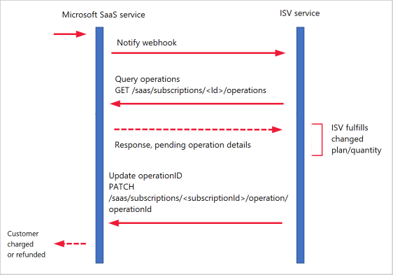
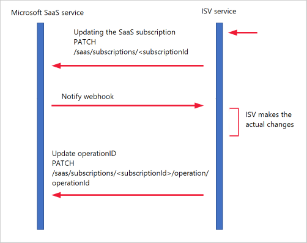

# SaaS fulfillment APIs version 2 in the commercial marketplace

This article details the APIs that enable partners to sell their software as a service (SaaS) offers in Microsoft AppSource and Azure Marketplace. A publisher is required to implement integration with these APIs to publish a transactable SaaS offer in Partner Center.

## Managing the SaaS subscription life cycle

The commercial marketplace manages the entire life cycle of a SaaS subscription after its purchase by the end user. It uses the landing page, Fulfillment APIs, Operations APIs, and the webhook as a mechanism to drive the actual SaaS subscription activation, usage, updates, and cancellation. The end user's bill is based on the state of the SaaS subscription that Microsoft maintains. 

### States of a SaaS subscription

The following diagram shows the states of a SaaS subscription and the applicable actions.


#### Purchased but not yet activated (*PendingFulfillmentStart*)

After an end user (or CSP) purchases a SaaS offer in the commercial marketplace, the publisher should be notified of the purchase. The publisher can then create and configure a new SaaS account on the publisher side for the end user.

For account creation to happen:

1. The customer selects the **Configure** button that's available for a SaaS offer after its successful purchase in Microsoft AppSource or the Azure portal. Alternatively the customer can use the **Configure** button in the email that they will receive shortly after the purchase.
2. Microsoft then notifies the partner about the purchase by opening in the new browser tab the landing page URL with the token parameter (the purchase identification token from the commercial marketplace).

An example of such call is `https://contoso.com/signup?token=<blob>`, whereas the landing page URL for this SaaS offer in Partner Center is configured as `https://contoso.com/signup`. This token provides the publisher with an ID that uniquely identifies the SaaS purchase and the customer.

>[!NOTE]
>The publisher won't be notified of the SaaS purchase until the customer initiates the configuration process from the Microsoft side.

The landing page URL must be up and running all day, every day, and ready to receive new calls from Microsoft at all times. If the landing page becomes unavailable, customers won't be able to sign up for the SaaS service and start using it.

Next, the publisher must pass the *token* back to Microsoft by calling the [SaaS Resolve API](#resolve-a-purchased-subscription), and entering the token as the value of the `x-ms-marketplace-token header` header parameter. As the result of the Resolve API call, the token is exchanged for details of the SaaS purchase such as unique ID of the purchase, purchased offer ID, and purchased plan ID.

On the landing page, the customer should be signed in to the new or existing SaaS account via Azure Active Directory (Azure AD) single sign-on (SSO).

The publisher should implement SSO to provide the user experience required by Microsoft for this flow. Make sure to use the multitenant Azure AD application and allow both work and school accounts or personal Microsoft accounts when configuring SSO. This requirement applies only to the landing page, for users who are redirected to the SaaS service when already signed in with Microsoft credentials. SSO isn't required for all sign-ins to the SaaS service.

> [!NOTE]
>If SSO requires that an administrator must grant permission to an app, the description of the offer in Partner Center must disclose that admin-level access is required. This disclosure is to comply with [commercial marketplace certification policies](/legal/marketplace/certification-policies#10003-authentication-options).

After sign-in, the customer should complete the SaaS configuration on the publisher side. Then the publisher must call the [Activate Subscription API](#activate-a-subscription) to send a signal to Azure Marketplace that the provisioning of the SaaS account is complete.
This action will start the customer's billing cycle. If the Activate Subscription API call is not successful, the customer isn't billed for the purchase.


 

#### Active (*Subscribed*)

*Active (Subscribed)* is the steady state of a provisioned SaaS subscription. After the Microsoft side has processed the [Activate Subscription API](#activate-a-subscription) call, the SaaS subscription is marked as *Subscribed*. The customer can now use the SaaS service on the publisher's side and will be billed.

When an SaaS subscription is already active, the customer can select **Manage SaaS experience** from the Azure portal or Microsoft 365 Admin Center. This action also causes Microsoft to call the **landing page URL** with the *token* parameter, as happens in the Activate flow. The publisher should distinguish between new purchases and the management of existing SaaS accounts, and handle this landing page URL call accordingly.

#### Being updated (*Subscribed*)

This action means that an update to an existing active SaaS subscription is being processed by both Microsoft and the publisher. Such an update can be initiated by:

- The customer from the commercial marketplace.
- The CSP from the commercial marketplace.
- The customer from the publisher's SaaS site (but not for CSP-made purchases).

Two types of updates are available for a SaaS subscription:

- Update plan when the customer chooses another plan for the subscription.
- Update quantity when the customer changes the number of purchased seats for the subscription.

Only an active subscription can be updated. While the subscription is being updated, its state remains Active on the Microsoft side.

##### Update initiated from the commercial marketplace

In this flow, the customer changes the subscription plan or quantity of seats from the Azure portal or Microsoft 365 Admin Center.

1. After an update is entered, Microsoft will call the publisher's webhook URL, configured in the **Connection Webhook** field in Partner Center, with an appropriate value for *action* and other relevant parameters. 
1. The publisher side should make the required changes to the SaaS service, and notify Microsoft when finished by calling the [Update Status of Operation API](#update-the-status-of-an-operation).
1. If the patch is sent with *fail* status, the update process won't finish on the Microsoft side. The SaaS subscription will keep the existing plan and quantity of seats.

> [!NOTE]
> The publisher should invoke PATCH to [update the Status of Operation API](#update-the-status-of-an-operation) with a Failure/Success response *within a 10-second time window* after receiving the webhook notification. If PATCH of operation status is not received within the 10 seconds, the change plan is *automatically patched as Success*. 

The sequence of API calls for an update scenario that's initiated from the commercial marketplace is shown in the following diagram.



##### Update initiated from the publisher

In this flow, the customer changes the subscription plan or quantity of seats purchased from the SaaS service itself. 

1. The publisher code must call the [Change Plan API](#change-the-plan-on-the-subscription) and/or the [Change Quantity API](#change-the-quantity-of-seats-on-the-saas-subscription) before making the requested change on the publisher side. 

1. Microsoft will apply the change to the subscription, and then notify the publisher via **Connection Webhook** to apply the same change.

1. Only then should the publisher make the required change to the SaaS subscription, and notify Microsoft when the change is done by calling [Update Status of Operation API](#update-the-status-of-an-operation).

The sequence of API calls for an update scenario that's initiated from the publisher side is shown in the following diagram.



#### Suspended (*Suspended*)

This state indicates that a customer's payment for the SaaS service has not been received. The publisher will be notified of this change in the SaaS subscription status by Microsoft. The notification is done via a call to webhook with the *action* parameter set to *Suspended*.

The publisher might or might not make changes to the SaaS service on the publisher side. We recommend that the publisher makes this information available to the suspended customer and limits or blocks the customer's access to the SaaS service. There is a probability the payment will never be received.

Microsoft gives the customer a 30-day grace period before automatically canceling the subscription. When a subscription is in the *Suspended* state:

* The partner or ISV must keep the SaaS account in a recoverable state, so that full functionality can be restored without any loss of data or settings.
* The partner or ISV should expect a request to reinstate the subscription, if the payment is received during the grace period, or a request to de-provision the subscription at the end of the grace period. Both requests will be sent via the webhook mechanism.

The subscription state is changed to Suspended on Microsoft side before the publisher takes any action. Only Active subscriptions can be suspended.

#### Reinstated (*Suspended*)

This action indicates that the customer's payment instrument has become valid again, a payment has been made for the SaaS subscription, and the subscription is being reinstated. In this case: 

1. Microsoft calls webhook with an *action* parameter set to the *Reinstate* value.
1. The publisher makes sure that the subscription is fully operational again on the publisher side.
1. The publisher calls the [Patch Operation API](#update-the-status-of-an-operation) with success status.
1. The Reinstate process is successful and the customer is billed again for the SaaS subscription. 

If the patch is sent with *fail* status, the reinstatement process won't finish on the Microsoft side and the subscription will remain *Suspended*.

Only a suspended subscription can be reinstated. The suspended SaaS subscription remains in a *Suspended* state while it's being reinstated. After this operation has finished, the subscription's status will become *Active*.

#### Renewed (*Subscribed*)

The SaaS subscription is automatically renewed by Microsoft at the end of the subscription term of a month or a year. The default for the auto-renewal setting is *true* for all SaaS subscriptions. Active SaaS subscriptions will continue to be renewed with a regular cadence. Microsoft doesn't notify the publisher when a subscription is being renewed. A customer can turn off automatic renewal for a SaaS subscription via the Microsoft 365 Admin Portal. In this case, the SaaS subscription will be automatically canceled at the end of the current billing term. Customers can also cancel the SaaS subscription at any time.

Only active subscriptions are automatically renewed. Subscriptions stay active during the renewal process, and if automatic renewal succeeds. After renewal, the start and end dates of the subscription term are updated to the new term's dates.

If an auto-renewal fails because of an issue with payment, the subscription will become *Suspended* and the publisher will be notified.

#### Canceled (*Unsubscribed*) 

Subscriptions reach this state in response to an explicit customer or CSP action by the cancellation of a subscription from the publisher site, the Azure portal, or Microsoft 365 Admin Center. A subscription can also be canceled implicitly, as a result of nonpayment of dues, after being in the *Suspended* state for 30 days.

After the publisher receives a cancellation webhook call, they should retain customer data for recovery on request for at least seven days. Only then can customer data be deleted.

A SaaS subscription can be canceled at any point in its life cycle. After a subscription is canceled, it can't be reactivated.

## API reference

This section documents the SaaS Subscription and Operations APIs.

**Subscription APIs** should be used to handle the SaaS subscription life cycle from purchase to cancellation.

**Operations APIs** should be used to:

* Verify and acknowledge the processed webhook calls.
* Get a list of apps pending operations that are waiting to be acknowledged by the publisher.

> [!NOTE]
> TLS version 1.2 version will be enforced soon as the minimal version for HTTPS communications. Make sure you use this TLS version in your code. TLS versions 1.0 and 1.1 will soon be deprecated.

### Subscription APIs

#### Resolve a purchased subscription

The resolve endpoint enables the publisher to exchange the purchase identification token from the commercial marketplace (referred to as *token* in [Purchased but not yet activated](#purchased-but-not-yet-activated-pendingfulfillmentstart)) to a persistent purchased SaaS subscription ID and its details.

When a customer is redirected to the partner's landing page URL, the customer identification token is passed as the *token* parameter in this URL call. The partner is expected to use this token and make a request to resolve it. The Resolve API response contains the SaaS subscription ID and other details to uniquely identify the purchase. The *token* provided with the landing page URL call is usually valid for 24 hours. If the *token* that you receive has already expired, we recommend that you provide the following guidance to the end user:

"We couldn't identify this purchase. Please reopen this SaaS subscription in the Azure portal or in Microsoft 365 Admin Center and select "Configure Account" or "Manage Account" again."

Calling the Resolve API will return subscription details and status for SaaS subscriptions in all supported statuses.

##### Post `https://marketplaceapi.microsoft.com/api/saas/subscriptions/resolve?api-version=<ApiVersion>`

*Query parameters:*

|  Parameter         | Value            |
|  ---------------   |  ---------------  |
|  `ApiVersion`        |  Use 2018-08-31.   |

*Request headers:*

|  Parameter         | Value             |
|  ---------------   |  ---------------  |
|  `content-type`      | `application/json` |
|  `x-ms-requestid`    |  A unique string value for tracking the request from the client, preferably a GUID. If this value isn't provided, one will be generated and provided in the response headers. |
|  `x-ms-correlationid` |  A unique string value for operation on the client. This parameter correlates all events from client operation with events on the server side. If this value isn't provided, one will be generated and provided in the response headers.  |
|  `authorization`     |  A unique access token that identifies the publisher making this API call. The format is `"Bearer <accessaccess_token>"` when the token value is retrieved by the publisher as explained in [Get a token based on the Azure AD app](./pc-saas-registration.md#get-the-token-with-an-http-post). |
|  `x-ms-marketplace-token`  | The purchase identification *token* parameter to resolve.  The token is passed in the landing page URL call when the customer is redirected to the SaaS partner's website (for example: `https://contoso.com/signup?token=<token><authorization_token>`). <br> <br>  Note that the *token* value being encoded is part of the landing page URL, so it needs to be decoded before it's used as a parameter in this API call.  <br> <br> Here's an example of an encoded string in the URL: `contoso.com/signup?token=ab%2Bcd%2Fef`, where *token* is `ab%2Bcd%2Fef`.  The same token decoded will be: `Ab+cd/ef` |
| | |

*Response codes:*

Code: 200
Returns unique SaaS subscription identifiers based on the `x-ms-marketplace-token` provided.

Response body example:

```json
{
  "id": "<guid>", // purchased SaaS subscription ID
  "subscriptionName": "Contoso Cloud Solution", // SaaS subscription name
  "offerId": "offer1", // purchased offer ID
  "planId": "silver", // purchased offer's plan ID
  "quantity": "20", // number of purchased seats, might be empty if the plan is not per seat
  "subscription": { // full SaaS subscription details, see Get Subscription APIs response body for full description
    "id": "<guid>",
    "publisherId": "contoso",
    "offerId": "offer1",
    "name": "Contoso Cloud Solution",
    "saasSubscriptionStatus": " PendingFulfillmentStart ",
    "beneficiary": {
      "emailId": "test@test.com",
      "objectId": "<guid>",
      "tenantId": "<guid>",
      "pid": "<ID of the user>"
    },
    "purchaser": {
      "emailId": "test@test.com",
      "objectId": "<guid>",
      "tenantId": "<guid>",
      "pid": "<ID of the user>"
    },
    "planId": "silver",
    "term": {
      "termUnit": "P1M",
      "startDate": "2019-05-31",
      "endDate": "2019-06-29"
    },
    "isTest": true,
    "isFreeTrial": false,
    "allowedCustomerOperations": ["Delete", "Update", "Read"],
    "sandboxType": "None",
    "sessionMode": "None"
  }
}

```

Code: 400
Bad request. `x-ms-marketplace-token` is missing, malformed, invalid, or expired.

Code: 403
Forbidden. The authorization token is invalid, expired, or was not provided.  The request is attempting to access a SaaS subscription for an offer that was published with a different Azure AD app ID from the one used to create the authorization token.

This error is often a symptom of not performing the [SaaS registration](pc-saas-registration.md) correctly.

Code: 500
Internal server error.  Retry the API call.  If the error persists, contact [Microsoft support](https://partner.microsoft.com/support/v2/?stage=1).

#### Activate a subscription

After the SaaS account is configured for an end user, the publisher must call the Activate Subscription API on the Microsoft side.  The customer won't be billed unless this API call is successful.

##### Post `https://marketplaceapi.microsoft.com/api/saas/subscriptions/<subscriptionId>/activate?api-version=<ApiVersion>`

*Query parameters:*

|  Parameter         | Value             |
|  --------   |  ---------------  |
| `ApiVersion`  |  Use 2018-08-31.   |
| `subscriptionId` | The unique identifier of the purchased SaaS subscription.  This ID is obtained after resolving the commercial marketplace authorization token by using the [Resolve API](#resolve-a-purchased-subscription).
 |

*Request headers:*

|  Parameter         | Value             |
|  ---------------   |  ---------------  |
| `content-type`       |  `application/json`  |
| `x-ms-requestid`     |  A unique string value for tracking the request from the client, preferably a GUID.  If this value isn't provided, one will be generated and provided in the response headers. |
| `x-ms-correlationid` |  A unique string value for operation on the client.  This string correlates all events from the client operation with events on the server side.  If this value isn't provided, one will be generated and provided in the response headers. |
| `authorization`      |  A unique access token that identifies the publisher making this API call. The format is `"Bearer <access_token>"` when the token value is retrieved by the publisher as explained in [Get a token based on the Azure AD app](./pc-saas-registration.md#get-the-token-with-an-http-post). |

*Request payload example:*

```json
{  // needed for validation of the activation request
  "planId": "gold", // purchased plan, cannot be empty
  "quantity": "" // purchased number of seats, can be empty if plan is not per seat
}
```

*Response codes:*

Code: 200 
The subscription was marked as Subscribed on the Microsoft side.

There is no response body for this call.

Code: 400 
Bad request: validation failed.

* `planId` doesn't exist in request payload.
* `planId` in request payload doesn't match the one that was purchased.
* `quantity` in request payload doesn't match the one that was purchased
* The SaaS subscription is in a *Subscribed* or *Suspended* state.

Code: 403 
Forbidden. The authorization token is invalid, expired, or was not provided. The request is attempting to access a SaaS subscription for an offer that was published with a different Azure AD app ID from the one used to create the authorization token.

This error is often a symptom of not performing the [SaaS registration](pc-saas-registration.md) correctly.

Code: 404 
Not found. The SaaS subscription is in an *Unsubscribed* state.

Code: 500 
Internal server error.  Retry the API call.  If the error persists, contact [Microsoft support](https://partner.microsoft.com/support/v2/?stage=1).

#### Get list of all subscriptions

This API retrieves a list of all purchased SaaS subscriptions for all offers that the publisher publishes in the commercial marketplace.  SaaS subscriptions in all possible statuses will be returned. Unsubscribed SaaS subscriptions are also returned, because this information is not deleted on the Microsoft side.

The API returns paginated results of 100 per page.

##### Get `https://marketplaceapi.microsoft.com/api/saas/subscriptions?api-version=<ApiVersion>`

*Query parameters:*

|  Parameter         | Value             |
|  --------   |  ---------------  |
| `ApiVersion`  |  Use 2018-08-31.  |
| `continuationToken`  | Optional parameter. To retrieve the first page of results, leave empty.  Use the value returned in `@nextLink` parameter to retrieve the next page. |

*Request headers:*

|  Parameter         | Value             |
|  ---------------   |  ---------------  |
| `content-type`       |  `application/json`  |
| `x-ms-requestid`     |  A unique string value for tracking the request from the client, preferably a GUID. If this value isn't provided, one will be generated and provided in the response headers. |
| `x-ms-correlationid` |  A unique string value for operation on the client.  This parameter correlates all events from client operation with events on the server side.  If this value isn't provided, one will be generated and provided in the response headers. |
| `authorization`      |  A unique access token that identifies the publisher that's making this API call.  The format is `"Bearer <access_token>"` when the token value is retrieved by the publisher as explained in [Get a token based on the Azure AD app](./pc-saas-registration.md#get-the-token-with-an-http-post). |

*Response codes:*

Code: 200 
Returns the list of all existing subscriptions for all offers made by this publisher, based on the publisher's authorization token.

*Response body example:*

```json
{
  "subscriptions": [
    {
      "id": "<guid>", // purchased SaaS subscription ID
      "name": "Contoso Cloud Solution", // SaaS subscription name
      "publisherId": "contoso", // publisher ID
      "offerId": "offer1", // purchased offer ID
      "planId": "silver", // purchased plan ID
      "quantity": "10", // purchased amount of seats, will be empty if plan is not per seat
      "beneficiary": { // email address, user ID and tenant ID for which SaaS subscription was purchased.
        "emailId": " test@contoso.com",
        "objectId": "<guid>",
        "tenantId": "<guid>",
        "pid": "<ID of the user>"
      },
      "purchaser": { // email address, user ID and tenant ID that purchased the SaaS subscription. These could be different from beneficiary information for reseller (CSP) purchase
        "emailId": " test@contoso.com",
        "objectId": "<guid>",
        "tenantId": "<guid>",
        "pid": "<ID of the user>"
      },
      "term": { // The period for which the subscription was purchased.
        "startDate": "2019-05-31", //format: YYYY-MM-DD. This is the date when the subscription was activated by the ISV and the billing started. This field is relevant only for Active and Suspended subscriptions.
        "endDate": "2019-06-30", // This is the last day the subscription is valid. Unless stated otherwise, the automatic renew will happen the next day. This field is relevant only for Active and Suspended subscriptions.
        "termUnit": "P1M" // where P1M is monthly and P1Y is yearly. Also reflected in the startDate and endDate values
      },
      "allowedCustomerOperations": ["Read", "Update", "Delete"], // Indicates operations allowed on the SaaS subscription for beneficiary. For CSP-initiated purchases, this will always be "Read" because the customer cannot update or delete subscription in this flow.  Purchaser can perform all operations on the subscription.
      "sessionMode": "None", // not relevant
      "isFreeTrial": true, // true - the customer subscription is currently in free trial, false - the customer subscription is not currently in free trial. (Optional field -– if not returned, the value is false.)
      "isTest": false, // not relevant
      "sandboxType": "None", // not relevant
      "saasSubscriptionStatus": "Subscribed" // Indicates the status of the operation. Can be one of the following: PendingFulfillmentStart, Subscribed, Suspended or Unsubscribed.
    },
    // next SaaS subscription details, might be a different offer
    {
      "id": "<guid1>",
      "name": "Contoso Cloud Solution1",
      "publisherId": "contoso",
      "offerId": "offer2",
      "planId": "gold",
      "quantity": "",
      "beneficiary": {
        "emailId": " test@contoso.com",
        "objectId": "<guid>",
        "tenantId": "<guid>",
        "pid": "<ID of the user>"
      },
      "purchaser": {
        "emailId": "purchase@csp.com ",
        "objectId": "<guid>",
        "tenantId": "<guid>",
        "pid": "<ID of the user>"
      },
      "term": {
        "startDate": "2019-05-31",
        "endDate": "2020-04-30",
        "termUnit": "P1Y"
      },
      "allowedCustomerOperations": ["Read"],
      "sessionMode": "None",
      "isFreeTrial": false,
      "isTest": false,
      "sandboxType": "None",
      "saasSubscriptionStatus": "Suspended"
    }
  ],
  "@nextLink": "https:// https://marketplaceapi.microsoft.com/api/saas/subscriptions/?continuationToken=%5b%7b%22token%22%3a%22%2bRID%3a%7eYeUDAIahsn22AAAAAAAAAA%3d%3d%23RT%3a1%23TRC%3a2%23ISV%3a1%23FPC%3aAgEAAAAQALEAwP8zQP9%2fFwD%2b%2f2FC%2fwc%3d%22%2c%22range%22%3a%7b%22min%22%3a%22%22%2c%22max%22%3a%2205C1C9CD673398%22%7d%7d%5d&api-version=2018-08-31" // url that contains continuation token to retrieve next page of the SaaS subscriptions list, if empty or absent, this is the last page. ISV can use this url as is to retrieve the next page or extract the value of continuation token from this url.
}
```

If no purchased SaaS subscriptions are found for this publisher, empty response body is returned.

Code: 403 
Forbidden. The authorization token is unavailable, invalid, or expired.

This error is often a symptom of not performing the [SaaS registration](pc-saas-registration.md) correctly. 

Code: 500
Internal server error. Retry the API call.  If the error persists, contact [Microsoft support](https://partner.microsoft.com/support/v2/?stage=1).

#### Get subscription

This API retrieves a specified purchased SaaS subscription for a SaaS offer that the publisher publishes in the commercial marketplace. Use this call to get all available information for a specific SaaS subscription by its ID rather than by calling the API that's used for getting a list of all subscriptions.

##### Get `https://marketplaceapi.microsoft.com/api/saas/subscriptions/<subscriptionId>?api-version=<ApiVersion>`

*Query parameters:*

|  Parameter         | Value             |
|  ---------------   |  ---------------  |
| `ApiVersion`        |   Use 2018-08-31. |
| `subscriptionId`     |  The unique identifier of the purchased SaaS subscription.  This ID is obtained after resolving the commercial marketplace authorization token by using the Resolve API. |

*Request headers:*

|  Parameter         | Value             |
|  ---------------   |  ---------------  |
|  `content-type`      |  `application/json`  |
|  `x-ms-requestid`    |  A unique string value for tracking the request from the client, preferably a GUID. If this value isn't provided, one will be generated and provided in the response headers. |
|  `x-ms-correlationid` |  A unique string value for operation on the client.  This parameter correlates all events from client operation with events on the server side.  If this value isn't provided, one will be generated and provided in the response headers. |
|  `authorization`     | A unique access token that identifies the publisher that's making this API call. The format is `"Bearer <access_token>"` when the token value is retrieved by the publisher as explained in [Get a token based on the Azure AD app](./pc-saas-registration.md#get-the-token-with-an-http-post).  |

*Response codes:*

Code: 200
Returns details for a SaaS subscription based on the `subscriptionId` provided.

*Response body example:*

```json
{
  "id": "<guid>", // purchased SaaS subscription ID
  "name": "Contoso Cloud Solution", // SaaS subscription name
  "publisherId": "contoso", // publisher ID
  "offerId": "offer1", // purchased offer ID
  "planId": "silver", // purchased plan ID
  "quantity": "10", // purchased amount of seats, will be empty if plan is not per seat
  "beneficiary": { // email address, user ID and tenant ID for which SaaS subscription is purchased.
    "emailId": "test@contoso.com",
    "objectId": "<guid>",
    "tenantId": "<guid>",
    "pid": "<ID of the user>"
  },
  "purchaser": { // email address ,user ID and tenant ID that purchased the SaaS subscription.  These could be different from beneficiary information for reseller (CSP) scenario
    "emailId": "test@test.com",
    "objectId": "<guid>",
    "tenantId": "<guid>",
    "pid": "<ID of the user>"
  },
  "allowedCustomerOperations": ["Read", "Update", "Delete"], // Indicates operations allowed on the SaaS subscription for beneficiary.  For CSP-initiated purchases, this will always be "Read" because the customer cannot update or delete subscription in this flow.  Purchaser can perform all operations on the subscription.
  "sessionMode": "None", // not relevant
  "isFreeTrial": false, // true - the customer subscription is currently in free trial, false - the customer subscription is not currently in free trial. Optional field – if not returned the value is false.
  "isTest": false, // not relevant
  "sandboxType": "None", // not relevant
  "saasSubscriptionStatus": " Subscribed ", // Indicates the status of the operation: PendingFulfillmentStart, Subscribed, Suspended or Unsubscribed.
  "term": { // the period for which the subscription was purchased
    "startDate": "2019-05-31", //format: YYYY-MM-DD. This is the date when the subscription was activated by the ISV and the billing started. This field is relevant only for Active and Suspended subscriptions.
    "endDate": "2019-06-29", // This is the last day the subscription is valid. Unless stated otherwise, the automatic renew will happen the next day. This field is relevant only for Active and Suspended subscriptions.
    "termUnit": "P1M" //where P1M is monthly and P1Y is yearly. Also reflected in the startDate and endDate values.
  }
}
```

Code: 403
Forbidden. The authorization token is invalid, expired, or was not provided. The request is attempting to access a SaaS subscription for an offer that's published with a different Azure AD app ID from the one used to create the authorization token.

This error is often a symptom of not performing the [SaaS registration](pc-saas-registration.md) correctly. 

Code: 404
Not found.  SaaS subscription with the specified `subscriptionId` cannot be found.

Code: 500
Internal server error.  Retry the API call.  If the error persists, contact [Microsoft support](https://partner.microsoft.com/support/v2/?stage=1).

#### List available plans

This API retrieves all plans for a SaaS offer identified by the `subscriptionId` of a specific purchase of this offer.  Use this call to get a list of all private and public plans that the beneficiary of a SaaS subscription can update for the subscription.  The plans returned will be available in the same geography as the already purchased plan.

This call returns a list of plans available for that customer in addition to the one already purchased.  The list can be presented to an end user on the publisher site.  An end user can change the subscription plan to any one of the plans in the returned list.  Changing the plan to one not in the list will fail.

##### Get `https://marketplaceapi.microsoft.com/api/saas/subscriptions/<subscriptionId>/listAvailablePlans?api-version=<ApiVersion>`

*Query parameters:*

|  Parameter         | Value             |
|  ---------------   |  ---------------  |
|  `ApiVersion`        |  Use 2018-08-31.  |
|  `subscriptionId`    |  The unique identifier of the purchased SaaS subscription.  This ID is obtained after resolving the commercial marketplace authorization token by using the Resolve API. |

*Request headers:*

|  Parameter         | Value             |
|  ---------------   |  ---------------  |
|   `content-type`     |  `application/json` |
|   `x-ms-requestid`   |  A unique string value for tracking the request from the client, preferably a GUID.  If this value isn't provided, one will be generated and provided in the response headers. |
|  `x-ms-correlationid`  |  A unique string value for operation on the client.  This parameter correlates all events from client operation with events on the server side.  If this value isn't provided, one will be generated and provided in the response headers. |
|  `authorization`     |  A unique access token that identifies the publisher that's making this API call.  The format is `"Bearer <access_token>"` when the token value is retrieved by the publisher as explained in [Get a token based on the Azure AD app](./pc-saas-registration.md#get-the-token-with-an-http-post).  |

*Response codes:*

Code: 200
Returns a list of all available plans for an existing SaaS subscription including the one already purchased.

Response body example:

```json
{
  "plans": [
    {
      "planId": "Platinum001",
      "displayName": "Private platinum plan for Contoso", // display name of the plan as it appears in the marketplace
      "isPrivate": true //true or false
    },
    {
      "planId": "gold",
      "displayName": "Gold plan for Contoso",
      "isPrivate": false //true or false
    }
  ]
}
```

If `subscriptionId` is not found, empty response body is returned.

Code: 403
Forbidden. The authorization token is invalid, expired, or was not provided.  The request may be attempting to access a SaaS subscription for an offer that's published with a different Azure AD app ID from the one used to create the authorization token.

This error is often a symptom of not performing the [SaaS registration](pc-saas-registration.md) correctly. 

Code: 500
Internal server error.  Retry the API call.  If the error persists, contact [Microsoft support](https://partner.microsoft.com/support/v2/?stage=1).

#### Change the plan on the subscription

Use this API to update the existing plan purchased for a SaaS subscription to a new plan (public or private).  The publisher must call this API when a plan is changed on the publisher side for a SaaS subscription purchased in the commercial marketplace.

This API can be called only for *Active* subscriptions.  Any plan can be changed to any other existing plan (public or private) but not to itself.  For private plans, the customer's tenant must be defined as part of plan's audience in Partner Center.

##### Patch `https://marketplaceapi.microsoft.com/api/saas/subscriptions/<subscriptionId>?api-version=<ApiVersion>`

*Query parameters:*

|  Parameter         | Value             |
|  ---------------   |  ---------------  |
|  `ApiVersion`        |  Use 2018-08-31.  |
| `subscriptionId`     | The unique identifier of the purchased SaaS subscription.  This ID is obtained after resolving the commercial marketplace authorization token by using the Resolve API. |

*Request headers:*
 
|  Parameter         | Value             |
|  ---------------   |  ---------------  |
|  `content-type`      | `application/json`  |
|  `x-ms-requestid`    | A unique string value for tracking the request from the client, preferably a GUID. If this value isn't provided, one will be generated and provided in the response headers.  |
|  `x-ms-correlationid`  | A unique string value for operation on the client.  This parameter correlates all events from client operation with events on the server side.  If this value isn't provided, one will be generated and provided in the response headers.  |
|  `authorization`     |  A unique access token that identifies the publisher that's making this API call.  The format is `"Bearer <access_token>"` when the token value is retrieved by the publisher as explained in [Get a token based on the Azure AD app](./pc-saas-registration.md#get-the-token-with-an-http-post). |

*Request payload example:*

```json
{
  "planId": "gold" // the ID of the new plan to be purchased
}
```

*Response codes:*

Code: 202
The request to change plan has been accepted and handled asynchronously.  The partner is expected to poll the **Operation-Location URL** to determine a success or failure of the change plan request.  Polling should be done every several seconds until the final status of *Failed*, *Succeed*, or *Conflict* is received for the operation.  Final operation status should be returned quickly, but can take several minutes in some cases.

The partner will also get webhook notification when the action is ready to be completed successfully on the commercial marketplace side.  Only then should the publisher make the plan change on the publisher side.

*Response headers:*

|  Parameter         | Value             |
|  ---------------   |  ---------------  |
|  `Operation-Location`        |  URL to get the operation's status.  For example, `https://marketplaceapi.microsoft.com/api/saas/subscriptions/<subscriptionId>/operations/<operationId>?api-version=2018-08-31`. |

Code: 400
Bad request: validation failures.

* The new plan doesn't exist or isn't available for this specific SaaS subscription.
* The new plan is the same as the current plan.
* The SaaS subscription status isn't *Subscribed*.
* The update operation for a SaaS subscription isn't included in `allowedCustomerOperations`.

Code: 403
Forbidden. The authorization token is invalid, expired, or wasn't provided.  The request is attempting to access a SaaS subscription for an offer that's published with a different Azure AD app ID from the one used to create the authorization token.

This error is often a symptom of not performing the [SaaS registration](pc-saas-registration.md) correctly.

Code: 404
Not found.  The SaaS subscription with `subscriptionId` is not found.

Code: 500
Internal server error.  Retry the API call.  If the error persists, contact [Microsoft support](https://partner.microsoft.com/support/v2/?stage=1).

>[!NOTE]
>Either the plan or quantity of seats can be changed at one time, not both.

>[!Note]
>This API can be called only after getting explicit approval for the change from the end user.

#### Change the quantity of seats on the SaaS subscription

Use this API to update (increase or decrease) the quantity of seats purchased for a SaaS subscription.  The publisher must call this API when the number of seats is changed from the publisher side for a SaaS subscription created in the commercial marketplace.

The quantity of seats cannot be more than the quantity allowed in the current plan.  In this case, the publisher should change the plan before changing the quantity of seats.

##### Patch `https://marketplaceapi.microsoft.com/api/saas/subscriptions/<subscriptionId>?api-version=<ApiVersion>`

*Query parameters:*

|  Parameter         | Value             |
|  ---------------   |  ---------------  |
|  `ApiVersion`        |  Use 2018-08-31.  |
|  `subscriptionId`     | A unique identifier of the purchased SaaS subscription.  This ID is obtained after resolving the commercial marketplace authorization token by using the Resolve API.  |

*Request headers:*
 
|  Parameter         | Value             |
|  ---------------   |  ---------------  |
|  `content-type`      | `application/json`  |
|  `x-ms-requestid`    | A unique string value for tracking the request from the client, preferably a GUID.  If this value isn't provided, one will be generated and provided in the response headers.  |
|  `x-ms-correlationid`  | A unique string value for operation on the client.  This parameter correlates all events from client operation with events on the server side.  If this value isn't provided, one will be generated and provided in the response headers.  |
|  `authorization`     | A unique access token that identifies the publisher that's making this API call.  The format is `"Bearer <access_token>"` when the token value is retrieved by the publisher as explained in [Get a token based on the Azure AD app](./pc-saas-registration.md#get-the-token-with-an-http-post).  |

*Request payload example:*

```json
{
  "quantity": 5 // the new amount of seats to be purchased
}
```

*Response codes:*

Code: 202
The request to change quantity has been accepted and handled asynchronously. The partner is expected to poll the **Operation-Location URL** to determine a success or failure of the change quantity request.  Polling should be done every several seconds until the final status of *Failed*, *Succeed*, or *Conflict* is received for the operation.  The final operation status should be returned quickly but can take several minutes in some cases.

The partner will also get webhook notification when the action is ready to be completed successfully on the commercial marketplace side.  Only then should the publisher make the quantity change on the publisher side.

*Response headers:*

|  Parameter         | Value             |
|  ---------------   |  ---------------  |
|  `Operation-Location`        |  Link to a resource to get the operation's status.  For example, `https://marketplaceapi.microsoft.com/api/saas/subscriptions/<subscriptionId>/operations/<operationId>?api-version=2018-08-31`.  |

Code: 400
Bad request: validation failures.

* The new quantity is greater or lower than the current plan limit.
* The new quantity is missing.
* The new quantity is the same as the current quantity.
* The SaaS Subscription status is not Subscribed.
* The update operation for a SaaS subscription is not included in `allowedCustomerOperations`.

Code: 403
Forbidden.  The authorization token is invalid, expired, or was not provided.  The request is attempting to access a subscription that doesn't belong to the current publisher.

This error is often a symptom of not performing the [SaaS registration](pc-saas-registration.md) correctly. 

Code: 404
Not found.  The SaaS subscription with `subscriptionId` is not found.

Code: 500
Internal server error.  Retry the API call.  If the error persists, contact [Microsoft support](https://partner.microsoft.com/support/v2/?stage=1).

>[!Note]
>Only a plan or quantity can be changed at one time, not both.

>[!Note]
>This API can be called only after getting explicit approval from the end user for the change.

#### Cancel a subscription

Use this API to unsubscribe a specified SaaS subscription.  The publisher doesn't have to use this API and we recommend that customers are directed to the commercial marketplace to cancel SaaS subscriptions.

If the publisher decides to implement the cancellation of a SaaS subscription purchased in the commercial marketplace on the publisher's side, they must call this API.  After the completion of this call, the subscription's status will become *Unsubscribed* on the Microsoft side.

The customer won't be billed if a subscription is canceled within the following grace periods:

* Twenty-four hours for a monthly subscription after activation.
* Fourteen days for a yearly subscription after activation.

The customer will be billed if a subscription is canceled after the preceding grace periods.  The customer will lose access to the SaaS subscription on the Microsoft side immediately after cancellation. 

##### Delete `https://marketplaceapi.microsoft.com/api/saas/subscriptions/<subscriptionId>?api-version=<ApiVersion>`

*Query parameters:*

|  Parameter         | Value             |
|  ---------------   |  ---------------  |
|  `ApiVersion`        |  Use 2018-08-31.  |
|  `subscriptionId`     | The unique identifier of the purchased SaaS subscription.  This ID is obtained after resolving the commercial marketplace authorization token by using the Resolve API.  |

*Request headers:*
 
|  Parameter         | Value             |
|  ---------------   |  ---------------  |
|  `content-type`      | `application/json`  |
|  `x-ms-requestid`    | A unique string value for tracking the request from the client, preferably a GUID.  If this value isn't provided, one will be generated and provided in the response headers.  |
|  `x-ms-correlationid`  | A unique string value for operation on the client.  This parameter correlates all events from client operation with events on the server side.  If this value isn't provided, one will be generated and provided in the response headers.  |
|  `authorization`     |  A unique access token that identifies the publisher making this API call.  The format is `"Bearer <access_token>"` when the token value is retrieved by the publisher as explained in [Get a token based on the Azure AD app](./pc-saas-registration.md#get-the-token-with-an-http-post). |

*Response codes:*

Code: 202
The request to unsubscribe has been accepted and handled asynchronously.  The partner is expected to poll the **Operation-Location URL** to determine a success or failure of this request.  Polling should be done every several seconds until the final status of *Failed*, *Succeed*, or *Conflict* is received for the operation.  The final operation status should be returned quickly but can take several minutes in some cases.

The partner will also get webhook notification when the action is completed successfully on the commercial marketplace side.  Only then should the publisher cancel the subscription on the publisher side.

*Response headers:*

|  Parameter         | Value             |
|  ---------------   |  ---------------  |
|  `Operation-Location`        |  Link to a resource to get the operation's status.  For example, `https://marketplaceapi.microsoft.com/api/saas/subscriptions/<subscriptionId>/operations/<operationId>?api-version=2018-08-31`. |

Code: 400
Bad request.  Delete is not in `allowedCustomerOperations` list for this SaaS subscription.

Code: 403
Forbidden.  The authorization token is invalid, expired, or is not available. The request is attempting to access a SaaS subscription for an offer that's published with a different Azure AD app ID from the one used to create the authorization token.

This error is often a symptom of not performing the [SaaS registration](pc-saas-registration.md) correctly.

Code: 404
Not found.  The SaaS subscription with `subscriptionId` is not found.

Code: 500
Internal server error. Retry the API call.  If the error persists, contact [Microsoft support](https://partner.microsoft.com/support/v2/?stage=1).

### Operations APIs

#### List outstanding operations 

Get list of the pending operations for the specified SaaS subscription.  The publisher should acknowledge returned operations by calling the [Operation Patch API](#update-the-status-of-an-operation).

Currently only **Reinstate operations** are returned as response for this API call.

##### Get `https://marketplaceapi.microsoft.com/api/saas/subscriptions/<subscriptionId>/operations?api-version=<ApiVersion>`

*Query parameters:*

|  Parameter         | Value             |
|  ---------------   |  ---------------  |
|    `ApiVersion`    |  Use 2018-08-31.         |
|    `subscriptionId` | The unique identifier of the purchased SaaS subscription.  This ID is obtained after resolving the commercial marketplace authorization token by using the Resolve API.  |

*Request headers:*
 
|  Parameter         | Value             |
|  ---------------   |  ---------------  |
|  `content-type`     |  `application/json` |
|  `x-ms-requestid`    |  A unique string value for tracking the request from the client, preferably a GUID.  If this value isn't provided, one will be generated and provided in the response headers.  |
|  `x-ms-correlationid` |  A unique string value for operation on the client.  This parameter correlates all events from client operation with events on the server side.  If this value isn't provided, one will be generated and provided in the response headers.  |
|  `authorization`     |  The format is `"Bearer <access_token>"` when the token value is retrieved by the publisher as explained in [Get a token based on the Azure AD app](./pc-saas-registration.md#get-the-token-with-an-http-post).  |

*Response codes:*

Code: 200 
Returns pending Reinstate operation on the specified SaaS subscription.

*Response payload example:*

```json
{
  "operations": [
    {
      "id": "<guid>", //Operation ID, should be provided in the operations patch API call
      "activityId": "<guid>", //not relevant
      "subscriptionId": "<guid>", // subscriptionId of the SaaS subscription that is being reinstated
      "offerId": "offer1", // purchased offer ID
      "publisherId": "contoso",
      "planId": "silver", // purchased plan ID
      "quantity": "20", // purchased amount of seats, will be empty is not relevant
      "action": "Reinstate",
      "timeStamp": "2018-12-01T00:00:00", // UTC
      "status": "InProgress" // the only status that can be returned in this case
    }
  ]
}
```

Returns empty json if no Reinstate operations are pending.

Code: 400
Bad request: validation failures.

Code: 403
Forbidden. The authorization token is invalid, expired, or was not provided.  The request is attempting to access a SaaS subscription for an offer that's published with a different Azure AD app ID from the one used to create the authorization token.

This error is often a symptom of not performing the [SaaS registration](pc-saas-registration.md) correctly. 

Code: 404
Not found.  The SaaS subscription with `subscriptionId` is not found.

Code: 500
Internal server error. Retry the API call.  If the error persists, contact [Microsoft support](https://partner.microsoft.com/support/v2/?stage=1).

#### Get operation status

This API enables the publisher to track the status of the specified async operation:  **Unsubscribe**, **ChangePlan**, or **ChangeQuantity**.

The `operationId` for this API call can be retrieved from the value returned by **Operation-Location**, the get pending Operations API call, or the `<id>` parameter value received in a webhook call.

##### Get `https://marketplaceapi.microsoft.com/api/saas/subscriptions/<subscriptionId>/operations/<operationId>?api-version=<ApiVersion>`

*Query parameters:*

|  Parameter         | Value             |
|  ---------------   |  ---------------  |
|  `ApiVersion`        |  Use 2018-08-31.  |
|  `subscriptionId`    |  The unique identifier of the purchased SaaS subscription.  This ID is obtained after resolving the commercial marketplace authorization token by using the Resolve API. |
|  `operationId`       |  The unique identifier of the operation being retrieved. |

*Request headers:*

|  Parameter         | Value             |
|  ---------------   |  ---------------  |
|  `content-type`      |  `application/json`   |
|  `x-ms-requestid`    |  A unique string value for tracking the request from the client, preferably a GUID.  If this value isn't provided, one will be generated and provided in the response headers. |
|  `x-ms-correlationid` |  A unique string value for operation on the client.  This parameter correlates all events from client operation with events on the server side.  If this value isn't provided, one will be generated and provided in the response headers.  |
|  `authorization`     |  A unique access token that identifies the publisher making this API call.  The format is `"Bearer <access_token>"` when the token value is retrieved by the publisher as explained in [Get a token based on the Azure AD app](./pc-saas-registration.md#get-the-token-with-an-http-post).  |

*Response codes:*

Code: 200 
Gets details for the specified SaaS operation. 

*Response payload example:*

```json
Response body:
{
  "id  ": "<guid>", //Operation ID, should be provided in the patch operation API call
  "activityId": "<guid>", //not relevant
  "subscriptionId": "<guid>", // subscriptionId of the SaaS subscription for which this operation is relevant
  "offerId": "offer1", // purchased offer ID
  "publisherId": "contoso",
  "planId": "silver", // purchased plan ID
  "quantity": "20", // purchased amount of seats
  "action": "ChangePlan", // Can be ChangePlan, ChangeQuantity or Reinstate
  "timeStamp": "2018-12-01T00:00:00", // UTC
  "status": "InProgress", // Possible values: NotStarted, InProgress, Failed, Succeeded, Conflict (new quantity / plan is the same as existing)
  "errorStatusCode": "",
  "errorMessage": ""
}
```

Code: 403
Forbidden. The authorization token is invalid, expired, or was not provided.  The request is attempting to access a SaaS subscription for an offer that's published with a different Azure AD app ID from the one used to create the authorization token.

This error is often a symptom of not performing the [SaaS registration](pc-saas-registration.md) correctly. 

Code: 404
Not found.  

* Subscription with `subscriptionId` is not found.
* Operation with `operationId` is not found.

Code: 500
Internal server error.  Retry the API call.  If the error persists, contact [Microsoft support](https://partner.microsoft.com/support/v2/?stage=1).

#### Update the status of an operation

Use this API to update the status of a pending operation to indicate the operation's success or failure on the publisher side.

The `operationId` for this API call can be retrieved from the value returned by **Operation-Location**, the get pending Operations API call, or the `<id>` parameter value received in a webhook call.

##### Patch `https://marketplaceapi.microsoft.com/api/saas/subscriptions/<subscriptionId>/operations/<operationId>?api-version=<ApiVersion>`

*Query parameters:*

|  Parameter         | Value             |
|  ---------------   |  ---------------  |
|   `ApiVersion`       |  Use 2018-08-31.  |
|   `subscriptionId`   |  The unique identifier of the purchased SaaS subscription.  This ID is obtained after resolving the commercial marketplace authorization token by using the Resolve API.  |
|   `operationId`      |  The unique identifier of the operation that's being completed. |

*Request headers:*

|  Parameter         | Value             |
|  ---------------   |  ---------------  |
|   `content-type`   | `application/json`   |
|   `x-ms-requestid`   |  A unique string value for tracking the request from the client, preferably a GUID.  If this value isn't provided, one will be generated and provided in the response headers. |
|   `x-ms-correlationid` |  A unique string value for operation on the client.  This parameter correlates all events from client operation with events on the server side.  If this value isn't provided, one will be generated and provided in the response headers. |
|  `authorization`     |  A unique access token that identifies the publisher that's making this API call.  The format is `"Bearer <access_token>"` when the token value is retrieved by the publisher as explained in [Get a token based on the Azure AD app](./pc-saas-registration.md#get-the-token-with-an-http-post). |

*Request payload example:*

```json
{
  "status": "Success" // Allowed Values: Success/Failure. Indicates the status of the operation on ISV side.
}
```

*Response codes:*

Code: 200 
A call to inform of completion of an operation on the partner side.  For example, this response could signal the completion of change of seats or plans on the publisher side.

Code: 403
- Forbidden.  The authorization token is not available, is invalid, or expired. The request may be attempting to access a subscription that doesn't belong to the current publisher.
- Forbidden.  The authorization token is invalid, expired, or was not provided.  The request is attempting to access a SaaS subscription for an offer that's published with a different Azure AD app ID from the one used to create the authorization token.

This error is often a symptom of not performing the [SaaS registration](pc-saas-registration.md) correctly.

Code: 404
Not found.

* Subscription with `subscriptionId` is not found.
* Operation with `operationId` is not found.

Code: 409
Conflict.  For example, a newer update is already fulfilled.

Code: 500
Internal server error.  Retry the API call.  If the error persists, contact [Microsoft support](https://partner.microsoft.com/support/v2/?stage=1).

## Implementing a webhook on the SaaS service

When creating a transactable SaaS offer in Partner Center, the partner provides the **Connection Webhook** URL to be used as an HTTP endpoint.  This webhook is called by Microsoft by using the POST HTTP call to notify the publisher side of following events that happen on the Microsoft side:

* When the SaaS subscription is in *Subscribed* status:
    * ChangePlan 
    * ChangeQuantity
    * Suspend
    * Unsubscribe
* When SaaS subscription is in *Suspended* status:
    * Reinstate
    * Unsubscribe

The publisher must implement a webhook in the SaaS service to keep the SaaS subscription status consistent with the Microsoft side.  The SaaS service is required to call the Get Operation API to validate and authorize the webhook call and payload data before taking action based on the webhook notification.  The publisher should return HTTP 200 to Microsoft as soon as the webhook call is processed.  This value acknowledges that the webhook call has been received successfully by the publisher.

>[!Note]
>The webhook URL service must be up and running 24x7, and ready to receive new calls from Microsoft time at all times.  Microsoft does have a retry policy for the webhook call (500 retries over 8 hours), but if the publisher doesn't accept the call and return a response, the operation that webhook notifies about will eventually fail on Microsoft side.

*Webhook payload examples:*

```json
// end user changed a quantity of purchased seats for a plan on Microsoft side
{
  "id": "<guid>", // this is the operation ID to call with get operation API
  "activityId": "<guid>", // do not use
  "subscriptionId": "guid", // The GUID identifier for the SaaS resource which status changes
  "publisherId": "contoso", // A unique string identifier for each publisher
  "offerId": "offer1", // A unique string identifier for each offer
  "planId": "silver", // the most up-to-date plan ID
  "quantity": " 25", // the most up-to-date number of seats, can be empty if not relevant
  "timeStamp": "2019-04-15T20:17:31.7350641Z", // UTC time when the webhook was called
  "action": "ChangeQuantity", // the operation the webhook notifies about
  "status": "Success" // Can be either InProgress or Success
}
```

```json
// end user's payment instrument became valid again, after being suspended, and the SaaS subscription is being reinstated
{
  "id": "<guid>",
  "activityId": "<guid>",
  "subscriptionId": "<guid>",
  "publisherId": "contoso",
  "offerId": "offer2 ",
  "planId": "gold",
  "quantity": " 20",
  "timeStamp": "2019-04-15T20:17:31.7350641Z",
  "action": "Reinstate",
  "status": "In Progress"
}
```

## Development and testing

To start the development process, we recommend creating dummy API responses on the publisher side.  These responses can be based on sample responses provided in this article.

When the publisher is ready for the end to end testing:

* Publish a SaaS offer to a limited preview audience and keep it in preview stage.
* Set the plan price to 0, to avoid triggering actual billing expense while testing.  Another option is to set a non-zero price and cancel all test purchases within 24 hours.
* Ensure all flows are invoked end to end, to simulate a real customer scenario.
* If the partner wants to test full purchase and billing flow, do so with offer that's priced above $0.  The purchase will be billed, and an invoice will be generated.

A purchase flow can be triggered from the Azure portal or Microsoft AppSource sites, depending on where the offer is being published.

*Change plan*, *change quantity*, and *unsubscribe* actions are tested from the publisher side.  From the Microsoft side, *unsubscribe* can be triggered from both the Azure portal and Admin Center (the portal where Microsoft AppSource purchases are managed).  *Change quantity and plan* can be triggered only from Admin Center.

## Get support

See [Support for the commercial marketplace program in Partner Center](../support.md) for publisher support options.

## Next steps

See the [commercial marketplace metering service APIs](marketplace-metering-service-apis.md) for more options for SaaS offers in the commercial marketplace.

Review and use the [clients for different programming languages and samples](https://github.com/microsoft/commercial-marketplace-samples).
