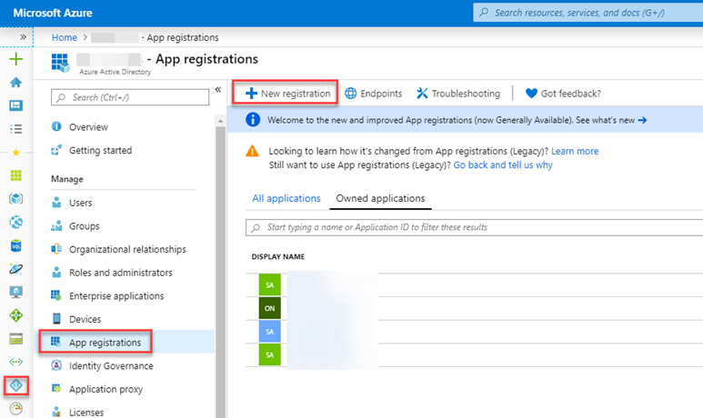

# Register a SaaS application

This article explains how to register a SaaS application using the Microsoft [Azure portal](https://portal.azure.com/) and how to get publisher's access token (Azure Active Directory access token). The publisher will use this token to authenticate the SaaS application by calling the SaaS Fulfillment APIs.  The Fulfillment APIs use the OAuth 2.0 client credentials to grant flow on Azure Active Directory (v1.0) endpoints to make a service-to-service access token request.

Azure Marketplace does not impose any constraints on the authentication method your SaaS service uses for end users. The flow below is required only for authenticating the SaaS Service in Azure Marketplace.

For more information about Azure AD (Active Directory), see [What is authentication](../../active-directory/develop/authentication-vs-authorization.md)?

## Register an Azure AD-secured app

Any application that wants to use the capabilities of Azure AD must first be registered in an Azure AD tenant. This registration process involves giving Azure AD some details about your application. To register a new application using the Azure portal, perform the following steps:

1. Sign in to the [Azure portal](https://portal.azure.com/).
2. If your account gives you access to more than one, click your account in the top-right corner, and set your portal session to the desired Azure AD tenant.
3. In the left-hand navigation pane, click the **Azure Active Directory** service, click **App registrations**, and click **New application registration**.

    

4. On the Create page, enter your application\'s registration information:
    -   **Name**: Enter a meaningful application name
    -   **Application type**:  
        
        Select **Web app / API** for
        [client applications](../../active-directory/develop/developer-glossary.md#client-application))
        and [resource/API applications](../../active-directory/develop/developer-glossary.md#resource-server))
        that are installed on a secure server. This setting is used for
        OAuth confidential [web clients](../../active-directory/develop/developer-glossary.md#web-client))
        and public [user-agent-based  clients](../../active-directory/develop/developer-glossary.md#user-agent-based-client)).
        The same application can also expose both a client and resource/API.

        For specific examples of web applications, check out the quickstart guided setups that are available in the [Get Started](../../active-directory/develop/quickstart-create-new-tenant.md) section of the [Azure AD Developers Guide](../../active-directory/develop/index.yml).

5. When finished, click **Register**.  Azure AD assigns a unique *Application ID* to your new application. We recommend registering one app that accesses the API only, and as single tenant.

6. To create client secret, navigate to **Certificates & secrets page** and click **+New client secret**.  Be sure to copy the secret value to use it in your code.

The **Azure AD app ID** is associated to your publisher ID, so make sure that the same *app ID* is used in all your offers.

>[!Note]
>If a publisher has two different accounts in Partner Center, two different Azure AD app IDs should be used.

## How to get the publisher's authorization token

Once you have registered your application, you can programmatically request the publisher's authorization token (Azure AD access token, using Azure AD V1 endpoint). The publisher must use this token when calling the various SaaS Fulfillment APIs. This token is only valid for one hour. 

For more information about these tokens, see [Azure Active Directory access tokens](../../active-directory/develop/access-tokens.md).  Note that in the flow below V1 end point token is used.

### Get the token with an HTTP POST

#### HTTP Method

Post<br>

##### *Request URL* 

`https://login.microsoftonline.com/*{tenantId}*/oauth2/token`

##### *URI parameter*

|  Parameter name    |  Required         |  Description |
|  ---------------   |  ---------------  | ------------ |
|  `tenantId`        |  True      |  Tenant ID of the registered AAD application. |

##### *Request header*

|  Header name       |  Required         |  Description |
|  ---------------   |  ---------------  | ------------ |
|  `content-type`    |  True      |  Content type associated with the request. The default value is `application/x-www-form-urlencoded`. |

##### *Request body*

|  Property name     |  Required         |  Description |
|  ---------------   |  ---------------  | ------------ |
|  `grant_type`      |  True      |  Grant type. Use `"client_credentials"`. |
|  `client_id`       |  True      |  Client/app identifier associated with the Azure AD app. |
|  `client_secret`   |  True      |  Secret associated with the Azure AD app. |
|  `resource`        |  True      |  Target resource for which the token is requested. Use `20e940b3-4c77-4b0b-9a53-9e16a1b010a7` because Marketplace SaaS API is always the target resource in this case. |

##### *Response*

|  Name     |  Type         |  Description |
|  ------   |  ---------------  | ------------ |
|  200 OK   |  TokenResponse    |  Request succeeded. |

##### *TokenResponse*

Sample response:

```json
{
      "token_type": "Bearer",
      "expires_in": "3600",
      "ext_expires_in": "0",
      "expires_on": "15251…",
      "not_before": "15251…",
      "resource": "20e940b3-4c77-4b0b-9a53-9e16a1b010a7",
      "access_token": "eyJ0eXAiOiJKV1QiLCJhbGciOiJSUzI1NiIsIng1dCI6ImlCakwxUmNxemhpeTRmcHhJeGRacW9oTTJZayIsImtpZCI6ImlCakwxUmNxemhpeTRmcHhJeGRacW9oTTJZayJ9…"
  }
```

The `"access_token"` field value in the response is the `<access_token>` that you will pass as authorization parameter when calling all SaaS fulfillment and Marketplace metering APIs.

## Next steps

Your Azure AD-secured app can now use the [SaaS Fulfillment API Version 2](./pc-saas-fulfillment-api-v2.md).