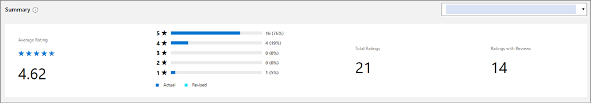
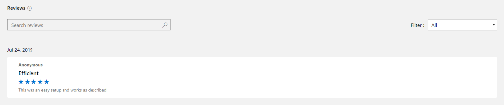

# Ratings & Reviews analytics dashboard in Partner Center

This article provides information on the Ratings & Reviews dashboard in Partner Center. This dashboard displays a consolidated view of customer feedback for offers on Microsoft AppSource and Azure Marketplace. As customers browse, search, and purchase offers in both marketplaces, they can leave ratings and reviews for the offers they've acquired.

- Customers can submit a new rating or review and update or delete an existing rating or review they have submitted. Customers can make changes only to the ratings and reviews they own.  
- Reviews are posted on the Reviews tab on the product display page of the offer in Azure Marketplace or AppSource. Customers can include their name or post anonymously.  

>[!NOTE]
> For detailed definitions of analytics terminology, see [Frequently asked questions and terminology for commercial marketplace analytics](./faq-terminology.md).

## Access the dashboard

In the [Commercial Marketplace dashboard](https://partner.microsoft.com/en-us/dashboard/commercial-marketplace/overview) in Partner Center, expand the **[Analyze](https://partner.microsoft.com/dashboard/commercial-marketplace/analytics/summary)** section and select **Ratings & Reviews**.

The dashboard displays a graphical representation of the following customer activity:

- Ratings & reviews  
- Review comments

Use the **Marketplace storefront** tabs to view your offer Microsoft AppSource and Azure Marketplace metrics separately. To view specific offer metrics, select the offer from the offer dropdown list.

### Ratings & reviews summary

The ratings & reviews summary section displays the metrics below for a selected date range:

- **Average rating:** Weighted average star rating of all the ratings submitted by customers for the selected offer.
- **Rating breakdown:** Breakdown of star rating by the count of customers who submitted ratings. The bar chart is stacked with actual and revised ratings (updated rating count).
- **Total ratings:** Overall count of ratings submitted. This count also includes ratings with and without reviews.
- **Ratings with reviews:** Count of reviews submitted.

### Review comments

Reviews are displayed in chronological order for when they were posted. The default view displays all reviews and you can filter through the reviews by star rating using the **Rating filter** in the dropdown menu. Additionally, you can search by keywords that appear in the review.  

## Next steps

- For an overview of analytics reports available in the Partner Center commercial marketplace, see [Analytics for the commercial marketplace in Partner Center](./analytics.md).
- For graphs, trends, and values of aggregate data that summarize marketplace activity for your offer, see [Summary Dashboard in commercial marketplace analytics](./summary-dashboard.md).
- For information about your orders in a graphical and downloadable format, see [Orders Dashboard in commercial marketplace analytics](./orders-dashboard.md).
- For Virtual Machine (VM) offers usage and metered billing metrics, see [Usage Dashboard in commercial marketplace analytics](./usage-dashboard.md).
- For detailed information about your customers, including growth trends, see [Customer Dashboard in commercial marketplace analytics](./customer-dashboard.md).
- For a list of your download requests over the last 30 days, see [Downloads Dashboard in commercial marketplace analytics](./downloads-dashboard.md).
- For frequently asked questions about commercial marketplace analytics and for a comprehensive dictionary of data terms, see [Frequently asked questions and terminology for commercial marketplace analytics](./faq-terminology.md).
