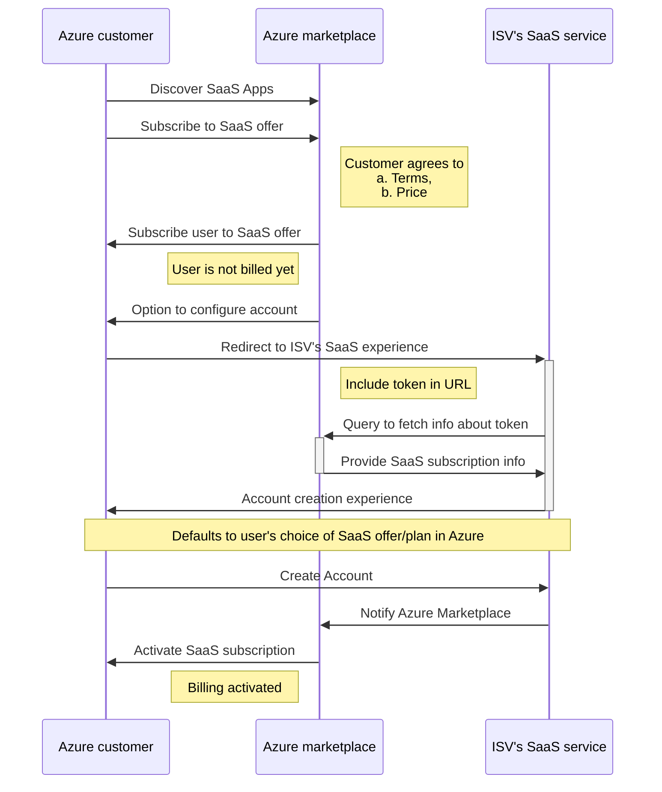
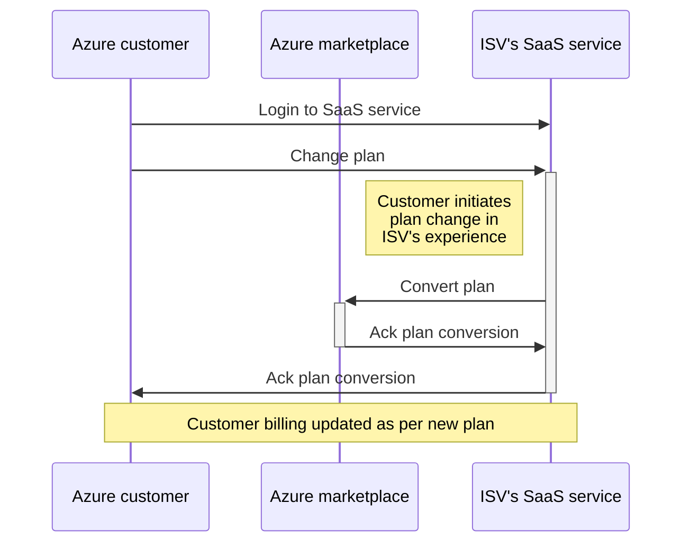
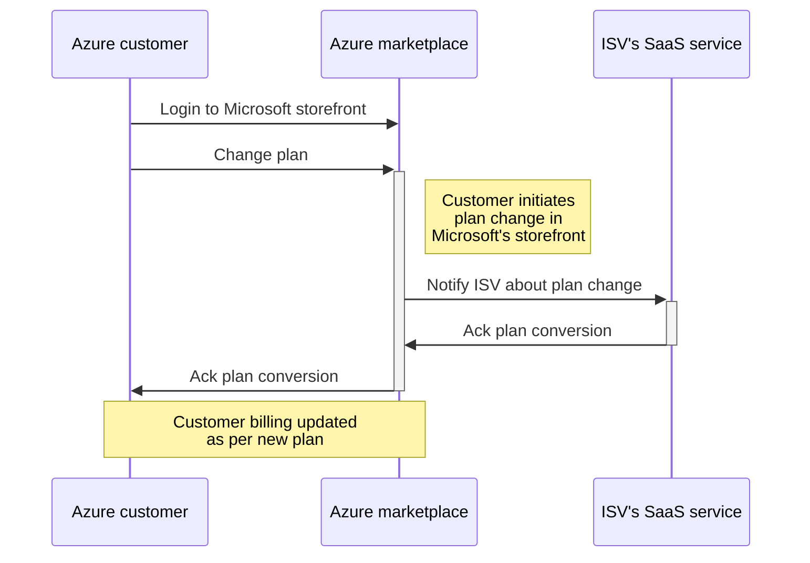
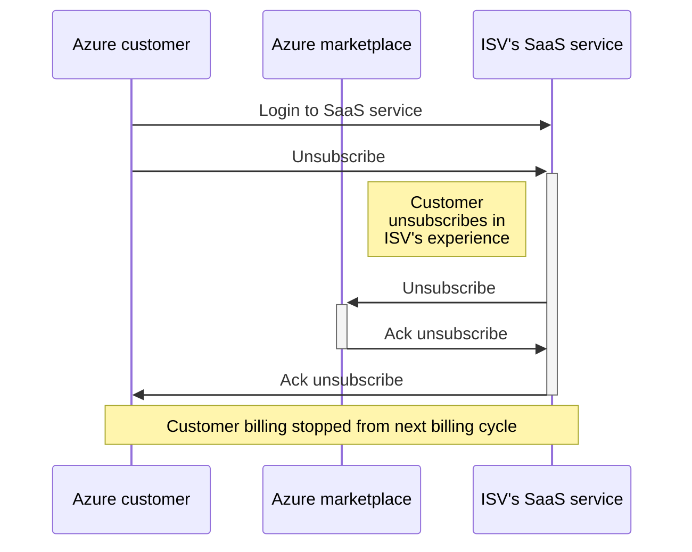
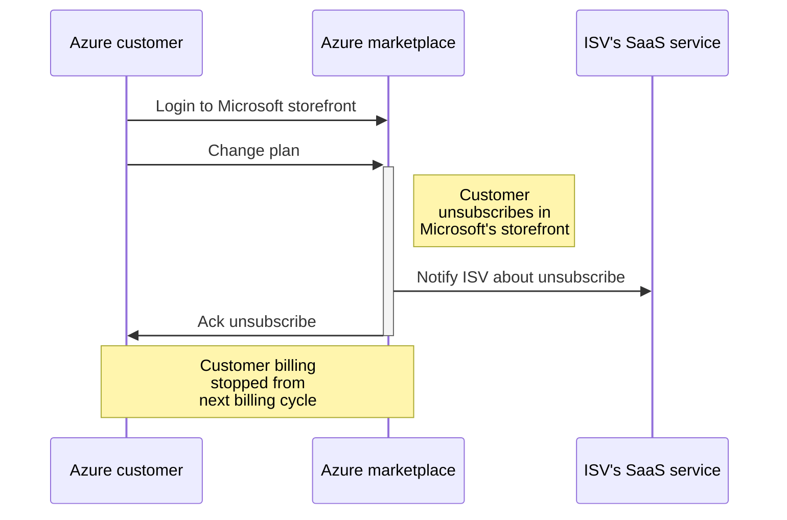
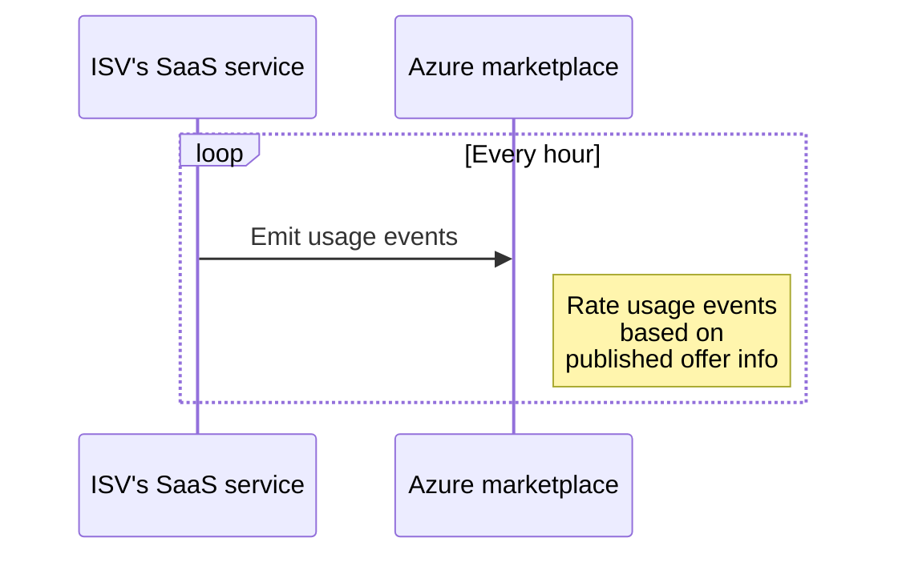

# Commercial Marketplace metering service

SaaS offers now support flexible billing models.  The sections below outlines the steps to take in order to advantage of this capability in the Commercial Marketplace:

1. Choosing the right billing model.
1. Understanding the Marketplace eligibility requirements.
1. Publishing a SaaS offer with the Marketplace metering service.
1. Understanding the integration requirements with Azure Marketplace.
1. Operational constraints with flexible billing models.

## Choosing the right billing model

### Publishing options

A SaaS offer published in Azure Marketplace can be one of the following publishing options

- List
- Trial
- Transact

**List** option allows you to publish your offer and get leads for prospective customers. Following up with the lead, and converting it to an opportunity are your responsibilities. You have a direct relationship with your customer, both from the engagement and transactional perspective.

**Trial** option allows you to publish an offer that Azure customers can try out your service in a sandbox environment. The sandbox environment is available for a specific period of time (example: 30 days). Once the trial period is complete, you are responsible to follow up with the customer to establish the engagement and future sales, wherever applicable.

**Transact** option allows you to publish an offer to Azure Marketplace that users can discover, subscribe, and pay for using their existing billing relationships with Microsoft.

### Billing models

This document is solely focused on the transact option. While publishing an offer that will be transacted in Azure Marketplace, it is important to understand the billing models available in the platform.

Billing models refer to the different capabilities available in the platform for you to charge the end users for their services. The list of available billing models for SaaS offers in Azure Marketplace are

- **Per site** - allows you to set a flat monthly fee that is pre-paid (often referred to as base price) per recurring term (month/year)
- **Per seat** - allows you to set a flat monthly fee per user that is pre-paid per recurring term (month/year)

**Custom meters** is an extension of the per-site billing model.  This capability allows you to set a flat monthly fee that is pre-paid per recurring term (month/year). You can define explicitly what the user gets for the base price. Additionally, you can define the overage charges if the user exceeds the services provided for the base price.

>[!Note]
>Marketplace metering service is available only to the per site billing model, and not on the per seat billing model.  This documentation solely focuses on **per site** billing model.

## Marketplace eligibility requirements

To transact SaaS offers with the Marketplace metering service, the following eligibility constraints should be met:

- The SaaS offer should be published to Azure Marketplace
- The SaaS service should support [Azure Active Direction AAD](https://docs.microsoft.com/azure/marketplace/enable-appsource-marketplace-using-azure-ad) as one of its authentication options.
  - End user purchasing and managing SaaS service from Azure should be able to natively log in, purchase, and manage the SaaS subscription without having to create an explicit login.

## Publishing a SaaS offer with the Marketplace metering service

The following information is required to publish a SaaS offer with the Marketplace metering service.

- **Storefront metadata**
- **Service-specific info for authentication, authorization, and notification**
- **Offer hierarchy with billing models**

**Storefront metadata**

This metadata includes title, description, screenshots, support info, privacy link, terms of use, etc. It is boilerplate, and is the same as the information collected for any offer (SaaS or otherwise) published in Azure Marketplace.

To publish a new SaaS offer, you must meet the following prerequisites:

- Access to the Microsoft publishing portal. This portal provides role-based access, allowing multiple individuals to collaborate on publishing an offer.
- Before an offer can be published on behalf of a publisher account, one of individuals with Owner role need to agree to comply with the Terms of Use, Microsoft Privacy Statement, and Microsoft Azure Certified Program Agreement.
- All non-English content must be accompanied with an English language version. This content includes Storefront text, documents, screenshots, Terms of Use and Privacy Policy. It's acceptable to provide a Useful link URL to a non-English application.
- Have your metadata ready to use. The following non-exhaustive list shows an example of this metadata:
  - A title
  - A description (in HTML format)
  - A logo image (in PNG format) and in these fixed image sizes: 40 x 40 pixels, 90 x 90 pixels, 115 x 115 pixels, and 255 x 115 pixels.
  - A Term of Use and Privacy Policy statements
  - Application documentation
  - Support contacts

**Service-specific information for authentication, authorization, and notification**

For offers transacted on the Microsoft platform, there needs to be a two-way secure connectivity between Azure Marketplace and your SaaS service.

You will communicate to Microsoft via one of its published APIs (Application Programming Interface). The authentication to this API is [Azure AD enabled](https://docs.microsoft.com/azure/marketplace/enable-appsource-marketplace-using-azure-ad).

The authentication requirements here are for the SaaS service integrating with Azure Marketplace platform to enable purchase transactions. It is independent from the authentication of SaaS service that enables its end users to sign in and manage the SaaS service.

To integrate with Azure Marketplace, you should

- Register an AAD application in their Azure subscription. See [SaaS fulfillment APIs, version 2](https://docs.microsoft.com/azure/marketplace/partner-center-portal/pc-saas-fulfillment-api-v2), for a step by step guide to create an AAD application in your Azure environment.
- Provide the tenant ID and client ID associated with the AAD application to Microsoft at the time of publishing the offer.

For Microsoft to communicate with you about certain events, you need to

- Host a webhook.
- Provide the details of the webhook end point to Microsoft at the time of publishing the offer.

>[!Note]
>Details about the webhook can be found in [SaaS fulfillment APIs, version 2](https://docs.microsoft.com/azure/marketplace/partner-center-portal/pc-saas-fulfillment-api-v2).

**Offer hierarchy with billing models**

When it comes to defining the offer along with its billing models, it is important to understand the offer hierarchy.

- You can publish one or more SaaS offers
- Each SaaS offer is associated with one publishing option (List/Trial/Transact). Once set, it cannot be changed after an offer is published.
- Each SaaS offer can have one or more plans. A user subscribes to the SaaS offer. However, they purchase it in the context of a plan.
- Each plan has the billing model associated with it (per site/per seat). All plans in an offer should be associated with the same billing model. For example, there cannot be an offer where one of its plans is per seat billing model, and another is per site billing model.
- Per site billing model at a plan level consists of the following recurring fee per term: <br> Recurring **monthly** fee: flat monthly fee that is pre-paid on a monthly recurrence when user purchases the plan. <br> Recurring **annual** fee (optional): flat annual fee that is pre-paid on an annual recurrence when user purchases the plan.
- Offer dimensions and overage:

  - **Dimension identifier**: immutable identifer set by the ISV. It is the identifier referenced while emitting overage usage events.
  - **Dimension name**: display name associated with the dimension.
  - **Unit of measure**: unit against which ISV measures the dimension
  - **Price / unit of measure**: price associated with the dimension.
  - **Included quantity for monthly term**: quantity of dimension included as part of the recurring monthly fee.
  - **Included quantity for annual term**: quantity of dimension included as part of the recurring annual fee, if applicable.

Lets take an example. Contoso is a publisher with a SaaS service called Contoso Notification Services (CNS). CNS allows user to send notifications either via email or text. Contoso is registered as a publisher in Microsoft's Marketplace platform. There are two plans associated with CNS, and they are outlined below

- Base plan
  - Send 10000 emails and 1000 texts for 0\$/mo
  - Beyond the 10000 emails, pay 1\$ for every 100 emails
  - Beyond the 1000 texts, pay 0.02\$ for every text
- Premium plan
  - Send 50000 emails and 10000 texts for 350\$/mo
  - Beyond the 50000 emails, pay 0.5\$ for every 100 emails
  - Beyond the 10000 texts, pay 0.01\$ for every text

A user subscribing to CNS service will automatically benefit with respect to included text and emails based on the plan selected. When users consume more than the included quantity, they do not have to change plans, or do anything different. Contoso can measure the overage beyond the included quantity, and start emitting usage events for the overage measured. Microsoft in turn will charge the user for the overage as specified by the ISV.

**Constraints**

- Once an SKU is published with the Marketplace metering service, those custom meters become immutable for that SKU:
  - Number of enabled dimensions is locked
  - No dimension may be created, deleted, or disabled, and the ID, Display Name, and Unit of Measure cannot be changed.
  - Price could go down in the future when we support price decrease.
- An ISV can add a new Marketplace metering service dimension to a new SKU, but the new meter will not be enabled for an already published SKU.
- Publishing a per-site offer with an SKU without the Marketplace metering service, and then updating and adding another SKU with a Marketplace metering service, which is not enabled for the first SKU, is supported.
- Max #dimensions per offer: 18 

## Integration requirements with Azure Marketplace to enable customers to subscribe to the SaaS offer

### Discovery experience

Once the offer is published, Azure users can discover the SaaS offer in Azure Marketplace. Users will be able to filter offers based on product type (SaaS) and discover the SaaS services of interest.

### FAQs on purchase experience

Once the user is interested in a specific SaaS service, the user can subscribe to it from Azure Marketplace.

**What does subscribing to an offer in Azure Marketplace mean?**

It means that a user can view the terms of use, privacy statement associated with the SaaS service, and agree to pay for it as per the billing terms set by the Publisher on Microsoft's paper. Users can use their existing payment profile in Marketplace to pay for the SaaS service consumption.

It is beneficial for the following reasons:

- Customers can now discover and subscribe in one place using Microsoft Cloud Platform as a trusted source, without having to vet every ISV software it intends to use. 
- Also, customers can use their existing payment profile without having to explicitly pay each ISV software independently.

**Is the user charged automatically when the offer is subscribed?**

While subscribing to the SaaS offer, user has agreed to pay for consumption of the SaaS service through the Microsoft platform. However, they will not be charged until they actually start consuming the offer. To start consuming the offer, they have to go the publisher's SaaS service and confirm account creation. The publisher will then notify Microsoft to start billing for this customer's SaaS subscription.

**How is the publisher notified when a user subscribes to their SaaS service?**

When a user subscribes to your SaaS service in Azure, a lead is automatically generated and sent to you. Information specific to the lead management system is provided by the publisher at the time of publishing the offer.

After subscribing to an offer, user can discover and manage all their offers in Azure. By default, the state of a newly subscribed SaaS service is **'Provisioning, fulfillment pending'**. In this state, the user will be prompted with an action to 'Configure Account' when they browse to their SaaS subscription management experience in Azure portal.

When the user clicks on 'Configure Account', they will be redirected to the SaaS service website. The URL is provided by the publisher at the time of publishing the offer. This page is referred to as the publisher's landing page. Users should be able to log in to the SaaS landing page based on their existing AAD credentials in Azure.

When the user is redirected to the landing page, a token is added to the query URL. This token is short lived, and is valid for a time duration of 5 minutes. The publisher can then detect the presence of this token, and call Microsoft's API to get more context associated with the token.



[SaaS fulfillment APIs, version 2](https://docs.microsoft.com/azure/marketplace/partner-center-portal/pc-saas-fulfillment-api-v2) contains the API contract for handling transact scenarios in the life cycle of a SaaS offer.

**How do you know the SaaS offer to which the user subscribed to, in Azure?**

The response from Microsoft includes non-PII information associated with the SaaS subscription. It includes the offer and plan information.

**How can the user change the plan associated with Azure subscription?**

- The user can change the plan associated with their SaaS subscription directly in the publisher's SaaS experience, or through Microsoft platform.
- Conversions can be done at any time in the billing cycle. Any conversion must be acknowledged by the publisher, and will be effective immediately as soon as it is acknowledged.
- Pre-paid plan rates are pro-rated. Any overage emitted until the time of conversion will be charged in the next invoice. New overages are emitted by the publishers based on the new plan.

>[!Note] 
>The publisher can block downgrades if they do not want to support specific conversion paths.

The sequence below captures the flow when a customer changes plan in the publisher's SaaS experience



The sequence below captures the flow when a customer changes plan in the Microsoft's storefront:



**How can the user unsubscribe from the plan associated with Azure subscription?**

User can unsubscribe from a purchased SaaS offer either directly in the ISV's SaaS experience, or through the Microsoft platform. Once the user unsubscribes, they will no longer be charged from next billing cycle.

Below sequence captures the flow when Azure customer unsubscribes to SaaS offer in ISV's SaaS experience



The sequence below captures the flow when Azure customer changes plan in Microsoft's storefront



### Emit usage events

Once a user subscribes to a SaaS service, the publisher will track consumption. If the consumption exceeds the dimension limits set for the base/annual terms, usage events will be emitted to Microsoft.



[SaaS usage event API document][??] contains the API contract for emitting usage events.

**How often is it expected to emit usage?**

The publisher is expected to emit usage every hour. If there is no usage in the previous hour, ISV is not expected to emit usage event to Microsoft.

<!--
Emitting usage every hour serves two purposes

- It establishes a heart beat between ISV and Microsoft. Health signals of heart beat is necessary to ensure communicate between ISV and Microsoft is healthy.
- It establishes a communication protocol for ISV to share usage events with Microsoft

  Note: In future iterations, we plan to decouple heartbeat signals from usage events. It will no longer be necessary to emit usage every hour, and ISV can emit usage only when there is overage events occur. -->

**What is the maximum delay between the time an event occurs and the time usage event is emitted to Microsoft?**

- Ideally, usage event is emitted every hour for events that occurred in the past hour. However, delays are expected.
- The maximum delay after which usage events will not be accepted is 24 hours.
  - It means that if a usage event occurs at 1 PM on a day, the publisher has until 1 PM on the next day to emit usage event associated with 1 PM on the day the event occurred. For example, if the system emitting usage has a down time, it can recover and then send the usage event for the hour interval in which the usage happened without loss of fidelity.

**What happens when the publisher sends more than one usage event at the same hour?**

- Only one usage event is accepted for an hour interval. Hour interval starts at minute 0 and ends and minute 59.
- If more than one usage event is published by publisher for the same hour interval, subsequent usage events are dropped as duplicates.

## Operational constraints

Following are some of the operations considerations while enabling the flexible billing models.

- User is under-charged
- User is over charged
- Usage boundary limit checks

### User is undercharged

- ISV has the option to detect and rectify it as part of usage events emitted before the billing cycle ends. Note that it could lead to loss of fidelity when the customer looks at the drill-down of usage events in invoice.
  Note: Multiple usage events for the same hour interval will be marked as duplicate. If the usage event is beyond 24 hours, it will be marked as 'Expired'
- ISV consumes the loss, since they emitted incorrect usage.

### User is over charged

- For any issues related to SaaS overage billing, customer reaches out to ISV support directly.
- If ISV detects they have overcharged the customer, they notify Azure support.
  - Azure CSS provides credit back to Azure customer for the amount over charged
  - This amount is automatically detected from ISV pay-out in next billing cycle.

### Usage boundary limit checks

To ensure that Microsoft platform is able to detect anomalies early - before an invoice is generated, following information is requested for each overage dimension defined at the time of publishing the offer

- Expected range (lower limit - higher limit)

If there is anomaly between the usage events received and the range defined by the ISV, Microsoft will notify ISV. Please note that this notification does not block future usage events to be emitted. Intent is to notify ISV early in the process about potential anomalies. This can help ISV take corresponding action.

## Usage Event External - Preview

**Version: 1.0.0**

/usageEvent

**POST**

### Summary

The usage event API allows you to emit usage event for a specific purchased entity.

**POST:** <br /> `https://marketplaceapi.microsoft.com/api/usageEvent?api-version=<ApiVersion>`

### *Query parameters*

|            |          |
| ---------- | ---------------------- |
| ApiVersion | The version of the operation to use for this request. |

### *Request headers*

| Content-Type       | `application/json`    |
| ------------------ | ---------------------------- |
| x-ms-requestid     | Unique string value for tracking the request from the client, preferably a GUID. If this value is not provided, one will be generated and provided in the response headers.                                                           |
| x-ms-correlationid | Unique string value for operation on the client. This parameter correlates all events from client operation with events on the server side. If this value isn't provided, one will be generated and provided in the response headers. |
| authorization      | [Get JSON web token (JWT) bearer token.](https://docs.microsoft.com/azure/marketplace/cloud-partner-portal/saas-app/cpp-saas-registration#get-a-token-based-on-the-azure-ad-app)                                                      |

### *Request*

```json
{
  "resourceId": "Identifier of the resource against which usage is emitted",
  "quantity": 5.0,
  "dimension": "dimension identifier",
  "effectiveStartTime": "Time in UTC when the usage event occured",
  "planId": "Plan associated with the purchased offer"
}
```
### **Responses**

Code: 200<br>
OK 
//TODO: change usageResourceId to resourceId

```json
{
  "usageEventId": "Unique identifier associated with the usage event",
  "status": "Accepted",
  "messageTime": "Time this message was created in UTC",
  "usageResourceId": "Identifier of the resource against which usage is emitted",
  "quantity": 5.0,
  "dimension": "dimension identifier",
  "effectiveStartTime": "Time in UTC when the usage event occured",
  "planId": "Plan associated with the purchased offer"
}
```

Code: 400 <br>
Bad request, missing or invalid data provided or Expired

```json
{
  "message": "One or more errors have occurred.",
  "target": "usageEventRequest",
  "details": [
    {
      "message": "The UsageResourceId is required.",
      "target": "UsageResourceId",
      "code": "BadArgument"
    }
  ],
  "code": "BadArgument"
}
```

Code: 403<br>
Bad request, missing or invalid data provided or Expired

```json
{
  "code": "Forbidden",
  "message": "User is not allowed authorized to call this"
}
```

Code: 409<br>
Conflict, when we recieve the usage call for the usage resource Id and effective usage which already exist. The response will contain 'additionalInfo' field that contains info about the accepted message.

```json
{
  "code": "Conflict",
  "additionalInfo": {
    "usageEventId": "Unique identifier associated with the usage event",
    "status": "Accepted|NotProcessed|Expired",
    "messageTime": "Time this message was created in UTC",
    "usageResourceId": "Identifier of the resource against which usage is emitted",
    "quantity": 5.0,
    "dimension": "dimension identifier",
    "effectiveStartTime": "Time in UTC when the usage event occured",
    "planId": "Plan associated with the purchased offer"
  }
}
```

### /batchUsageEvent

**POST**

### Summary

The batch usage event API allows ISV to emit usage event for more than one purchased entity at the same time. Resources included in the batch usage event should have the same AAD application identifier //TODO: rephrase.

**POST:** <br /> `https://marketplaceapi.microsoft.com/api/batchUsageEvent?api-version=<ApiVersion>`

### *Query parameters:*

|            |     |
| ---------- | -------------------- |
| ApiVersion | The version of the operation to use for this request. |

### *Request headers:*

| Content-Type       | `application/json`       |
| ------------------ | ------ |
| x-ms-requestid     | Unique string value for tracking the request from the client, preferably a GUID. If this value is not provided, one will be generated and provided in the response headers.                                                           |
| x-ms-correlationid | Unique string value for operation on the client. This parameter correlates all events from client operation with events on the server side. If this value isn't provided, one will be generated and provided in the response headers. |
| authorization      | [Get JSON web token (JWT) bearer token.](https://docs.microsoft.com/azure/marketplace/cloud-partner-portal/saas-app/cpp-saas-registration#get-a-token-based-on-the-azure-ad-app)                                                      |

### _Request:_

```json
{
  "request": [
    {
      "usageResourceId": "Identifier of the resource against which usage is emitted",
      "quantity": 5.0,
      "dimension": "dimension identifier",
      "effectiveStartTime": "Time in UTC when the usage event occured",
      "planId": "Plan associated with the purchased offer"
    },
    {
      "usageResourceId": "Identifier of the resource against which usage is emitted",
      "quantity": 5.0,
      "dimension": "dimension identifier",
      "effectiveStartTime": "Time in UTC when the usage event occured",
      "planId": "Plan associated with the purchased offer"
    }
  ]
}
```

### Responses

Code: 200<br>
OK

```json
{
  "count": 2,
  "result": [
    {
      "usageEventId": "Unique identifier associated with the usage event",
      "status": "Accepted|Expired|Duplicate|Error|ResourceNotFound|ResourceNotAuthorized|InvalidDimension|BadArgument",
      "messageTime": "Time this message was created in UTC",
      "usageResourceId": "Identifier of the resource against which usage is emitted",
      "quantity": 5.0,
      "dimension": "dimension identifier",
      "effectiveStartTime": "Time in UTC when the usage event occured",
      "planId": "Plan associated with the purchased offer",
      "error": "Error object (optional)"
    },
    {
      "usageEventId": "Unique identifier associated with the usage event",
      "status": "Accepted|Expired|Duplicate|Error|ResourceNotFound|ResourceNotAuthorized|InvalidDimension|BadArgument",
      "messageTime": "Time this message was created in UTC",
      "usageResourceId": "Identifier of the resource against which usage is emitted",
      "quantity": 5.0,
      "dimension": "dimension identifier",
      "effectiveStartTime": "Time in UTC when the usage event occured",
      "planId": "Plan associated with the purchased offer",
      "error": "Error object (optional)"
    }
  ]
}
```

//TODO: Define each status enum
//TODO: Expand error object

Code: 400<br>
Bad request, missing or invalid data provided or Expired

```json
{
  "message": "One or more errors have occurred.",
  "target": "usageEventRequest",
  "details": [
    {
      "message": "Invalid data format.",
      "target": "usageEventRequest",
      "code": "BadArgument"
    }
  ],
  "code": "BadArgument"
}
```

Code: 403<br>
User is unauthorized to make this call

```json
{
  "code": "Forbidden",
  "message": "User is not allowed to call this"
}
```

//TODO: Check the response structure for 403.

## Next steps

- [Update an existing offer in the Commercial Marketplace program](./update-existing-offer.md)
