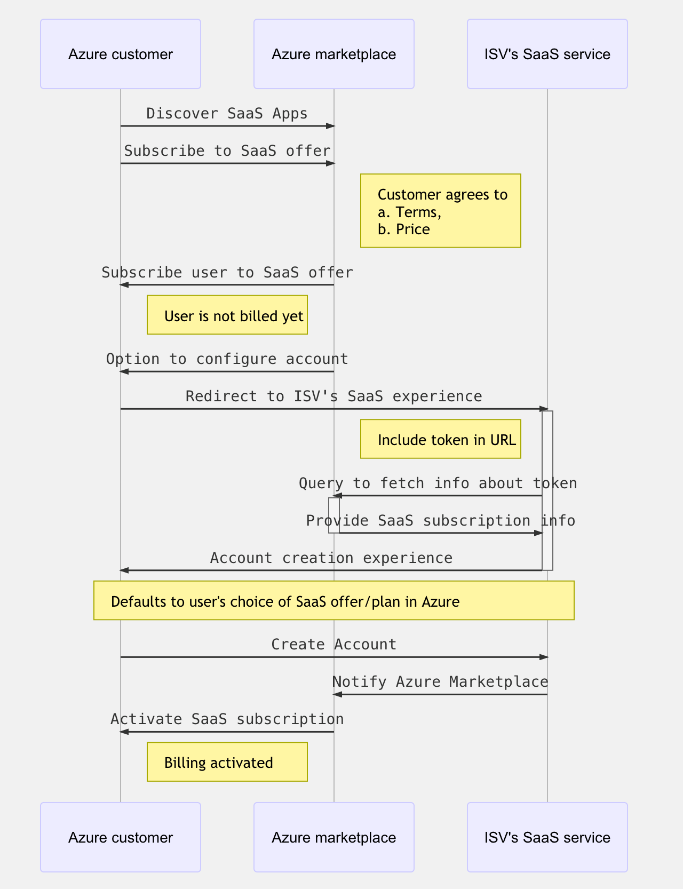
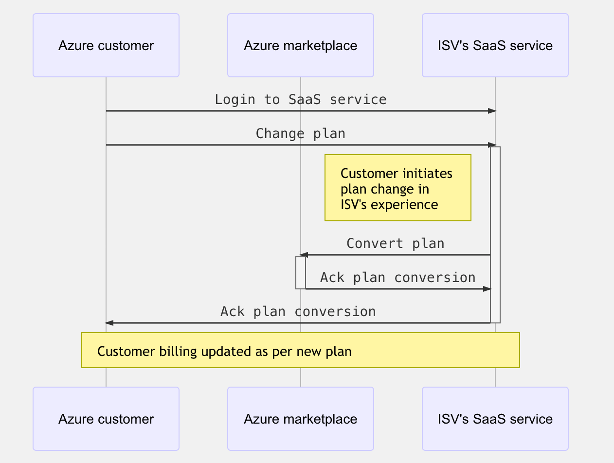
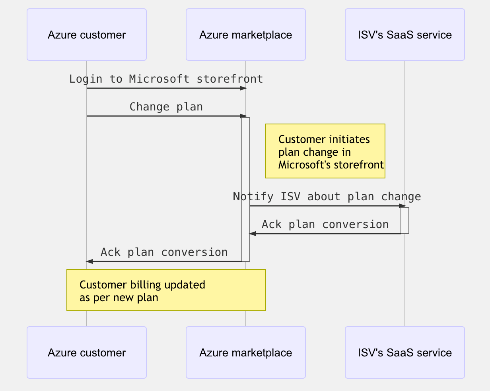
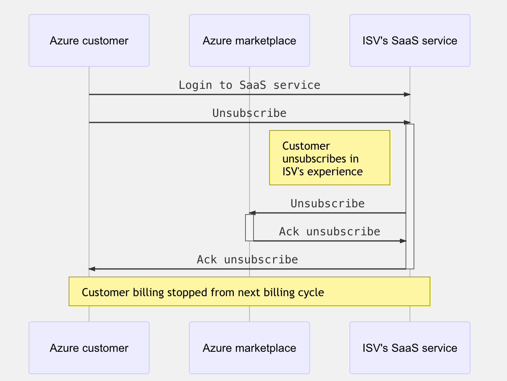

# SaaS fulfillment APIs - FAQ

The integration requirements with Azure Marketplace to enable Azure customers to subscribe to the SaaS offer are listed.

## Discovery experience

Once the offer is published, Azure users can discover the SaaS offer in Azure Marketplace. Your customers will be able to filter offers based on product type (SaaS) and discover the SaaS services they are interested in.

## Purchase experience

Once a user is interested in a specific SaaS service, the user can subscribe to it from Azure Marketplace.

### What does it mean for an Azure user to subscribe to a SaaS offer in Azure Marketplace?

It means that a user can view the terms of use and privacy statement associated with the SaaS service, and agree to pay for it as per the billing terms set by you, the publisher of the SaaS offer, on Microsoft's invoice. Users can use their existing payment profile in Azure to pay for the SaaS service consumption.

This is beneficial for a lot of reasons. Customers can now discover and subscribe in one place using Microsoft Cloud Platform as a trusted source, without having to vet every ISV software it intends to use. Also, customers can use their existing payment profile without having to explicitly pay each ISV software independently.

### Is the user charged automatically when the offer is subscribed?

While subscribing to the SaaS offer, the user has agreed to pay for consumption of the SaaS service through the Microsoft platform. However, charges will only start when the offer is consumed. The user must go to your SaaS offer and confirm account creation to start consuming the offer. You will then notify Microsoft to start billing for this customer SaaS subscription.

### How are you notified when a user subscribes to your SaaS offer?

After subscribing to an offer, the Azure user can discover and manage all their offers in Azure. By default, the state of a newly subscribed SaaS offer is **'Provisioning, fulfillment pending'**. In this state, the Azure user will be prompted with an action to **'Configure Account'**, in order to browse to their SaaS subscription management experience in the Azure portal.

When the user clicks on **'Configure Account'**, they will be redirected to the SaaS service website. The URL where they are navigated to is provided by the publisher at the time of publishing the offer. This page is referred to as the publisher's landing page. Azure users should be able to login to the SaaS landing page based on their existing AAD credentials in Azure.

When the Azure user is redirected to the landing page, a token is added to the query URL. This token is short lived, and valid for a time duration of 24 hours. You can then detect the presence of this token, and call Microsoft's API to get more context associated with the token.

See the [SaaS fulfillment API](https://docs.microsoft.com/azure/marketplace/partner-center-portal/pc-saas-fulfillment-api-v2) document for more information on the API contract for handling transact scenarios in the life cycle of a SaaS offer.

### How do you know the SaaS offer to which the user subscribes in Azure?

The response to the `Resolve` API includes the offer and plan information associated with the SaaS subscription.

### How can the Azure user change the plan associated with this Azure subscription?

* The Azure user can change the plan associated with the SaaS subscription directly in the SaaS experience, or through the Microsoft platform.

* Conversions can be done at any time in the  billing cycle. You must acknowledge any conversion, which will become effective once acknowledged.

* Pre-paid plan (**monthly** or **annual**) rates are pro-rated. Any overage emitted up to the time of conversion will be charged in the next invoice. New overages will be emitted based on the new plan.

>[!Note]
>You can block downgrades if you do not want to support specific conversion paths.

The sequence below captures the flow when a Azure customer changes plan in the SaaS experience:

The sequence below captures the flow when an Azure customer changes plan in Microsoft's storefront

### How can the Azure user unsubscribe from the plan associated with Azure subscription?

An Azure user can unsubscribe from a purchased SaaS offer either directly in the SaaS experience, or through the Microsoft platform. Once the user unsubscribes, they will no longer be charged from next billing cycle.

The sequence below captures the flow when an Azure customer unsubscribes to the SaaS offer in the SaaS experience:

The sequence below captures the flow when Azure user unsubscribes in Microsoft's storefront:

## Next steps

- See [Marketplace metering service APIs](./marketplace-metering-service-apis.md) for more information.
