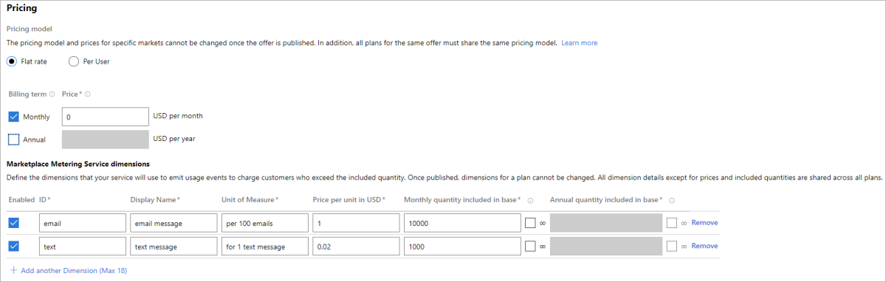
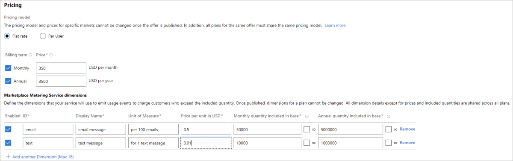
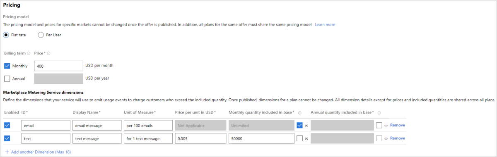
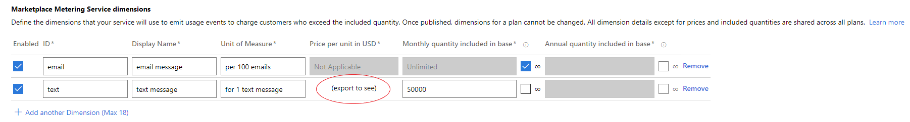

# Metered billing using the marketplace metering service

With the Marketplace metering service, you can create software-as-a-service (SaaS) offers that are charged according to non-standard units.  Before publishing this offer, you define the billing dimensions such as bandwidth, tickets, or emails processed.  Customers then pay according to their consumption of these dimensions, with your system informing Microsoft via the Marketplace metering service API of billable events as they occur.  

## Prerequisites for metered billing

For a SaaS offer to use metered billing, it must first:

* Meet all of the offer requirements for a [sell through Microsoft offer](./create-new-saas-offer.md#sell-through-microsoft) as outlined in [Create a SaaS offer](./create-new-saas-offer.md).
* Integrate with the [SaaS Fulfillment APIs](./pc-saas-fulfillment-api-v2.md) for customers to provision and connect to your offer.  
* Be configured for the **flat rate** pricing model when charging customers for your service.  Dimensions are an optional extension to the flat rate pricing model. 
* Integrate with the [Marketplace metering service APIs](./marketplace-metering-service-apis.md) to inform Microsoft of billable events.

Then the SaaS offer can integrate with the [Marketplace metering service APIs](./marketplace-metering-service-apis.md) to inform Microsoft of billable events.

>[!Note]
>Marketplace metering service is available only to the flat rate billing model, and does not apply to the per user billing model.

## How metered billing fits in with pricing

Understanding the offer hierarchy is important, when it comes to defining the offer along with its pricing models.

* Each SaaS offer is configured to sell either through Microsoft or not.  Once an offer is published, this option cannot be changed.
* Each SaaS offer, configured to sell through Microsoft, can have one or more plans.  A user subscribes to the SaaS offer, but it is purchased through Microsoft within the context of a plan.
* Each plan has a pricing model associated with it: **flat rate** or **per user**. All plans in an offer must be associated with the same pricing model. For example, there cannot be an offer having plans for a flat-rate pricing model, and another being per-user pricing model.
* Within each plan configured for a flat rate billing model, at least one recurring fee (which can be $0) is included:
    * Recurring **monthly** fee: flat monthly fee that is pre-paid on a monthly recurrence when the user purchases the plan.
    * Recurring **annual** fee: flat annual fee that is pre-paid on an annual recurrence when the user purchases the plan.
* In addition to the recurring fees, a flat rate plan can also include optional custom dimensions used to charge customers for the overage usage not included in the flat rate.  Each dimension represents a billable unit that your service will communicate to Microsoft using the [Marketplace metering service API](./marketplace-metering-service-apis.md).

## Sample offer

As an example, Contoso is a publisher with a SaaS service called Contoso Notification Services (CNS). CNS allows its customers to send notifications either via email or text. Contoso is registered as a publisher in Partner Center for the commercial marketplace program to publish SaaS offers to Azure customers.  There are two plans associated with CNS, outlined below:

* Basic plan
    * Send 10000 emails and 1000 texts for $0/month (flat monthly fee)
    * Beyond the 10000 emails, pay $1 for every 100 emails
    * Beyond the 1000 texts, pay $0.02 for every text

    

* Premium plan
    * Send 50000 emails and 10000 texts for $350/month or 5M emails and 1M texts for $3500 per year
    * Beyond the 50000 emails, pay $0.5 for every 100 emails
    * Beyond the 10000 texts, pay $0.01 for every text

    

* Enterprise plan
    * Send unlimited number of emails and 50000 texts for $400/month
    * Beyond the 50000 texts pay $0.005 for every txt

    

Based on the plan selected, an Azure customer purchasing subscription to CNS SaaS offer will be able to send the included quantity of text and emails per subscription term (month or year as appears in subscription details - startDate and endDate).  Contoso counts the usage up to the included quantity in base without sending any usage events to Microsoft. When customers consume more than the included quantity, they do not have to change plans or do anything different.  Contoso will measure the overage beyond the included quantity and start emitting usage events to Microsoft for charging the overage usage using the [Marketplace metering service API](./marketplace-metering-service-apis.md).  Microsoft in turn will charge the customer for the overage usage as specified by the publisher in the custom dimensions. The overage billing is done on the next billing cycle (monthly, but can be quarterly or early for some customers).  For a monthly flat rate plan, the overage billing will be made for every month where overage has occurred.  For a yearly flat rate plan, once the quantity included in base per year is consumed, all additional usage emitted by the custom meter will be billed as overage during each billing cycle (monthly) until the end of the subscription's year term.

## Billing dimensions

Each billing dimension defines a custom unit by which the ISV can emit usage events.  Billing dimensions are also used to communicate to the customer on how they will be billed for using the software.  They are defined as follows:

* **ID**: the immutable dimension identifier referenced while emitting usage events.
* **Display Name**: the display name associated with the dimension, for example "text messages sent".
* **Unit of Measure**: the description of the billing unit, for example "per text message" or "per 100 emails".
* **Price per unit in USD**: the price for one unit of the dimension.  It can be 0. 
* **Monthly quantity included in base**: quantity of dimension included per month for customers paying the recurring monthly fee, must be an integer. It can be 0 or unlimited.
* **Annual quantity included in base**: quantity of dimension included per each year for customers paying the recurring annual fee, must be an integer. Can be 0 or unlimited.

Billing dimensions are shared across all plans for an offer.  Some attributes apply to the dimension across all plans, and other attributes are plan-specific.

The attributes, which define the dimension itself, are shared across all plans for an offer.  Before you publish the offer, a change made to these attributes from the context of any plan will affect the dimension definition across all plans.  Once you publish the offer, these attributes will no longer be editable.  These attributes are:

* ID
* Display Name
* Unit of Measure

The other attributes of a dimension are specific to each plan and can have different values from plan to plan.  Before you publish the plan, you can edit these values and only this plan will be affected.  Once you publish the plan, these attributes will no longer be editable.  These attributes are:

* Price per unit in USD
* Monthly quantity included in base  
* Annual quantity included in baseIncluded  

Dimensions also have two special concepts, "enabled" and "infinite":

* **Enabled** indicates that this plan participates in this dimension.  If you are creating a new plan that does not send usage events based on this dimension, you might want to leave this option unchecked.  Also, any new dimensions added after a plan was first published will show up as "not enabled" on the already published plan.  A disabled dimension will not show up in any lists of dimensions for a plan seen by customers.
* **Infinite** represented by the infinity symbol "∞", indicates that this plan participates in this dimension, but does not emit usage against this dimension.  If you want to indicate to your customers that the functionality represented by this dimension is included in the plan, but with no limit on usage.  A dimension with infinite usage will show up in lists of dimensions for a plan seen by customers, with an indication that it will never incur a charge for this plan.

>[!Note] 
>The following scenarios are explicitly supported:   - You can add a new dimension to a new plan.  The new dimension will not be enabled for any already published plans.   - You can publish a **flat-rate** plan without any dimensions, then add a new plan and configure a new dimension for that plan. The new dimension will not be enabled for already published plans.

### Setting dimension price per unit per supported market

Like flat rate pricing, billing dimension prices can be set per supported country. The publisher needs to use pricing data import and export feature in Partner Center.

1. First define the desired dimensions and mark which markets are supported. 
1. Then export this data into file.
1. Add the correct prices per country and import the file in Partner Center.

The UI of the meter will change to reflect that the prices of the dimension can only be seen in the file.

### Private plan

Like flat rate plans, a plan with dimensions can be set as private plan, accessible only by the plan's defined audience.

## Constraints

### Trial behavior

Metered billing using the marketplace metering service is not compatible with offering a free trial.  It is not possible to configure a plan to use both metered billing and a free trial.

### Locking behavior

Because a dimension used with the Marketplace metering service represents an understanding of how a customer will be paying for the service, all of the details for a dimension are no longer editable once you publish it.  It's important that you have your dimensions fully defined for a plan before you publish.

Once an offer is published with a dimension, the offer-level details for that dimension can no longer be changed:

* ID
* Display Name
* Unit of Measure

Once a plan is published, the plan-level details can no longer be changed:

* Price per unit in USD
* Monthly quantity included in base
* Annual quantity included in base
* Whether the dimension is enabled for the plan or not

### Upper limits

The maximum number of dimensions that can be configured for a single offer is 18 unique dimensions.

## Get support

If you have one of the following issues, you can open a support ticket.

* Technical issues with marketplace metering service API.
* An issue that needs to be escalated because of an error or bug on your side (ex. wrong usage event).
* Any other issues related to metered billing.

Follow the instruction in [Support for the commercial marketplace program in Partner Center](./support.md) to understand publisher support options and open support ticket with Microsoft.

## Next steps

- See [Marketplace metering service APIs](./marketplace-metering-service-apis.md) for more information.
