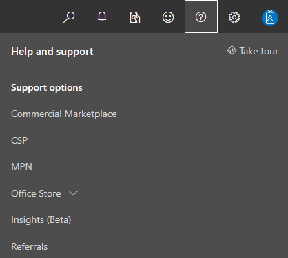
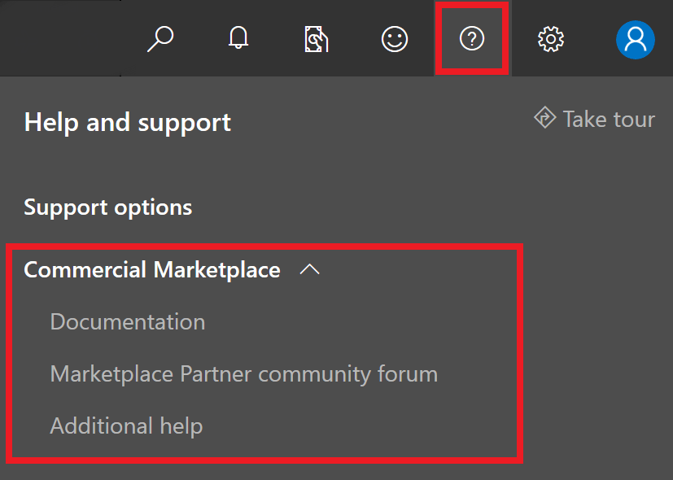

# Support for the Commercial Marketplace program in Partner Center

Microsoft provides support for a wide variety of products and services. Finding the right support team is important to ensure an appropriate and timely response. Consider the following scenarios, which should help you route your query to the appropriate team: 

- If you're a publisher and have a question from a customer, ask your customer to request support using the support links in the [Azure portal](https://portal.azure.com/). 

- If you're a publisher and have a question relating to your app or service, review the following support options.

## Support options for publishers

1. Sign in to the [Commercial Marketplace program on Partner Center](https://partner.microsoft.com/dashboard/commercial-marketplace/overview) with your work account. (If you have not yet done so, you will need to [create a Partner Center account](./create-account.md).)

1. In the upper menu on the right side of the page, select the **Support** icon. 
 
   

1. The **Help and support** pane will appear from the right-hand side of the page. There will be a dropdown for each program in Partner Center that your account is registered for. Select the **Commercial Marketplace** dropdown menu. 
 
   

1. Select **[Documentation](../index.md)** to review comprehensive answers to questions and resources. 

1. Select **[Marketplace Partner community forum](https://www.microsoftpartnercommunity.com/t5/Azure-Marketplace-and-AppSource/bd-p/2222)** to answer your questions by leveraging the knowledge of other Microsoft publishers. 

1. Select **[Additional help](https://support.microsoft.com/supportforbusiness/productselection?sapId=48734891-ee9a-5d77-bf29-82bf8d8111ff)** to open a **New support request** ticket. 

## How to open a support ticket

Selecting **Additional help** from the Commercial Marketplace support menu in Partner Center will direct you to the Microsoft Support for business page. You will see several dropdown menus. The first few dropdown menus are automatically filled out for you. For Marketplace support, identify the product family as **Cloud and Online Services**, the product as **Marketplace Publisher**, and the product version as **Marketplace Publishing**. Do not change these pre-populated dropdown menu selections. 

- **Select a category that best describes the issue**: Choose the category that best aligns with your question or problem. Selecting a category will cause an additional dropdown menu to appear, asking you to select the problem that best describes your issue.

- **Select a problem that best describes the issue**: Choose the problem from the listed options that best aligns with your issue. Depending on your problem, a new section may appear saying "Here's some information that might help" with links relevant to your issue. Review these links before selecting the **Next** button to see whether your question or problem is addressed.

By selecting the **Next** button, you will be directed to the **Issue Details** page. 

#### Tell us more about your issue

In the **Issue Details** section, explain what you need help with.

- Select your country.
- Select the language in which you'd like to receive support.
- Enter a title for your issue (from 3 to 200 characters).  
- Enter a brief description of your issue (max 2000 characters).
- Select **Next**.

#### Select a support plan

No information is required in the **Support Plan** section. Select **Next**. 

#### Select the severity of your issue

No information is required in the **Severity** section. Select **Next**. 

#### Who should we contact

In the **Contact Information** section, ensure that your primary contact’s name, phone number, and email is correct. 
- Update this information if you see anything that is incorrect
- You may add other contacts from your company to this support request if desired
- Select **Next**

#### Review and submit your support request

Review your support request information on the **Review** section. 
- If all the information is correct, select **Submit**. 
- If any information needs to be updated, select the **Change** button next to the section in need of updates.

## Track your existing support requests 

To track your support request, visit the [Commercial Marketplace support page](https://support.microsoft.com/supportforbusiness/productselection?sapId=48734891-ee9a-5d77-bf29-82bf8d8111ff). 

On the top blue menu bar, next to "Support for business", select the **Support requests** link. 

Review all of your open and closed support requests in the **Microsoft Professional Support** section. 

## Next steps

- [Update an existing offer in the Commercial Marketplace](./update-existing-offer.md)
