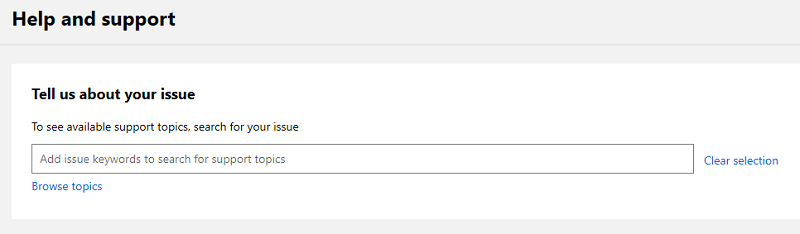

# Support for the commercial marketplace program in Partner Center

Microsoft provides support for a wide variety of products and services. Finding the right support team is important to ensure an appropriate and timely response. Consider the following scenarios, which should help you route your query to the appropriate team: 

- If you're a publisher and have a question from a customer, ask your customer to request support using the support links in the [Azure portal](https://portal.azure.com/). 

- If you're a publisher and have a question relating to your app or service, review the following support options.

## Support options for publishers

1. Sign in to the [Commercial Marketplace program on Partner Center](https://partner.microsoft.com/dashboard/commercial-marketplace/overview) with your work account. (If you have not yet done so, you will need to [create a Partner Center account](./create-account.md).)

2. In the upper menu on the right side of the page, select the **Support** icon. 
 
3. The **Help and support** pane will appear from the right-hand side of the page. 
 
   

    Or go to the **Home page** pane and select **Help and support**.

   

4. Select **[Documentation](../index.yml)** to review comprehensive answers to questions and resources. 

5. Select **[Marketplace Partner community forum](https://www.microsoftpartnercommunity.com/t5/Azure-Marketplace-and-AppSource/bd-p/2222)** to answer your questions by leveraging the knowledge of other Microsoft publishers. 

6. Select **[Additional help](https://aka.ms/marketplacepublishersupport)** to open a **New support request** ticket.  

## How to open a support ticket

Now you're ready to open a support ticket on the **Help and Support** screen.

>[!Note]
>If you are logged in Partner Center, you will receive better experience with support.

**Option 1:** Enter keywords such as: Marketplace, Azure app, SaaS offer, account management, lead management, deployment issue, payout, etc.

**Option 2:** Browse topics -> select **Category** = commercial marketplace -> select the appropriate **Topic** then **Subtopic**.

Once you have found the topic of your choice, select **Review Solutions**.

The following options will become available:

* To select a different topic, select a different topic link under **selected issue**.
* Review the description for this issue, if available.  It is the text shown above the **recommended steps**.
* Review **recommended steps**, if available.
* Review **recommended documents**, if available.

In case you cannot find your answer in **recommended solutions**, click on **provide issue details**.  Fill in the form and all required fields to help speed up the resolution process.  Then click **submit**.

>[!Note]
>If you have not logged in Partner Center and the topic requires authentication, you will be requested to log in before you can proceed.  For public topics, authentication is not required.

## Track your existing support requests 

To review all of your open and closed tickets, go to **Commercial Marketplace** on the left navigation bar, and then select **support**.

## Next steps

- [Update an existing offer in the Commercial Marketplace](./update-existing-offer.md)
