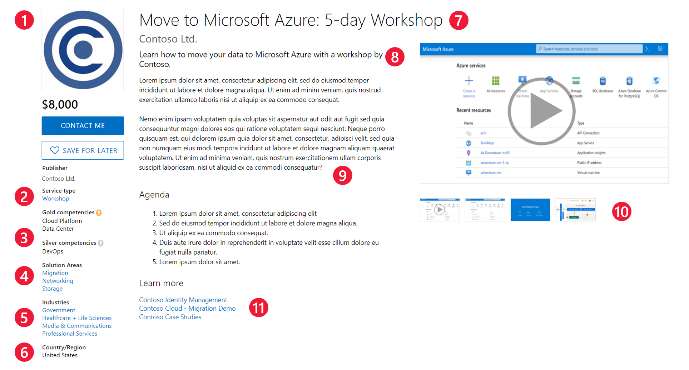

# Plan a consulting service offer

This article introduces the different options and requirements for publishing a consulting service offer to the commercial marketplace. Read this article to prepare your offer for publishing using Partner Center.

## What’s a consulting service?

Consulting services are virtual or in-person customer engagements that support and extend the customers’ use of Microsoft products. With a consulting service, customers can assess, evaluate, and deploy solutions that further their business goals. You choose the scope, duration, and pricing structure (fixed-price or free) of your service.

Consulting service offers are published as **Contact me** listings. This means that customers will contact you directly from the information you provide in your listing. While Microsoft hosts the listing in the commercial marketplace, you manage all interactions with customers. You’re responsible for fulfilling the service, billing, invoicing, and collecting from the customer.

## Primary products and online stores

Each consulting service must focus on one of these Microsoft products, called the **primary product** of the offer:

:::row:::
    :::column:::
        Azure

        Dynamics 365 Business Central

        Dynamics 365 Commerce

        Dynamics 365 Customer Insights

        Dynamics 365 Customer Service

        Dynamics 365 Field Service

        Dynamics 365 Finance

        Dynamics 365 Marketing
    :::column-end:::
    :::column:::
        Dynamics 365 Project Service Automation

        Dynamics 365 Sales

        Dynamics 365 Supply Chain Management

        Microsoft 365

        Power Apps

        Power Automate

        Power BI

        Power Virtual Agents
    :::column-end:::
:::row-end:::

The primary product you select in Partner Center determines whether your offer will be published to Microsoft AppSource or Azure Marketplace.

* If the primary product of your consulting service is Azure, the offer will be listed on Azure Marketplace.
* If the primary product is not Azure, the offer will be listed on AppSource.

To learn more about the differences between AppSource and Azure Marketplace, see [Commercial marketplace online stores](./overview.md#commercial-marketplace-online-stores).

## Eligibility requirements

To demonstrate to customers your expertise in a field, you must meet a set of eligibility requirements before publishing a consulting service offer. The requirements depend on the product at the core of your offer. The complete list of eligibility requirements for each primary product is in the [certification policies for consulting services](/legal/marketplace/certification-policies#800-consulting-services).

> [!NOTE]
> For some primary products, you must have a Gold or Silver Microsoft competency in your solution area. For more information, see [Microsoft Cloud Partner Program Competencies](https://partner.microsoft.com/membership/competencies).

## Service type and duration

The commercial marketplace supports five types of consulting service:

* **Assessment**: an evaluation of a customer’s environment to determine the applicability of a solution and to estimate the cost and timeline of its implementation.
* **Briefing**: an introduction to a solution or a service using frameworks, demos, and customer examples.
* **Implementation**: a complete installation that results in a fully working solution.
* **Proof of concept**: a limited-scope implementation to determine whether a solution meets the customer’s requirements.
* **Workshop**: an interactive engagement conducted on the customer’s premises. It can involve training, briefings, assessments, or demos built on the customer’s data or environment.

Your service should have a predetermined duration of up to 12 months. The service duration must be explicitly defined in the offer listing.

## Customer leads

The commercial marketplace will collect leads with customer information so you can access them in the [Referrals workspace](https://partner.microsoft.com/dashboard/referrals/v2/leads) in Partner Center. Leads will include information such as customer details along with the offer name, ID, and online store where the customer found your offer.

You can also choose to connect your CRM system to your offer. The commercial marketplace supports Dynamics 365, Marketo, and Salesforce, along with the option to use an Azure table or configure an HTTPS endpoint using Power Automate. For detailed guidance, see [Customer leads from your commercial marketplace offer](partner-center-portal/commercial-marketplace-get-customer-leads.md).

## Offer listing details

When you create your consulting service offer in Partner Center, you’ll enter text, images, documents, and other offer details. This is what customers will see when they discover your offer in AppSource or Azure Marketplace. See the following example:

**Call-out descriptions**

1. Logo
2. Service type
3. Competencies
4. Solution areas (Azure Marketplace) / Products (AppSource)
5. Industries
6. Country/region
7. Offer name
8. Search result summary
9. Description
10. Promotional media
11. Supporting documents

> [!NOTE]
> If you’ll deliver your service in a language other than English, the offer listing can be in that language, but the description must begin or end with the English phrase “This service is available in &lt;language of your offer content>”. You can also provide supporting documents in a language that's different from the one used in the offer listing details.

To help create your offer more easily, prepare some of these items ahead of time. The following items are required unless otherwise noted.

**Name**: This name will appear as the title of your offer listing in the commercial marketplace. The name may be trademarked. It can't contain emojis (unless they're the trademark and copyright symbols) and must be limited to 200 characters. The name must include the duration and service type of the offer to maximize search engine optimization (SEO). The required format is *Name: Duration + type*. Don’t include your company name unless it’s also the product name. Here are some examples:

|Don't say |Say |
|---|---|
|Getting Started with Azure IoT in Manufacturing |Manufacturing IoT: 2-Day Assessment |
|Workshop on Smart Toasters |Smart Toasters: 1-Week Workshop |
|SQL Server Migration PoC by Contoso |SQL Migration: 3-Wk Proof of Concept |

**Search results summary**: Describe the purpose or goal of your offer in 200 characters or less. This summary is used in the commercial marketplace listing search results. It shouldn’t be identical to the title. Consider including your top SEO keywords.

**Description**: This description will be displayed in the commercial marketplace listing. Consider including a value proposition, key benefits, intended user base, and any category or industry associations.

When writing the description, follow these criteria, according to your service type:

|Service type |Description requirements |
|---|---|
|Assessment |Include a detailed agenda for assessments longer than a day, and articulate what deliverable the customer can expect. |
|Briefing |Explain what deliverable the customer can expect.|
|Implementation |Include a detailed agenda for implementations longer than a day, and describe what engineering changes, technical artifacts, or other artifacts a customer can expect as outcomes of the engagement. |
|Proof of concept |Describe what engineering changes, technical artifacts, or other artifacts a customer can expect as outcomes of the engagement. |
|Workshop |Include a detailed daily, weekly, or monthly agenda depending on the duration of your offer. Articulate the learning goals or other deliverables of your workshop. |

Here are some tips for writing your description:

* Clearly describe the value of your offer in the first few sentences, including:
    * The type of user who benefits from the offer.
    * Customer needs or issues that the offer addresses.
* Remember that the first few sentences might be displayed in search results.
* If the price of your offer is estimated, explain what variables will determine the final price.
* Use industry-specific vocabulary.

You can use HTML tags to format your description. You can enter up to 5,000 characters of text in this box, including HTML tags and spaces. For information about HTML formatting, see [HTML tags supported in the commercial marketplace offer descriptions](./supported-html-tags.md).

**Search keywords** (optional): Provide up to three search keywords that customers can use to find your offer in the online stores. You don't need to include the offer **Name** and **Description**.

**Duration**: your consulting service offer must have a predetermined duration of up to 12 months.

**Contact information**: in Partner Center, you’ll be asked to provide name, email address, and phone number of two people in your company (you can be one of the two contacts). We'll use this information to communicate with you about your offer. This information isn’t shown to customers but may be provided to Cloud Solution Provider (CSP) partners.

**Supporting documents**: upload at least one and up to three customer-facing PDF documents that provide information about your offer. For example, they could be white papers or brochures.

**Marketplace media – logos**: Provide a PNG file for the large-size logo. Partner Center will use it to create a small logo. You can optionally replace the small logo with a different image later.

* Large (from 216x216 to 350x350 pixels, required)
* Small (48x48 pixels, optional)

The large logo appears on your offer listing page in Azure Marketplace or AppSource. The small logo appears in Azure Marketplace search results or on the AppSource main page and search results page.

Follow these guidelines for your logos:

* Make sure the image isn’t blurry or stretched.
* The Azure design has a simple color palette. Limit the number of primary and secondary colors on your logo.
* If you use a transparent background, make sure that the logo and text aren't white, black, or blue.
* Avoid gradients in the logo or background. Don't place text on the logo, not even your company or brand name.

**Marketplace media – promotional images**: Add at least one and up to five images that highlight your service’s value proposition, differentiation, and customer success. This could include snapshots from a slide deck, fact sheet, case study, or marketing one-pager summarizing your service. All images must be 1280x720 pixels in size and in PNG format.

**Marketplace media – videos** (optional): you can add up to four videos that demonstrate your offer. The videos must be hosted on YouTube or Vimeo and have a thumbnail (1280x720 pixel PNG file).

## Pricing and availability

Your consulting service offer can be made available in one or more countries or regions. In Partner Center, you can decide the price for each market you select. For the complete list of supported markets and currencies, see [Geographic availability and currency support for the commercial marketplace](./marketplace-geo-availability-currencies.md).

## Next steps

* [Create a consulting service offer in the commercial marketplace](./create-consulting-service-offer.md)
* [Offer listing best practices](./gtm-offer-listing-best-practices.md)
