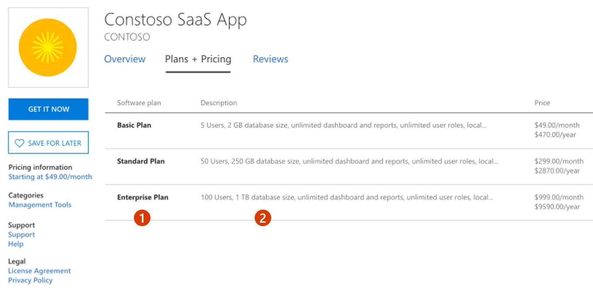

# Plan a SaaS offer for Microsoft commercial marketplace
This article explains the different options and requirements for publishing a software-as-a-service (SaaS) offer to the Microsoft commercial marketplace. This article will help you prepare your offer for publishing to the commercial marketplace with Partner Center.

## Publishing options and requirements
When you publish a SaaS offer, it will be listed in Microsoft AppSource, Azure Marketplace, or both. Your offer can be listed in the commercial marketplace with a variety of call-to-action options as shown in the following table.

You will define your _call to action_ option in the **Offer setup** tab, as explained in [Create a SaaS offer in the commercial marketplace](create-new-saas-offer.md). The call to action you choose determines what information you need to provide while you create the offer. After your offer is published, the call to action appears under your organization’s logo, as seen in Figure 1 and Figure 2, later in this article.

| Setup Details: Call-to-action | Transaction process |
| ------------ | ------------- |
| Contact me | The customer contacts you directly from information in your listing. You manage the engagement outside of the commercial marketplace. |
| Get it now (Free) | The customer is redirected to your target URL via Azure Active Directory (Azure AD), and you manage the transaction directly. |
| Free trial | The customer is redirected to your target URL via Azure AD, and you manage the transaction directly. |
| Sell through Microsoft  | Microsoft hosts the commerce transaction and bills the customer on your behalf. |
|||

### Technical requirements

The _Contact me_ call-to-action option has no technical requirements. You have the option to connect a CRM system to manage customer leads, which is described in the [Customer leads](#customer-leads) section, later in this article.

The _Get it now (Free)_, _Free trial_, and _Sell through Microsoft_ call-to-action options have the following technical requirements:

- Your SaaS application must be a multitenant solution.
- Your offer must use [Azure Active Directory (Azure AD)](https://azure.microsoft.com/services/active-directory/) for single sign-on identity management and authentication. Microsoft Accounts (MSA) are not supported for authentication. For detailed guidance, see Authenticating commercial marketplace SaaS transactions using Azure Active Directory.
- Your offer must use [SaaS Fulfillment APIs](./partner-center-portal/pc-saas-fulfillment-api-v2.md) to integrate with the Azure Marketplace.

To learn more about these options, see [Determine your publishing option](determine-your-listing-type.md).

### Subscriptions

If you want to sell your SaaS offer through Microsoft, you must meet these additional requirements.

|Requirement | Details |
| ------------ | ------------- |
| Billing and metering | Your offer is priced based on the pricing model you select before publishing: _flat rate_ or _per-user_. If you choose the flat rate model, you can optionally include additional dimensions used to charge customers for usage not included in the flat rate. We call this [metering](./partner-center-portal/saas-metered-billing.md). |
| Cancellation | Your offer is cancelable by the customer at any time. |
| Transaction landing page | You host an Azure co-branded transaction landing page where users can create and manage their SaaS service account. |
| Subscription API  | You expose a service that can interact with the SaaS subscription to create, update, and delete a user account and service plan. Critical API changes must be supported within 24 hours. Non-critical API changes will be released periodically. |
|||

### Test drives
You can choose to enable [test drives](./cloud-partner-portal/test-drive/what-is-test-drive.md) for your SaaS app, which gives customers access to a preconfigured environment for a fixed number of hours. You can enable test drives for any publishing option, however this feature has additional requirements. For more information, see [Learn about test drive for your offer](./partner-center-portal/test-drive.md).

## Customer leads

You can connect your offer to your Customer Relationship Management (CRM) system to collect customer information. The customer will be asked for permission to share their information. These customer details, along with the offer name, ID, and marketplace storefront where they found your offer, will be sent to the CRM system that you've configured. The commercial marketplace supports a variety of CRM systems, along with the option to use an Azure table or configure an HTTPS endpoint using Power Automate.

You can add or modify a CRM connection at any time during or after offer creation. For detailed guidance, see [Lead management for commercial marketplace](lead-management-for-cloud-marketplace.md).

## Legal contracts

To simplify the procurement process for customers and reduce legal complexity for software vendors, Microsoft offers a standard contract you can use for your offers in the commercial marketplace. When you offer your software under the standard contract, customers only need to read and accept it one time, and you don't have to create custom terms and conditions. 

If you choose to use the standard contract, you have the option to add universal amendment terms and up to 10 custom amendments to the standard contract. You can also use your own terms and conditions instead of the standard contract. For detailed information, see [Standard contract for Microsoft commercial marketplace](standard-contract.md).

> [!NOTE]
> After you publish an offer using the standard contract for the commercial marketplace, you are not able to use your own custom terms and conditions. It is an "or" scenario. You either offer your solution under the standard contract or your own terms and conditions. If you want to modify the terms of the standard contract you can do so through Standard Contract Amendments.

## Offer listing details

When you [create a new SaaS app offer](create-new-saas-offer.md) in Partner Center, you will enter text, images, and other details in the Offer listing tab. This is the information that customers will see when they discover your offer listing in the commercial marketplace.

***Figure 1: Example offer listing in the commercial marketplace***

:::image type="content" source="./partner-center-portal/media/example-saas-1.png" alt-text="Illustrates how this offer appears in Microsoft AppSource.":::

**Call-out descriptions**

&nbsp;&nbsp;&nbsp;&nbsp;&nbsp;&nbsp;&nbsp;1. Logo
 &nbsp;&nbsp;&nbsp;&nbsp;&nbsp;&nbsp;&nbsp;2. Categories
 &nbsp;&nbsp;&nbsp;&nbsp;&nbsp;&nbsp;&nbsp;3. Industries
 &nbsp;&nbsp;&nbsp;&nbsp;&nbsp;&nbsp;&nbsp;4. Support address (link)
 &nbsp;&nbsp;&nbsp;&nbsp;&nbsp;&nbsp;&nbsp;5. Terms of use
 &nbsp;&nbsp;&nbsp;&nbsp;&nbsp;&nbsp;&nbsp;6. Privacy policy
 &nbsp;&nbsp;&nbsp;&nbsp;&nbsp;&nbsp;&nbsp;7. Offer name
 &nbsp;&nbsp;&nbsp;&nbsp;&nbsp;&nbsp;&nbsp;8. Summary
 &nbsp;&nbsp;&nbsp;&nbsp;&nbsp;&nbsp;&nbsp;9. Description
 &nbsp;&nbsp;&nbsp;&nbsp;&nbsp;10. Screenshots/videos
 &nbsp;&nbsp;&nbsp;&nbsp;&nbsp;11. Documents

> [!NOTE]
> Offer listing content is not required to be in English if the offer description begins with the phrase "This application is available only in [non-English language]".

To help create your offer more easily, prepare some of these items ahead of time:

- **Name**: This name will appear as the title of your offer listing in the commercial marketplace. The name may be trademarked. It cannot contain emojis (unless they are the trademark and copyright symbols) and must be limited to 50 characters.
- **Search results summary**: Describe the purpose or function of your offer as a single sentence with no line breaks in 100 characters or less. This summary is used in the marketplace listing(s) search results.
- **Description**: This description will be displayed in the marketplace listing(s) overview. Consider including a value proposition, key benefits, intended user base, any category or industry associations, in-app purchase opportunities, any required disclosures, and a link to learn more. You can enter up to 3,000 characters of text in this box, including HTML markup. For additional tips, see [Write a great app description](https://docs.microsoft.com/windows/uwp/publish/write-a-great-app-description).

  > [!NOTE]
  > You can use HTML tags to format your description so it's more engaging. Most tags require both opening and closing tags. For information about HTML formatting, see Supported HTML tags for offer descriptions.

- **Getting Started Instructions**: If you choose to sell your offer through Microsoft (transact offer), this field is required. These are instructions to help customers connect to your SaaS offer. You can add up to 3,000 characters of text and links to more detailed online documentation.
- **Search keywords**: Provide up to three search keywords that customers can use to find your offer in the marketplace(s).
- **Privacy policy link**: The URL for your company’s privacy policy. You must provide a valid privacy and are responsible for ensuring your app complies with privacy laws and regulations.
- **Contact information**: You must designate the following contacts from your organization:
  - **Support contact** (name, phone, and email) for Microsoft partners to use when your customers open tickets. You must also include the URL for your support website.
  - **Engineering contact** (name, phone, and email) for Microsoft to use directly when there are problems with your offer. This contact information isn’t listed in the marketplace.
  - **CSP Program contact** (name, phone, and email) if you opt in to the CSP program, so those partners can contact you with any questions. You can also include a URL to your marketing materials.
- **Useful links**: You can provide links to various resources for users of your offer. For example, forums, FAQs, and release notes.
- **Supporting documents**: You can provide up to three customer-facing documents, such as whitepapers, brochures, checklists, or PowerPoint presentations.
- **Media – Logos**: Provide logos as .png files in the following sizes:
  - Small: 48 x 48 pixels (required)
  - Medium: 90 x 90 pixels (required)
  - Large: 216 x 216 pixels (required)
  - Wide: 255 x 115 (optional)
- **Media - Screenshots**: You must add at least one and up to five screenshots, that show how your offer works, with the following requirements:
  - 1280 x 720 pixels
  - .png file
  - Must include a caption
- **Media - Videos**: You can add up to four videos that demonstrate your offer, with the following requirements:
  - Name
  - URL: Must be hosted on YouTube or Vimeo only.
  - Thumbnail: 1280 x 720 .png file

> [!TIP]
> To publish your offer to commercial marketplace, your offer must meet the general [commercial marketplace certification policies](https://docs.microsoft.com/legal/marketplace/certification-policies#100-general) and the [software as a service policies](https://docs.microsoft.com/legal/marketplace/certification-policies#1000-software-as-a-service-saas).

## Preview audience
On the **Preview audience** tab, you can define a limited preview audience who can see and verify the details of your offer before you publish it live. This setting is not available if you choose to process transactions independently. If so, you can skip this section and go to [Technical configuration](#technical-configuration).

The preview audience differs from a private audience. A preview audience can access your offer prior to being published live in the marketplaces. You may also choose to create a private plan and make it available only to a private audience. See [Plans](#plans) for more details.

You can send invites to Microsoft Account (MSA) or Azure Active Directory (AAD) email addresses. Add up to 10 email addresses manually or import up to 20 with a .csv file. If your offer is already live, you can still define a preview audience for testing any changes or updates to your offer.

## Technical configuration

As explained earlier in [Publishing options and requirements](#publishing-options-and-requirements), if you choose any publishing option besides a Contact me listing, your offer will require integration with Azure AD and SaaS fulfillment APIs to function correctly. For detailed guidance on configuring Azure AD for your SaaS app, see Authenticating commercial marketplace SaaS transactions using Azure Active Directory.

> [!NOTE]
> You must implement integration with [SaaS fulfillment APIs](./partner-center-portal/pc-saas-fulfillment-api-v2.md) before configuring the details on the Technical configuration page. Diagrams and detailed explanations describing the usage of the collected fields are available in documentation for [the APIs](./partner-center-portal/pc-saas-fulfillment-api-v2.md).

After you have met these requirements, you must gather the following information that you’ll need for the **Technical configuration** tab.

> [!NOTE]
> If you choose to process transactions independently, this tab is not visible. If so, skip this section and go to [Plans](#plans).

- **Landing page URL**: The SaaS URL that a user will be directed to for setup. This URL will receive a token that can be used to call the fulfillment APIs to get provisioning details for your interactive registration page.

  This URL will be called with the marketplace purchase identification token parameter which uniquely identifies the specific end customer's SaaS purchase. You must exchange this token for the corresponding SaaS subscription details using the [resolve API](./partner-center-portal/pc-saas-fulfillment-api-v2.md#api-reference). Those details and any others you wish to collect should be used as part of a customer-interactive web page built in your experience to complete end customer registration and activate their purchase. On this page the user should sign up through one-click authentication by using Azure Active Directory (Azure AD). 

  This URL with marketplace purchase identification token parameter will also be called when end customer launches managed SaaS experience from Azure Portal or M365 Admin Center. You should handle both flows, when the token is provided first time after purchase for new customers and when it's provided for existing customer managing his SaaS. 

  The Landing page you configure here should be up and running 24/7. This is the only way you’ll be notified about new purchases of your SaaS offers made in the marketplace, or configuration requests of an active subscription of an offer.

- **Connection webhook**: The URL to be used as an HTTP endpoint where Microsoft will notify you of events such as purchases and subscription changes.

  The webhook you provide should be up and running 24/7 as this is the only way you’ll be notified about updates about your customers' SaaS subscriptions purchased via the commercial marketplace. If you don't already have a webhook system in place, the simplest configuration is to have an HTTP Endpoint Logic App that will listen for any events being posted to it and then handle them appropriately. For example, `https://prod-1westus.logic.azure.com:443/work`. For more information, see [Call, trigger, or nest logic apps by using HTTPS endpoints in Azure Logic Apps](https://docs.microsoft.com/azure/logic-apps/logic-apps-http-endpoint).

  > [!NOTE]
  > Inside the Azure portal, we require that you [create an Azure Active Directory (AD) app](https://docs.microsoft.com/azure/active-directory/develop/howto-create-service-principal-portal) we can verify that the connection between our two services is behind an authenticated communication. To find the [tenant ID](https://docs.microsoft.com/azure/active-directory/develop/howto-create-service-principal-portal#get-values-for-signing-in), go to your Azure Active Directory and select **Properties**, then look for the Directory ID number that’s listed. For example, `50c464d3-4930-494c-963c-1e951d15360e`.

- **Azure Active Directory application ID**: Provide the Azure AD application ID for your application. You can find this in the Azure portal in **App registrations** for Azure Active Directory.

  The Azure AD application ID is associated with your publisher ID in your Partner Center account. You must use the same application ID for all offers in that account.

  > [!NOTE]
  > If you have two or more accounts in Partner Center, you must have a unique Azure AD application ID for each account. All SaaS offers published in an account will use that account’s Azure AD application ID.

## Plans

Offers sold through Microsoft (transact offers) require at least one plan. A plan defines the solution scope and limits, and the associated pricing. You can create multiple plans for your offer to give your customers different technical and pricing options. The following screenshot shows three plans in an offer listing in the Azure Marketplace storefront.

***Figure 2: Example offer listing in the commercial marketplace showing three plans***

The **Plan overview** tab of Partner Center will take you to additional tabs where you complete all details for your plan.

> [!NOTE]
> If you choose to publish your transactions independently, this tab is not visible. If so, go to [Additional sales opportunities](#additional-sales-opportunities).

The first pieces of information you are asked to provide are a name and an ID for your plan:

- **Plan ID**: Create a unique plan ID for each plan in this offer. This ID will be visible to customers in the product URL and Azure Resource Manager templates (if applicable). Max 50 characters and must consist only of lowercase, alphanumeric characters, dashes, or underscores. You can’t change this ID after you publish the offer.

- **Plan Name**: The plan name is used to differentiate software plans that may be a part of the same offer (for example, Offer name: Windows Server 2016, Windows Server 2019). This name must be unique across all the plans in the offer. Max 50 characters. Customers will see this name when deciding which plan to select within your offer.

On the **Plan listing** tab, add a plan description as it will appear to your customers in the commercial marketplace. Explain what makes this software plan unique and any differences from other software plans within your offer. This description may contain up to 500 characters.

### Pricing models

You must associate a pricing model with each plan: either _flat rate_ or _per user_. All plans in the same offer must be associated with the same pricing model. For example, an offer cannot have one plan that's flat rate and another plan that’s per user.

**Flat rate** – Enable access to your offer with a single monthly or annual price flat rate price. This is sometimes referred to as site-based pricing. With this pricing model, you can optionally define metered plans that use the marketplace metering service API to charge customers for usage that isn't covered by the flat rate. For more information on metered billing, see [Metered billing using the marketplace metering service](./partner-center-portal/saas-metered-billing.md). You should also use this option if the usage behavior is in bursts for your SaaS service. We recommend against the customer frequently switching plans on a daily or hourly basis.

**Per user** – Enable access to your offer with the price based on the number of users who can access the offer or occupy seats. With this user-based model, you can set the minimum and maximum number of users supported by the plan. This way, different price points can be configured based on the number of users by configuring multiple plans. These fields are optional. If left unselected, the number of users will be interpreted as not having a limit (min of 1 and max of as many as the system can support). These fields may be edited as part of an update to your plan.

> [!IMPORTANT]
> After your offer is published, the pricing model choice cannot be changed. In addition, all plans for the same offer must share the same pricing model.

The **Pricing and availability** tab is where you will define the plan’s markets, pricing, and availability:

- **Markets**: Every plan must be available in at least one market. This page includes a search box and option for selecting "Tax Remitted" countries/regions, in which Microsoft remits sales and use tax on your behalf. 

- **Pricing**: For detailed pricing guidance, see [Pricing and billing](#pricing-and-billing). If you have already set prices for your plan in United States Dollars (USD) and add another market location, the price for the new market will be calculated according to the current exchange rates. After saving your changes, you will see an **Export prices (xlsx)** link that you can use to review and change the price for each market before publishing.

### Free trials

You can enable a one-month free trial for your offer, which will automatically convert to a paid offer at the end of the trial.

SaaS offers through the commercial marketplace enables you to provide a one-month free trial when selling through Microsoft. Free trials are supported for all billing models and terms except metered plans. This option gives customers one month of free access to try your offer. If you choose to enable a free trial for one or more plans within your offer, the customer can't convert to a paid subscription before the end of the initial one-month period. During this time, customers purchasing your offer can try any of the supported plans within the offer that have a free trial enabled and convert between them. The conversion to a paid subscription is done automatically at the end of the term.

> [!NOTE]
> If the customer chooses to convert to a plan without free trials, the conversion will happen, but the free trial will be lost immediately. After a customer starts paying for a plan, they can’t get a free trial on the same plan again, even if they convert to a plan that supports free trials.

To obtain information on customer subscriptions currently participating in a free trial, use the new API property inferential, which will be marked as true or false. For more information, see the [SaaS Get Subscription API](./partner-center-portal/pc-saas-fulfillment-api-v2.md#get-subscription).

### Plan visibility

You can make your plan private, which means it will be available only to a specific audience. This audience is defined by Azure tenant IDs with the option to include a description of each tenant you assign. You can enter up to 10 tenant IDs manually, or import up to 20,000 tenant IDs with a .csv file that you can download from the **Pricing and availability** tab in Partner Center.

After your offer is published with a private plan, you can update the audience or choose to make the plan available to everyone. After a plan is published as visible to everyone, it must remain visible to everyone (it cannot be configured as a private plan again).

> [!NOTE]
> The private audience differs from a preview audience. On the **Preview audience** tab, you can define an audience who can preview your offer prior to the offer being published live in the marketplace. While the private audience designation only applies to a specific plan, the preview audience can view all plans (private or not), but only during the limited preview period while the plan is being tested and validated.

### Pricing and billing

For SaaS apps that run in your (the publisher’s) Azure subscription, infrastructure usage is billed to you directly; customers do not see actual infrastructure usage fees. You should bundle Azure infrastructure usage fees into your software license pricing to compensate for the cost of the infrastructure you deployed to run the solution. 

SaaS app offers support monthly or annual billing based on a flat fee, per user, or consumption charges using the [metered billing service](./partner-center-portal/saas-metered-billing.md). Commercial marketplace operates on an agency model, whereby publishers set prices, Microsoft bills customers, and Microsoft pays revenue to publishers while withholding an agency fee.

This is a sample breakdown of costs and payouts to demonstrate the agency model. In this example, Microsoft bills $100.00 to the customer for your software license and pays out $80.00 to the publisher.

| Your license cost | $100 per month |
| ------------ | ------------- |
| Azure usage cost (D1/1-Core) | Billed directly to the publisher, not the customer |
| Customer is billed by Microsoft | $100.00 per month (Publisher must account for any incurred or pass-through infrastructure costs in the license fee) |
| **Microsoft bills** | **$100 per month** |
| Microsoft pays you 80% of your license cost `*` For qualified SaaS apps, Microsoft pays 90% of your license cost| $80.00 per month ``*`` $90.00 per month |
|||

`*` Partners who have qualified for the Reduced Marketplace Service Fee will see a reduced transaction fee on the SaaS offers from May 2019 until June 2020.

**Reduced Marketplace Service Fee** – For certain SaaS offers that you have published on the commercial marketplace, Microsoft will reduce its Marketplace Service Fee from 20% (as described in the Microsoft Publisher Agreement) to 10%. In order for your offer to qualify, at least one of your offers must have been designated by Microsoft as being either IP co-sell ready or IP co-sell prioritized. Eligibility must be met at least five (5) business days before the end of each calendar month in order to receive this reduced Marketplace Service Fee for the month. The Reduced Marketplace Service Fee does not apply to VMs, Managed Apps, or any other products made available through our Commercial Marketplace. The Reduced Marketplace Service Fee will only be available to qualified offers for license charges collected by Microsoft between May 1, 2019 and June 30, 2020. After this time, the Marketplace Service Fee will return to its normal amount.

## Additional sales opportunities

You can choose to opt into Microsoft-supported marketing and sales streams. When creating your offer in Partner Center, you will see two tabs toward the end of the process:

- **Co-sell with Microsoft**: This option allows Microsoft sales teams consider your solution when evaluating their customers’ needs. See [Co-sell option in Partner Center](./partner-center-portal/commercial-marketplace-co-sell.md) for detailed information on how to prepare your offer for evaluation.

- **Resell through CSPs**: Use this option to allow Microsoft Cloud Solution Providers (CSP) partners to resell your solution as part of a bundled offer. See [Cloud Solution Providers](https://docs.microsoft.com/azure/marketplace/cloud-solution-providers) for more information.

## Next steps

- [Create a SaaS offer in the commercial marketplace](create-new-saas-offer.md)
- [Best practices for marketplace offer listings](gtm-offer-listing-best-practices.md)
