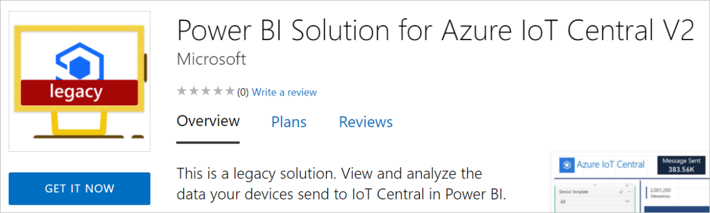

# Plan a SaaS offer for the commercial marketplace

This article explains the different options and requirements for publishing software as a service (SaaS) offers to the Microsoft commercial marketplace. SaaS offers let you deliver and license software solutions to your customers via online subscriptions. As a SaaS publisher, you manage and pay for the infrastructure required to support your customers' use of your offer. This article will help you prepare your offer for publishing to the commercial marketplace with Partner Center.

> [!TIP]
> To see the customer's view of purchasing a SaaS offer in the Azure portal, see [Purchase a SaaS offer in the Azure portal](/marketplace/purchase-saas-offer-in-azure-portal) and [Purchase SaaS apps on Microsoft AppSource](/marketplace/purchase-software-appsource).

## Listing options

As you prepare to publish a new SaaS offer, you need to decide which _listing_ option to choose. The listing option you choose determines what additional information you’ll need to provide as you create your offer in Partner Center. You will define your listing option on the  **Offer setup** page as explained in [How to create a SaaS offer in the commercial marketplace](create-new-saas-offer.md).

The following table shows the listing options for SaaS offers in the commercial marketplace.

| Listing option | Transaction process |
| ------------ | ------------- |
| Contact me | The customer contacts you directly from information in your listing.``*`` You can change to a different listing option after publishing the offer. |
| Free trial | The customer is redirected to your target URL via Azure Active Directory (Azure AD).``*`` You can change to a different listing option after publishing the offer. |
| Get it now (Free) | The customer is redirected to your target URL via Azure AD.``*`` You can change to a different listing option after publishing the offer. |
| Sell through Microsoft  | Offers sold through Microsoft are called _transactable_ offers. An offer that is transactable is one in which Microsoft facilitates the exchange of money for a software license on the publisher’s behalf. We bill SaaS offers using the pricing model you choose, and manage customer transactions on your behalf. Azure infrastructure usage fees are billed to you, the partner, directly. You should account for infrastructure costs in your pricing model. This is explained in more detail in [SaaS billing](#saas-billing) below.  **Note**: You cannot change this option once your offer is published.  |

``*`` Publishers are responsible for supporting all aspects of the software license transaction, including but not limited to order, fulfillment, metering, billing, invoicing, payment, and collection.

For more information about these listing options, see [Commercial marketplace transact capabilities](marketplace-commercial-transaction-capabilities-and-considerations.md).

After your offer is published, the listing option you chose for your offer appears as a button in the upper-left corner of your offer’s listing page. For example, the following screenshot shows an offer listing page in Azure Marketplace with the **Get it now** button.

## Technical requirements

The technical requirements differ depending on the listing option you choose for your offer.

The _Contact me_ listing option has no technical requirements. When a customer expresses interest in or deploys your product, you’ll receive a lead in the [Referrals workspace](https://partner.microsoft.com/dashboard/referrals/v2/leads) in Partner Center. You also have the option to connect a customer relationship management (CRM) system to your offer to manage customer leads. This is described in the [Customer leads](#customer-leads) section, later in this article.

The _Get it now (Free)_, _Free trial_, and _Sell through Microsoft_ listing options have the following technical requirements:

- You must enable both Microsoft Accounts (MSA) and [Azure Active Directory (Azure AD)](https://azure.microsoft.com/services/active-directory/) for authenticating buyers on your site. You must let buyers with an Azure AD account sign in to your application using Azure AD with single sign-on (SSO).
- You must create a landing page that offers a seamless sign-in and onboarding experience for a customer who’s purchased your offer. The landing page helps them complete any additional provisioning or setup that’s required. For guidance on creating the landing page, see these articles:
  - [Build the landing page for your transactable SaaS offer in the commercial marketplace](azure-ad-transactable-saas-landing-page.md)
  - [Build the landing page for your free or trial SaaS offer in the commercial marketplace](azure-ad-free-or-trial-landing-page.md)

These additional technical requirements apply to the _Sell through Microsoft_ (transactable) listing option only:

- You must use the [SaaS Fulfillment APIs](./partner-center-portal/pc-saas-fulfillment-apis.md) to integrate with Azure Marketplace and Microsoft AppSource. You must expose a service that can interact with the SaaS subscription to create, update, and delete a user account and service plan. Critical API changes must be supported within 24 hours. Non-critical API changes will be released periodically. Diagrams and detailed explanations describing the usage of the collected fields are available in documentation for the [APIs](./partner-center-portal/pc-saas-fulfillment-apis.md).
- You must create at least one plan for your offer. Your plan is priced based on the pricing model you select before publishing: _flat rate_ or _per-user_. More details about [plans](#plans) are provided later in this article.
- The customer can cancel your offer at any time.

### Technical information

If you’re creating a transactable offer, you'll need to gather the following information for the **Technical configuration** page. If you choose to process transactions independently instead of creating a transactable offer, skip this section and go to [Test drives](#test-drives).

- **Landing page URL**: The SaaS site URL (for example: `https://contoso.com/signup`) that users will be directed to after acquiring your offer from the commercial marketplace, triggering the configuration process from the newly created SaaS subscription. This URL will receive a token that can be used to call the fulfillment APIs to get provisioning details for your interactive registration page.

  This URL will be called with the marketplace purchase identification token parameter that uniquely identifies the specific customer's SaaS purchase. You must exchange this token for the corresponding SaaS subscription details using the [resolve API](./partner-center-portal/pc-saas-fulfillment-subscription-api.md#resolve-a-purchased-subscription). Those details and any others you wish to collect as part of a customer-interactive web page can be used to kick off the customer onboarding experience, which has to eventually conclude with an activate call on the API for starting the subscription period. On this page, the user should sign up through one-click authentication by using Azure Active Directory (Azure AD).

  This URL with marketplace purchase identification token parameter will also be called when the customer launches a managed SaaS experience from the Azure portal or Microsoft 365 Admin Center. You should handle both flows: when the token is provided for the first time after a new customer purchase, and when it's provided again for an existing customer managing their SaaS solution.

    The Landing page you configure should be up and running 24/7. This is the only way you’ll be notified about new purchases of your SaaS offers made in the commercial marketplace, or configuration requests for an active subscription of an offer.

- **Connection webhook**: For all asynchronous events that Microsoft needs to send to you (for example, when a SaaS subscription has been canceled), we require you to [provide a connection webhook URL](./partner-center-portal/pc-saas-fulfillment-webhook.md). We will call this URL to notify you on the event.

  The webhook you provide should be up and running 24/7. This is the only way you’ll be notified about updates about your customers' SaaS subscriptions purchased via the commercial marketplace.

  > [!NOTE]
  > Inside the Azure portal, we require that you create a single-tenant [Azure Active Directory (Azure AD) app registration](../active-directory/develop/howto-create-service-principal-portal.md). Use the app registration details to authenticate your solution when calling the marketplace APIs. To find the [tenant ID](../active-directory/develop/howto-create-service-principal-portal.md#get-tenant-and-app-id-values-for-signing-in), go to your Azure Active Directory and select **Properties**, then look for the Directory ID number that’s listed. For example, `50c464d3-4930-494c-963c-1e951d15360e`.

- **Azure Active Directory tenant ID**: (also known as directory ID). Inside the Azure portal, we require you to [register an Azure Active Directory (Azure AD) app](../active-directory/develop/howto-create-service-principal-portal.md) so we can add it to the access control list (ACL) of the API to make sure you are authorized to call it. To find the tenant ID for your Azure Active Directory app, go to the [App registrations](https://portal.azure.com/#blade/Microsoft_AAD_RegisteredApps/ApplicationsListBlade) blade in Azure Active Directory. In the **Display name** column, select the app. Then look for the **Directory (tenant) ID** number listed (for example, `50c464d3-4930-494c-963c-1e951d15360e`).

- **Azure Active Directory application ID**: You also need your [application ID](../active-directory/develop/howto-create-service-principal-portal.md#get-tenant-and-app-id-values-for-signing-in). To get its value, go to the [App registrations](https://portal.azure.com/#blade/Microsoft_AAD_RegisteredApps/ApplicationsListBlade) blade in Azure Active Directory. In the **Display name** column, select the app. Then look for the Application (client) ID number listed (for example, `50c464d3-4930-494c-963c-1e951d15360e`).

  The Azure AD application ID is associated with your publisher ID in your Partner Center account. You must use the same application ID for all offers in that account.

  > [!NOTE]
  > If the publisher has two or more different accounts in Partner Center, the Azure AD app registration details can be used in one account only. Using the same tenant ID, app ID pair for an offer under a different publisher account is not supported.

## Test drives
You can choose to enable a test drive for your SaaS app. Test drives give customers access to a preconfigured environment for a fixed number of hours. You can enable test drives for any publishing option, however this feature has additional requirements. To learn more about test drives, see [What is a test drive?](what-is-test-drive.md). For information about configuring different kinds of test drives, see [Test drive technical configuration](test-drive-technical-configuration.md).

> [!TIP]
> A test drive is different from a [free trial](plans-pricing.md#free-trials). You can offer a test drive, free trial, or both. They both provide your customers with your solution for a fixed period-of-time. But, a test drive also includes a hands-on, self-guided tour of your product’s key features and benefits being demonstrated in a real-world implementation scenario.

## Customer leads

The commercial marketplace will collect leads with customer information so you can access them in the [Referrals workspace](https://partner.microsoft.com/dashboard/referrals/v2/leads) in Partner Center. Leads will include information such as customer details along with the offer name, ID, and online store where the customer found your offer.

You can also choose to connect your CRM system to your offer. The commercial marketplace supports Dynamics 365, Marketo, and Salesforce, along with the option to use an Azure table or configure an HTTPS endpoint using Power Automate. For detailed guidance, see [Customer leads from your commercial marketplace offer](partner-center-portal/commercial-marketplace-get-customer-leads.md).

You can add or modify a CRM connection at any time during or after offer creation. For detailed guidance, see
[Customer leads from your commercial marketplace offer](partner-center-portal/commercial-marketplace-get-customer-leads.md).

## Selecting an online store

When you publish a SaaS offer, it will be listed in Microsoft AppSource, Azure Marketplace, or both. Each online store serves unique customer requirements. AppSource is for business solutions and Azure Marketplace is for IT solutions. Your offer type, transact capabilities, and categories will determine where your offer will be published. Categories and subcategories are mapped to each online store based on the solution type. 

If your SaaS offer is *both* an IT solution (Azure Marketplace) and a business solution (AppSource), select a category and a subcategory applicable to each online store. Offers published to both online stores should have a value proposition as an IT solution *and* a business solution.

> [!IMPORTANT]
> SaaS offers with [metered billing](partner-center-portal/saas-metered-billing.md) are available through Azure Marketplace and the Azure portal. SaaS offers with only private plans are only available through the Azure portal.

| Metered billing | Public plan | Private plan | Available in: |
|---|---|---|---|
| Yes             | Yes         | No           | Azure Marketplace and Azure portal |
| Yes             | Yes         | Yes          | Azure Marketplace and Azure portal* |
| Yes             | No          | Yes          | Azure portal only |
| No              | No          | Yes          | Azure portal only |

&#42; The private plan of the offer will only be available via the Azure portal.

For example, an offer with metered billing and a private plan only (no public plan), will be purchased by customers in the Azure portal. Learn more about [Private offers in Microsoft commercial marketplace](private-offers.md).

For detailed information about listing options supported by online stores, see [Listing and pricing options by online store](determine-your-listing-type.md#listing-and-pricing-options-by-online-store). For more information about categories and subcategories, see [Categories and subcategories in the commercial marketplace](categories.md).

## Legal contracts

To simplify the procurement process for customers and reduce legal complexity for software vendors, Microsoft offers a standard contract you can use for your offers in the commercial marketplace. When you offer your software under the standard contract, customers only need to read and accept it one time, and you don't have to create custom terms and conditions.

If you choose to use the standard contract, you have the option to add universal amendment terms and up to 10 custom amendments to the standard contract. You can also use your own terms and conditions instead of the standard contract. You will manage these details in the **Properties** page. For detailed information, see [Standard contract for Microsoft commercial marketplace](standard-contract.md).

> [!NOTE]
> After you publish an offer using the standard contract for the commercial marketplace, you cannot use your own custom terms and conditions. It is an "or" scenario. You either offer your solution under the standard contract or your own terms and conditions. If you want to modify the terms of the standard contract you can do so through Standard Contract Amendments.

## Microsoft 365 integration

Integration with Microsoft 365 allows your SaaS offer to provide connected experience across multiple Microsoft 365 App surfaces through related free add-ins like Teams apps, Office add-ins, and SharePoint Framework solutions. You can help your customers easily discover all facets of your E2E solution (web service + related add-ins) and deploy them within one process by providing the following information. 
  - If your SaaS offer integrates with Microsoft Graph, then provide the Azure Active Directory (Azure AD) App ID used by your SaaS offer for the integration. Administrators can review access permissions required for the proper functioning of your SaaS offer as set on the Azure AD App ID and grant access if advanced admin permission is needed at deployment time. 
    
     If you choose to sell your offer through Microsoft, then this is the same Azure AD App ID that you have registered to use on your landing page to get basic user information needed to complete customer subscription activation. For detailed guidance, see [Build the landing page for your transactable SaaS offer in the commercial marketplace](azure-ad-transactable-saas-landing-page.md). 
	
   -	Provide a list of related add-ins that work with your SaaS offer you want to link. Customers will be able to discover your E2E solution on Microsoft AppSource and administrators can deploy both the SaaS and all the related add-ins you have linked in the same process via Microsoft 365 admin center.
    
        To link related add-ins, you need to provide the AppSource link of the add-in, this means the add-in must be first published to AppSource. Supported add-in types you can link are: Teams apps, Office add-ins, and SharePoint Framework (SPFx) solutions. Each linked add-in must be unique for a SaaS offer. 

For linked products, search on AppSource will return with one result that includes both SaaS and all linked add-ins. Customer can navigate between the product detail pages of the SaaS offer and linked add-ins. 
IT admins can review and deploy both the SaaS and linked add-ins within the same process through an integrated and connected experience within the Microsoft 365 admin center. To learn more, see [Test and deploy Microsoft 365 Apps - Microsoft 365 admin](/microsoft-365/admin/manage/test-and-deploy-microsoft-365-apps).

### Microsoft 365 integration support limitations

Discovery as a single E2E solution is supported on AppSource for all cases, however, simplified deployment of the E2E solution as described above via the Microsoft 365 admin center is not supported for the following scenarios:

   - “Contact me” list-only offers.
   - The same add-in is linked to more than one SaaS offer.
   - The SaaS offer is linked to add-ins, but it does not integrate with Microsoft Graph and no Azure AD App ID is provided.
  - The SaaS offer is linked to add-ins, but Azure AD App ID provided for Microsoft Graph integration is shared across multiple SaaS offers.

## Offer listing details

When you [create a new SaaS offer](create-new-saas-offer.md) in Partner Center, you will enter text, images, optional videos, and other details on the **Offer listing** page. This is the information that customers will see when they discover your offer listing in the commercial marketplace, as shown in the following example.

:::image type="content" source="./media/saas/example-saas-1.png" alt-text="Illustrates how this offer appears in Microsoft AppSource.":::

**Call-out descriptions**

1. Logo
2. Categories
3. Industries
4. Support address (link)
5. Terms of use
6. Privacy policy
7. Offer name
8. Summary
9. Description
10. Screenshots/videos
11. Documents

The following example shows an offer listing in the Azure portal.

**Call out descriptions**

1. Title
1. Description
1. Useful links
1. Screenshots

> [!NOTE]
> Offer listing content is not required to be in English if the offer description begins with the phrase "This application is available only in [non-English language]".

To help create your offer more easily, prepare some of these items ahead of time. The following items are required unless otherwise noted.

- **Name**: This name will appear as the title of your offer listing in the commercial marketplace. The name may be trademarked. It cannot contain emojis (unless they are the trademark and copyright symbols) and must be limited to 200 characters.
- **Search results summary**: Describe the purpose or function of your offer as a single sentence with no line breaks in 100 characters or less. This summary is used in the commercial marketplace listing(s) search results.
- **Description**: This description will be displayed in the commercial marketplace listing(s) overview. Consider including a value proposition, key benefits, intended user base, any category or industry associations, in-app purchase opportunities, any required disclosures, and a link to learn more.

    This text box has rich text editor controls that you can use to make your description more engaging. You can also use HTML tags to format your description. You can enter up to 5,000 characters of text in this box, including HTML markup. For additional tips, see [Write a great app description](/windows/uwp/publish/write-a-great-app-description).

- **Getting Started instructions**: If you choose to sell your offer through Microsoft (transactable offer), this field is required. These instructions help customers connect to your SaaS offer. You can add up to 3,000 characters of text and links to more detailed online documentation.
- **Search keywords** (optional): Provide up to three search keywords that customers can use to find your offer in the online stores. You don't need to include the offer **Name** and **Description**: that text is automatically included in search.
- **Privacy policy link**: The URL for your company’s privacy policy. You must provide a valid privacy policy and are responsible for ensuring your app complies with privacy laws and regulations.
- **Contact information**: You must provide the following contacts from your organization:
  - **Support contact**: Provide the name, phone, and email for Microsoft partners to use when your customers open tickets. You must also include the URL for your support website.
  - **Engineering contact**: Provide the name, phone, and email for Microsoft to use directly when there are problems with your offer. This contact information isn’t listed in the commercial marketplace.
  - **CSP Program contact** (optional): Provide the name, phone, and email if you opt in to the CSP program, so those partners can contact you with any questions. You can also include a URL to your marketing materials.
- **Useful links** (optional): You can provide links to various resources for users of your offer. For example, forums, FAQs, and release notes.
- **Supporting documents**: You can provide up to three customer-facing documents, such as whitepapers, brochures, checklists, or PowerPoint presentations.
- **Media – Logos**: Provide a PNG file for the **Large** logo. Partner Center will use this to create a **Small** and a **Medium** logo. You can optionally replace these with different images later.

   - Large (from 216 x 216 to 350 x 350 px, required)
   - Medium (90 x 90 px, optional)
   - Small (48 x 48 px, optional)

  These logos are used in different places in the online stores:

  - The Small logo appears in Azure Marketplace search results and on the AppSource main page and search results page.
  - The Medium logo appears when you create a new resource in Microsoft Azure.
  - The Large logo appears on your offer listing page in Azure Marketplace and AppSource.

- **Media - Screenshots**: You must add at least one and up to five screenshots with the following requirements, that show how your offer works:
  - 1280 x 720 pixels
  - PNG file type
  - Must include a caption
- **Media - Videos** (optional): You can add up to four videos with the following requirements, that demonstrate your offer:
  - Name
  - URL: Must be hosted on YouTube or Vimeo only.
  - Thumbnail: 1280 x 720 PNG file

> [!Note]
> Your offer must meet the general [commercial marketplace certification policies](/legal/marketplace/certification-policies#100-general) and the [software as a service policies](/legal/marketplace/certification-policies#1000-software-as-a-service-saas) to be published to the commercial marketplace.

> [!NOTE]
> A preview audience differs from a private plan. A private plan is one you make available only to a specific audience you choose. This enables you to negotiate a custom plan with specific customers. For more information, see the next section: Plans.

You can send invites to Microsoft Account (MSA) or Azure Active Directory (Azure AD) email addresses. Add up to 10 email addresses manually or import up to 20 with a .csv file. If your offer is already live, you can still define a preview audience for testing any changes or updates to your offer.

## Plans

Transactable offers require at least one plan. A plan defines the solution scope and limits, and the associated pricing. You can create multiple plans for your offer to give your customers different technical and pricing options. If you choose to process transactions independently instead of creating a transactable offer, the **Plans** page is not visible. If so, skip this section and go to [Additional sales opportunities](#additional-sales-opportunities).

See [Plans and pricing for commercial marketplace offers](plans-pricing.md) for general guidance about plans, including pricing models, free trials, and private plans. The following sections discuss additional information specific to SaaS offers.

### SaaS pricing models

SaaS offers can use one of two pricing models with each plan: either _flat rate_ or _per user_. All plans in the same offer must be associated with the same pricing model. For example, an offer cannot have one plan that's flat rate and another plan that’s per user.

**Flat rate** – Enable access to your offer with a single monthly or annual flat rate price. This is sometimes referred to as site-based pricing. With this pricing model, you can optionally define metered plans that use the marketplace metering service API to charge customers for usage that isn't covered by the flat rate. For more information on metered billing, see [Metered billing for SaaS using the commercial marketplace metering service](./partner-center-portal/saas-metered-billing.md). You should also use this option if usage behavior for your SaaS service is in bursts.

**Per user** – Enable access to your offer with a price based on the number of users who can access the offer or occupy seats. With this user-based model, you can set the minimum and maximum number of users supported by the plan. You can create multiple plans to configure different price points based on the number of users. These fields are optional. If left unselected, the number of users will be interpreted as not having a limit (min of 1 and max of as many as your service can support). These fields may be edited as part of an update to your plan.

> [!IMPORTANT]
> After your offer is published, you cannot change the pricing model. In addition, all plans for the same offer must share the same pricing model.

### SaaS billing terms and payment options

The _billing term_ is the plan duration the customer is committing to, and the payment option is the payment schedule that the customer follows to pay for the entire term. SaaS apps support 1-month, 1-year, 2-year, and 3-year billing terms with options to pay one-time upfront, or with equal payments (if applicable).

This table shows the payment options for SaaS offers in the commercial marketplace.

| Billing term | One-time upfront payment | Monthly equal payments | Annual equal payments |
| ------------ | ------------- | ------------- | ------------- |
| 1-month | Yes | NA | NA |
| 1-year | Yes | Yes | NA |
| 2-year | Yes | Yes | Yes |
| 3-year | Yes | Yes | Yes |

> [!IMPORTANT]
> If you choose to configure a 2-year or 3-year billing term, or a 1-year billing term with a monthly payment option, your offer will be published to Azure Marketplace only. If you update an offer that is currently published live on AppSource with a multi-year billing term, the offer will be delisted from AppSource and published to Azure Marketplace only.

You can choose to configure one or more billing terms on a plan. For each billing term you define, you can select one payment option (monthly or annual payments) and set the price for each payment option. For example, to encourage a potential customer to subscribe to a longer billing term, you could offer a 2-year billing term for $100.00 and a 3-year billing term for $90.00.

> [!NOTE]
> Only one payment option is supported for a billing term on a given plan. To offer an additional payment option for the same term, you can create another plan.

For billing terms with equal payments, payment collection will be enforced for the entire term and the [standard refund policy](/marketplace/refund-policies) applies. For more information about SaaS subscription management, see [SaaS subscription lifecycle management](/marketplace/saas-subscription-lifecycle-management).

### SaaS billing

For SaaS apps that run in your (the publisher’s) Azure subscription, infrastructure usage is billed to you directly; customers do not see actual infrastructure usage fees. You should bundle Azure infrastructure usage fees into your software license pricing to compensate for the cost of the infrastructure you deployed to run the solution.

SaaS app offers that are sold through Microsoft support one-time upfront, monthly, or annual billing (payment options) based on a flat fee, per user, or consumption charges using the [metered billing service](./partner-center-portal/saas-metered-billing.md). The commercial marketplace operates on an agency model, whereby publishers set prices, Microsoft bills customers, and Microsoft pays revenue to publishers while withholding an agency fee.

The following example shows a sample breakdown of costs and payouts to demonstrate the agency model. In this example, Microsoft bills $100.00 to the customer for your software license and pays out $97.00 to the publisher.

| Your license cost | $100 per month |
| ------------ | ------------- |
| Azure usage cost (D1/1-Core) | Billed directly to the publisher, not the customer |
| Customer is billed by Microsoft | $100.00 per month (Publisher must account for any incurred or pass-through infrastructure costs in the license fee) |
| **Microsoft bills** | **$100 per month** |
| Microsoft charges a 3% Marketplace Service Fee and pays you 97% of your license cost | $97.00 per month |

## Preview audience

A preview audience can access your offer prior to being published live in the online stores. They can see how your offer will look in the commercial marketplace and test the end-to-end functionality before you publish it live.

On the **Preview audience** page, you can define a limited preview audience. This setting is not available if you choose to process transactions independently instead of selling your offer through Microsoft. If so, you can skip this section and go to [Additional sales opportunities](#additional-sales-opportunities).

## Test offer

Before you publish your offer live, you should use the preview functionality to develop your technical implementation, test and experiment with different pricing models.

To develop and test your SaaS offer with the lowest amount of risk, we recommend that you create a test and development (DEV) offer for experimentation and testing. The DEV offer will be separate from your production (PROD) offer.

> [!IMPORTANT]
> To prevent accidental purchases of the DEV offer, you’ll never push the **Go live** button to publish the DEV offer live.

For information about the benefits of a DEV offer, and the configuration difference between a DEV and production offer, see [Plan a test and development (DEV) offer](plan-saas-dev-test-offer.md).

## Additional sales opportunities

You can choose to opt into Microsoft-supported marketing and sales channels. When creating your offer in Partner Center, you will see two tabs toward the end of the process:

- **Resell through CSPs**: Use this option to allow Microsoft Cloud Solution Providers (CSP) partners to resell your solution as part of a bundled offer. For more information about this program, see [Cloud Solution Provider program](cloud-solution-providers.md).

- **Co-sell with Microsoft**: This option lets Microsoft sales teams consider your IP co-sell eligible solution when evaluating their customers’ needs. For details about co-sell eligibility, see [Requirements for co-sell status](/legal/marketplace/certification-policies#3000-requirements-for-co-sell-status). For detailed information on how to prepare your offer for evaluation, see [Co-sell option in Partner Center](/partner-center/co-sell-configure?context=/azure/marketplace/context/context).

## Next steps

- [Plan a test SaaS offer](plan-saas-dev-test-offer.md)
- [Offer listing best practices](gtm-offer-listing-best-practices.md)
- [Create a SaaS offer](create-new-saas-offer.md)

**Video tutorials**

- [SaaS offer overview](https://go.microsoft.com/fwlink/?linkid=2196417)
- [SaaS Offer Technical Overview](https://go.microsoft.com/fwlink/?linkid=2196315)
- [Publishing a SaaS offer](https://go.microsoft.com/fwlink/?linkid=2196318)
- [Configuring SaaS Pricing in Partner Center: Publisher Overview](https://go.microsoft.com/fwlink/?linkid=2201523)
- [Configuring SaaS Pricing in Partner Center: Publisher Demo](https://go.microsoft.com/fwlink/?linkid=2201524)
- [A SaaS Accelerator Hands-on Tour - The Basics](https://go.microsoft.com/fwlink/?linkid=2196164)
- [SaaS Accelerator Architecture](https://go.microsoft.com/fwlink/?linkid=2196167)
- [Installing the SaaS Accelerator With the Install Script](https://go.microsoft.com/fwlink/?linkid=2196326)
- [Invoking Metered Billing with the SaaS Accelerator](https://go.microsoft.com/fwlink/?linkid=2196161)
- [Configuring Email in the SaaS Accelerator](https://go.microsoft.com/fwlink/?linkid=2196165)
- [Custom Landing Page Fields with the SaaS Accelerator](https://go.microsoft.com/fwlink/?linkid=2196166)
