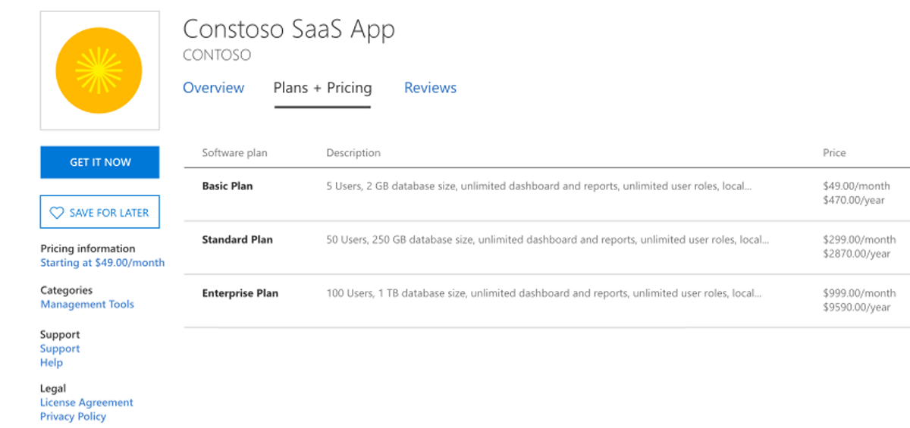
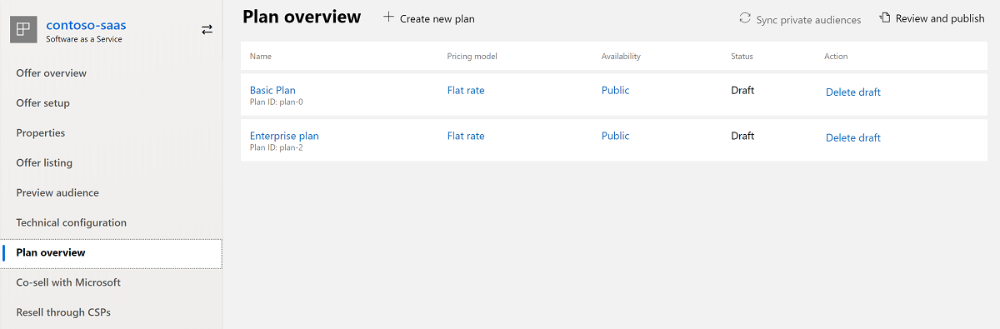

# Plans and pricing for commercial marketplace offers

A plan defines an offer’s scope and limits, and the associated pricing when applicable. For example, depending on the offer type, you can select regional markets and choose whether a plan is visible to the public or only to a private audience. Some offer types support recurring subscriptions, some support usage-based pricing, and some let a customer purchase the offer with a license they have purchased directly from the publisher. This gives you the flexibility to provide your customers with different technical and pricing options, when applicable.

You can create up to 100 plans for each offer that supports plans, and up to 45 of those plans can be [private](#plan-visibility). You can create paid plans only for Azure virtual machine offers, Azure application offers (managed applications), and software as a service (SaaS) offers. When you choose to sell any of these offers through Microsoft (transactable offers), you are required to create at least one plan. You can create plans for some of the other offer types, but the plans for those offer types do not include pricing options.

> [!TIP]
> A transactable offer is one in which Microsoft facilitates the exchange of money for a software license on the publisher’s behalf.

## Plans by offer type

The following table shows the plan options for each offer type. The following sections will explain more about these options. 

| Offer type | Plans with pricing options | Plans without pricing options | Private audience option |
| ------------ | ------------- | ------------- | ------------- |
| Azure managed application | &#10004; | | &#10004; |
| Azure solution template | | &#10004; | &#10004; |
| Azure container | | &#10004; (BYOL) | |
| IoT Edge module |  | &#10004; |  |
| Managed service |  | &#10004; (BYOL) | &#10004; |
| Software as a service | &#10004; |  | &#10004; |
| Azure virtual machine | &#10004; |  | &#10004; |
|||||

Plans are not supported for the following offer types:

- Consulting service
- Dynamics 365 Business Central
- Dynamics 365 Customer Engagement & PowerApps
- Dynamics 365 for Operations
- Power BI app

## Plan information

Each offer type requires different information when you create a new plan. You can find links to offer-specific articles in [Publishing guide by offer type](publisher-guide-by-offer-type.md). Once you create a new plan in the **Plan overview** page, you will see different tabs, such as **Plan listing** or **Pricing and availability** to configure different details for your plan. Each tab will show a status of incomplete or complete as you work through these fields.

There are a few common details to complete for a new plan:

- **Plan ID**: Create a unique ID for each plan in this offer. Use a maximum of 50 characters: only lowercase, alphanumeric characters, dashes, and underscores. This ID will be visible to customers in the product URL and Azure Resource Manager templates (if applicable). You can’t change this ID after you publish the offer.
- **Plan Name**: (Callout 1 in the image above.) Create a unique name for each plan in this offer. Use a maximum of 50 characters. The plan name is used to differentiate software plans that may be a part of the same offer (for example, Offer name: Standard plan, and Enterprise plan). Customers will see this name when deciding which plan to select within your offer.
- **Plan summary**: (Callout 2 in the image above.) This summary appears in Azure Marketplace search results and can contain up to 100 characters.
   > [!NOTE]
   > This field doesn't apply to SaaS offers.
- **Plan description**: (Callout 3 in the image above.) Add a plan description that explains what makes this plan unique from other plans for your offer. Use a maximum of 500 characters. This content will appear to your customers on the offer listing page(s) as they browse through and select a plan for your offer.

The plan name and description appear on the offer listing page in the commercial marketplace online store(s). The following screenshot shows three plans for a SaaS offer listing in Azure Marketplace.

Once you create your plans, the **Plan overview** page shows a list of your plans’ name, ID, other details, current publishing status, and any available actions. The available actions will depend on the status of your plan and might include:

- If the plan status is **Draft** – Delete draft.
- If the plan status is **Live** – Stop distribution of the plan or Sync private audience.

The following screenshot shows two draft offers.

## Pricing and availability

The commercial marketplace operates on an agency model, whereby publishers set prices, Microsoft bills customers, and Microsoft pays revenue to publishers while withholding an agency fee. You define your offer’s markets, visibility, and pricing (when applicable) on the **Pricing and availability** or **Availability** tab.

- **Markets**: Every plan must be available in at least one market.  You have the option to select only "Tax Remitted" countries, in which Microsoft remits sales and use tax on your behalf.
- **Pricing**: Pricing models only apply to plans for Azure managed application, SaaS, and Azure virtual machine offers. All plans for the same offer must use the same pricing model.  
- **Plan visibility**: Depending on the offer type, you can define a private audience or hide the offer or plan from the Azure Marketplace. This is explained in more detail in [Plan visibility](#plan-visibility) later in this article.

> [!TIP]
> We recommend that you create plans that are best suited to the usage patterns of your target customer base. This reduces users from frequently switching plans based on their changes in usage. For an example of a SaaS offer with three metered billing plans, see [Sample offer](./partner-center-portal/saas-metered-billing.md#sample-offer).

### Pricing models

You must associate a pricing model with each plan for the following offer types. Each of these offer types have different available pricing models:

- **Azure managed application**: flat rate (monthly) and usage-based pricing (metering service dimensions).
- **Software as a service**: flat rate (monthly or annual), per user, and usage-based pricing (metering service dimensions). 
- **Azure virtual machine**: Bring your own license (BYOL) and usage-based pricing. For a usage-based pricing model, you can charge per core, per core size, or per market and core size. A BYOL license model does not allow for additional, usage-based charges.   (BYOL virtual machine offers do not require a pricing model.)

All plans for the same offer must use the same pricing model. For example, a SaaS offer cannot have one plan that's flat rate and another plan that’s per user. See specific offer documentation for detailed information.

If you have already set prices for your plan in United States Dollars (USD) and add another market location, the price for the new market will be calculated according to the current exchange rates. After saving your changes, you will see an **Export prices (xlsx)** link that you can use to review and change the price for each market before publishing.

> [!IMPORTANT]
> After your offer is published, the pricing model choice cannot be changed.

Flat-rate SaaS offers and managed application offers support metered billing using the marketplace metering service. This is a usage-based billing model that lets you define non-standard units, such as bandwidth or emails, that your customers will pay on a consumption basis. See related documentation to learn more about metered billing for [managed applications](marketplace-metering-service-apis.md) and [SaaS apps](./partner-center-portal/saas-metered-billing.md).

## Custom prices

To set custom prices in an individual market, export, modify, and then import the pricing spreadsheet. You're responsible for validating this pricing and owning these settings.

Review your prices carefully before publishing, as there are some restrictions on what can change after a plan is published:

- After a plan is published, the pricing model can't be changed.
- After a billing term is published for a plan, it can't be removed later.
- After a price for a market in your plan is published, it can't be changed later.

Prices set in United States Dollars (USD) are converted into the local currency of all selected markets using the current exchange rates when saved. Validate these prices before publishing by exporting the pricing spreadsheet and reviewing the price in each market you selected.

1. You must first save your pricing changes to enable export of pricing data. Near the bottom of the **Pricing and availability** tab, select **Save draft**.
1. Under **Pricing**, select the **Export pricing data** link.
1. Open the exportedPrice.xlsx file in Microsoft Excel.
1. In the spreadsheet, make the updates you want to your pricing information and then save the .CSV file.
    > [!NOTE]
    > You may need to enable editing in Excel before you can update the file.
1. On the **Pricing and availability** tab, under **Pricing**, select the **Import pricing data** link.
1. In the dialog box that appears, select **Yes**.
1. Select the exportedPrice.xlsx file you updated, and then select **Open**.

## Plan visibility

You can make plans for some offer types publicly available or available to only a specific (private) audience. Offers with private plans will be published to the Azure portal. Learn more about private plans in [Private offers in the Microsoft commercial marketplace](private-offers.md).

You define your private audience by using Azure tenant IDs or Azure subscription IDs, depending on the offer type. You can enter up to 10 IDs manually or import up to 10,00 subscription IDs or 20,000 tenant IDs (as applicable) with a .csv file. You can also define private audiences for consulting services and Dynamics 365 offers that do not have plans.

After your offer is published with a private plan, you can update the audience or choose to make the plan available to everyone. After a plan is published as visible to everyone, it must remain visible to everyone and cannot be configured as a private plan again.

> [!NOTE]
> A private audience differs from a preview audience. On the **Availability** page for some offer types, you can define an audience who can preview your offer prior to the offer being published live in the commercial marketplace. While the private audience designation only applies to a specific plan, the preview audience can view all plans (private or not), but only during the limited preview period while the plan is being tested and validated.

You can also choose to hide the plan entirely from the Azure Marketplace if your offer will be deployed as part of a managed application or solution template.

## Free trials

You can enable a free trial on plans for transactable Azure virtual machine and SaaS offers.

> [!NOTE]
> This section explains free trials on paid plans for offers that are sold through Microsoft. This is different than free trial listings from partners who choose to process their transactions independently. You can create a free trial listing (that is not associated with a plan) for the following offer types:
> - Azure virtual machine 
> - SaaS 
> - Dynamics 365 Business Central
> - Dynamics 365 for Customer Engagement & PowerApps
> - Dynamics 365 for Operations
>
> For more information about listing options, see [Determine your publishing option](determine-your-listing-type.md).

Free trials are supported for all billing models except metered plans. SaaS plans allow for 1-month free trials. Azure virtual machine plans allow for 1, 3, or 6-month free trials.

When a customer selects a free trial, we collect their billing information, but we don’t start billing the customer until the trial is converted to a paid subscription. Free trials automatically convert to a paid subscription at the end of the trial, unless the customer cancels the subscription before the trial period ends.

During the trial period, customers can evaluate any of the supported plans within the same offer that has a free trial enabled. If they switch to a different trial within the same offer, the trial period doesn’t restart. For example, if a customer uses a free trial for 15 days and then switches to a different free trial for the same offer, the new trial period will account for 15 days used. The free trial that the customer was evaluating when the trial period ends is the one that’s automatically converted to a paid subscription.

After a customer selects a free trial for a plan, they can't convert to a paid subscription for that plan until the trial period has ended. If a customer chooses to convert to a different plan within the offer that doesn’t have a free trial, the conversion will happen, but the free trial will end immediately and any data will be lost.

> [!NOTE]
> After a customer starts paying for a plan, they can’t get a free trial on the same offer again, even if they switch to another plan that supports free trials.

To obtain information on customer subscriptions currently participating in a free trial, use the new API property `isFreeTrial`, which will be marked as true or false. For more information, see the [SaaS Get Subscription API](./partner-center-portal/pc-saas-fulfillment-api-v2.md#get-subscription).

## Next steps

- To learn how to add or update plans on an existing offer, see [Update an existing offer in the commercial marketplace](./update-existing-offer.md).
- To learn more about transaction options and associated pricing models, see [Commercial marketplace transact capabilities](./marketplace-commercial-transaction-capabilities-and-considerations.md).
