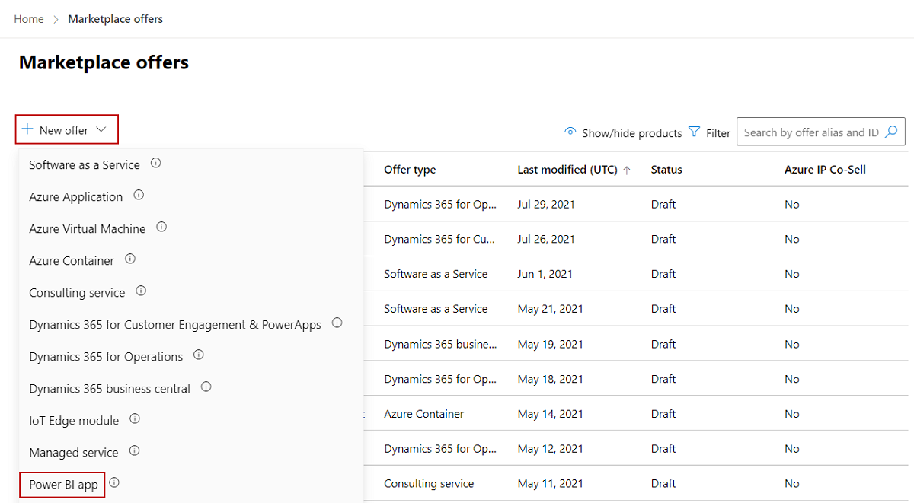

# Create a Power BI app offer

This article describes how to create a Power BI app offer. All offers go through our certification process, which checks your solution for standard requirements, compatibility, and proper practices.

## Before you begin

Before you can publish a Power BI app offer, you must have a commercial marketplace account in Partner Center and ensure your account is enrolled in the commercial marketplace program. See [Create a commercial marketplace account in Partner Center](create-account.md) and [Verify your account information when you enroll in a new Partner Center program](/partner-center/verification-responses#checking-your-verification-status).

Review [Plan a Power BI offer](marketplace-power-bi.md). It will explain the technical requirements for this offer and list the information and assets you’ll need when you create it.

## Create a new offer

1. Sign in to [Partner Center](https://go.microsoft.com/fwlink/?linkid=2166002).

1. On the Home page, select the **Marketplace offers** tile.

    

1. On the Marketplace offers page, select **+ New offer** > **Power BI app**.

    

> [!IMPORTANT]
> After an offer is published, any edits you make to it in Partner Center appear on Microsoft AppSource only after you republish the offer. Be sure to always republish an offer after changing it.

If **Power BI App** isn't shown or enabled, your account doesn't have permission to create this offer type. Please check that you've met all the [requirements](./marketplace-dynamics-365.md) for this offer type, including registering for a developer account.

## New offer

1. Enter an **Offer ID**. This is a unique identifier for each offer in your account.

    - This ID is visible to customers in the web address for the offer and in Azure Resource Manager templates, if applicable.
    - Use only lowercase letters and numbers. The ID can include hyphens and underscores, but no spaces, and is limited to 50 characters. For example, if your Publisher ID is `testpublisherid` and you enter **test-offer-1**, the offer web address will be `https://appsource.microsoft.com/product/dynamics-365/testpublisherid.test-offer-1`.
    - The Offer ID can't be changed after you select **Create**.

1. Enter an **Offer alias**. This is the name used for the offer in Partner Center.

    - This name isn't used on AppSource. It is different from the offer name and other values shown to customers.
    - This name can't be changed after you select **Create**.

1. Associate the new offer with a _publisher_. A publisher represents an account for your organization. You may have a need to create the offer under a particular publisher. If you don’t, you can simply accept the publisher account you’re signed in to.

    > [!NOTE]
    > The selected publisher must be enrolled in the [**Commercial Marketplace program**](marketplace-faq-publisher-guide.yml#how-do-i-sign-up-to-be-a-publisher-in-the-microsoft-commercial-marketplace-) and cannot be modified after the offer is created.

1. Select **Create** to generate the offer. Partner Center opens the **Offer setup** page.

## Alias

Enter a descriptive name that we'll use to refer to this offer solely within Partner Center. The offer alias (pre-populated with what you entered when you created the offer) won't be used in the marketplace and is different than the offer name shown to customers. If you want to update the offer name later, see the [Offer listing](power-bi-app-offer-listing.md) page.

## Setup details

This section is blank and not applicable to Power BI apps.

## Customer leads

When a customer expresses interest or deploys your product, you’ll receive a lead in the [Referrals workspace](https://partner.microsoft.com/dashboard/referrals/v2/leads) in Partner Center.

You can also connect the product to your customer relationship management (CRM) system to handle leads there.

> [!NOTE]
> Connecting to a CRM system is optional.

To configure the lead management in Partner Center:

1. In Partner Center, go to the **Offer setup** tab.
1. Under **Customer leads**, select the **Connect** link.
1. In the **Connection details** dialog box, select a lead destination from the list.
1. Complete the fields that appear. For detailed steps, see the following articles:

    - [Configure your offer to send leads to the Azure table](./partner-center-portal/commercial-marketplace-lead-management-instructions-azure-table.md#configure-your-offer-to-send-leads-to-the-azure-table)
    - [Configure your offer to send leads to Dynamics 365 Customer Engagement](./partner-center-portal/commercial-marketplace-lead-management-instructions-dynamics.md#configure-your-offer-to-send-leads-to-dynamics-365-customer-engagement) (formerly Dynamics CRM Online)
    - [Configure your offer to send leads to HTTPS endpoint](./partner-center-portal/commercial-marketplace-lead-management-instructions-https.md#configure-your-offer-to-send-leads-to-the-https-endpoint)
    - [Configure your offer to send leads to Marketo](./partner-center-portal/commercial-marketplace-lead-management-instructions-marketo.md#configure-your-offer-to-send-leads-to-marketo)
    - [Configure your offer to send leads to Salesforce](./partner-center-portal/commercial-marketplace-lead-management-instructions-salesforce.md#configure-your-offer-to-send-leads-to-salesforce)

1. To validate the configuration you provided, select the **Validate link**.
1. When you’ve configured the connection details, select **Connect**.

    For more information, see [Customer leads from your commercial marketplace offer](partner-center-portal/commercial-marketplace-get-customer-leads.md).

1. Select **Save draft** before continuing to the next tab in the left-nav menu, **Properties**.

## Next steps

- [Configure offer properties](power-bi-app-properties.md)
