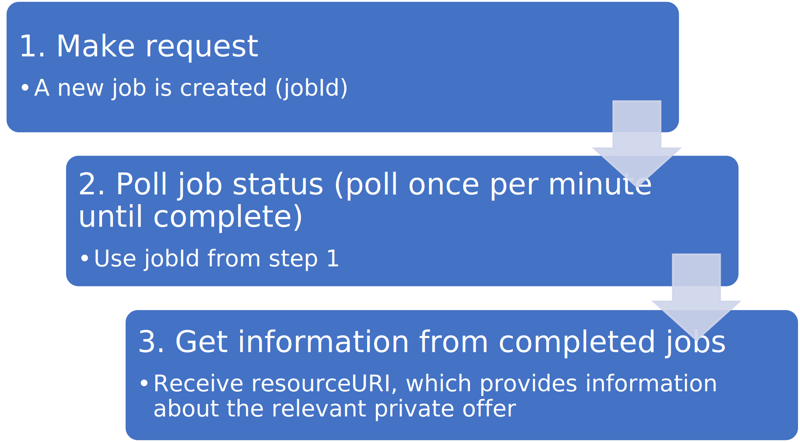
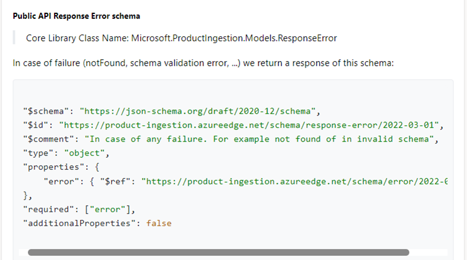

# Create and manage private offers via API

Private offers allow publishers and customers to transact one or more products in Azure Marketplace by creating time-bound pricing with customized terms. The private offers API enables ISVs to programmatically create and manage private offers for customers and resellers. This API is useful if your account manages many private offers and you want to automate and optimize their management workflows. This API uses Azure Active Directory (Azure AD) to authenticate the calls from your app or service.

## Terminology

- **Private offer** – A custom deal between an ISV and a specific customer with customized terms and pricing for a specific product in Azure Marketplace.
- **Product** – A single unit representing an offer in Azure Marketplace. There's one product per listing page.
- **Plan** – A single version of a particular product. There can be multiple plans for a given product that represent various levels of pricing or terms.
- **Job** – A task created when making a request in this API. When using this API to manage private offers, a job is created to complete the request. Once the job is completed, you can get more information about the relevant private offer.

## Supported scenarios

- Create a private offer for a customer
- Create a private offer for a reseller
- Delete a private offer
- Withdraw a private offer
- Upgrade a private offer
- Query for a list of private offers
- Query for a list of products and plans

## Scenarios not supported via API

These scenarios are only available through Partner Center:

- **Creating in draft state** – All private offers created through the API will be published.
- **Republishing** – Private offers withdrawn via API can't be republished via API.
- **Publishing drafts** – Private offers in draft state can't be published via API.

## Get ready to use this API

Before you write code to call the private offers API, ensure you've completed the following prerequisites.

### Step 1: Complete prerequisites for using the Microsoft Product Ingestion API (one-time)

You or your organization must have an Azure AD directory and global administrator permission. If you already use Microsoft 365 or other business services from Microsoft, you already have Azure AD directory. If not, you can create a new Azure AD in Partner Center for free.

You must [associate an Azure AD](https://aka.ms/PCtoAzureAD) application with your Partner Center account and obtain your tenant ID, client ID, and key. You need these values to obtain the Azure AD access token you'll use in calls to the private offers API.

### Step 2: Obtain an Azure AD access token (every time)

Before you call any of the methods in the Microsoft Store submission API, you need an Azure AD access token to pass to the authorization header of each method in the API. You have 60 minutes to use a token before it expires. After expiration, you can refresh a token so you can continue to use it in further calls to the API.

To obtain the access token, see [Service to Service Calls Using Client Credentials](https://aka.ms/AADAccesstoken) to send an HTTP POST to the [https://login.microsoftonline.com/<tenant_id>/oauth2/token](https://login.microsoftonline.com/%3Ctenant_id%3E/oauth2/token) endpoint. Here's a sample request:

```json
POST https://login.microsoftonline.com/<tenant_id>/oauth2/token HTTP/1.1
Host: login.microsoftonline.com
Content-Type: application/x-www-form-urlencoded; charset=utf-8
grant_type=client_credentials
&client_id=<your_client_id>
&client_secret=<your_client_secret>
&resource=https://graph.microsoft.com/
```

For the tenant_id value in the POST URI and the client_id and client_secret parameters, specify the tenant ID, client ID, and key for your application that you retrieved from Partner Center in the previous section. For the resource parameter, you must specify `https://graph.microsoft.com/`.

### Find product, plan, and private offer IDs

To use this API, you may need to reference several different types of IDs associated with your seller account.

| ID |  Where to find them |
| --- | --- |
| client_id | See [Associate an Azure AD application with your Partner Center account](https://aka.ms/PCtoAzureAD) |
| tenant_id | See [Associate an Azure AD application with your Partner Center account](https://aka.ms/PCtoAzureAD) |
| client_secret | See [Associate an Azure AD application with your Partner Center account](https://aka.ms/PCtoAzureAD) |
| productId | See [Retrieve products](#retrieve-products) below |
| planId | See [Retrieve plans for a specific product](#retrieve-plans-for-a-specific-product) below |
| privateofferId | See [Retrieve private offers](#retrieve-private-offers) below |

#### Retrieve products

A private offer is based on an existing product in your Partner Center account. To see a list of products associated with your Partner Center account, use this API call:

`GET https://graph.microsoft.com/rp/product-ingestion/product?$version=2022-07-01`

The response appears in the following sample format:

```json
{
  "value": [
    {
      "$schema": "https://schema.mp.microsoft.com/schema/product/2022-07-01",
      "id": "string",
      "identity": {
        "externalId": "string"
      },
      "type": "enum",
      "alias": "string"
    }
  ],
  "@nextLink": "opaque_uri"
}
```

#### Retrieve plans for a specific product

For products that contain more than one plan, you may want to create a private offer based on one specific plan. If so, you'll need that plan's ID. Obtain a list of the plans (such as variants or SKUs) for the product using the following API call:

`GET https://graph.microsoft.com/rp/product-ingestion/plan?product=<product-id>&$version=2022-07-01`

The response appears in the following sample format:

```json
{
  "value": [
    {
      "$schema": "https://schema.mp.microsoft.com/schema/plan/2022-07-01",
      "product": "string",
      "id": "string",
      "identity": {
        "externalId": "string"
      },
      "alias": "string"
    }
  ]
}
```

#### Retrieve private offers

To see a list of all private offers associated with your seller account, use the following API call:

`GET https://graph.microsoft.com/rp/product-ingestion/private-offer/query?$version=2022-07-01`

## How to use the API

The private offers API lets you create and manage private offers associated with products and plans within your Partner Center account. Here's a summary of the typical calling pattern when using this API.



### Step 1. Make request

When you make an API call to create, delete, withdraw, or upgrade a private offer, a new job is created to complete the requested task. The API response will contain a **jobId** associated with the job.

### Step 2. Poll for job status

Using the **jobId** from the initial API response, poll to get the status of the job. The status of the job will either be **running** or **completed**. Once the job is completed, the result will either be **succeeded** or **failed**. To avoid performance issues, don't poll a job more than once per minute.

| jobStatus | Description |
| --- | --- |
| NotStarted | The job hasn't yet started; this is part of the response on the initial request. |
| Running | The job is still running. |
| Completed | The job has completed. See jobResult for more details. |

| jobResult | Description |
| --- | --- |
| Pending | The job hasn't yet completed. |
| Succeeded | The job has completed successfully. This will also return a resourceURI<br>that refers to the private offer related to the job. Use this resourceURI<br>to obtain the full details of a private offer. |
| Failed | The job has failed. This will also return any relevant errors to help determine the cause of failure. |

For more information, see [Querying the status of an existing job](#query-the-status-of-an-existing-job) later in this article.

### Step 3. Obtain information from completed jobs

A successful job will return a resourceUri referencing the relevant private offer. Use this resource Uri to obtain more details about the private offer in the future, such as the privateofferId.

A failed job will contain errors that provide detail on why the job failed and how to resolve the issue.

For more information, see [Obtaining details of an existing private offer](#obtaining-details-of-an-existing-private-offer) later in this article.

## Create a private offer for a customer

Use this method to create a private offer for a customer.

### Request

`POST https://graph.microsoft.com/rp/product-ingestion/configure?$version=2022-07-01`

#### Request Header

| Header | Type | Description |
| --- | --- | --- |
| Authorization | String | Required. The Azure AD access token in the form **`Bearer <token>`**. |

Optional: clientID

#### Request parameters

$version - required. This is the version of the schema that is being used in the request

#### Request body

Provide the details of the private offer using the ISV to Customer private offer schema. This must include a name.

```json
{
 "$schema": "https://schema.mp.microsoft.com/schema/configure/2022-07-01",
  "resources": [ 
    {
       "$schema": "https://schema.mp.microsoft.com/schema/private-offer/2022-07-01", 
       "name": "privateOffercustomer1705",
       "state": "live",
       "privateOfferType": "customerPromotion",
       "variableStartDate": true,
       "end": "2022-01-31",
       "acceptBy": "2022-02-28",
       "preparedBy": "amy@xyz.com",
       "termsAndConditionsDocSasUrl": "https://query.prod.cms.rt.microsoft.com/cms/api/am/binary/RE4rFOA",
       "notificationContacts": [ "amy@xyz.com" ],
       "beneficiaries": [ 
          { "id": "xxxxxx-2163-5eea-ae4e-d6e88627c26b:6ea018a9-da9d-4eae-8610-22b51ebe260b_2019-05-31", "description": "Top First Customer"}
       ], 
       "pricing": [ 
          { "product": "product/34771906-9711-4196-9f60-4af380fd5042", "plan":"plan/123456","discountType": "percentage", "discountPercentage": 5 }
       ]
    }
  ]
}
```

##### Sample request body using absolute pricing

If you're using absolute pricing instead of percentage-based discounting, you can create a new resource above the private offer resource that defines the absolute pricing, then include that newly created resource as an additional object in the resources list of the configure schema.

Use this method to obtain the pricing resource for your existing public plan, edit the prices, and then use the edited resource for your private offer. 

`GET https://graph.microsoft.com/rp/product-ingestion/price-and-availability-private-offer-plan/{productId}?plan={planId}&$version=2022-07-01`

Sample absolute pricing resource:

```json
{
    "$schema": "https://schema.mp.microsoft.com/schema/price-and-availability-private-offer-plan/2022-07-01",
    "resourceName": "newSimpleAbsolutePricing",
    "product": "product/7ba807c8-386a-4efe-80f1-b97bf8a554f8",
    "plan": "plan/987654",
    "pricing": {
        "recurrentPrice": {
 "priceInputOption": "usd",
            "prices": [
                {
                    "pricePerPaymentInUsd": 1,
                    "billingTerm": {
                        "type": "month",
                        "value": 1
                    }
                },
                {
                    "pricePerPaymentInUsd": 2,
                    "paymentOption": {
                        "type": "month",
                        "value": 1
                    },
                    "billingTerm": {
                        "type": "year",
                        "value": 1
                    }
                }
            ]
        },
        "customMeters": {
            "priceInputOption": "usd",
            "meters": {
                "meter1": {
                    "pricePerPaymentInUsd": 1
                }
            }
        }
    }
}

```

Include that resource as an object in the pricing module:

```json
[
    {
        "product": "product/34771906-9711-4196-9f60-4af380fd5042",
        "plan": "plan/123456",
        "discountType": "percentage",
        "discountPercentage": 5
    },
    {
        "product": "product/7ba807c8-386a-4efe-80f1-b97bf8a554f8",
        "plan": "plan/987654",
        "discountType": "absolute",
        "priceDetails": {
            "resourceName": "newSimpleAbsolutePricing"
        }
    }
]
```

#### Response

The response will contain the jobId you can use later to poll the status:

```json
{
    "$schema": "https://schema.mp.microsoft.com/schema/configure-status/2022-07-01",
    "jobId": "c32dd7e8-8619-462d-a96b-0ac1974bace5",
    "jobStatus": "notStarted",
    "jobResult": "pending",
    "jobStart": "2021-12-21T21:29:54.9702903Z",
    "jobEnd": "0001-01-01",
    "errors": []
}
```

#### Error codes

| HTTP Status Code | Description |
| --- | --- |
| 401 | Authentication Error: Ensure you're using a valid Azure AD access token. |
| 400 | Schema Validation. Ensure your request body is following the correct schema and includes all required fields. |

## Create a private offer for a reseller

Use this method to create a new private offer for a customer.

### Request

`POST https://graph.microsoft.com/rp/product-ingestion/configure?$version=2022-07-01`

#### Request header

| Header | Type | Description |
| --- | --- | --- |
| Authorization | String | Required. The Azure AD access token in the form **`Bearer <token>`**. |

#### Request parameters

$version - required. This is the version of the schema that is being used in the request

#### Request body

Provide the details of the private offer using the **ISV to reseller margin private offer** schema. You must include a name.

```json
{
 "$schema": "https://schema.mp.microsoft.com/schema/configure/2022-07-01", 
  "resources": [ 
    { 
       "$schema": "https://schema.mp.microsoft.com/schema/private-offer/2022-07-01", 
       "privateOfferType": "cspPromotion",
       "name": "privateOffercsp1034",
       "state": "live",
       "variableStartDate": false,
       "start": "2022-01-31",
       "end": "2022-02-28",
       "preparedBy": "amy@xyz.com",
       "notificationContacts": [ "amy@xyz.com" ],
       "beneficiaries": [ 
          { "id": "xxxxxxx-0a32-4b44-b904-39dd964dd790", "description": "Top First CSP"}
       ], 
       "pricing": [ 
          { "product": "product/34771906-9711-4196-9f60-4af380fd5042", "plan":"plan/123456","discountType": "percentage","discountPercentage": 5 }
       ]
    }
  ]
}
```

#### Sample request for a reseller offer restricted to a specified beneficiary

If you're creating a margin for a reseller that applies to a specific customer, add that information as an object in the `beneficiaryRecipients` parameter array under beneficiaries.

The request body will look like the sample below:

```json
[
    {
        "id": "xxxxxxx-0a32-4b44-b904-39dd964dd790",
        "description": "Top First CSP",
        "beneficiaryRecipients": [
            {
                "id": "xxxxxxx-48b4-af80-66333cd9c609",
                "recipientType": "cspCustomer"
            }
        ]
    }
],
```

### Response

The response will contain the jobId you can use later to poll the status.

```json
{
    "$schema": "https://schema.mp.microsoft.com/schema/configure-status/2022-07-01",
    "jobId": "c32dd7e8-8619-462d-a96b-0ac1974bace5",
    "jobStatus": "notStarted",
    "jobResult": "pending",
    "jobStart": "2021-12-21T21:29:54.9702903Z",
    "jobEnd": "0001-01-01",
    "errors": []
}
```

### Error codes

| Error code | Description |
| --- | --- |
| 401 | Authentication Error: Ensure you're using a valid Azure AD access token. |
| 400 | Schema Validation. Ensure your request body is following the correct schema and includes all required fields. |

## Delete an existing private offer

Use this method to delete an existing private offer while it's still in draft state. You must use the private offer ID to specify which private offer to delete.

### Request

`POST https://graph.microsoft.com/rp/product-ingestion/configure?$version=2022-07-01`

#### Request header

| Header | Type | Description |
| --- | --- | --- |
| Authorization | String | Required. The Azure AD access token in the form **`Bearer <token>`**. |

#### Request parameters

$version - required. This is the version of the schema that is being used in the request

#### Request body

```json
{
    "$schema": "https://schema.mp.microsoft.com/schema/configure/2022-07-01"
     "resources": [
        {
            "$schema": "https://schema.mp.microsoft.com/schema/private-offer/2022-07-01",
            "id": "private-offer/456e-a345-c457-1234",
            "name": "privateOffercustomer1705",
            "state": "deleted"
        }
    ]
}
```

### Response

The response will contain the jobId you can use later to poll the status.

```json
{
    "$schema": "https://schema.mp.microsoft.com/schema/configure-status/2022-07-01",
    "jobId": "c32dd7e8-8619-462d-a96b-0ac1974bace5",
    "jobStatus": "notStarted",
    "jobResult": "pending",
    "jobStart": "2021-12-21T21:29:54.9702903Z",
    "jobEnd": "0001-01-01",
    "errors": []
}
```

### Error codes

| Error code | Description |
| --- | --- |
| 401 | Authentication Error: Ensure you're using a valid Azure AD access token. |
| 400 | Schema Validation. Ensure your request body is following the correct schema and includes all required fields. |

## Withdraw an existing private offer

Use this method to withdraw an existing private offer. Withdrawing a private offer means your customer will no longer be able to access it. A private offer can only be withdrawn if your customer hasn't accepted it.

You must use the private offer ID to specify which private offer you want to withdraw.

### Request

`POST https://graph.microsoft.com/rp/product-ingestion/configure?$version=2022-07-01`

#### Request header

| Header | Type | Description |
| --- | --- | --- |
| Authorization | String | Required. The Azure AD access token in the form **`Bearer <token>`**. |

#### Request parameters

$version - required. This is the version of the schema that is being used in the request

#### Request body

```json
{
    "$schema": "https://schema.mp.microsoft.com/schema/configure/2022-07-01"
     "resources": [
         {
            "$schema": "https://schema.mp.microsoft.com/schema/private-offer/2022-07-01",
            "id": "private-offer/456e-a345-c457-1234",
            "name": "privateOffercustomer1705", 
            "state": "withdrawn"
        }
    ]
}
```

### Response

The response will contain the jobId you can later use to poll the status.

```json
{
    "$schema": "https://schema.mp.microsoft.com/schema/configure-status/2022-07-01",
    "jobId": "c32dd7e8-8619-462d-a96b-0ac1974bace5",
    "jobStatus": "notStarted",
    "jobResult": "pending",
    "jobStart": "2021-12-21T21:29:54.9702903Z",
    "jobEnd": "0001-01-01",
    "errors": []
}
```

### Error Codes

| Error code | Description |
| --- | --- |
| 401 | Authentication Error: Ensure you're using a valid Azure AD access token. |
| 400 | Schema Validation. Ensure your request body is following the correct schema and includes all required fields. |

## Upgrade an existing customer private offer

Use this method to upgrade an existing customer private offer. You must provide the ID of the customer private offer you wish to use as the basis for the upgrade as well as the new name of the offer.

### Request

`POST https://graph.microsoft.com/rp/product-ingestion/configure?$version=2022-07-01`

#### Request header

| Header | Type | Description |
| --- | --- | --- |
| Authorization | String | Required. The Azure AD access token in the form **`Bearer <token>`**. |

#### Request parameters

$version - required. This is the version of the schema that is being used in the request

#### Request body

You can use the same schemas as the two methods to create a new private offer depending on whether it is for a customer or a margin reseller. When upgrading, you must specify the existing private offer to be used as the basis for the upgrade in the `upgradedFrom` property.

> [!NOTE]
> If you provide pricing information in the upgrade request for a given product or plan, it will override the pricing information from the original private offer for that product or plan. If you do not provide new pricing information, the pricing information from the original private offer will be carried over.

```json
{
    "$schema": "https://schema.mp.microsoft.com/schema/configure/2022-07-01",
     "resources": [ 
       { 
          "$schema": "https://schema.mp.microsoft.com/schema/private-offer/2022-07-01", 
          "name": "publicApiCustAPIUpgrade1",
          "state": "live",
          "privateOfferType": "customerPromotion",
          "upgradedFrom": {
              "name": "publicApiCustAPI",
              "id": "private-offer/97ac19ce-04f9-40e7-934d-af41124a079d"
          },
          "variableStartDate": false,
          "start":"2022-11-01",
          "end": "2022-12-31",
          "acceptBy": "2022-10-31",
          "pricing": [ 
             { "product": "product/4ce67c07-614f-4a5b-8627-95b16dbdbf2b", "discountType": "percentage", "discountPercentage": 20 },
             { "product": "product/92931a1c-f8ac-4bb8-a66f-4abcb9145852", "discountType": "percentage", "discountPercentage": 20 }
          ]
       }
     ]
   }
```

### Response

The response will contain the jobId you can use later to poll the status.

```json
{
    "$schema": "https://schema.mp.microsoft.com/schema/configure-status/2022-07-01",
    "jobId": "c32dd7e8-8619-462d-a96b-0ac1974bace5",
    "jobStatus": "notStarted",
    "jobResult": "pending",
    "jobStart": "2021-12-21T21:29:54.9702903Z",
    "jobEnd": "0001-01-01",
    "errors": []
}
```

### Error codes

| Error code | Description |
| --- | --- |
| 401 | Authentication Error: Ensure you're using a valid Azure AD access token. |
| 400 | Schema Validation. Ensure your request body is following the correct schema and includes all required fields. |

## Query the status of an existing job

Use this method to query the status of an existing job. You can poll the status of an existing job with a polling interval with a maximum frequency of one request per minute.

### Request

`GET https://graph.microsoft.com/rp/product-ingestion/configure/<jobId>/status?$version=2022-07-01`

#### Request header

| Header | Type | Description |
| --- | --- | --- |
| Authorization | String | Required. The Azure AD access token in the form **`Bearer <token>`**. |

#### Request parameters

jobId – required. This is the ID of the job you want to query the status of. It's available in the response data generated during a previous request to either create, delete, withdraw, or upgrade a private offer.

$version - required. This is the version of the schema that is being used in the request

#### Request body

Don't provide a request body for this method.

### Response

There are three possible responses for a completed job.

| jobResult | Description |
| --- | --- |
| Running | The job hasn't yet completed. |
| Succeeded | The job completed successfully. This will also return a resourceURI that refers to the private offer related to the job. Use this resourceURI to obtain the full details of a private offer. |
| Failed | The job failed. This will also return any relevant errors to help determine the cause of failure. |

Sample outputs:

**Running**

```json
{
    "$schema": "https://schema.mp.microsoft.com/schema/configure-status/2022-07-01",
    "jobId": "c32dd7e8-8619-462d-a96b-0ac1974bace5",
    "jobStatus": "running",
    "jobResult": "pending",
    "jobStart": "2021-12-21T21:29:54.9702903Z",
    "jobEnd": "2021-12-21T21:30:10.3649551Z",
    "errors": []
}
```

**Succeeded**

```json
{
    "$schema": " https://schema.mp.microsoft.com/schema/configure-status/2022-07-01",
    "jobId": "b3f49dff-381f-480d-a10e-17f4ce49b65f",
    "jobStatus": "completed",
    "jobResult": "succeeded",
    "jobStart": "2021-12-21T21:29:54.9702903Z",
    "jobEnd": "2021-12-21T21:30:10.3649551Z",
    "resourceUri": "https://product-ingestion.mp.microsoft.com/configure/b3f49dff-381f-480d-a10e-17f4ce49b65f",
    "errors": []
}
```

> [!NOTE]
> If the job was created by a request to delete a private offer, then there will be no resourceURI in the response.

**Failure**


```json
{
    "$schema": " https://schema.mp.microsoft.com/schema/configure-status/2022-07-01",
    "jobId": "c32dd7e8-8619-462d-a96b-0ac1974bace5",
    "jobStatus": "completed",
    "jobResult": "failed",
    "jobStart": "2021-12-21T21:29:54.9702903Z",
    "jobEnd": "2021-12-21T21:30:10.3649551Z",
    "errors": [
        {
            "code": "Conflict",
            "message": "The start date should be defined"
        }
    ]
}
```

### Error codes

| Error code | Description |
| --- | --- |
| 401 | Authentication Error: ensure you're using a valid Azure AD access token. |

## Obtaining details of an existing private offer

There are two methods to do this depending whether you have the resourceURI or the private offer ID.

### Request

`GET https://graph.microsoft.com/rp/product-ingestion/private-offer/<id>?$version=2022-07-01`

or

`GET https://graph.microsoft.com/rp/product-ingestion/configure/<jobId>?$version=2022-07-01`

#### Request header

| Header | Type | Description |
| --- | --- | --- |
| Authorization | String | Required. The Azure AD access token in the form **`Bearer <token>`**. |

#### Request parameters

ID - required. This is the ID of the private offer you want the full details of. This ID is available in the response data generated during a previous request to obtain the details of an existing private offer using the jobId.

jobId - required. This is the ID of the job you want the full details of. This ID is available in the response data generated during a previous request to either create, delete, withdraw, or upgrade a private offer.

$version - required. This is the version of the schema that is being used in the request

#### Request body

Don't provide a request body for this method.

### Response

You'll receive the full details of the private offer.

```json
{
    "$schema": "https://schema.mp.microsoft.com/schema/configure/2022-07-01",
    "resources": [
        {
            "id": "private-offer/07380dd9-bcbb-cccbb-bbccbc",
            "name": "privateOffercsp1015",
            "privateOfferType": "cspPromotion",
            "upgradedFrom": null,
            "variableStartDate": false,
            "start": "2021-12-01",
            "end": "2022-01-31",
            "acceptBy": null,
            "preparedBy": "amy@xyz.com",
            "notificationContacts": [
                "amy@xyz.com"
                ],
            "state": "Live",
            "termsAndConditionsDocSasUrl": null,
            "beneficiaries": [
            {
                "id": "xxxxyyyzz",
                "description": "Top First CSP",
                "beneficiaryRecipients": null
            }
            ],
            "pricing": [
            {
                "product": "product/xxxxxyyyyyyzzzzz",
                "plan": "plan/123456",
                "discountType": "Percentage",
                "discountPercentage": 5.0,
                "featureAvailabilityId": null,
                "availabilityInstanceId": null
            }
            ],
            "lastModified": "0001-01-01",
            "acceptanceLinks": null,
            "_etag": "\"9600487b-0000-0800-0000-61c24c7f0000\"",
            "schema": null,
            "resourceName": null,
            "validations": null
        }
    ]
}
```

### Error codes

| Error code | Description |
| --- | --- |
| 401 | Authentication Error: Ensure you're using a valid Azure AD access token. |
| 404 | Resource not found. Ensure you're using the correct ID in the request. |

## How to parse error messages in the response body



## Schemas

[Private offer](https://aka.ms/POSchema)

[ISV to customer private offer](https://aka.ms/POCustomerSchema)

[ISV to reseller margin private offer](https://aka.ms/POCSPSchema)

[Private offer acceptance link](https://aka.ms/POacceptlinkschema)

[Private offer beneficiary](https://aka.ms/PObeneficiary)

[Private offer pricing](https://aka.ms/POpricing)

[Private offer promotion reference](https://aka.ms/POpromoref)

## Next steps

- To start using private offers, follow the steps in [ISV to customer private offers](isv-customer.md).
