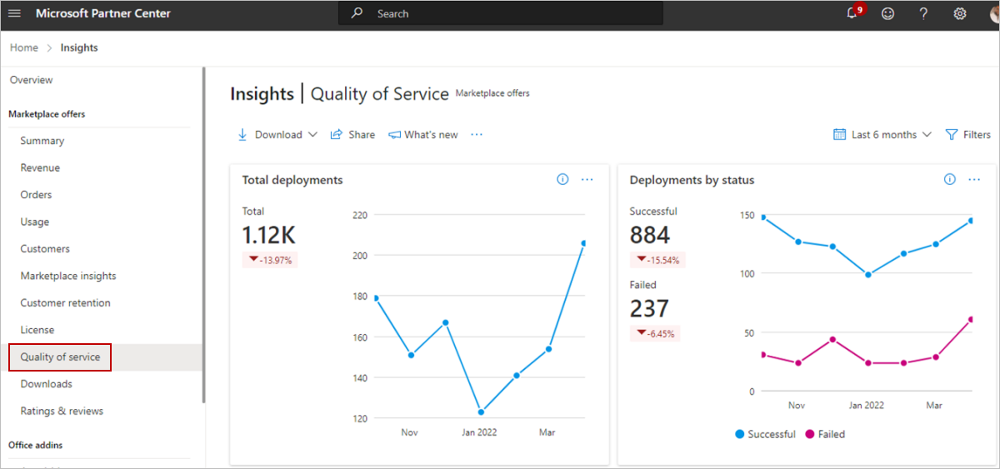

# Quality of service (QoS) dashboard

This dashboard displays the quality of deployments for all your offers. A higher offer deployment success signifies a higher quality of service offered to your customers.

View graphical representations of the following items:

- Total deployments
- Deployment by status
- Quality by offers
    - Successful deployments
    - Failed deployments
- Deployments – error codes and resources
- Deployment errors by offer plan
- Quality by deployment duration
- Geographical spread

Additionally, view [offer deployment details](#detailed-data) in tabular form.

> [!IMPORTANT]
> This dashboard is currently only available for **Azure application** offers available to all (not private offers).

This feature is currently applicable to all partners performing deployment of Azure application offers using Azure Resource Manager (ARM) templates (but not for private offers). This report will not show data for other marketplace offers.

## Access the Quality of service dashboard

1. Sign in to [Partner Center](https://partner.microsoft.com/dashboard/home)

1. On the Home page, select the **Insights** tile.

    

1. In the left menu, select **[Quality of Service](https://partner.microsoft.com/dashboard/insights/commercial-marketplace/analytics/qos)**.

    

## Elements of the Quality of service dashboard

The following sections describe how to use the Quality-of-Service (QoS) dashboard and how to read the data.

### Download

To download of the data for this dashboard, select **Download as PDF** from the **Download** list.

:::image type="content" source="./media/quality-of-service/download.png" alt-text="Screenshot of the Download menu.":::

Alternatively, you can go to the [Downloads dashboard](https://partner.microsoft.com/dashboard/insights/commercial-marketplace/analytics/downloads) to download the report.

### Share

To share the dashboard widgets data via email, in the top menu, select **Share**.

:::image type="content" source="./media/quality-of-service/share.png" alt-text="Screenshot of the Share menu.":::

In the dialog box that appears, provide the recipient email address and message. To share the report URL, select the **Copy link** or **Share to Teams** button. To take a snapshot of the charts data, select the **Copy as image** button.

### What's new

To learn about changes and enhancements that were made to the dashboard, select **What’s new**. The _What’s new_ side panel appears.

:::image type="content" source="./media/quality-of-service/whats-new.png" alt-text="Screenshot of the What's new menu.":::

### Data refresh details

To view the data source and the data refresh details, such as the frequency of the data refresh, select the ellipsis (three dots) and then select **Data refresh details**.

:::image type="content" source="./media/quality-of-service/data-refresh-details.png" alt-text="Screenshot of the Data refresh details option in the ellipsis menu.":::

### Got feedback?

To provide instant feedback about the report/dashboard, select the ellipsis (three dots), and then select the **Got feedback?** link.

:::image type="content" source="./media/quality-of-service/got-feedback.png" alt-text="Screenshot of the Got feedback option in the ellipsis menu.":::

Provide your feedback in the dialog box that appears.

> [!NOTE]
> A screenshot is automatically sent to us with your feedback.

### Quality of service page dashboard filters

The page has different dashboard-level filters you can use to filter the Quality of service data based on the following:

- Application type
- Azure subscription Id
- Customer Id
- Offer Id
- Pricing
- Deployment location

Each filter is expandable with multiple options that you can select. Filter options are dynamic and based on the selected date range.

To select the filters, in the top-right of the page, select **Filters**.

:::image type="content" source="./media/quality-of-service/filters.png" alt-text="Screenshot of the Filters menu.":::

In the panel that appears on the right, select the filters you want, and then select **Apply**.

:::image type="content" source="./media/quality-of-service/filters-panel.png" alt-text="Screenshot of the Filters panel.":::

### Total deployments

This graph shows the total deployment of offers. Metrics and growth trends are represented by a line chart. View value for each month by hovering over the line chart.

The percentage value below the Deployments metrics represents the amount of growth or decline during the selected month range.

Select the ellipsis (three dots) to copy the widget image, download aggregated widget data as a .CSV file, and download the image as a .PDF.

:::image type="content" source="media/quality-of-service/total-deployments.png" alt-text="Shows a deployment count graph.":::

About this graph:

- Total count of offer deployments for the selected date range.
- Change in percentage of offer deployments during the selected date range.
- Month over month trend of total count for offer deployments.

### Deployments by status

This graph shows the metric and trend of successful and failed offer deployments by customers for the selected month range. Offer deployments can have two statuses: **Successful** or **Failed**.

Select the ellipsis (three dots) to copy the widget image, download aggregated widget data as a .CSV file, and download the image as a .PDF.

:::image type="content" source="media/quality-of-service/deployments-by-status.png" alt-text="Shows a deployment count by status graph.":::

About this graph:

- Total count of successful and failed deployments of offers for the selected date range.
- Change in percentage of successful and failed offer deployments for the selected date range.
- Month over month trend of successful and failed offer deployment counts.

### Quality by offers

This graph shows quality-of-service by offers and their corresponding SKUs, also called plans. It provides metrics and trends for **Total**, **Successful**, and **Failed** offer deployments monthly. The bar chart represents the number of deployments.

The line chart represents the percentage change in:

- Total deployments (the **All** tab)
- Success deployments (the **Successful** tab)
- Failed deployments (the **Failure** tab).

The chart shows the metric and trends of all offers. The top offers are displayed in the graph and the rest of the offers are grouped as **Rest All**.

Select the ellipsis (three dots) to copy the widget image, download aggregated widget data as a .CSV file, and download the image as a .PDF.

:::image type="content" source="media/quality-of-service/quality-by-offers-1.png" alt-text="Shows a quality by offer graph, version 1.":::

About this graph:

- Select specific offers in the legend to display only that offer and the associated SKUs in the graph.
- Hover over a slice in the graph to display the number of deployments and percentage of that offer compared to total number of deployments across all offers.
- The Quality by offers trend displays month-by-month growth or decline trends.

:::image type="content" source="media/quality-of-service/quality-by-offers-2.png" alt-text="Shows a quality by offer graph, version 2.":::

:::image type="content" source="media/quality-of-service/quality-by-offers-3.png" alt-text="Shows a SKU trend":::

About this graph:

- Select specific offers and associated SKUs in the legend to be displayed.
- The Quality by offers trend displays month-by-month metrics.
- When viewing a month-over-month trend for an offer, select a maximum of three SKUs of that offer.
- The line chart represents the same percentage changes as noted for the prior graph.

### Deployment errors codes and resources

This graph shows metrics and trends of the offer deployments basis error codes and resources. The tabular section can be pivoted on error codes and resources. The first subtab provides analytics basis error codes, description, and error counts. The second provides an analytic basis for the deployment of resources. The line chart provides the total error count basis error codes and resources.

For more information about error codes, see [Troubleshoot common Azure deployment errors with Azure Resource Manager](../azure-resource-manager/templates/common-deployment-errors.md) and [Resource providers for Azure services](../azure-resource-manager/management/azure-services-resource-providers.md).

:::image type="content" source="media/quality-of-service/deployment-error-codes-1.png" alt-text="Shows a deployment error codes graph, sample 1.":::

Select the ellipsis (three dots) to copy the widget image, download aggregated widget data as a .CSV file, and download the image as a .PDF.

:::image type="content" source="media/quality-of-service/deployment-error-codes-2.png" alt-text="Shows a deployment error codes graph, sample 2.":::

About these graphs:

- Select specific errors or resources in the legend to be displayed.
- The trend widget displays error count on a month-by-month basis.
- When viewing a month-over-month trend by error codes or resources, select a maximum of three items in the table.
- Sort error codes and resources for deployment failures by basis error count in the table.

### Deployment errors by offer plan

On this graph, the Y-axis represents deployment error count and the X-axis represents the percentile of top offer plans (by error count).

Select the ellipsis (three dots) to copy the widget image, download aggregated widget data as a .CSV file, and download the image as a .PDF.

:::image type="content" source="media/quality-of-service/deployment-error-by-offer-plan.png" alt-text="Shows deployment errors by offer plan graph.":::

About this graph:

- The bar chart represents the deployment error counts for the selected month range.
- The values on the line chart represent the cumulative error percentages by offer plan.

### Quality by deployment duration

This graph shows the metric and trend for the average time duration for a successful and failed deployment. View the metrics by selecting an offer in the drop-down menu. Select a SKU in the tabular view or enter it in the search bar. The following list shows different mean deployments durations (in minutes):

- **Success duration** – Mean time of deployment duration with offer deployments status marked as Success. This aggregated metric is calculated using the time duration between start and end timestamps of deployments marked with successful status.
- **Failure duration** – Mean time of deployments duration with offer deployment status marked as Failure. This aggregated metric is calculated using the time duration between start and end timestamps of deployments marked with Failure status.
- **First Successful deployment duration** – Mean time of deployment duration with offer deployment status marked as Success. This aggregated metric is calculated using the time duration between start timestamp of first deployment and end timestamp of the final deployment marked with Successful status. It is calculated for each deployment marked for a specific Offer SKU and Customer.

Select the ellipsis (three dots) to copy the widget image, download aggregated widget data as a .CSV file, and download the image as a .PDF.

:::image type="content" source="media/quality-of-service/deployment-duration-quality.png" alt-text="Shows a deployment duration quality graph.":::

About this graph:

- Select Failure, Success, or First successful deployment duration in the legend to be displayed.
- The line graph presents the Mean duration of deployments marked as successful, failed, and successful deployments with failed prior attempts.
- Mean time for first deployment factors the time spent on failure attempts before the deployment is marked as successful.

### Geographical spread

This graph shows the geographical spread heat map for successful and failed deployment counts for the selected month range. It also shows failure percentage against each region. The Green to Red color scale represents low to high value of failure rates. Select a record in the table to zoom in on a deployment region.

Select the ellipsis (three dots) to copy the widget image, download aggregated widget data as a .CSV file, and download the image as a .PDF.

:::image type="content" source="media/quality-of-service/geographical-spread.png" alt-text="Shows a deployment reliability by locations graph.":::

About this graph:

- Move the map to view the exact location.
- Zoom into a specific location.
- The heat map has a supplementary grid to view the deployment details of Successful count, Failed count, and Failure percentage in a specific location.
- Red regions indicate higher failure rates and green indicate lower.
- Search and select a country/region in the grid to zoom to the location in the map. Revert to the original view with the **Home** icon.

### Detailed data

This table shows all offer deployment details available. Download the report to view the raw data on offer deployments.

Select the ellipsis (three dots) to copy the widget image, download aggregated widget data as a .CSV file, and download the image as a .PDF.

:::image type="content" source="media/quality-of-service/deployment-details.png" alt-text="Shows a deployment details table.":::

About this table:

- Displays a numbered list of the 1000 top deployments sorted by date of deployment.
- Each column in the grid is sortable.
- Expand the control and export the table.
- The detail view is paginated. Select other pages at the bottom.

### Dictionary of data terms

| Column name | Attribute Name | Definition |
| --- | --- | --- |
| Offer ID | Offer ID | The name of the deployed offer |
| Sku | Sku | The name of the deployed offer plan/SKU |
| Deployment Status | Deployment Status | The offer deployment status marked as either **successful** or **failed** |
| Subscription ID | Subscription ID | The Subscription ID of the customer |
| Customer Tenant ID | Customer Tenant ID | The Tenant ID of the customer |
| Customer Name | Customer Name | The name of the customer |
| Template Type | Template Type | Type of Azure App deployed. It can be either Managed App or Solution Templates and it cannot be private. |
| Deployment Start Time | Deployment Start Time | The start time of the deployment |
| Deployment End Time | Deployment End Time | The end time of the deployment |
| Deployment Duration: | Deployment Duration: | The total time duration of offer deployment in milliseconds. It is shown in minutes in the graph. |
| Deployment Region | Deployment Region | The location of the Azure App deployment |
| Resource Provider | Resource Provider | The resource provider for the particular deployed resource |
| Resource Uri | Resource Uri | The URI of the deployed resource |
| Resource Group | Resource Group | The resource group where the resource is deployed |
| Resource Type | Resource Type | The type of deployed resource |
| Resource Name | Resource Name | The name of the deployed resource |
| Error Code | Error Code | The error code for the deployment failure |
| Error Name | Error Name | The error name for the deployment failure |
| Error Message | Error Message | The error message for the deployment failure |
| Deep Error Code | Deep Error Code | If present, contains further information on the error code |
| Deep Message Code | Deep Message Code | If present, contains further information on the error message |
| Correlation ID | Correlation ID | The identifier used to distinguish different deployments. The same value means all resources being deployed are for one deployment. |

## Next steps

- For information about deployment errors, see [Troubleshoot common Azure deployment errors with Azure Resource Manager](../azure-resource-manager/templates/common-deployment-errors.md).
- For information about resource providers, see [Resource providers for Azure services](../azure-resource-manager/management/azure-services-resource-providers.md).
- For graphs, trends, and values of aggregate data that summarize marketplace activity for your offer, see [Summary dashboard in commercial marketplace analytics](./summary-dashboard.md).
- For information about your orders in a graphical and downloadable format, see [Orders dashboard in commercial marketplace analytics](./orders-dashboard.md).
- For virtual machine (VM) offers usage and metered billing metrics, see [Usage dashboard in commercial marketplace analytics](./usage-dashboard.md).
- For detailed information about your customers, including growth trends, see [Customers dashboard in commercial marketplace analytics](./customer-dashboard.md).
- For information about your licenses, see [License dashboard in commercial marketplace analytics](./license-dashboard.md).
- For a list of your download requests over the last 30 days, see [Downloads dashboard in commercial marketplace analytics](./downloads-dashboard.md).
- To see a consolidated view of customer feedback for offers on Microsoft AppSource and Azure Marketplace, see [Ratings and Reviews dashboard in commercial marketplace analytics](./ratings-reviews.md).
- For FAQs about commercial marketplace analytics and a comprehensive dictionary of data terms, see [Commercial marketplace analytics common questions](./analytics-faq.yml).
