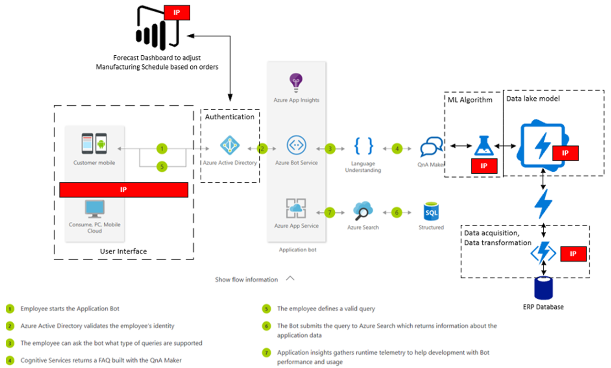

# Reference architecture diagram

The reference architecture diagram is a model that represents the infrastructure your offer relies on. For Azure IP solutions, the diagram should also show how your offer uses Microsoft’s cloud services per the technical requirements of IP Co-sell. It is not designed to assess the quality of the architecture. It is designed to show how your solution uses Microsoft services.

The reference architecture diagram can be created via multiple tools. We recommend Microsoft Visio, as it has multiple stencils that depict Azure architecture models.

A helpful starting point for building reference architecture diagrams is to leverage the [Azure Architecture models](/azure/architecture/browse/).

## Typical components of a reference architecture diagram

- Cloud services that host and interact with your offer, including ones that consume Azure resources
- Data connections, data layers, and data services being consumed by your offer
- Cloud services used to control security, authentication, and users of the offer
- User interfaces and other services that expose the offer to users
- Hybrid or on-premises connectivity and integrations or a combination of both

This screenshot shows an example of a reference architecture diagram.

This example reference architecture diagram is for a vertical industry chatbot that can be integrated with intranet sites to help with forecast demand scenarios via a machine learning algorithm. This solution uses supply chain and manufacturing schedule data from different ERP systems. The bot is designed to address questions about when a salesperson can commit on possible delivery dates for an order.

## Next steps

- [Configure Co-sell for a commercial marketplace offer](./co-sell-configure.md)