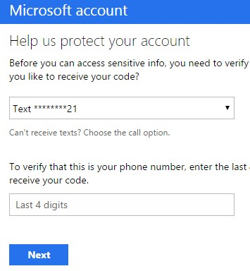
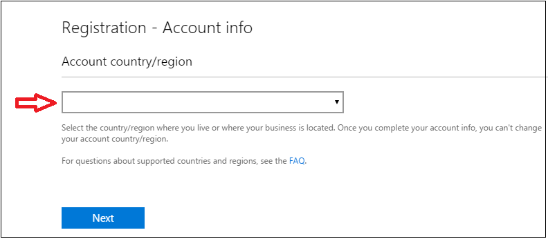

---  
title: Register in Dev Center | Azure
description: How to Register in Developer Center (Dev Center).
services: Azure, Marketplace, Compute, Storage, Networking, Blockchain, Security
documentationcenter:
author: jm-aditi-ms
manager: pabutler
editor:

ms.assetid: 
ms.service: marketplace
ms.workload: 
ms.tgt_pltfrm: 
ms.devlang: 
ms.topic: article
ms.date: 10/05/2018
ms.author: ellacroi

---  

# Register in Dev Center  
To help verify that you are not logged into a personal browser account, open a new Internet Explorer InPrivate or Chrome Incognito browsing session.  
1.  Register as a seller in Dev Center.  
    *   To sign in and register as a seller, visit the Azure Dev Center page located at [dev.windows.com/registration?accountprogram=azure](http://dev.windows.com/registration?accountprogram=azure).  
2.  Complete the `Help us protect your account` wizard, which verifies your identity using your phone number or email address.  

      

3.  In the `Registration - Account Info` section, select your account country or region from the *Account country/region* drop-down menu.  

      
   
    >[!WARNING]
    >To sell your services in Azure Marketplace, verify that your registered entity is from one of the approved *sell-from* countries. The location restriction is required for payout and taxation reasons. 
    >*   For more information, visit the Azure Marketplace Participation Policies page located at [azure.microsoft.com/support/legal/marketplace/participation-policies](https://azure.microsoft.com/support/legal/marketplace/participation-policies).  

4.  For *Account Type*, select the `Company` radio button.  
    *   For more information about account types and to assist in determining which is best for you, visit the Account types, locations, and fee page located at [docs.microsoft.com/windows/uwp/publish/account-types-locations-and-fees](https://docs.microsoft.com/windows/uwp/publish/account-types-locations-and-fees).  

    Click on the Next button.  

5.  For *Publisher display name*, enter the display name (typically the name of your company).  

    >[!NOTE]
    >The publisher display name entered in Dev Center is not displayed in Azure Marketplace when your offer is listed, but you must fill this box to complete the registration process. 

6.  For *Contact info*, enter the information required for the account verification. 

    >[!IMPORTANT]
    >You must provide accurate contact information. The verification process uses your contact information to approve your company in Dev Center. 

1.  For *Company Approver*, enter the contact information for the approver. An approver verifies that you are authorized to create an account in Dev Center for your organization.  

    Click on the Next button.  

      

8.  In the `Registration - Payment` section, you must enter your payment information to pay for your Dev Center account.  
    *   For *Promo code*, enter a promo code that covers the cost of registration.  
    *   For *Billing*, provide your credit card information. PayPal information may be used in place of a credit card in supported markets.  

    Click on the Next button.  

      

9.  In the `Registration - Review` section, review your account information and confirm that everything is correct.  

    Read the terms and conditions of the Microsoft Azure Marketplace publisher agreement.  

    Click on the check-box to indicate that you have read and accepted the terms.  
    
    Click on the Finish button to be sent a confirmation email message.  
11. Choose the next steps using the billing model for your offer.  

    | Billing model | Next steps |  
    |:--- |:--- |  
    | Free | Go to Cloud Partner Portal.<ul> <li>To publish on the Azure Marketplace, visit the Cloud Partner Portal page located at [cloudpartner.azure.com](https://cloudpartner.azure.com).</li> </ul> |  
    | Commercial (transact) | Update your account information.<ul> <li>For more information about adding account information, visit the [How to Add bank and tax information](#how-to-add-bank-and-tax-information) section.</li> </ul> |  

    *   An example of a commercial offer is a VM offer with an hourly billing model.  

---  

## Get Help with Dev Center Registration  
If you have issues with Dev Center registration, then follow these steps to submit a support ticket.  
1.  Go to Dev Center support.  
    *   To access support, visit the Windows developer support page located at [developer.microsoft.com/windows/support](https://developer.microsoft.com/windows/support).  
2.  In Contact Us section, click on the Submit an incident button. 

      

    Select `Help with Dev Center` from the *Problem type* drop-down menu.  

    Select `Publish and manage apps` from the *Category* drop-down menu.  
    
    Click on the Start email button.  
1.  On the sign-in page, sign in using any Microsoft ID. If you do not have a Microsoft ID, then create one.  
    *   For more information about creating a Microsoft ID, visit the [Guidelines for creating a Microsoft ID to manage an Azure Marketplace account](#guidelines-for-creating-a-microsoft-id-to-manage-an-azure-marketplace-account) section.  
2.  Fill in the details of the issue.  
3.  To submit the ticket, click on the Submit button. 

## Issue: Add bank and tax information for publisher payouts  
The bank and tax information is required for all commercial offers using the transact listing type.  
*   If you are publishing commercial offers for purchase, then you must add payout and tax information and request validation in Dev Center.  
    >[!IMPORTANT]
    >For commercial offers (transact), you must complete the bank and tax information before you are able to push your offers to production.  

*   If you are publishing only free or BYOL offers, then you are not required to add the information. You may add the information later, but validation of the tax information takes some time. If you plan to offer commercial offers for purchase, then you should add the information as soon as possible.  

## Add bank information  
1.  Sign into Dev Center using your Microsoft ID.  
    *   To sign into Dev Center, visit the Windows Dev Center page located at [dev.windows.com](https://dev.windows.com).  
2.  Select Payout account on the left menu.
3.  On the `Choose payment method` page, select `Bank account` or `PayPal`.  
    >[!IMPORTANT]
    >If you have commercial offers that customers purchase on the Marketplace, then your payout account is where you receive payout for the purchases.  

4.  Enter the payment information. After you have verified that the information is correct, click on the Save button.  
    >[!IMPORTANT]
    >If you update or change your payout account, then you must follow the same steps replacing the current information with the new information. Changes to your payout account may delay payments up to one payment cycle. This delay occurs because Microsoft must verify the account change, this is the same as when you first set-up your payout account. You get paid the full amount after your account has been verified. Any payments due from the current payment cycle are added to the next cycle.  

4.  Click on the Next button. 

---   

## Add tax information  
1.  Sign into Dev Center using your Microsoft ID.  
    *   To sign into Dev Center, visit the Windows Dev Center page located at [dev.windows.com](https://dev.windows.com).  
2.  Select Tax profile on the left menu. 
3.  On the `Set up your tax form` page, select the country or region where you have permanent residency.  
    
    Select the country or region where you hold primary citizenship.  
    
    Click on the Next button. 
4.  Enter your tax details.  
5.  Click on the Next button.  

## Frequently Asked Questions: 

*	**Which publishers requires a Dev Center account registration?** 
> Publisher who are publishing in Transact listing type: VM, Azure apps: solution templates and managed apps.  

*	**Why is Dev Center account required?**
> Dev Center account is a required to enable Microsoft to bill the customer on the publisher’s behalf for Transact listing type. Dev Center account registration enables Microsoft to validate the legal, tax, and banking information for your company. To learn more click [here.](https://docs.microsoft.com/azure/marketplace/become-publisher#register-in-dev-center)

*	**How do I get started with Dev Center registration?**
> To prevent duplication, verify that your company does not already have a Dev Center account registered. 
You must be signed in with the Microsoft account that you want to associate with your developer account. If you don’t already have a Microsoft account, you can create a new account [here.](https://signup.live.com/signup?contextid=AEB123C8F2B1DA7A&bk=1529968434&ru=https%3a%2f%2flogin.live.com%2flogin.srf%3fcontextid%3dAEB123C8F2B1DA7A%26mkt%3dEN-US%26lc%3d1033%26bk%3d1529968434&uiflavor=web&uaid=9987e727fedb459780d95c1b9e46c82c&mkt=EN-US&lc=1033&lic=1) (example: contoso_marketplace@live.com) To sign in and register, go to https://dev.windows.com/en-us/registration?accountProgram=Azure
 To learn more on registration process click [here.](https://docs.microsoft.com/azure/marketplace/register-dev-center) 

*	**Should I choose 'Individual' or 'Company' account type?**
> To publish a transact offer on Marketplace, you need to select Company account when registering for your Dev Center account.

*	**Can I change my account type from 'Individual' to 'Company' account after account creation?**
> No, the account type cannot be updated once the account is created.

*	**Why do I get a ‘City is required’ error message though I have entered the city correctly?**
> Check to make sure the zip code is correctly entered too. There is a city, zip code validation.

*	**How can I get a promo code?**
> Complete the [Marketplace Registration](https://azuremarketplace.microsoft.com/en-us/sell/signup) form to receive a Dev Center promotional code.
 
*	**What should I expect after I complete the registration?**
> Look for an email from verify@microsoft.com with subject line “Action needed: Verify your email account with Microsoft”. Click on the time sensitive verification link to complete registration. *If you have not received an email within 24hrs, please check the spam folder.*

*	**What are the next steps after Dev Center verification?**
> Go to “Your programs” (https://developer.microsoft.com/dashboard/Account/Programs) and log into the Dev Center account. If you don’t see Azure as a registered program, look under “Recommended programs for you”, and then look for Azure to select  “Get Started.”

*	**How do I link my Dev Center account to my Cloud Partner Portal publisher profile?**
> The final step before publishing is linking your Dev Center account to your Cloud Partner Portal [profile](https://cloudpartner.azure.com/#profile). If your Dev Center account is different from your account on [Cloud Partner Portal](https://cloudpartner.azure.com/#alloffers), add your Dev Center account as a new [user](https://cloudpartner.azure.com/#documentation/manage-users) in the Cloud Partner Portal. Login to the [Cloud Partner Portal](https://cloudpartner.azure.com/#alloffers) with your Dev Center Account. Select Publisher profile on menu located on the top right of your web browser. Select Link Dev Center Account.

*	**Why is my Dev Center application rejected?**
> The third-party vetting company (Duns & Bradstreet) was unable to contact you through the phone number that you have provided. Contact support at [developer.microsoft.com/windows/support](https://developer.microsoft.com/windows/support) to re-start the vetting process

> or

> Account registration are rejected based on geography issues. Companies with subsidiaries based in locations different than the headquarters will only need one Dev Center account.
 
*	**What should I do if the company name that I want to use already exists in Dev Center?**
> Assign a temporary company name, contact support at [developer.microsoft.com/windows/support](https://developer.microsoft.com/windows/support) and provide them your business registration documents.

*	**How do I add my tax and payout information?**
> You will not be able to publish transact offers without completing the tax and bank information in your Dev Center account.  For more information about adding account information, visit [How to Add bank and tax information.](https://docs.microsoft.com/azure/marketplace/register-dev-center#how-to-add-bank-and-tax-information)

*	**Can I change the Dev Center Microsoft login account?**
> No. Once a Dev Center is created, the owner account cannot be changed. You would have to start over with a brand-new Dev Center account with the desired Microsoft account.

*	**Where do I contact support with issues regarding Dev Center registration?**
To access support, visit the Windows developer support page located at [developer.microsoft.com/windows/support](https://developer.microsoft.com/windows/support). 

## Next steps
*   Visit the [Azure Marketplace and AppSource Publisher Guide](./marketplace-publishers-guide.md) page.  
 
---  
