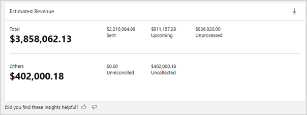
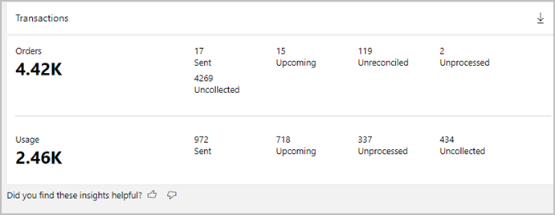
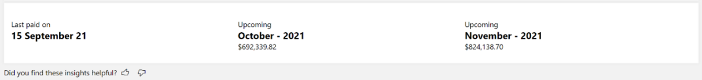
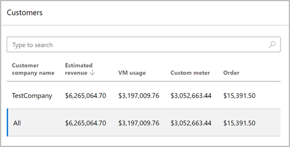
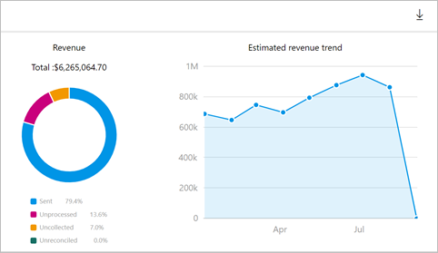
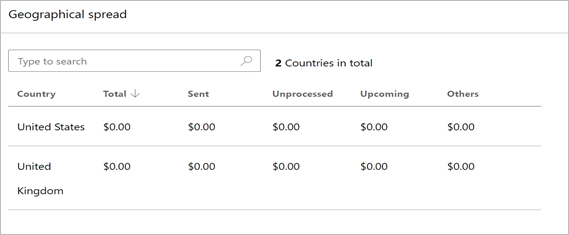
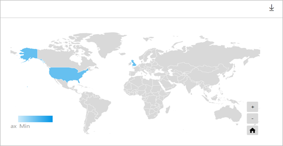
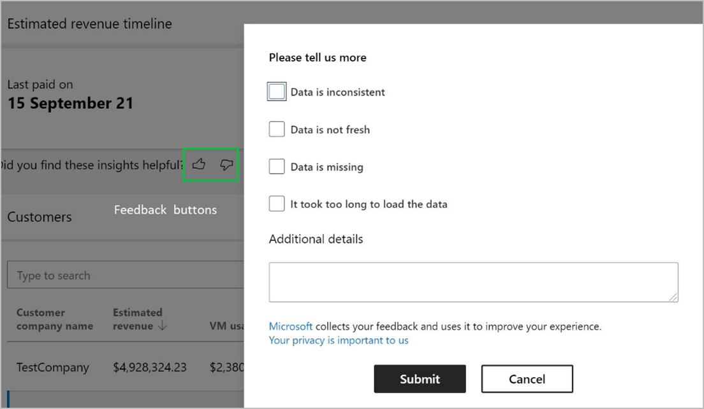

# Revenue dashboard in commercial marketplace analytics

This article provides information on the Revenue dashboard in Microsoft Partner Center. The Revenue dashboard shows the summary of billed sales of all offer purchases and consumption through the commercial marketplace. Use this report to understand your revenue information across customers, billing models, offer plans, and so on. It provides a unified view across entities and helps answer queries, such as:

- How much revenue was invoiced to customers and when can I expect payouts?
- Which customer transacted the offer and where are they located?
- Which offer was purchased?
- When was the offer purchased or consumed?
- What are the billing models and sales channels used?

This article explains how to access the revenue report, understand the purpose of the various widgets on the page, and how to download the exported revenue reports.

## Revenue Dashboard

The [Revenue dashboard](https://partner.microsoft.com/dashboard/commercial-marketplace/analytics/revenue) displays the estimated revenue for all your order purchases and offer consumption. You can view graphical representations of the following items:

- Estimated revenue
- Transactions
- Estimated revenue timeline
- Customer leader board
- Geographical spread
- Details

## Access the Revenue dashboard

[!INCLUDE [Workspaces view note](./includes/preview-interface.md)]

#### [Workspaces view](#tab/workspaces-view)

1. Sign in to [Partner Center](https://partner.microsoft.com/dashboard/home).

1. On the Home page, select the **Insights** tile.

    

1. In the left menu, select **Revenue**.

#### [Current view](#tab/current-view)

1. Sign in to [Partner Center](https://partner.microsoft.com/dashboard/home).

1. In the [Commercial Marketplace dashboard](https://partner.microsoft.com/dashboard/commercial-marketplace/overview) in Partner Center, expand the **[Analyze](https://partner.microsoft.com/dashboard/commercial-marketplace/analytics/summary)** section and select **Revenue**.

    :::image type="content" source="./media/revenue-dashboard/revenue-dashboard-nav.png" alt-text="Illustrates the Revenue dashboard link in the left nav of the Partner Center Home page.":::

---

## Elements of the Revenue dashboard

The following sections describe how to use the Revenue dashboard and how to read the data.

### Month range

You can find a month range selection at the top-right corner of each page. Customize the output of the Revenue dashboard graphs by selecting a month range based on the past 3, 6 or 12 months, or by selecting a custom month range with a maximum duration of 12 months. The default month range (computation period) is six months. Month range selection is not applicable for Estimated revenue timeline widget.

    :::image type="content" source="./media/revenue-dashboard/month-range-filter.png" alt-text="Illustrates the month range filter on the revenue dashboard.":::

> [!NOTE]
> Data for revenue report is available from Jan,2021 onwards.

### Payout currency selector

You can choose to view the revenue figures in either USD or your preferred pay out currency.

    :::image type="content" source="./media/revenue-dashboard/payout-currency-selector.png" alt-text="Illustrates the payout currency selector on the revenue dashboard.":::

### Dashboard filters

The page has different dashboard-level filters you can use to filter the Revenue data based on offer type, offer name, billing model, sales channel, payment instrument type, payout status, and estimated payout month. Each filter is expandable with multiple options that you can select. Filter options are dynamic and based on the selected date range.

> [!NOTE]
> Filters are not applicable for the Estimated revenue timeline widget.

    :::image type="content" source="./media/revenue-dashboard/dashboard-filters.png" alt-text="Illustrates the filters on a revenue dashboard widget.":::

### Estimated revenue

In this section, you will find the _estimated revenue_ information which shows the overall billed sales of a partner for the selected date range and page filters.

The _Total revenue_ represents the billed sales of pay-outs or earnings mapped to different pay out statuses – _sent_, _upcoming_ and _unprocessed_.

The _Others revenue_ represents billed sales with earnings that either are rejected, reprocessed, not eligible, uncollected from the customers, or not reconcilable with transaction amounts in the earnings report.

> [!NOTE]
> There are no earnings entries in the transaction history report for estimated revenue figures with the rejected, reprocessed, not eligible, or not reconcilable status. This screenshot shows an example of an unprocessed billed sale.

### Transactions

In this section, you will find the _transactions information_ that shows the overall count of the order purchases or offer consumption for a partner for the selected date range and page filters.

Each transaction represents a unique combination of purchase record ID and line-item ID in the revenue report. Transaction information is further categorized based on orders (subscriptions) and consumption (usage) based billing models.

### Estimated revenue timeline

In this section, you will find the _estimated revenue timeline_ information that displays the last payment date and the revenue figures of upcoming payments and their associated timelines. The upcoming revenue values shown are figures based on the current date.

### Customer leader board

In this section, you will find the information for top customers who contribute the most to estimated revenue. All figures are reported in the partner preferred currency and can be sorted on different columns. You can select each row of the table and see the corresponding revenue split across different statuses, and the revenue trend for the selected month range.

### Geographical spread

In this section, you will find the geographic spread the total estimated revenue, estimated revenue for sent, upcoming and unprocessed pay out statuses. You can sort the table on different statuses. Total estimated revenue includes revenue for other statuses as well.

The light-to-dark colors on the map represent the low to high value of the total revenue. Select a record in the table to zoom in on a specific country or region.

Note the following:

- You can move around the map to view an exact location.
- You can zoom into a specific location.
- The heatmap has a supplementary grid to view the details of country or region name, total revenue, estimated revenue of sent, unprocessed, and upcoming earnings.
- You can search and select a country/region in the grid to zoom to the location in the map. To revert to the original view, select the **Home** button in the map.

### Details

The _Revenue details_ table displays a numbered list of the 1,000 top orders sorted by transaction month.

- Each column in the grid is sortable.
- The data can be extracted to a .CSV or .TSV file if the count of the records is less than 1,000. To download the report, select **Download raw data** (down arrow icon) in the upper-right of the widget.
- If records number over 1,000, exported data will be asynchronously placed in a downloads page for the next 30 days.
- Apply filters to the revenue details table to display only the data you're interested in. You can filter by order type, offer name, billing model, sales channel, payment instrument type, pay out status, and estimated pay out instrument.

Note the following:

- The revenue is an estimate since it factors the exchange currency rates. It is displayed in transaction currency, US dollar, or partner preferred currency. Values are displayed as per the selected date range and page filters.
- Estimated revenue is tagged with different statuses as explained in the [data dictionary table](#data-dictionary-table).
- Each row in the details section has estimated revenue which is an aggregate of all revenue figures for a unique combination of purchase record ID and line-item ID.
- Columns for customer attributes may contain empty values.

### Providing feedback

In the lower left of most widgets, you’ll see a thumbs up and thumbs down icon. Selecting the thumbs down icon displays this dialog box that you can use to submit your feedback on the widget.

## Data dictionary table

| Data field | Definition |
|----|---------|
|||
| Estimated revenue | Represents billed sales of a partner for customer’s offer purchases and consumption through the commercial marketplace. This is in transaction currency and will always be present in download reports. |
| Estimated revenue (USD) | Estimated revenue reported in US dollars. This column will always be present in download reports. |

---
