# Revenue dashboard in commercial marketplace analytics

This article provides information on the _Revenue dashboard_ in Microsoft Partner Center. The Revenue dashboard shows the summary of _billed sales_ of all offer purchases and consumption through the commercial marketplace. It enables you to reconcile billed sales, payouts, and analytic reports in the commercial marketplace.

Use this report to understand your revenue information across customers, billing models, offer plans, and so on. It provides a unified view across entities and helps answer queries, such as:

- How much revenue was invoiced to customers and when can I expect payouts?
- Which customer transacted the offer and where are they located?
- Which offer was purchased?
- When was the offer purchased or consumed?
- What are the billing models and sales channels used?

This article explains how to access the revenue report, understand the purpose of the various widgets on the page, and how to download the exported revenue reports. To learn about your earnings and payouts, see [Getting paid in Partner Center](/partner-center/marketplace-get-paid).

## Revenue Dashboard

The [Revenue dashboard](https://partner.microsoft.com/dashboard/commercial-marketplace/analytics/revenue) displays the estimated revenue for all your order purchases and offer consumption. You can view graphical representations of the following items:

- Estimated revenue
- Transactions
- Estimated revenue timeline
- Customer leader board
- Geographical spread
- Details

## Access the Revenue dashboard

1. Sign in to [Partner Center](https://partner.microsoft.com/dashboard/home).

1. On the Home page, select the **Insights** tile.

    

1. In the left menu, under **Marketplace offers**, select **Revenue**.

    [ 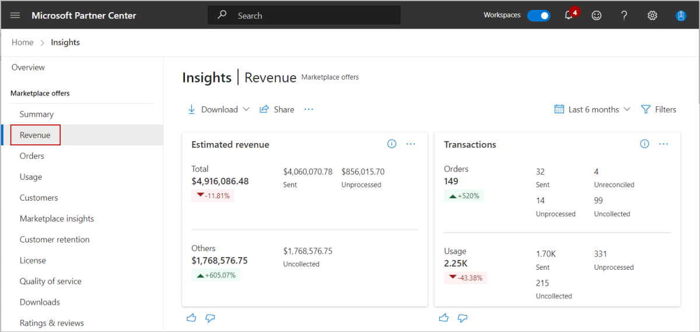 ](./media/revenue-dashboard/revenue-dashboard.png#lightbox)

## Elements of the Revenue dashboard

The following sections describe how to use the Revenue dashboard and how to read the data.

### Download

To download data for this dashboard, select **Download as PDF** from the **Download** list.

[ 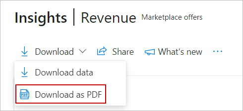 ](./media/revenue-dashboard/download-as-pdf.png#lightbox)

Alternatively, you can go to the [Downloads dashboard](https://partner.microsoft.com/dashboard/insights/commercial-marketplace/analytics/downloads) to download the report.

### Share

To share the dashboard widgets data via email, in the top menu, select Share.

[ 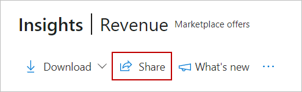 ](./media/revenue-dashboard/share.png#lightbox)

In the dialog box that appears, provide the recipient email address and message. to share the report URL, select the **Copy link** or **Share to Teams** button. To take a snapshot of charts data, select the **Copy as image** button.

### What's new?

To learn about changes and enhancements that were made to the dashboard, select **What’s new**. The _What’s new_ side panel appears.

[ 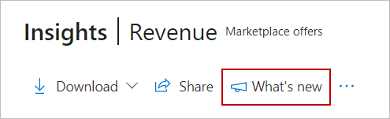 ](./media/revenue-dashboard/whats-new.png#lightbox)

### About data refresh

To view the data source and the data refresh details, such as the frequency of the data refresh, select the ellipsis (three dots) and then select **Data refresh details**.

[ 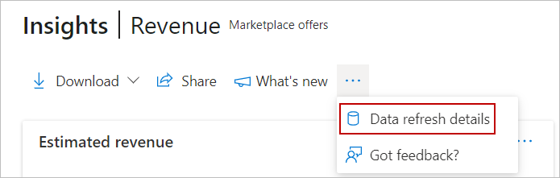 ](./media/revenue-dashboard/data-refresh-details.png#lightbox)

### Got feedback

To provide instant feedback about the report/dashboard, select the ellipsis (three dots), and then select the **Got feedback?** link.

[ 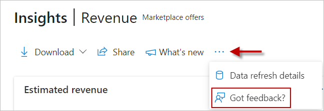 ](./media/revenue-dashboard/got-feedback.png#lightbox)

Provide your feedback in the dialog box that appears.

> [!NOTE]
> A screenshot is automatically sent to us with your feedback.

### Month range

You can find a month range selection at the top-right corner of each page. Customize the output of the Revenue page graphs by selecting a month range based on the past 3, 6, or 12 months, or by selecting a custom month range with a maximum duration of 12 months. The default month range is six months.

[ 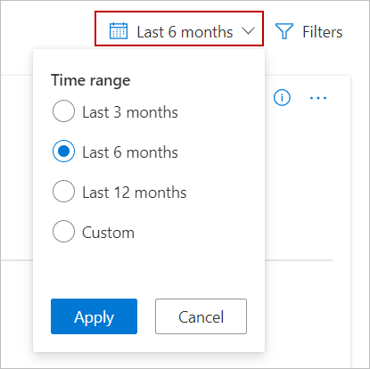 ](./media/revenue-dashboard/time-range.png#lightbox)

### Revenue dashboard filters

The page has different dashboard-level filters you can use to filter the Revenue data based on the following:
- Offer type
- Offer listing
- Billing model
- Payout status
- Offer name
- Payment instrument family
- Sales channel

To select the filters, in the top-right of the page, select **Filters**.

[ 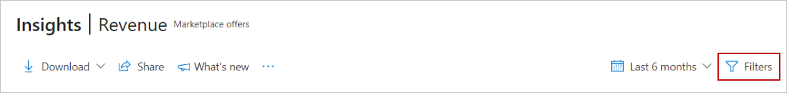 ](./media/revenue-dashboard/filters.png#lightbox)

Each filter is expandable with multiple options that you can select. Filter options are dynamic and based on the selected date range.

[ 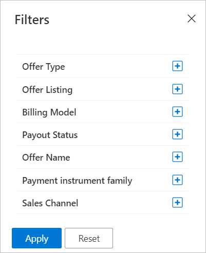 ](./media/revenue-dashboard/filters-panel.png#lightbox)

> [!NOTE]
> The dashboard-level filters have no impact on the data shown in the _Estimated revenue timeline_ widget.

### Estimated revenue

In this section, you will find the _estimated revenue_ information that shows the overall billed sales of a partner for the selected date range and page filters.

The _Total revenue_ represents the billed sales of payouts or earnings mapped to different payout statuses: _sent_, _upcoming_, and _unprocessed_.

The _Others revenue_ represents billed sales with earnings that either are rejected, reprocessed, not eligible, uncollected from the customers, or not reconcilable with transaction amounts in the earnings report.

The growth rate denotes the percentage change of billed sales between the end and the start of the selected month range.

> [!NOTE]
> There are no earnings entries in the transaction history report for estimated revenue figures with the rejected, reprocessed, not eligible, or not reconcilable status. This screenshot shows an example of billed sales of not only sent, upcoming, and unprocessed earnings, but also uncollected payments from customers.

Select the ellipsis (three dots) to copy the widget image and download the image as a .PDF for sharing purposes.

[ 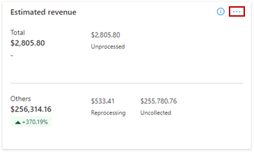 ](./media/revenue-dashboard/estimated-revenue-ellipsis.png#lightbox)

### Transactions

In this section, you will find the _transactions information_ that shows the overall count of the order purchases or offer consumption for a partner for the selected date range and page filters.

Each transaction represents a unique combination of purchase record ID and line-item ID in the revenue report. Transaction information is further categorized based on orders (subscriptions) and consumption (usage) based billing models.

The growth rate denotes the percentage change of transactions between the end and the start of the selected month range.

Select the ellipsis (three dots) to copy the widget image and download the image as a .PDF.

[ 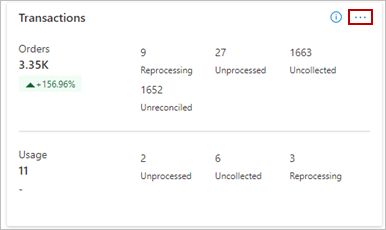 ](./media/revenue-dashboard/transactions-widget-ellipsis.png#lightbox)

### Estimated revenue timeline

In this section, you will find the _estimated revenue timeline_ information that displays the billed sales of the last payout amount, date, and the revenue figures of upcoming payments and their associated timelines. The upcoming revenue values shown are figures based on the current system date.

Select the ellipsis (three dots) to copy the widget image, download aggregated widget data as a .CSV file, and download the image as a .PDF.

### Customers leader board

In this section, you will find the information for top customers who contribute the most to estimated revenue. The “All” row denotes billed sales of all your customers. Up to 500 records can be displayed in this leaderboard table. All figures are reported in the partner preferred currency and can be sorted on different columns. You can select each row of the table and see the corresponding revenue split across different statuses, and the revenue trend for the selected month range. The dotted line in the revenue trend represents revenue figures for the open month.

Select the ellipsis (three dots) to copy the widget image and download the image as a .PDF.

[ 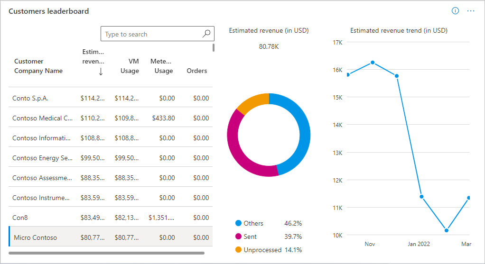 ](./media/revenue-dashboard/customers-leaderboard.png#lightbox)

### Geographical spread

In this section, you will find the geographic spread the total estimated revenue, estimated revenue for sent, upcoming, and unprocessed payout statuses. You can sort the table on different statuses. Total estimated revenue includes revenue for other statuses as well.

The light-to-dark colors on the map represent the low to high value of the estimated revenue. Select a record in the table to zoom in on a specific country or region.

Select the ellipsis (three dots) to copy the widget image and download the image as a .PDF.

[ 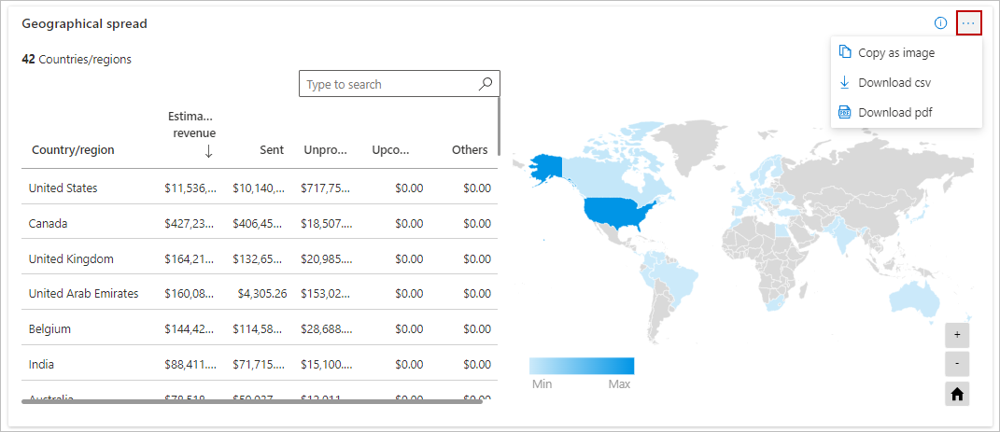 ](./media/revenue-dashboard/revenue-geographical-spread.png#lightbox)

Note the following:

- You can move around the map to view an exact location.
- You can zoom into a specific location.
- The heatmap has a supplementary grid to view the details of country or region name, total revenue, estimated revenue of sent, unprocessed, and upcoming earnings.
- You can search and select a country/region in the grid to zoom to the location in the map. To revert to the original view, select the **Home** button in the map.

### Details

The _Revenue details_ table displays a numbered list of the 1,000 top orders sorted by transaction month.

- Each column in the grid is sortable.
- The data can be extracted to a .CSV or .TSV file if the count of the records is less than 1,000. To download the report, select **Download raw data** (down arrow icon) in the upper right of the widget.
- If records number over 500, exported data will be asynchronously placed in a downloads page for the next 30 days.
- Use the expand and collapse widget icon at the rightmost side of each record to view billed sales revenue split across different statuses for a given _purchase order id_ and _line item id_.
- Apply filters to the revenue details table to display only the data you're interested in. You can filter by order type, offer name, billing model, sales channel, payment instrument type, payout status, and estimated payout instrument.

[ 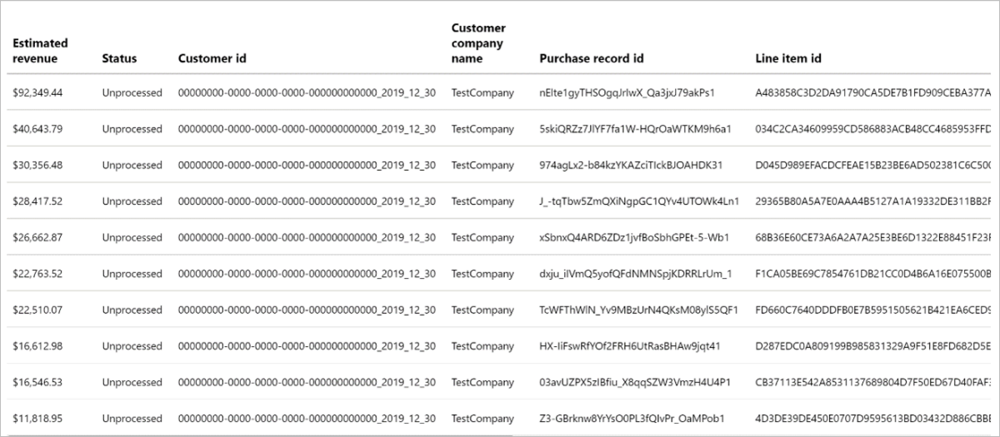 ](./media/revenue-dashboard/details-widget.png#lightbox)

Details widget with expandable and collapsible view.

[ 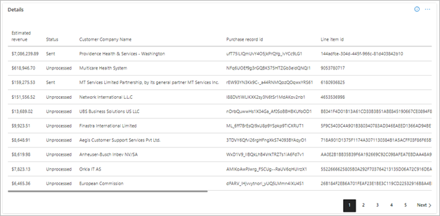 ](./media/revenue-dashboard/details-table.png#lightbox)

Note the following:

- The revenue is an estimate since it factors the exchange currency rates. It is displayed in transaction currency, US dollar, or partner preferred currency. Values are displayed as per the selected date range and page filters.
- Estimated revenue is tagged with different statuses as explained in the [data dictionary table](#data-dictionary-table).
- Each row in the Details section has estimated revenue that is an aggregate of all revenue figures for a unique combination of purchase record ID and line-item ID.
- Columns for customer attributes may contain empty values.

### Providing feedback

In the lower left of most widgets, you’ll see a thumbs up and thumbs down icon. Selecting the thumbs down icon displays a dialog box that you can use to submit your feedback on the widget.

## Data dictionary table

| Column name in user interface | Definition |
|----|---------|
| Billed revenue | Represents billed sales of a partner for customer’s offer purchases and consumption through the commercial marketplace. This is in transaction currency and will always be present in download reports. |
| Estimated revenue (USD) | Estimated revenue reported in US dollars. This column will always be present in download reports. |
| Estimated revenue (PC) | Estimated revenue reported in partner preferred currency. This column will always be present in download reports. |
| Status - Sent | The overall revenue for which earnings were sent to the Partner. |
| Status - Unprocessed | The overall revenue for which earnings are yet to be processed. This revenue may be shown across months due to payment schedules and processes. It can occur for multiple reasons:<ul><li>Customer has made payment but the earnings to partner is not yet posted.</li><li>Manual payment cancellations or failed payment submissions, and so on.</li></ul> |
| Status - Upcoming | The overall revenue for which earnings are upcoming or pending. This revenue may be shown across months due to payment schedules and processes. |
| Status - Rejected | The overall revenue for which payments or safe approval were rejected. |
| Status - Not eligible | The overall revenue for which a partner isn't eligible to receive payouts. [Learn more](/partner-center/payout-statement) about eligibility. |
| Status - Reprocessed | The overall revenue under-reprocessing due to various reasons. For example, invoice cancellation or safe approval cancelation, and so on. |
| Status - Unreconciled | The overall revenue for which successful reconciliation with earnings couldn't happen. This can occur for multiple reasons:<ul><li>Estimated revenue is generated but earnings are not yet posted</li><li>Some issues with software systems</li></ul> |
| Status - Uncollected | The overall revenue for which an end customer hasn't yet paid or has defaulted. [Learn more](/partner-center/payout-policy-details#process-for-customer-non-payment) about write-offs. For enterprise agreement (EA) customers, there may be entries and for non-EA customers there will be no entries in the transaction history report. |
| Transactions | An order purchase or an offer usage event for which a purchase order id and line-item id are generated in the customer invoice. |
| Purchase record Id | Relates to a customer's invoice. Same as `order id` in the transaction history report. |
| Line-item Id | Individual line in a customer's invoice. Same as  `lineItemId` in the transaction history report. |
| Customer name | Name of the customer |
| Customer company name | Name of the customer’s company |
| Customer Id | The unique identifier assigned to a customer. A customer may have zero or more Azure Marketplace subscriptions. Same as `customer id` in the customers report. |
| Billing account Id | Identifier for the billing account of the customer. Same as `customer id` in the transaction history report. |
| Asset Id | An identifier for the software assets. Same as the `order id` in the orders report in Partner Center. |
| Offer type | Type of offer, such as SaaS, VM, and so on. |
| Offer name | Display name of the offer |
| Is Private Offer | Indicates whether a marketplace offer is a private or a public offer. <ul><li>0 value indicates false</li><li>1 value indicates true</li></ul>
| Offer plan | Specific offer plan, also referred to as SKU |
| Trial deployment | Denotes whether the offer was in trial deployment at the time of billing |
| Service Start Date | The start date of the order subscription term |
| Service End Date | The end date of the order subscription term |
| Billed month | The month for which the billing was done and `Purchase record id` and `Line-item id` were generated |
| Transaction amount | Transaction amount in the original transaction currency. Refers to the transaction amount column in the transaction history report |
| Earnings amount CC | Earnings amount in the original transaction currency |
| Transaction currency | The customer currency used for a transaction |
| Transaction amount (USD) | Transaction amount in US dollars. Refers to the transaction currency USD column in the transaction history report |
| Earnings amount USD | Earnings amount in USD |
| Transaction exchange rate (USD) | The exchange rate used to convert transaction amount and transaction amount in USD |
| Transaction amount (PC) | Transaction amount in Partner preferred currency. Refers to the transaction currency USD column in the transaction history report |
| Earnings amount (PC) | Earnings amount in partner preferred payout currency |
| Exchange rate date | The date used to calculate exchange rates for currency conversions |
| Estimated pay out month | The month for receiving your estimated earnings |
| Sales channel | Represents the sales channel for the customer. It is the same as `Azure license type` in the orders report and usage report. The possible values are:<ul><li>Cloud Solution Provider (CSP)</li><li>Enterprise (EA)</li><li>Enterprise through Reseller</li><li>Pay as You Go</li><li>Go to market (GTM)</li></ul> |
| PlanId | The display name of the plan entered when the offer was created in Partner Center. Note that PlanId was originally a numeric number. |
| Billing model | Subscription or consumption-based billing model used for calculation of estimated revenue. It can have one of these two values:<ul><li>UsageBased</li><li>SubscriptionBased</li></ul> |
| Customer postal code | The postal code name provided by the bill-to customer |
| Customer city | The city name provided by the bill-to customer |
| Customer state | The state name provided by the bill-to customer |
| Customer country | The country or region name provided by the customer. The country/region could be different than the country/region in a customer's Azure subscription. |
| Customer company | The company name provided by the customer |
| Customer email | The e-mail address provided by the end customer. This address could be different than the e-mail address in a customer's Azure subscription. |
| Payout currency | The partner preferred currency to receive payout. This is the same as the _lastpaymentcurrency_ column in the transaction history report. |
| Payment sent date | The date on which payment was sent to the partner |
| Quantity | Indicates billed quantity for transactions. This can represent the seats and site purchase count for subscription-based offers, and usage units for consumption-based offers. |
| Units | The unit quantity. Represents count of purchased seat/site SaaS orders and core hours for VM-based offers. Units will be displayed as NA for offers with custom meters. |

## Next steps

- For common questions about the revenue dashboard or commercial marketplace analytics, and for a comprehensive dictionary of data terms, see [Commercial marketplace analytics Frequently Asked Questions](analytics-faq.yml).
- For information on payout statements, see [Payout statements](/partner-center/payout-statement).
- For information on Payout schedules, see [Payout schedules and processes](/partner-center/payout-policy-details).
- For Virtual Machine (VM) offers usage and metered billing metrics, see [Usage dashboard in commercial marketplace analytics](usage-dashboard.md).
- For information about your orders in a graphical and downloadable format, see [Orders dashboard in commercial marketplace analytics](orders-dashboard.md).
- For a list of your download requests over the last 30 days, see [Downloads dashboard in commercial marketplace analytics](downloads-dashboard.md).
- For an overview of analytics reports available in the commercial marketplace, see [Access analytic reports for the commercial marketplace in Partner Center](analytics.md).
