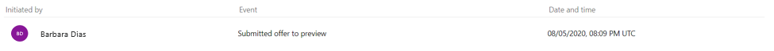
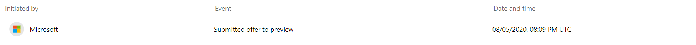
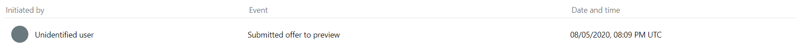
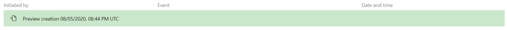

# How to review and publish an offer to the commercial marketplace

This article shows you how to use Partner Center to submit your offer for publishing, preview your offer, and then publish it to the commercial marketplace. We also cover how to check your publishing status as it proceeds through the publishing steps. You must have already created an offer that you want to publish.

## Offer status

You can review your offer status on the **Overview** tab of the commercial marketplace dashboard in [Partner Center](https://partner.microsoft.com/dashboard/commercial-marketplace/overview). One of the following status indicators is displayed in the **Status** column for each offer.

| Status | Description |
| ------------ | ------------- |
| Draft | Offer has been created but it isn't being published. |
| Publish in progress | Offer is working its way through the publishing process. |
| Attention needed | We discovered a critical issue during certification or during another publishing phase. |
| Preview | We certified the offer, which now awaits a final verification by the publisher. Select **Go live** to publish the offer live. |
| Live | Offer is live in the marketplace and can be seen and acquired by customers. |
| Pending stop sell | Publisher selected "stop sell" on an offer or plan, but the action has not yet been completed. |
| Not available in the marketplace | A previously published offer in the marketplace has been removed. |
|||

## Validation and publishing steps

When you are ready to submit an offer for publishing, select **Review and publish** at the upper-right corner of the portal. The **Review and publish** page shows the status of each page for your offer, which can be one of the following:

   - **Not started** – The page is incomplete.
   - **Incomplete** – The page is missing required information or has errors that need to be fixed. You'll need to go back to the page and update it.
   - **Complete** – The page is complete. All required data has been provided and there are no errors.

If any of the pages have a status other than **Complete**, you need to correct the issue on that page and then return to the **Review and publish** page to confirm the status now shows as **Complete**. Some offer types require testing. If so, you will see a **Notes for certification** field where you need to provide testing instructions to the certification team and any supplementary notes helpful for understanding your app.

After all pages are complete and you have entered applicable testing notes,  select **Publish** to begin the validation and publishing processes. The phases and overall sequence can vary depending on the type of offer you are publishing. The following table shows one possible publishing flow. Each phase is explained in more detail in the following sections.

| Phase | What happens |
| ------------ | ------------- | ------------- |
| [Automated validation](#automated-validation-phase) | We process a set of automated validations. |
| [Certification](#certification-phase) | We conduct manual validations. |
| [Preview creation](#preview-creation-phase) | The listing page for your offer preview is available to anyone who has the preview link. If your offer will be sold through Microsoft (transactable), only the audience you specified on the **Preview audience** page of your offer can purchase and access the offer for testing. |
| [Publisher sign-off](#publisher-sign-off-phase) | We send you an email with a request for you to preview and approve your offer. |
| [Publish](#publish-phase) | We run a series of steps to verify that the preview offer is published live to the commercial marketplace. |
|||

## Automated validation phase

The first step in the publishing process is a set of automated validations. Each validation step corresponds to a feature you chose when you created the offer. Each validation check must be complete before the offer can advance to the next step in the publishing process.

- **Offer purchase flow setup** (<10 min)

   We ensure your offer can be fulfilled when purchased by customers through the Azure portal. This step is only applicable for offers being sold through Microsoft.

- **Test drive data validation** (~5 min)

   We validate the data you provided on the Technical configuration page of the offer. We test and approve test drive functionality. This step is only applicable for offers with a test drive enabled.

- **Test drive provisioning** (~30 min)

    After validating the data and functionality of your test drive in the previous step, we deploy and replicate instances of your test drive so they are ready for customer use. This step is only applicable for offers with a test drive enabled.

- **Lead management validation and registration** (<15 min)

    We confirm that your lead management system can receive customer leads based on the details you provided on the **Offer setup** page. This step is only applicable for offers with lead management enabled.

## Certification phase

Offers submitted to the commercial marketplace must be certified before being published. Offers undergo rigorous testing, some automated and others manual. To learn more, see [commercial marketplace certification policies](/legal/marketplace/certification-policies).

### Types of validation that take place during certification

There are three levels of validation included in the certification process for each submitted offer.

- Publisher business eligibility
- Content validation
- Technical validation

#### Publisher business eligibility

Each offer type checks a set of required base eligibility criteria. This criteria may include publisher MPN status, competencies held, competency levels, and so on.

#### Content validation

The information entered when you created your offer is checked for quality and relevance. These checks will review your entries for the marketplace listing details, pricing, availability, associated plans, and so on. To meet the listing criteria of Microsoft AppSource and Azure Marketplace, we will validate that your offer includes:

- A title that accurately describes the offer
- Well-written descriptions that provide a thorough overview and value proposition
- Quality screenshots and videos
- An explanation of how the offer utilizes Microsoft platforms and tools.

Learn more regarding the content validation criteria by reading the [general listing policies](/legal/marketplace/certification-policies#100-general).

#### Technical validation

During technical validation, the offer (package or binary) undergoes the following checks.

- Scanned for malware
- Network calls monitored
- Package analyzed
- Thorough scanning of the offer's functionality

The offer is tested across various platforms and versions to ensure it’s robust.

### Certification failure report

If your offer fails any of the listing, technical, or policy checks, or if you are not eligible to submit an offer of that type, we email a certification failure report to you.

This report contains descriptions of any policies that failed, along with review notes. Review this email report, address any issues, make updates to your offer where needed, and resubmit the offer using the [commercial marketplace portal](https://partner.microsoft.com/dashboard/commercial-marketplace/offers) in Partner Center. You can resubmit the offer as many times as needed until passing certification.

## Preview creation phase

During the preview creation phase, we create a version of your offer that will be accessible to only the audience you specified on the **Preview audience** page of your offer, if any. The preview version of your offer won’t be available to anyone outside the preview audience until you publish the offer live.

> [!NOTE]
> Do not use the preview audience to give people outside your organization visibility into an offer. Use the Private Offer option instead. At this point, your offering has not been fully tested and validated, and is not ready for outside distribution.

## Cancel publishing

To cancel an offer with the **Publish in progress** status:

1. Select the offer name to open the **Offer overview** page.
1. Select **Cancel publish** from the top-right corner of the page.
1. Confirm that you want to stop the offer from being published.

If you want to publish the offer at a later time, you'll need to start the publishing process over.

> [!NOTE]
> You can stop an offer from being published only if the offer hasn't yet progressed to the publisher sign off step. After you select **Go live**, you will not have the option to cancel publish any longer.

## Publisher sign-off phase

When the offer is ready for you to review and be signed off, we’ll send you an email to request that you review and approve your offer preview. You can also refresh the **Offer overview** page in your browser to see if your offer has reached the Publisher sign-off phase. If it has, the **Go live** button and preview links will be available.

The following screenshot shows the **Offer overview** page for a SaaS offer. The validation steps you’ll see on this page vary depending on the offer type and the selections you made when you created the offer.

### Previewing and approving your offer

> [!IMPORTANT]
> To validate the end-to-end purchase and setup flow, purchase your offer while it is in Preview. First notify Microsoft with a [support ticket](https://aka.ms/marketplacesupport) to ensure we don't process a charge.

On the **Offer overview** page, you will see preview links under the **Go live** button. There will be a link for either AppSource preview, Azure Marketplace preview, or both depending on the options you chose when creating your offer. If you chose to sell your offer through Microsoft, anyone who has been added to the preview audience can test the acquisition and deployment of your offer to ensure it meets your requirements during this stage.

After you approve your preview, select **Go live** to publish your offer live to the commercial marketplace. 

If you want to make changes after previewing the offer, you can edit and resubmit your publication request. If your offer is already live and available to the public in the marketplace, any updates you make won't go live until you select **Go live*. For more information, see [Update an existing offer in the commercial marketplace](partner-center-portal/update-existing-offer.md)

## Publish phase

Now that you’ve chosen to go live with your offer, which makes it available in the commercial marketplace, we perform a series of final validation checks to ensure the live offer is configured just like the preview version of the offer.

- **Offer purchase flow setup** (>10 min)

    We ensure your offer can be fulfilled when purchased by customers through the Azure portal. This step is only applicable for offers being sold through Microsoft.

- **Test drive data validation** (~5 min)

    We validate the data you provided on the Technical configuration page of the offer. We test and approve test drive functionality. This step is only applicable for offers with a test drive enabled.

- **Test drive provisioning** (~30 min)

    We deploy and replicate instances of your test drive so they are ready for customer use. This step is only applicable for offers with a test drive enabled.

- **Lead management validation and registration** (>15 min)

    We confirm that your lead management system can receive customer leads based on the details provided on your **Offer setup** page. This step is only applicable for offers with lead management enabled.

- **Final publish (>30 minutes)**

    We ensure your offer becomes publicly available in the marketplace.

After these validation checks are complete, your offer will be live in the marketplace.

## Publishing history

The **History** page in Partner Center shows the publishing events for your commercial marketplace offers. For each event, the page displays the user who initiated the action, the event type, and the event date and time. The [validation and publishing steps](#validation-and-publishing-steps) are listed with the date and time of completion.

To view the history of your offer:

1.    Sign in to [Partner Center](https://partner.microsoft.com/dashboard/home).
2.    In the navigation menu on the left, select **Commercial Marketplace** > **Overview**.
3.    Select your offer.
4.    Select the **History** tab in the navigation menu on the left. The page provides details for the following events, as applicable to your offer:

|Event    |Description    |
|---------|---------------|
|Created offer    |The offer was created in Partner Center. A user selected the offer type, offer ID, and offer alias in **Commercial Marketplace** > **Overview**.    |
|Created plan: *plan name*    |A user created a new plan by entering the plan ID and plan name in the **Plan overview** tab. *This event applies only to offer types that support plans*.    |
|Deleted plan    |A user deleted a draft plan that had not been published by selecting **Delete draft** from the **Plan overview** page. *This event applies only to offer types that support plans*.    |
|Initiated plan stop sell: *plan name*    |A user initiated a plan stop-sell by selecting **Stop selling** from the **Plan overview** page. *This event applies only to offer types that support plans*.    |
|Undo plan stop sell: *plan name*    |A user canceled a plan stop-sell by selecting **Undo stop selling** from the **Plan overview** page. *This event applies only to offer types that support plans*.    |
|Submitted offer to preview    |A user submitted the offer to preview by selecting **Publish** from the **Review and publish** page.    |
|Initiated submit to preview cancellation    |A user requested to cancel the offer publication to preview by selecting **Cancel publish** from the **Offer overview** page after the submission to preview. *This event is displayed as the cancellation request is being processed*.    |
|Canceled submission to preview    |A user canceled the offer publication to preview by selecting **Cancel publish** from the **Offer overview** page after the submission to preview. *This event is displayed after the cancellation request is successfully processed*.    |
|Sign-off to go live    |A user published the offer to the commercial marketplace by selecting **Go live** from the **Offer overview** page.    |
|Initiated publish to marketplace cancellation    |A user requested to cancel the offer publication by selecting **Cancel publish** from the **Offer overview** page after the sign-off to go live. *This event is displayed as the cancellation request is being processed*.    |
|Canceled publishing to the commercial marketplace    |A user canceled the offer publication by selecting **Cancel publish** from the **Offer overview** page after the sign-off to go live. *This event is displayed after the cancellation request is successfully processed*.    |
|Sync private audience    |A user updated and synced the private audience by selecting **Sync private audience** from the **Plan overview** page or the **Plan pricing & availability** page. *This event applies only to offer types that support private plans*.    |
|Stop sell offer    |A user stopped selling the offer by selecting **Stop selling** from the **Offer overview** page.    |

> [!NOTE]
> The History page doesn’t say when an offer draft was saved.

### Filter options

You can use filters to narrow down the full history of your offer to specific publishing events:

1.    Select the filter button on the upper-right corner of the page.
2.    Choose a filter, then select **Apply** to see which history events correspond to the criteria you selected.
3.    Select **Clear filters** to return to the full history of your offer.

There are four filters:
* Events
* Users
* Date
* Pages

When you choose the **Pages** filter, you can select any of the Partner Center pages that are applicable to your offer type. When applied, the **Pages** filter shows all the **Submitted offer to preview** events with changes to the page you selected.

* For all offers, the **Offer setup** page is included by default for each submission event.
* For offers that support plans, the **Plan overview** page is included for each submission event.
* For offers that support test drive, the **Test drive** page is included for each submission event.

### Users

If an event was initiated by a user, the History page will show the user according to the following scenarios:

#### The event was initiated by the publisher

Users with publishing permissions for an offer will have their name displayed for the publishing events they initiate.

#### The event was initiated by Microsoft

You may give permissions to Microsoft administrators to initiate actions on your behalf or take corrective actions after an unexpected system error. The Microsoft name and logo are displayed for publishing events initiated by Microsoft on behalf of your account.

#### The event was initiated by an unidentified user

Users who are no longer associated with an account will have their name removed from the **Initiated by** column after their publishing permissions are withdrawn.

#### Validation and publishing steps

No user is shown for system processes that correspond to [validation and publishing steps](#validation-and-publishing-steps). These events are color-coded according to the completion status of the event.

## Next steps

[Access analytic reports for the commercial marketplace in Partner Center](partner-center-portal/analytics.md)