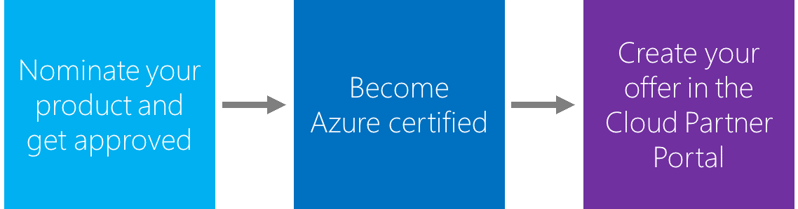
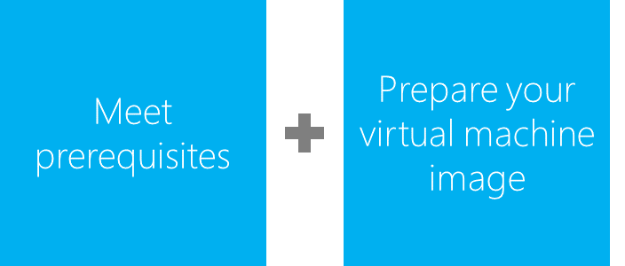
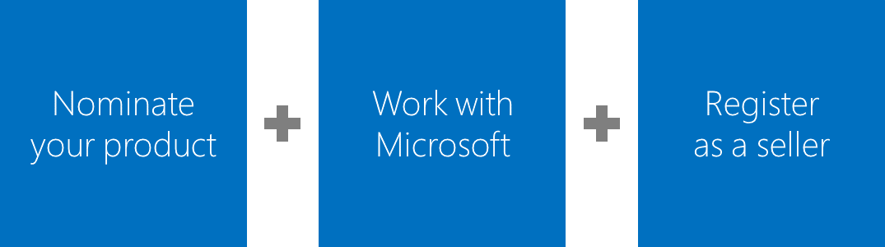

# Azure Marketplace seller guide

Welcome to the Azure Marketplace seller guide. This guide is designed for business users and product managers at independent software vendors (ISVs) who are interested in selling their Azure Certified virtual machine images to IT professionals and developers. With Azure customers located around the world, the [Marketplace](https://azuremarketplace.microsoft.com/) can provide great reach and exposure for your products.

> [!NOTE]
> If you're interested in selling your finished software as a service (SaaS) products to business users, you can investigate options to list them in [AppSource](https://appsource.microsoft.com).

By the end of this guide, you'll know where to find more detailed information on these topics:

- What is the Azure Marketplace?
- How do I determine if my product fits with the Marketplace?
- What are the benefits of selling on the Marketplace?
- What are the prerequisites (technical and nontechnical) to sell on the Marketplace?
- How do I build Azure-compatible virtual hard disks (VHDs)?
- How do I apply and register as a seller?
- How do I create and publish my offer?
- How do I go to market and find available resources?
- What reporting and insights does the Marketplace provide?
- Where can I get help and support?

Let's get started.

## What's the Azure Marketplace?

The Azure Marketplace is an online applications and services marketplace on which ISVs--from startups to enterprises--offer their solutions to Azure customers around the world. Through the Marketplace, Azure publishers can distribute and sell their virtual machine images to other professionals who want to quickly develop their cloud-based applications and mobile solutions in Azure. The Marketplace supports a range of offerings--from end-to-end data analytics applications with data processing, data storage, and analysis layers, to tiered e-commerce apps (data, service, and Internet).

Cloud customers face several challenges when searching for solutions to fit their unique needs. The Marketplace provides a way to solve these challenges and connect customers with innovative ISV solutions, as explained in the following table:

| Customer need | Azure Marketplace solution |
| --- | --- |
| Demands additional cloud platform functionality to meet business and technical needs | Offers a growing portfolio of complementary applications and services on Azure |
| Finds it challenging to discover the right application or service | Provides a one-stop shop to discover, search for, and purchase applications and services |
| Needs a scalable deployment mechanism for third-party applications and services | Enables the creation and configuration of scalable deployments for third-party applications and services |
| Requires new applications and services to integrate and work with existing solutions | Easily integrates third-party applications and services with existing solutions on Azure |

The Marketplace brings the quality, choice, and strength of the Azure partner ecosystem to global customers. Key benefits include:

- Unified location for Azure-based offerings from Microsoft and partners.
- More than 5,000 offers.
- Integrated platform experience.
- Streamlined configuration, deployment, and management.

## Is the Marketplace right for my business?

By now you might be wondering if the Azure Marketplace is the right fit for your business. And if it is, what will you get out of it? The Marketplace creates new sales opportunities for you:

- **Sell into new customer markets with an expanded portfolio of solutions on Azure**. Upsell and cross-sell Marketplace offerings with Azure services that are available to Microsoft Online Subscription Program (MOSP) and Microsoft Enterprise Agreement customers. You can easily incorporate Marketplace offerings into your customer solution and Azure scenario pitch.
- **Enhance business value and increase deal size with existing and new customer accounts**. The Marketplace can help you grow deal size, address customer pain points when moving workloads to the cloud, and increase deal profitability. You increase business value by selling complete solutions and address Azure cloud platform gaps to meet customer requirements.
- **Appeal to a wider range of potential customers by selling Marketplace applications and services**. The Marketplace can make it easier to find and retain new customers. Many businesses today need to transition workloads to the cloud and adapt to changing infrastructure environments. You can provide the right applications and services to help them bridge the gap.
- **Complement and extend Azure functionality by bundling Marketplace offers with Azure services**. The Marketplace can help you frame scenario-based conversations with your customers. You can also address specific platform gaps and customer needs by talking about end-to-end solutions. Finally, by selling solution bundles, you can use the Azure platform ecosystem to address a variety of customer issues--and increase your sales.

## What&#39;s the customer base for the Marketplace?

Marketplace customers are diverse. Also, Azure has one of the fastest-growing customer bases of all cloud providers. You gain access to IT professionals and developers working for companies ranging from start-ups to enterprises, across industries, and in both the public and private sectors.

## How does the Marketplace work?

It&#39;s pretty easy. After you&#39;re approved, you create your Azure Certified virtual machine image and publish it to the Marketplace. There, Azure customers can find, buy, and deploy your product in minutes. Even better, customers deploy your solution with confidence. They know that the environment is configured for success on Azure and that the infrastructure is ready to go within a few minutes.

The Cloud Partner Portal is the hub for creating your offer on the Marketplace. Virtual machine images are preconfigured with a fully installed operating system and one or more applications. To certify your image so that it&#39;s ready for publication, you have to meet certain prerequisites. We discuss these in the next section.

## What's next?

You might be thinking that the Azure Marketplace really is the right fit for your product. So how do you get started? This section is all about getting up and running on the Marketplace (Figure 1) by: 
* Becoming Azure Certified.
* Getting approved to sell your product.
* Creating your offer in the Cloud Partner Portal. 

Figure 1: Process for selling on the Azure Marketplace

First you meet a set of technical and nontechnical prerequisites and prepare your virtual machine image. Then you nominate your product and register as a seller. Finally, you add marketing content and submit for publishing. You can review your offer in a preview/staging environment prior to making it live on the Marketplace.

The first time you create an offer for the Azure Marketplace, you should plan on about four weeks for basic onboarding. If possible, build in six weeks before the launch of your offer to allow time for media and publishing tasks.

## How do I become Azure Certified?

The first step in creating your offer for the Azure Marketplace is to become Azure Certified. That means compiling company information, agreeing to participation policies, downloading necessary tools, and building technical components (Figure 2).

Figure 2: Requirements for becoming Azure Certified

### Technical prerequisites

Carefully review and meet all technical prerequisites before you launch. You will need access to Windows or Linux and also to Azure-compatible VHDs linked to testing tools.

We recommend that you develop your Azure VHD directly in the cloud by using Remote Desktop Protocol. However, if it is your only option, it&#39;s possible to download a VHD and develop it by using [on-premises infrastructure](https://docs.microsoft.com/azure/marketplace-publishing/marketplace-publishing-vm-image-creation-on-premise).

For more detailed information, see the [technical prerequisites](https://docs.microsoft.com/azure/marketplace-publishing/marketplace-publishing-vm-image-creation-prerequisites) page.

### Nontechnical prerequisites

To become part of the Marketplace, you need to meet some nontechnical prerequisites. First, review and agree to the terms of the [Azure Marketplace Participation Policies](https://azure.microsoft.com/support/legal/marketplace/participation-policies/). The software and services offered in the Marketplace must meet at least one of the following requirements:

- **Run on Azure**. The primary function of the software or service must run on Microsoft Azure.
- **Deploy to Azure**. In your listing information, you must describe how the software or service is deployed on Azure.
- **Integrate with or extend an Azure service**. You must indicate in your listing information:
  - Which Azure service the software or service integrates with or extends
  - How the software or service integrates with or extends the Azure service

You also need to meet these business requirements, as described in the Azure Marketplace Participation Policies:

- Your company (or its subsidiary) must be located in a sell-from country supported by the Marketplace.
- Your product must be licensed in a way that is compatible with billing models supported by the Marketplace.
- You are responsible for making technical support available to customers in a commercially reasonable manner, whether free, paid, or through community support.
- You are required to license your software and any third-party software dependencies.
- Your content must meet certain criteria for your offering to be listed on [azure.microsoft.com](../../C:/Users/Lisa.Rosenberger/Desktop/azure.microsoft.com) and in the Azure portal.

Finally, you'll need to agree with the [Terms of Use](https://azure.microsoft.com/support/legal/website-terms-of-use/), [Microsoft Privacy Statement](http://www.microsoft.com/privacystatement/default.aspx), and [Microsoft Azure Certified Program Agreement](https://azure.microsoft.com/support/legal/marketplace/certified-program-agreement/). 

For a list of commonly asked questions, see the [Azure Marketplace FAQ](https://azure.microsoft.com/marketplace/faq/).

### Azure certification

Earning _Azure Certified_ status represents the successful completion of the onboarding process. This status instills confidence in customers that their IT professionals and developers are acquiring quality solutions that run on or are built with Azure technology from a trusted partner. Azure Certified solutions include:

- Global vetting.
- Determination of compatibility with the Azure platform.
- Online image safety compliance.
- No viruses or malware.
- Supported billing models.

## How do I nominate my product and get approved?

Now it's time to get approval to sell your product on the Marketplace (Figure 3). Microsoft makes it easy to nominate your product, complete the publishing process, and register as a seller.

Figure 3: Steps for getting approved to sell on the Azure Marketplace

The first step toward approval is to [nominate](https://createopportunity.azurewebsites.net/) your product prior to registration and publication. Approval can take _up to three business days_.

Upon approval, you receive the following:

- Email receipt with a promo code waiving the $99 application fee for the Development Center and a profile in the Cloud Partner Portal.
- Technical preapproval for Azure Certified status, along with the option to create an offer and certify your VHD. (Your Development Center application must be approved before you can create your offer.)
- Instructions for accessing the Cloud Partner Portal and an overview of the publishing process.
- Eligibility for a call with the Microsoft onboarding team to walk through the process and ask questions.
- Ability to publish a second offer. Second-time offers don&#39;t need to go through approval. They can go directly to the Cloud Partner Portal, but the virtual machines still must be certified through the publishing process.
- Guidance on requesting help with publication. (Questions should be directed to the Marketplace Publisher [support link](https://support.microsoft.com/en-us/getsupport?oaspworkflow=start_1.0.0.0&wf=0&wfName=productselection&prid=16230&ccsid=636282352448485256).)

Finally, you [register your account](https://docs.microsoft.com/azure/marketplace-publishing/marketplace-publishing-accounts-creation-registration) as a Microsoft seller. Approval and vetting can take _up to two weeks_, so use this time to create your Azure Marketplace offer in the Cloud Partner Portal.

## How do I publish my offer on the Azure Marketplace?

You are now ready to certify your virtual machine image and publish your offer. To do this, you use the Cloud Partner Portal. You can think of the Cloud Partner Portal as a hub for publishing and managing your solution. Basically, you just need to upload your VHD, add marketing content and SKU details, and submit your offer for certification and review. You get to preview your offer and see how it will look before going live on the Marketplace.

## What about best practices?

Here are some tools and best practices that can help you get the most out of being a seller on the Marketplace.

### Azure test drives

[Azure test drives](https://azuremarketplace.microsoft.com/en-us/marketplace/apps/category/test-drives?page=1) are a great way to showcase your product to potential customers and give them the option to try before they buy. Test drives can help increase conversion and generate leads.

After providing their contact information, customers can access your prebuilt test drive. They experience a hands-on, self-guided trial of your product&#39;s key features and benefits in a real-world scenario.

Currently, publishing a test drive for your product is available only on the classic publishing portal. Learn more by going to documentation on [how to publish a new test drive](https://github.com/Azure/AzureTestDrive/wiki).

Learn more about [Azure test drives](https://azuremarketplace.azureedge.net/documents/azure-marketplace-test-drive-program.pdf).

### Go-to-market checklist

Learn more about our [go-to-market programs](https://partner.microsoft.com/go-to-market/) that can help expand your organization&#39;s global reach. You can also leverage resources at the [partner marketing center](http://smartpartnermarketing.microsoft.com/isv).

Before your launch, we recommend taking a few steps to get rapid traction on your Marketplace offer. Use this checklist to find out if you&#39;re ready:

- **I&#39;ve announced that my offer is available on the Marketplace** by posting a blog, sending emails, or issuing a press release.
- **I&#39;m promoting my offer on my own website**, pointing customers to my offer on the Marketplace.
- **I&#39;ve published a test drive** so that customers can experience my offer running live on Azure over a coffee break.
- **I&#39;ve enabled on-demand lead generation** so that every time a customer clicks to deploy my application, I receive their name and contact information.
- **I&#39;ve connected with my partner manager** at Microsoft (if I have one) to explore additional opportunities.

## What about reports?

The Marketplace offers reports on your orders, usage, and customers that are accessible via the Marketplace [Publisher Reporting portal](https://reports.azure.com). In addition to helpful insights and analytics, raw data is provided in a navigable table and can be downloaded as a CSV or XLS file.

[This video](https://player.vimeo.com/video/200859918) gives you a sneak peek of report features and benefits, including:

- Types of reports: summary snapshot of orders, usage, and customer trends on the home page.
- Detailed orders, usage, and customer data.
- Orders and usage shown as a monthly summary or as a six-month trend view.
- Several insights shown as a standard.
- Usage/orders by:
  - Market
  - Channel
  - Trending offers
  - Marketplace license type

Detailed reports show customer information, like company name and geographic location down to the postal code, so you can comp your sellers. The following list includes the specific attributes we provide about your customers:

- Reseller
- FirstName
- LastName
- Email
- CompanyName
- TransactionDate
- SubscriptionName
- AzureSubscriptionId
- CloudInstanceName
- OrderCount
- CustomerCountryRegion
- CustomerCity
- CustomerCommunicationCulture
- CustomerZipCode

We also offer training through Help documentation, a glossary, and a recorded demo. If you need help or support with your reports, you can open a [support ticket](https://support.microsoft.com/getsupport?wf=0&tenant=ClassicCommercial&oaspworkflow=start_1.0.0.0&locale=en-us&supportregion=en-us&pesid=15635&ccsid=636233723471685249).

We welcome you to our community of ISV sellers and look forward to seeing your offer.

---
