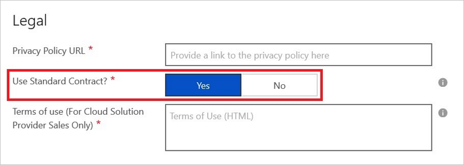
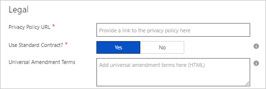
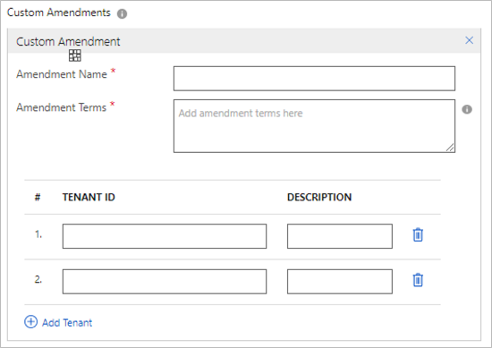
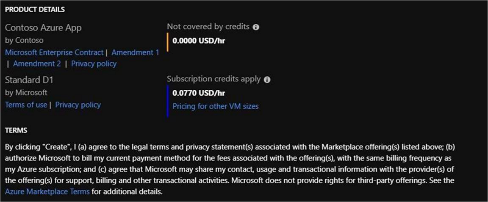

# Standard Contract

To simplify the procurement process for customers and reduce legal complexity for software vendors, Microsoft offers a Standard Contract template in order to help facilitate a transaction in the marketplace. Rather than crafting custom terms and conditions, Azure Marketplace publishers can choose to offer their software under the Standard Contract, which customers only need to vet and accept once. The Standard Contract can be found here: [https://go.microsoft.com/fwlink/?linkid=2041178](https://go.microsoft.com/fwlink/?linkid=2041178). 

The terms and conditions for an offering are defined on the Marketplace tab when creating an offer in the Cloud Partner Portal. The Standard Contract option is enabled by changing the setting to Yes.

>[!Note] 
>If you choose to use the Standard Contract, separate terms and conditions are still required for the [Cloud Solution Provider](./cloud-solution-providers.md) channel.

## Standard Contract Amendments

Standard Contract Amendments allow publishers to select the standard contract for simplicity, and with customized terms for their product or business.  Customers only need to review the amendments to the contract, if they have already reviewed and accepted the Microsoft Standard Contract.

There are two kinds of amendments available for Azure Marketplace publishers:

* Universal Amendments: These amendments are applied universally to the standard contract for all customers. Universal amendments are shown to every customer of the product in the purchase flow.

* Custom Amendments: Azure Marketplace also has a provision for custom amendments targeted to tenants. They are special amendments to the standard contract that are targeted to certain customers only. Publishers can choose the tenant they want to target. Customers from that tenant would purchase the product under Standard Contract and the targeted amendments.

>[!Note] 
>Customers targeted with custom amendments will also get the universal amendment to the standard terms during purchase.

>[!Note]
>The following offer types support Standard Contract Amendments: Azure Applications (Solution Templates and Managed Applications), Virtual Machines, Containers, Container Applications.

### Customer Experience

During the purchase process in the Azure portal, customers will be able to see the terms associated with the product as the Microsoft Standard Contract and the amendments.

### API

Customers may use `Get-AzureRmMarketplaceTerms` to retrieve the terms of an offer and accept it. The standard contract and associated amendments will be returned in the output of the cmdlet.

---
