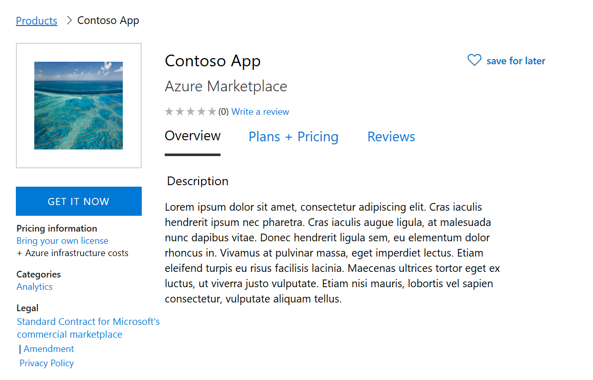
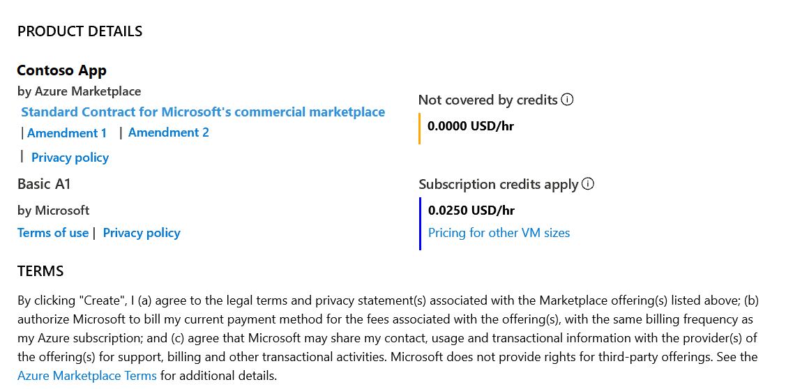

# Standard Contract for the Microsoft commercial marketplace

To simplify the procurement process for customers and reduce legal complexity for software vendors, Microsoft offers a Standard Contract for the Microsoft commercial marketplace in order to help facilitate transactions in the marketplace. Rather than crafting custom terms and conditions, commercial marketplace publishers can choose to offer their software under the Standard Contract, which customers only need to vet and accept once. The Standard Contract can be found here: [https://go.microsoft.com/fwlink/?linkid=2041178](https://go.microsoft.com/fwlink/?linkid=2041178).

The terms and conditions for an offer are defined when creating the offer in Partner Center. You can select to use the Standard Contract for the Microsoft commercial marketplace instead of providing your own custom terms and conditions.

>[!Note]
>Once you publish an offer using the Standard contract for the Microsoft commercial marketplace, you are not able to use your own custom terms and conditions. It is an "or" scenario. You either offer your solution under the Standard Contract *or* your own terms and conditions. If you would like to modify the terms of the Standard Contract you can do so through Standard Contract Amendments.

## Standard Contract Amendments

Standard Contract Amendments allow publishers to select the Standard Contract for simplicity, and with customized terms for their product or business. Customers only need to review the amendments to the contract, if they have already reviewed and accepted the Microsoft Standard Contract.

There are two kinds of amendments available for commercial marketplace publishers:

* Universal Amendments: These amendments are applied universally to the Standard Contract for all customers. Universal amendments are shown to every customer of the offer in the purchase flow. Customers must accept the terms of the Standard Contract and the amendment before they can use your offer.

* Custom Amendments: These amendments are special amendments to the Standard Contract that are targeted to specific customers only via Azure tenant IDs. Publishers can choose the tenant they want to target. Only customers from the tenant will be presented with the custom amendment terms in the offer's purchase flow.  Customers must accept the terms of the Standard Contract and the amendment(s) before they can use your offer.

>[!Note]
>These two types of amendments stack on top of each other. Customers targeted with custom amendments will also get the universal amendment to the Standard Contract during purchase.

You can leverage the Standard Contract for the Microsoft commercial marketplace for the following offer types:  Azure Applications (Solution Templates and Managed Applications), Virtual Machines, Containers, Container Applications, IoT Edge Modules, and SaaS.

## Customer experience

During the discovery experience in Azure marketplace or AppSource, customers will be able to see the terms associated with the offer as the Standard Contract for the Microsoft commercial marketplace and any universal amendments.

During the purchase process in the Azure portal, customers will be able to see the terms associated with the offer as the Standard Contract for the Microsoft commercial marketplace and any universal and/or tenant-specific amendments.

## API

Customers may use Get-AzureRmMarketplaceTerms to retrieve the terms of an offer and accept it. The Standard Contract and associated amendments will be returned in the output of the cmdlet.
