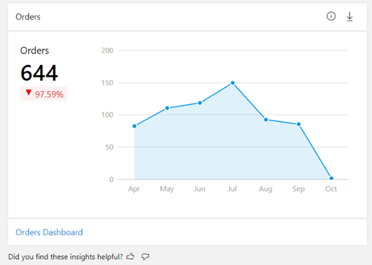
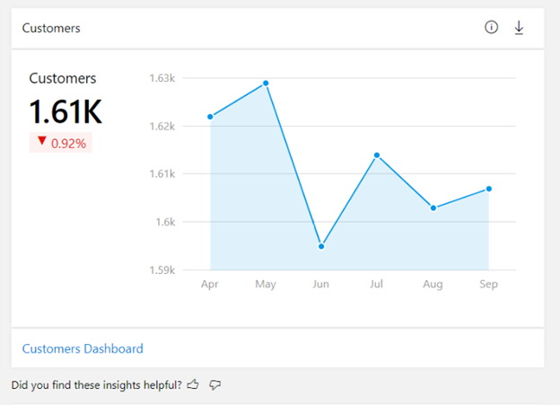
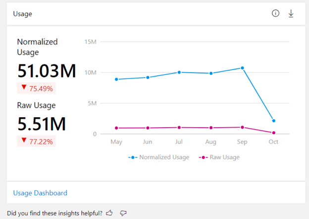
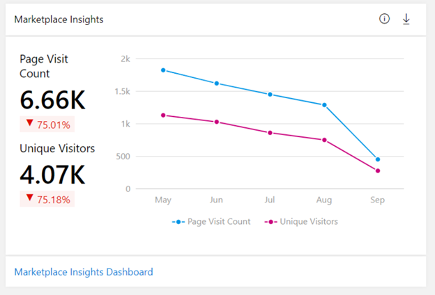

# Summary dashboard in commercial marketplace analytics

This article provides information on the Summary dashboard in Partner Center. This dashboard displays graphs, trends, and values of aggregate data that summarize marketplace activity for your offers.

To access the Summary dashboard in Partner Center, under **Commercial Marketplace** select **[Analyze](https://partner.microsoft.com/dashboard/commercial-marketplace/analytics/summary)** > **Summary**.

>[!NOTE]
> For detailed definitions of analytics terminology, see [Commercial marketplace analytics terminology and common questions](./analytics-faq.md).

## Summary dashboard

The Summary dashboard presents an overview of Azure Marketplace and Microsoft AppSource offers’ business performance. The dashboard provides a broad overview of the following:

- Customers' orders
- Customers
- Customers' usage of the offers
- Customers' page visits in Azure Marketplace and AppSource

## Elements of the Summary dashboard

The following sections describe how to use the summary dashboard and how to read the data.

### Month range

You can find a month range selection at the top-right corner of each page. Customize the output of the **Summary** page graphs by selecting a month range based on the past 3, 6, or 12 months, or by selecting a custom month range with a maximum duration of 12 months. The default month range (computation period) is six months.

:::image type="content" source="./media/summary-dashboard/summary-dashboard.png" alt-text="Illustrates the monthly range options on the summary dashboard.":::

> [!NOTE]
> All metrics in the visualization widgets and export reports honor the computation period selected by the user.

### Orders widget

The Orders widget on the Summary** dashboard displays the current orders for all your transact-based offers. The Orders widget displays a count and trend of all purchased orders (excluding canceled orders) for the selected computation period. The percentage value **Orders** represents the amount of growth during the selected computation period.

You can also go to the Orders report by selecting the **Orders Dashboard** link in the lower-left corner of the widget.

### Customers widget

The **Customers** widget of the **Summary** dashboard displays the total number of customers who have acquired your offers for the selected computation period. The Customers widget displays a count and trend of total number of active (including new and existing) customers (excluding churned customers) for the selected computation period. The percentage value under **Customers** represents the amount of growth during the selected computation period.

You can also go to the detailed Customers report by selecting the **Customers dashboard** link in the lower-left corner of the widget.

### Usage widget

The **Usage** widget of the **Summary** dashboard represents the total normalized and raw usage hours for all Azure Virtual Machine (VM) offers. The Usage widget displays a count and trend of total usage hours for the selected computation period.

The usage summary table displays the customer usage hours for all offers they have purchased.

- Normalized usage hours are defined as the usage hours normalized to account for the number of VM cores ([number of VM cores] x [hours of raw usage]). VMs designated as "SHAREDCORE" use 1/6 (or 0.1666) as the [number of VM cores] multiplier.
- Raw usage hours are defined as the amount of time VMs have been running in terms of hours.

The percentage value below the total usage hours represents the amount of growth in usage hours during the selected computation period.

You can also go to the Usage report by selecting the **Usage dashboard** link in the lower-left corner of the widget.

### Marketplace insights

Marketplace Insights show the number of users who have visited your offers’ pages in Azure Marketplace and AppSource. **Page visit count** shows a summary of commercial marketplace web analytics that enables publishers to measure customer engagement for their respective product detail pages listed on the commercial marketplace online stores: Microsoft AppSource and Azure Marketplace. This widget displays a count and trend of total page visits during the selected computation period.

You can also go to the Marketplace Insights report by selecting the **Marketplace insights dashboard** link in the lower-left corner of the widget.

### Geographical spread

For the selected computation period, the heatmap displays the total number of customers, orders, and normalized usage hours against geography dimension.

:::image type="content" source="./media/summary-dashboard/geo-spread.png" alt-text="Illustrates the Countries Spread widget on the summary dashboard.":::

Note the following:

- You can move the map to view the exact location.
- You can zoom into a specific location.
- The heatmap has a supplementary grid to view the details of customer count, order count, and normalized usage hours for the specific location.
- You can search and select a country/region in the grid to zoom to the location in the map. Revert to the original view by selecting the **Home** button in the map.

> [!TIP]
> You can use the download icon in the upper-right corner of any widget to download the data. You can provide feedback on each of the widgets by selecting the “thumbs up” or “thumbs down” icon.

## Next steps

- For an overview of analytics reports available in the commercial marketplace, see [Access analytic reports for the commercial marketplace in Partner Center](./partner-center-portal/analytics.md).
- For information about your orders in a graphical and downloadable format, see [Orders Dashboard in commercial marketplace analytics](orders-dashboard.md).
- For Virtual Machine (VM) offers usage and metered billing metrics, see [Usage Dashboard in commercial marketplace analytics](usage-dashboard.md).
- For detailed information about your customers, including growth trends, see [Customer Dashboard in commercial marketplace analytics](customer-dashboard.md).
- For a list of your download requests over the last 30 days, see [Downloads Dashboard in commercial marketplace analytics](./partner-center-portal/downloads-dashboard.md).
- To see a consolidated view of customer feedback for offers on Azure Marketplace and AppSource, see [Ratings & Reviews analytics dashboard in Partner Center](./partner-center-portal/ratings-reviews.md).
- For frequently asked questions about commercial marketplace analytics and for a comprehensive dictionary of data terms, see [Commercial marketplace analytics terminology and common questions](./analytics-faq.md).