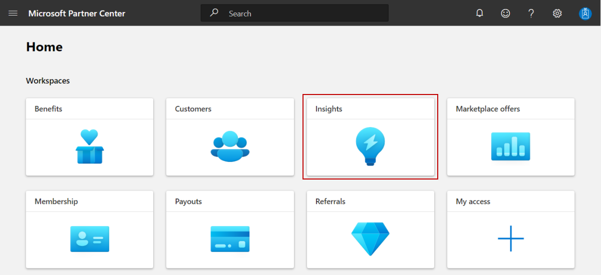
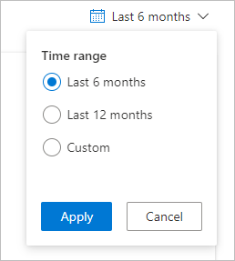
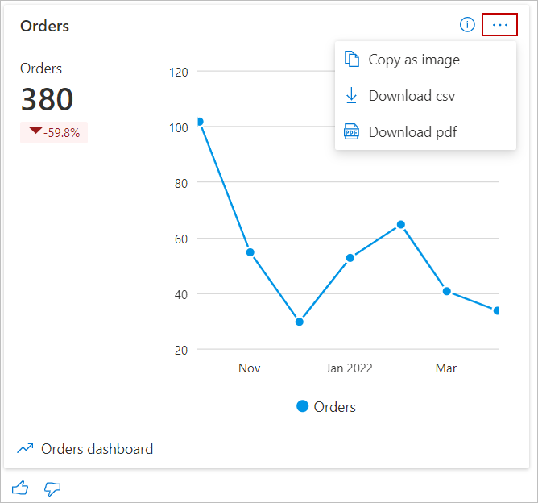
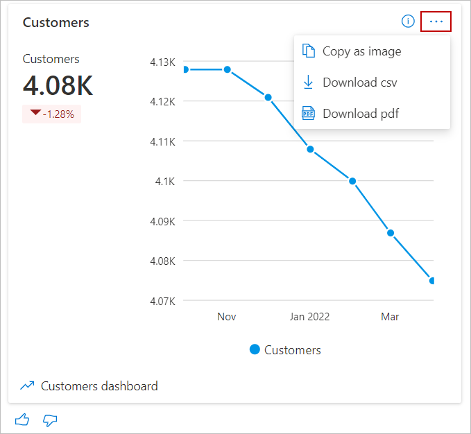

# Summary dashboard in commercial marketplace analytics

This article provides information on the Summary dashboard in Partner Center. This dashboard displays graphs, trends, and values of aggregate data that summarize marketplace activity for your offers.

>[!NOTE]
> For detailed definitions of analytics terminology, see [Commercial marketplace analytics terminology and common questions](./analytics-faq.yml).

## Summary dashboard

The [Summary dashboard](https://partner.microsoft.com/dashboard/insights/commercial-marketplace/analytics/summary) presents an overview of Azure Marketplace and Microsoft AppSource offers’ business performance. The dashboard provides a broad overview of the following:

- Customers' orders
- Customers
- Customers' usage of the offers
- Customers' page visits in Azure Marketplace and AppSource

## Access the Summary dashboard

1. Sign in to [Partner Center](https://partner.microsoft.com/dashboard/home).
1. On the Home page, select the **Insights** tile.

    

1. In the left menu, select **Summary**.

    :::image type="content" source="./media/summary-dashboard/summary-left-nav.png" alt-text="Screenshot of the link for the Summary dashboard in the left nav.":::

## Elements of the Summary dashboard

The following sections describe how to use the summary dashboard and how to read the data.

### Download

To download of the data for this dashboard, select **Download as PDF** from the **Download** list.

:::image type="content" source="./media/summary-dashboard/download-as-pdf.png" alt-text="Screenshot of the Download as PDF link in the Download list.":::

Alternatively, you can go to the [Downloads dashboard](https://partner.microsoft.com/dashboard/insights/commercial-marketplace/analytics/downloads) to download the report.

### Share

To share the dashboard widgets data via email, in the top menu, select **Share**.

:::image type="content" source="./media/summary-dashboard/share.png" alt-text="Screenshot of the Share button at the top of the Summary dashboard.":::

In the dialog box that appears, provide the recipient email address and message. To share the report URL, select the **Copy link** or **Share to teams** button. To take a snapshot of the charts data, select the **Copy as image** button.

### What's new

To learn about changes and enhancements that were made to the dashboard, select **What’s new**. The _What’s new_ side panel appears.

:::image type="content" source="./media/summary-dashboard/whats-new.png" alt-text="Screenshot of the What's new button at the top of the Summary dashboard.":::

### About data refresh

To view the data source and the data refresh details, such as the frequency of the data refresh, select the ellipsis (three dots) and then select **Data refresh details**.

:::image type="content" source="./media/summary-dashboard/data-refresh-details.png" alt-text="Screenshot of the Data refresh details link under the ellipsis.":::

### Got feedback?

To provide instant feedback about the report/dashboard, select the ellipsis (three dots), and then select the **Got feedback?** link.

:::image type="content" source="./media/summary-dashboard/feedback.png" alt-text="Screenshot of the Got feedback link.":::

Provide your feedback in the dialog box that appears.

> [!NOTE]
> A screenshot is automatically sent to us with your feedback.

### Month range

You can find a month range selection at the top-right corner of each page. Customize the output of the **Summary** page graphs by selecting a month range based on the past 6 or 12 months, or by selecting a custom month range with a maximum duration of 12 months. The default month range is six months.

### Orders widget

The Orders widget on the **Summary** dashboard displays the current orders for all your transact-based offers. The Orders widget displays a count and trend of all purchased orders (excluding canceled orders) for the selected computation period. The percentage value **Orders** represents the amount of growth during the selected computation period.

Select the ellipsis (three dots) to copy the widget image, download aggregated widget data as a .CSV file, and download the image as a .PDF.

You can also go to the Orders report by selecting the [Orders Dashboard](https://partner.microsoft.com/dashboard/insights/commercial-marketplace/analytics/order) link in the lower-left corner of the widget.

### Customers widget

The **Customers** widget of the **Summary** dashboard displays the total number of customers who have acquired your offers for the selected computation period. The Customers widget displays a count and trend of total number of active (including new and existing) customers (excluding churned customers) for the selected computation period. The percentage value under **Customers** represents the amount of growth during the selected computation period.

Select the ellipsis (three dots) to copy the widget image, download aggregated widget data as a .csv file, and download the image as a PDF.

You can also go to the detailed Customers report by selecting the [Customers retention dashboard](https://partner.microsoft.com/dashboard/insights/commercial-marketplace/analytics/customerretention) link in the lower-left corner of the widget.

### Usage widget

The **Usage** widget of the **Summary** dashboard represents the total normalized and raw usage hours for all Azure Virtual Machine (VM) offers. The Usage widget displays a count and trend of total usage hours for the selected computation period.

The usage summary table displays the customer usage hours for all offers they have purchased.

- Normalized usage hours are defined as the usage hours normalized to account for the number of VM cores ([number of VM cores] x [hours of raw usage]). VMs designated as "SHAREDCORE" use 1/6 (or 0.1666) as the [number of VM cores] multiplier.
- Raw usage hours are defined as the amount of time VMs have been running in terms of hours.

The percentage value below the total usage hours represents the amount of growth in usage hours during the selected computation period.

Select the ellipsis (three dots) to copy the widget image, download aggregated widget data as a .CSV file, and download the image as a .PDF.

You can also go to the Usage report by selecting the [Usage dashboard](https://partner.microsoft.com/dashboard/insights/commercial-marketplace/analytics/usage) link in the lower-left corner of the widget.

### Marketplace insights

Marketplace Insights show the number of users who have visited your offers’ pages in Azure Marketplace and AppSource. **Page visit count** shows a summary of commercial marketplace web analytics that enables publishers to measure customer engagement for their respective product detail pages listed on the commercial marketplace online stores: Microsoft AppSource and Azure Marketplace. This widget displays a count and trend of total page visits during the selected computation period.

Select the ellipsis (three dots) to copy the widget image, download aggregated widget data as a .CSV file, and download the image as a .PDF.

You can also go to the Marketplace Insights report by selecting the [Marketplace insights dashboard](https://partner.microsoft.com/dashboard/insights/commercial-marketplace/analytics/marketplaceinsights) link in the lower-left corner of the widget.

### Geographical spread

For the selected computation period, the geographical spread heatmap displays the total number of customers, orders, and normalized usage hours against geography dimension.

Select the ellipsis (three dots) to copy the widget image, download aggregated widget data as a .CSV file, and download the image as a .PDF.

:::image type="content" source="./media/summary-dashboard/geo-spread-ellipsis.png" alt-text="Illustrates the Countries Spread widget on the summary dashboard.":::

Note the following:

- You can move the map to view the exact location.
- You can zoom into a specific location.
- The heatmap has a supplementary grid to view the details of customer count, order count, and normalized usage hours for the specific location.
- You can search and select a country/region in the grid to zoom to the location in the map. Revert to the original view by selecting the **Home** button in the map.

## Next steps

- For an overview of analytics reports available in the commercial marketplace, see [Access analytic reports for the commercial marketplace in Partner Center](analytics.md).
- For frequently asked questions about commercial marketplace analytics and for a comprehensive dictionary of data terms, see [Commercial marketplace analytics terminology and common questions](./analytics-faq.yml).
