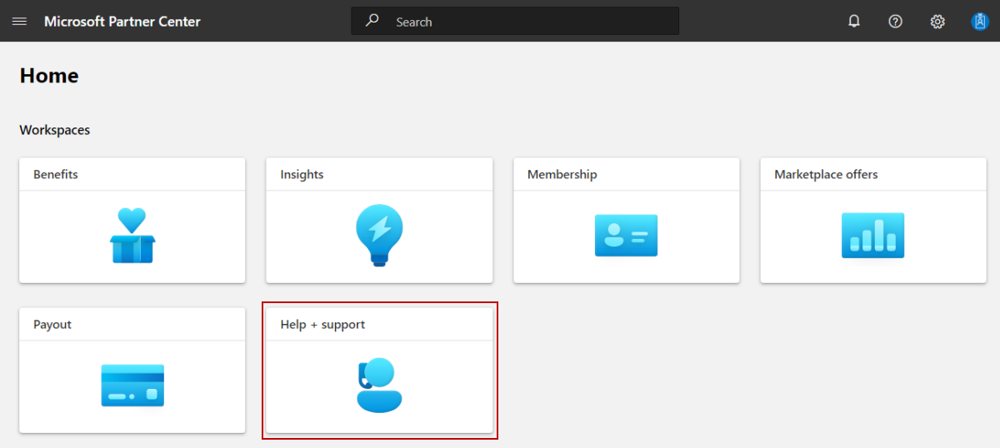

# Support for the commercial marketplace program in Partner Center

Microsoft provides support for a wide variety of products and services. Finding the right support team is important to ensure an appropriate and timely response. Consider the following scenarios, which should help you route your query to the appropriate team:

- If you're a publisher and have a question from a customer, ask your customer to request support using the support links in the [Azure portal](https://portal.azure.com/).
- If you’re a publisher and have detected a security issue with an application running on Azure, see [How to log a security event support ticket](../security/fundamentals/event-support-ticket.md). Publishers must report suspected security events, including security incidents and vulnerabilities of their Azure Marketplace software and service offerings, at the earliest opportunity.
- If you're a publisher and have a question relating to your app or service, review the following support options.

## Get help or open a support ticket

1. Sign in to [Partner Center](https://partner.microsoft.com/dashboard/home) with your work account. If you have not yet done so, you will need to [create a Partner Center account](create-account.md).

1. On the Home page, select the **Help + support** tile.

     

1. Under **My support requests**, select **+ New request**.

1. In the **Problem summary** box, enter a brief description of the issue.

1. In the **Problem type** box, do one of the following:

    - **Option 1**: Enter keywords such as: Marketplace, Azure app, SaaS offer, account management, lead management, deployment issue, payout, or co-sell offer migration. Then select a problem type from the recommended list that appears.

    - **Option 2**: Select **Browse topics** from the **Category** list and then select **Commercial Marketplace**. Then select the appropriate **Topic** and **Subtopic**.

1. After you have found the topic of your choice, select **Review Solutions**.

    

The following options are shown:

- To select a different topic, click **Select a different issue**.
- To help solve the issue, review the recommended steps and documents, if available.

    

If you cannot find your answer in the self help, select **Provide issue details**. Complete all required fields to speed up the resolution process, then select **Submit**.

>[!Note]
>If you have not signed in to Partner Center, you may be required to sign in before you can create a ticket.

## Track your existing support requests

1. To review your open and closed tickets, sign in to [Partner Center](https://partner.microsoft.com/dashboard/home) with your work account.

1. On the Home page, select the **Help + support** tile.

    

## Record issue details with a HAR file

To help support agents troubleshoot your issue, consider attaching an HTTP Archive format (HAR) file to your support ticket. HAR files are logs of network requests in a web browser.

> [!WARNING]
> HAR files may record sensitive data about your Partner Center account.

### Microsoft Edge and Google Chrome

To generate a HAR file using **Microsoft Edge** or **Google Chrome**:

1. Go to the web page where you’re experiencing the issue.
1. In the top right corner of the window, select the ellipsis icon, then **More tools** > **Developer tools**. You can press F12 as a shortcut.
1. In the Developer tools pane, select the **Network** tab.
1. Select **Stop recording network log** and **Clear** to remove existing logs. The record icon will turn grey.

    

1. Select **Record network log** to start recording. When you start recording, the record icon will turn red.

    

1. Reproduce the issue you want to troubleshoot.
1. After you’ve reproduced the issue, select **Stop recording network log**.
1. Select **Export HAR**, marked with a downward-arrow icon, and save the file.

    

### Mozilla Firefox

To generate a HAR file using **Mozilla Firefox**:

1. Go to the web page where you’re experiencing the issue.
1. In the top right corner of the window, select the ellipsis icon, then **Web Developer** > **Toggle Tools**. You can press F12 as a shortcut.
1. Select the **Network** tab, then select **Clear** to remove existing logs.

    

1. Reproduce the issue you want to troubleshoot.
1. After you’ve reproduced the issue, select **HAR Export/Import** > **Save All As HAR**.

    

### Apple Safari

To generate a HAR file using **Safari**:

1. Enable the developer tools in Safari: select **Safari** > **Preferences**. Go to the **Advanced** tab, then select **Show Develop menu in menu bar**.
1. Go to the web page where you’re experiencing the issue.
1. Select **Develop**, then select **Show Web Inspector**.
1. Select the **Network** tab, then select **Clear Network Items** to remove existing logs.

    

1. Reproduce the issue you want to troubleshoot.
1. After you’ve reproduced the issue, select **Export** and save the file.

    

## Additional resources

Do you have questions about getting started as a Microsoft commercial marketplace publisher? Here's a list of support options for the commercial marketplace. In addition to the following resources, you can also get many of your questions answered in the [Marketplace channel of C+AI Community Forum](https://www.microsoftpartnercommunity.com/t5/Marketplace/bd-p/2222).  

### Onboarding

Open a ticket with Microsoft [marketplace publisher support](https://go.microsoft.com/fwlink/?linkid=2165533) for issues with onboarding and getting started.

### Partner Center

| Support channel | Description | Availability |  
|:--- |:--- |:--- |  
| For assistance, visit the Create an incident page located at [Marketplace Support](https://go.microsoft.com/fwlink/?linkid=2165533)</li> </ul> | Support for Partner Center. | Support is provided 24x5. |
|

### Technical  

| Support channel | Description |  
|:--- |:--- |  
| MSDN forums: Marketplace located at [Microsoft Q&A question page](/answers/products/azure) | Microsoft Developer Network forum. |  
| Stack Overflow: Azure located at [stackoverflow.com/questions/tagged/azure](https://stackoverflow.com/questions/tagged/azure) | Stack Overflow environment to get solutions and ask questions about everything related to Azure Marketplace.<ul> <li>Stack Overflow: Azure Marketplace located at [stackoverflow.com/questions/tagged/azure-marketplace](https://stackoverflow.com/questions/tagged/azure-marketplace)</li> <li>Stack Overflow: Azure Resource Manager located at [stackoverflow.com/questions/tagged/azure-resource-manager](https://stackoverflow.com/questions/tagged/azure-resource-manager)</li> <li>Stack Overflow: Virtual Machines on Azure located at [stackoverflow.com/questions/tagged/azure-virtual-machine](https://stackoverflow.com/questions/tagged/azure-virtual-machine)</li> <li>Stack Overflow: Containers on Azure located at [stackoverflow.com/search?q=azure+container](https://stackoverflow.com/search?q=azure+container)</li> </ul> |

### Marketing resources  

| Support channel | Description | Availability |  
|:--- |:--- |:--- |
| Email: [cebrand@microsoft.com](mailto:cebrand@microsoft.com) | Answers to questions about usage for Azure logos and branding. |  |
|

For questions about Marketplace Rewards, contact [Partner Center support](https://partner.microsoft.com/support/v2/?stage=1).

## Next steps

- [Update an existing offer in the Commercial Marketplace](update-existing-offer.md)
