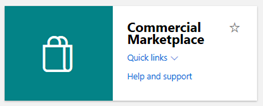
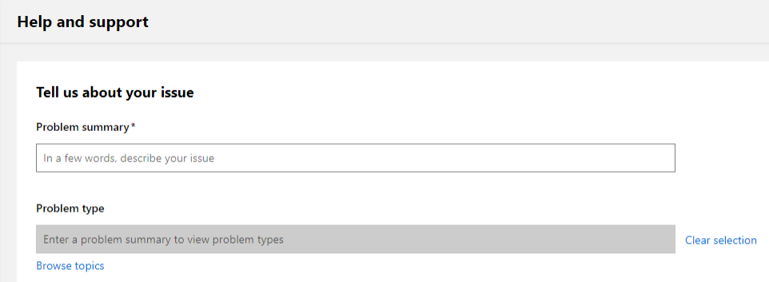

# Support for the commercial marketplace program in Partner Center

Microsoft provides support for a wide variety of products and services. Finding the right support team is important to ensure an appropriate and timely response. Consider the following scenarios, which should help you route your query to the appropriate team:

- If you're a publisher and have a question from a customer, ask your customer to request support using the support links in the [Azure portal](https://portal.azure.com/).
- If you're a publisher and have a question relating to your app or service, review the following support options.

## Support options for publishers

1. Sign in to the [commercial marketplace program on Partner Center](https://partner.microsoft.com/dashboard/commercial-marketplace/overview) with your work account (if you have not yet done so, you will need to [create a Partner Center account](partner-center-portal/create-account.md).

2. In the upper menu on the right side of the page, select the **Support** icon.

3. The **Help and support** pane will appear from the right-hand side of the page.

   

    Or go to the **Home page** pane and select **Help and support**.

   

4. Select **[Documentation](../index.yml)** to review comprehensive answers to questions and resources.

5. Select **[Marketplace Partner community forum](https://www.microsoftpartnercommunity.com/t5/Azure-Marketplace-and-AppSource/bd-p/2222)** to answer your questions by leveraging the knowledge of other Microsoft publishers.

6. Select **[Additional help](https://aka.ms/marketplacepublishersupport)** to open a **New support request** ticket.  

## How to open a support ticket

Now you're ready to open a support ticket on the **Help and Support** screen.

>[!Note]
>If you are logged in Partner Center, you will receive better experience with support.

**Option 1:** Enter keywords such as: Marketplace, Azure app, SaaS offer, account management, lead management, deployment issue, payout, etc.

**Option 2:** Browse topics -> select **Category** = commercial marketplace -> select the appropriate **Topic** then **Subtopic**.

Once you have found the topic of your choice, select **Review Solutions**.

The following options will become available:

- To select a different topic, select a different topic link under **selected issue**.
- Review the description for this issue, if available.  It is the text shown above the **recommended steps**.
- Review **recommended steps**, if available.
- Review **recommended documents**, if available.

If you cannot find your answer in **recommended solutions**, select **provide issue details**. Complete all required fields to speed up the resolution process, then select **submit**.

>[!Note]
>If you have not logged in Partner Center and the topic requires authentication, you will be requested to log in before you can proceed.  For public topics, authentication is not required.

## Track your existing support requests

To review all of your open and closed tickets, go to **Commercial Marketplace** on the left navigation bar, and then select **support**.

## Record issue details with a HAR file

To help support agents troubleshoot your issue, consider attaching an HTTP Archive format (HAR) file to your support ticket. HAR files are logs of network requests in a web browser.

> [!WARNING]
> HAR files may record sensitive data about your Partner Center account.

### Microsoft Edge and Google Chrome

To generate a HAR file using **Microsoft Edge** or **Google Chrome**:

1. Go to the web page where you’re experiencing the issue.
2. In the top right corner of the window, select the ellipsis icon, then **More tools** > **Developer tools**. You can press F12 as a shortcut.
3. In the Developer tools pane, select the **Network** tab.
4. Select **Stop recording network log** and **Clear** to remove existing logs. The record icon will turn grey.

    

5. Select **Record network log** to start recording. When you start recording, the record icon will turn red.

    

6. Reproduce the issue you want to troubleshoot.
7. After you’ve reproduced the issue, select **Stop recording network log**.
8. Select **Export HAR**, marked with a downward-arrow icon, and save the file.

    

### Mozilla Firefox

To generate a HAR file using **Mozilla Firefox**:

1. Go to the web page where you’re experiencing the issue.
1. In the top right corner of the window, select the ellipsis icon, then **Web Developer** > **Toggle Tools**. You can press F12 as a shortcut.
1. Select the **Network** tab, then select **Clear** to remove existing logs.

    

1. Reproduce the issue you want to troubleshoot.
1. After you’ve reproduced the issue, select **HAR Export/Import** > **Save All As HAR**.

    

### Apple Safari

To generate a HAR file using **Safari**:

1. Enable the developer tools in Safari: select **Safari** > **Preferences**. Go to the **Advanced** tab, then select **Show Develop menu in menu bar**.
1. Go to the web page where you’re experiencing the issue.
1. Select **Develop**, then select **Show Web Inspector**.
1. Select the **Network** tab, then select **Clear Network Items** to remove existing logs.

    

1. Reproduce the issue you want to troubleshoot.
1. After you’ve reproduced the issue, select **Export** and save the file.

    

## Next steps

- [Update an existing offer in the Commercial Marketplace](partner-center-portal/update-existing-offer.md)
