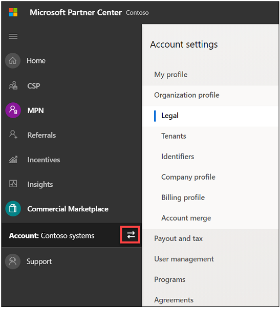
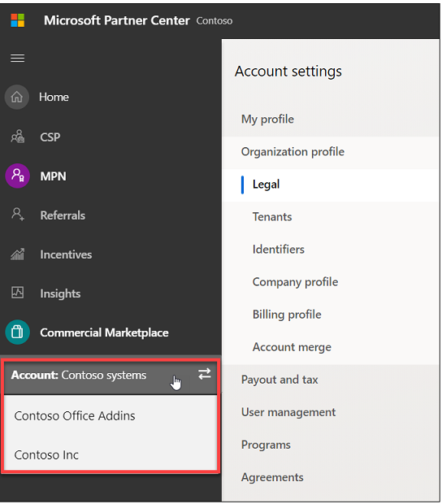

# Switch accounts in Partner Center

**Appropriate roles**

- Owner
- Manager

You can be part of more than one account. You can check to see if you are part of multiple accounts by the presence of the *account picker* in the left navigation menu, as seen highlighted in the following screenshot.

If you don't see the *account picker*, you are part of one account only. You can find the details of this account from on the **Account settings** > **Organization profile** > **Legal** > **Developer** tab in Partner Center.

When you select this picker, all the accounts that you are a part of appear as a list. You can then select any of them to switch to that account. After you switch, everything in Partner Center appears in the context of that account.

> [!NOTE]
> Partner Center uses [Azure Active Directory](../active-directory/fundamentals/active-directory-whatis.md) (Azure AD) for multi-user account access and management. Your organization's Azure AD is automatically associated with your Partner Center account as part of the enrollment process.

In the following example, the signed-in user is part of the three highlighted accounts. The user can switch between them by clicking on an account.

