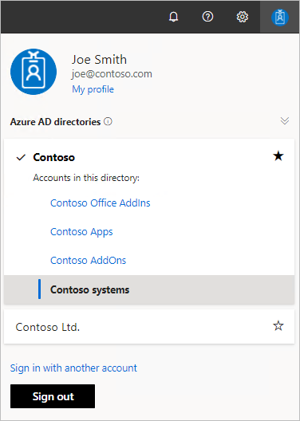
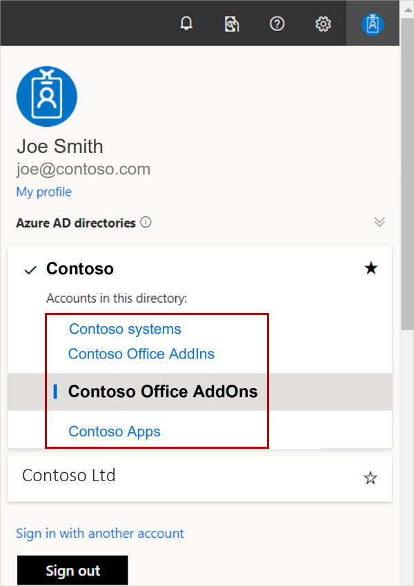

# Switch accounts in Partner Center

**Appropriate roles**

- Owner
- Manager

You can be part of more than one account. This article describes how to see if you are part of multiple accounts and how to switch between them.

## View and switch accounts

You can check to see if you are part of multiple accounts by the presence of the _account picker_. In the upper-right, select the account icon as seen highlighted in the following screenshot.

If you don't see the *account picker*, you are part of one account only. You can find the details of this account on the **Account settings** > **Organization profile** > **Legal info** page.

**To view the Legal info page in Partner Center**

1. In the upper-right, select **Settings** (gear icon) > **Account settings**.
1. In the left-menu, under **Organization profile**, select **Legal info**. Then select the **Developer** tab.

You can then select any of the accounts on the list to switch to that account. After you switch, everything in Partner Center appears in the context of that account.

> [!NOTE]
> Partner Center uses [Azure Active Directory](../active-directory/fundamentals/active-directory-whatis.md) (Azure AD) for multi-user account access and management. Your organization's Azure AD is automatically associated with your Partner Center account as part of the enrollment process.

In the following example, the signed-in user is part of the four highlighted accounts. The user can switch between them by selecting an account.

## Manage offers across company accounts

In the marketplace offers workspace, you no longer have to switch accounts to see the offers created under a specific account. The workspace lets you manage offers across all the accounts you have access to in a single view. You can associate new offers with specific publishers who are eligible to publish in either the commercial marketplace or Office Store programs.

> [!IMPORTANT]
> The account picker may still be required in some scenarios within the _Marketplace offers_ workspace. Publishers enrolled in a single program, either the commercial marketplace or Office Store, must switch accounts to access offers in a different program. Companies with more than 75 unique publishers can’t manage offers across company accounts.

## Next steps

- [Add and manage users for the commercial marketplace](add-manage-users.md)
