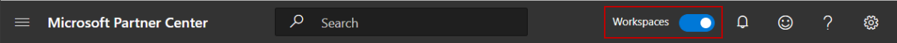
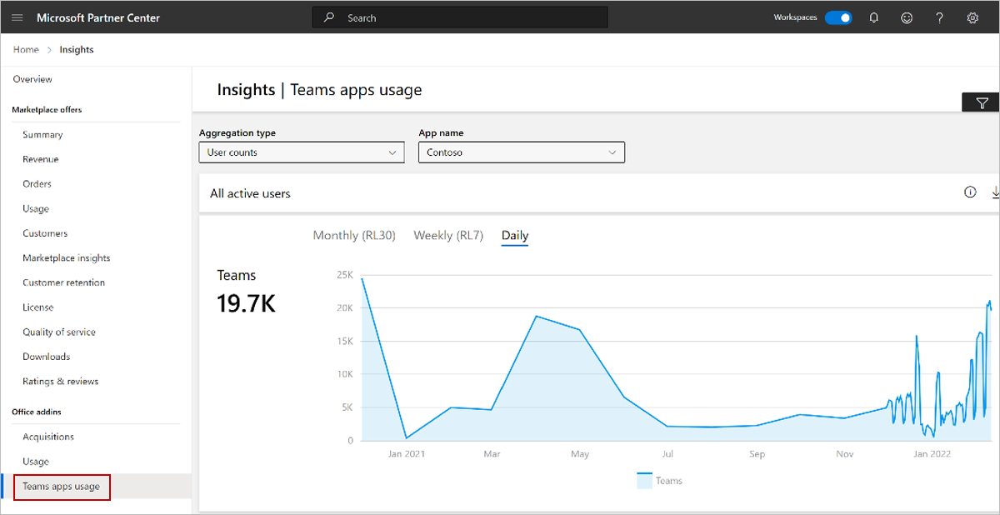
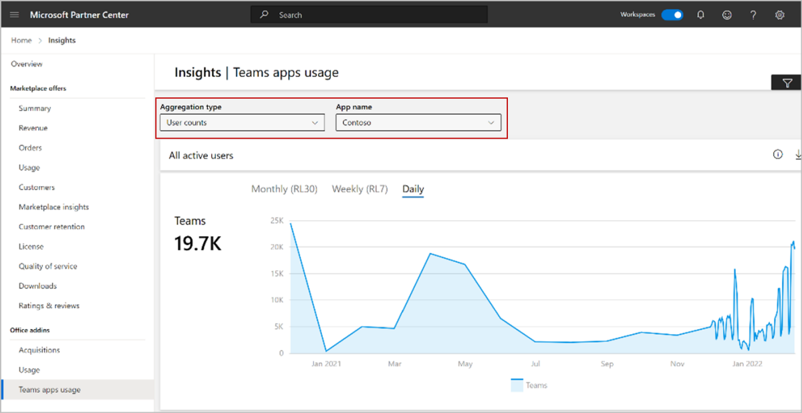
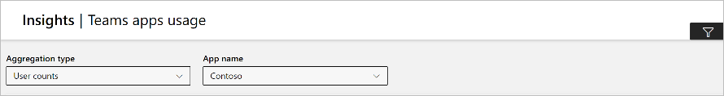
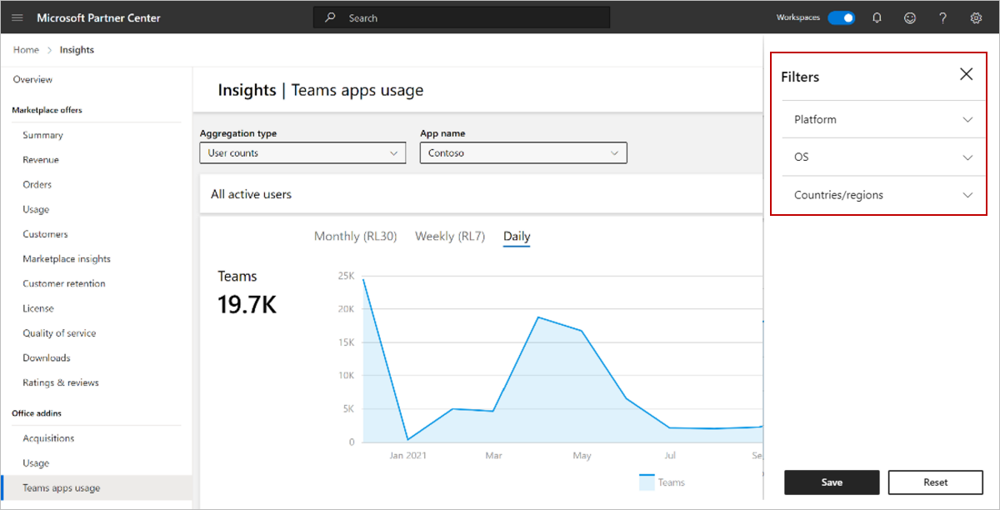
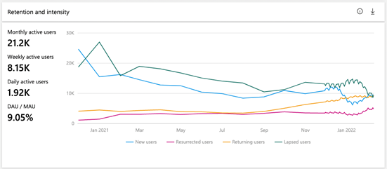
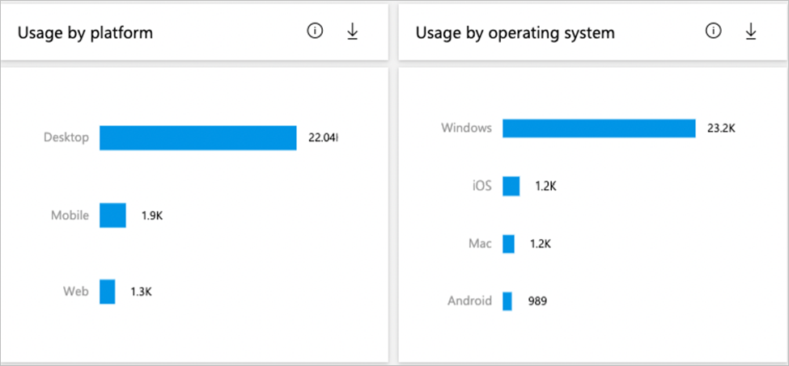
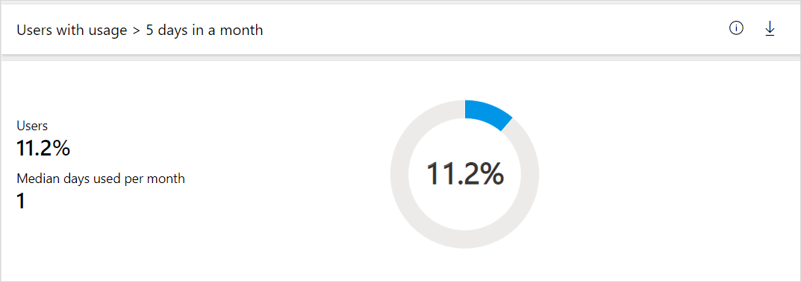

# Teams apps usage report in Partner Center

The _Teams apps usage_ report shows rich and actionable usage insights for each published Teams store app. You can use this report to understand who is using your app and how they’re using it to be able to answer questions such as:

- How many monthly, weekly, and daily active users does my app have?
- Are these new users, returning users, resurrected users, or lapsed users?
- Are these users using my app more than 5 days in a given month?
- What is the active user breakdown by platform/operating system?

Data for a newly published app can take about 5 days to appear in the report. The data for a given day will appear within 48 hours. For example, data for January 10th should appear in the report around January 12th.

## Accessing the Teams apps usage report

1. Sign in to [Partner Center](https://partner.microsoft.com/dashboard/home).
1. If you see the **Workspaces** toggle in the top menu bar, make sure the toggle is set to on.

    

1. Select the **Insights** tile.

    

1. In the left-nav, under **Office addins**, select **Teams apps usage**.

    

## Filter the report

You can filter the report by aggregation type, app name, and by other dimensions.

### Filter by aggregation type and app

At the top of the report, you’ll see two filters:

- **Aggregation type** – Each of the insights in the report have been aggregated by user counts and tenant counts (count of unique customers using your app). You can choose which aggregation type you want to explore for each of the subsequent metrics.
- **App name** – Provides a list of Teams store apps that you have published. The insights in this report are specific to the app you select.

### Filter by other Dimensions

In addition to filtering by **Aggregation type** and **App name**, you can further filter all subsequent insights by the key dimensions you choose: **Platform**, **OS**, **Countries/regions**.

1. In the upper-right of the page, select the filter icon.

    

1. Select the filters you want from the **Platform**, **OS**, and **Countries/regions** lists, and then select **Save**.

    

> [!NOTE]
> To restore the default settings, select **Reset**.

You can use any combination of Aggregation type, App name, and other key dimensions to filter the data in the report.

## Elements of the Teams app usage report

Once you’ve filtered the page the way you want, the data is displayed on the page in a number of widgets.

### All active users widget

The **All active users** widget enumerates the number of active users/tenants that have opened/used this app across different time-periods. You can zoom into a specific date range by holding down the left mouse button and dragging your cursor over a selected time-period. To zoom out again, select the minus sign.

This table defines the different time-periods you can choose.

| Time-Period | Definition |
| ------------ | ------------- |
| Monthly (R30) | The count of distinct users or tenants who have opened your app in a given RL30 (Rolling 30 day) period. |
| Weekly (R7) | The count of distinct users or tenants who have opened your app in a given RL7 (Rolling 7 day) period. |
| Daily | The count of distinct users or tenants who have opened your app in a given RL1 (Rolling 1 day) period. |
|||

### Retention and Intensity widget

The **Retention and intensity** chart includes a combination of active usage, user churn, and usage intensity metrics.

You can zoom into a specific date range by holding down the left mouse button and dragging your cursor over a selected time-period. To zoom out again, select the minus sign.

You can choose which metrics you want to view in the chart by unselecting metric(s) in the legend.

This table defines the metrics in this widget.

| Metric | Definition |
| ------------ | ------------- |
| Monthly active users | The count of distinct users or tenants who opened your app in a given RL30 (Rolling 30 day) period. |
| Weekly active users | The count of distinct users or tenants who opened your app in a given RL7 (Rolling 7 day) period. |
| Daily active users | The count of distinct users or tenants who opened your app in a given RL1 (Rolling 1 day) period. |
| DAU/MAU | The average number of unique users or tenants who used your app each day divided by the _Monthly active users_ for the selected RL30 time-period. This is also known as the _stickiness ratio_. |
| New users | Active users or tenants who are new during this RL30 time-period and have not used this app before. |
| Resurrected users | Active users or tenants who have used your app before, but not in the immediately preceding RL30 time-period. |
| Returning users | Active users or tenants who used your app during a given RL30 time-period and the immediately preceding RL30 time-period. |
| Lapsed users | Active users or tenants who were not seen during a given RL30 time-period but were seen during the immediately preceding R30 time-period. |
|||

### Usage by platform and Usage by operating system widgets

The **Usage by platform** and **Usage by operating system** widgets focus on grouping active users/tenants by endpoint for the current RL30 (Rolling 30 day) time-period.

Please note that the same user/tenant can use an app on multiple endpoints.

Available Operating System endpoints:
- Windows
- Mac
- iOS
- Android

Available Platform endpoints:
- Desktop
- Mobile
- Web

### Users with Usage > 5 Days in a month widget

The **Users with usage > 5 days in a month** widget includes two intensity metrics. Note that the metrics in this widget are only available for the **User counts** aggregation type.

This table defines the metrics in this widget.

| Metric | Definition |
| ------------ | ------------- |
| Users | The percentage of active users who have opened/used the app more than 5 days in the current RL30 (Rolling 30 day) period. |
| Median days used per month | The median numbers of days in which your app was opened in the current RL30 (Rolling 30 day) period. |
|||

### Geographical Spread widget

For the selected computation period, this widget groups users/tenants by countries/regions. Each user/tenant is mapped to a single area or geography.

## Next steps

To learn how to publish a Teams store app, see [Publish your app to the Microsoft Teams store](/microsoftteams/platform/concepts/deploy-and-publish/appsource/publish).
