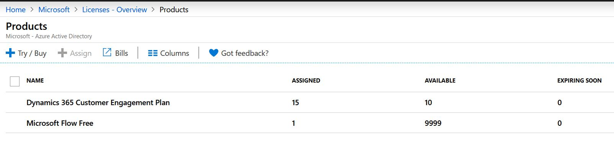
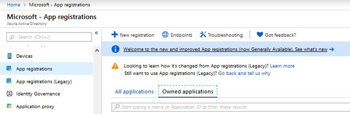
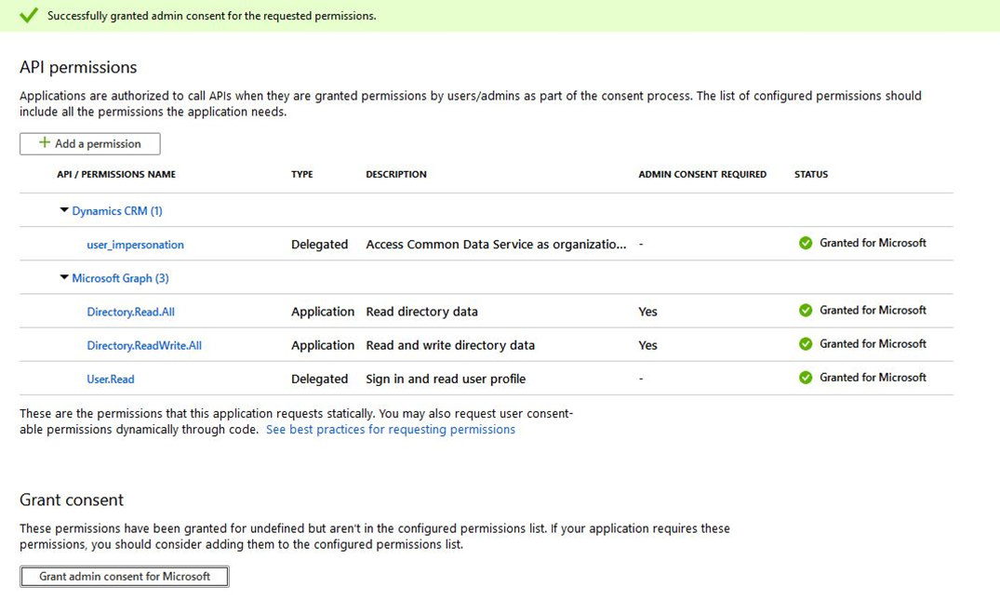
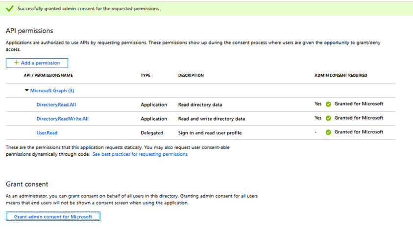
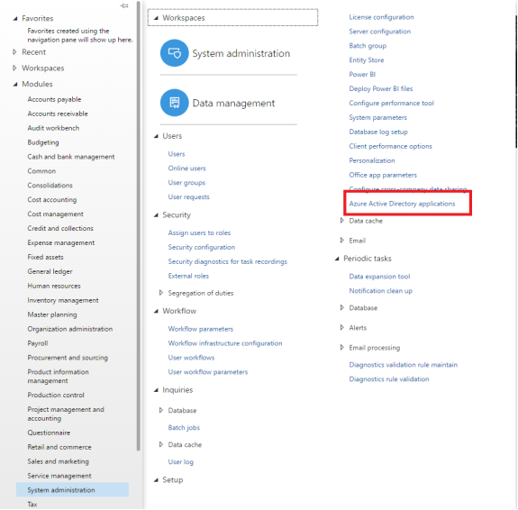

# Set up an Azure Marketplace subscription for hosted test drives

This article explains how to set up an Azure Marketplace subscription and **Dynamics 365 for Customer Engagement** or **Dynamics 365 for Operations** environment for test drives.

## Set up for Dynamics 365 for Customer Engagement

1. Sign into the [Azure portal](https://portal.azure.com/) with an Admin account.
2. Verify you are in the tenant associated with your Dynamics 365 test drive instance by hovering over your account icon in the upper right corner. If you are not in the correct tenant, select the account icon to switch into the correct tenant.

    :::image type="content" source="./media/test-drive/select-correct-tenant.png" alt-text="Selecting the correct tenant.":::

3. Verify that the **Dynamics 365 Customer Engagement Plan** license is available.

    

4. Create an Azure Active Directory (AD) app in Azure. AppSource will use this app to provision and deprovision the test drive user in your tenant.
    1. From the filter pane, select **Azure Active Directory**.
    2. Select **App registrations**.

        

    3. Select **New registration**.
    4. Provide an appropriate application name.

        :::image type="content" source="./media/test-drive/register-an-application.png" alt-text="Registering an application.":::

    5. Under Supported account types, select **Account in any organization directory and personal Microsoft accounts**.
    6. Select **Create** and wait for your app to be created.
    7. Once the app is created, note the **Application ID** displayed on the overview screen. You will need this value later when configuring your test drive.
    8. To add a nativeclient redirect URI, select the **Authentication** blade. Under **Platform configuration**, select **Add Platform** > **Mobile** > **Desktop** application tile. Choose the **nativeclient** redirect URI and select **Configure**.

        :::image type="content" source="./media/test-drive/configure-desktop-devices.png" alt-text="Adding a nativeclient redirect URI.":::

    9. Under **Manage Application**, select **API permissions**.
    10. Select **Add a permission** and then **Microsoft Graph API**.
    11. Select the **Application** permission category and then the **Directory.Read.All** and **Directory.ReadWrite.All** permissions.

        :::image type="content" source="./media/test-drive/microsoft-graph.png" alt-text="Setting the application permissions.":::

    12. To add **Dynamics CRM - User impersonation** access for allow list Azure AD app, select **Add permission** again.

        :::image type="content" source="./media/test-drive/request-api-permissions.png" alt-text="Requesting the application permissions.":::

    13. Once the permission is added, select **Grant admin consent for Microsoft**.
    14. From the message alert, select **Yes**.

        

    15. To generate a secret for the Azure AD App:
        1. From **Manage Application**, select **Certificate and secrets**.
        2. Under Client secrets, select **New client secret**.
        3. Enter a description, such as *Test Drive*, and select an appropriate duration. The test drive will break once this Key expires, at which point you will need to generate and provide AppSource a new key.
        4. Select **Add** to generate the Azure app secret. Copy this value as it will be hidden as soon as you lave this blade. You will need this value later when configuring your test drive.

            :::image type="content" source="./media/test-drive/add-client-secret.png" alt-text="Adding a client secret.":::

5. Sometimes it takes longer than expected to sync a user from Azure AD to a CRM instance. To aid with this, we added a process to force sync user, but it requires the Azure AD application to be whitelisted by Partner Center. To do this, see [User sync to Customer Engagement instance](https://github.com/microsoft/AppSource/blob/master/Microsoft%20Hosted%20Test%20Drive/CDS_Utility_to_ForceUserSync_in_CRM_Instance.md).
6. Add the Service Principal role to the application to allow the Azure AD app to remove users from your Azure tenant.
    1. Open an Administrative-level PowerShell command prompt.
    2. Install-Module MSOnline (run this command if MSOnline is not installed).
    3. Connect-MsolService (this will display a popup window; sign in with the newly created org tenant).
    4. $applicationId = **<YOUR_APPLICATION_ID>**.
    5. $sp = Get-MsolServicePrincipal -AppPrincipalId $applicationId.
    6. Add-MsolRoleMember -RoleObjectId fe930be7-5e62-47db-91af-98c3a49a38b1 -RoleMemberObjectId $sp.ObjectId -RoleMemberType servicePrincipal.

        :::image type="content" source="./media/test-drive/sign-in-to-account.png" alt-text="Signing in to your account.":::

7. Add the above created Azure app as an application user to your test drive CRM instance.
    1. Add a new user in **Azure Active Directory**. Only **Name** and **Username** values (belonging to the same tenant) are required to create this user, leave the other fields as default. Copy the username value.
    2. Sign into **CRM instance** and select **Setting** > **Security** > **Users**.
    3. Change the view to **Application Users**.

        :::image type="content" source="./media/test-drive/application-users.png" alt-text="Setting account information for a user.":::

    4. Add a new user (ensure the form is for APPLICATION USER).
    5. Enter the same username in the **Primary Email** and **User Name** fields. Add the **Azure ApplicationId** in **Application ID**.
    6. Give any **Full name**.
    7. Select **Save**.
    8. Select **Manage roles**.
    9. Assign a custom or OOB security role that contains read, write, and assign role privileges, such as *System Administrator*.

        :::image type="content" source="./media/test-drive/security-roles-selection.png" alt-text="Selecting the role privileges.":::

    10. Assign the application user the custom security role you created for your test drive.

## Set up for Dynamics 365 for Operations

1. Sign into the [Azure portal](https://portal.azure.com/) with an Admin account.
2. Verify you are in the tenant associated with your Dynamics 365 test drive instance by hovering over your account icon in the upper right corner. If you are not in the correct tenant, select the account icon to switch into the correct tenant.

    :::image type="content" source="./media/test-drive/select-correct-tenant.png" alt-text="Selecting the correct tenant.":::

3. Create an Azure AD App in Azure. AppSource will use this app to provision and deprovision the test drive user in your tenant.
    1. From the filter pane, select **Azure Active Directory**.
    2. Select **App registrations**.

        :::image type="content" source="./media/test-drive/app-registrations.png" alt-text="Selecting an app registration.":::

    3. Select **New registration**.
    4. Provide an appropriate application name.

        :::image type="content" source="./media/test-drive/register-an-application.png" alt-text="Registering an application.":::

    5. Under Supported account types, select **Account in any organization directory and personal Microsoft accounts**.
    6. Select **Create** and wait for your app to be created.
    7. Once the app is created, note the **Application ID** displayed on the overview screen. You will need this value later when configuring your test drive.
    8. Under **Manage Application**, select **API permissions**.
    9. Select **Add a permission** and then **Microsoft Graph API**.
    10. Select the **Application** permission category and then the **Directory.Read.All** and **Directory.ReadWrite.All** permissions.

        :::image type="content" source="./media/test-drive/microsoft-graph.png" alt-text="Setting application permissions.":::

    11. Select **Add permission**.
    12. Once the permission is added, select **Grant admin consent for Microsoft**.
    13. From the message alert, select **Yes**.

        

    14. To generate a secret for the Azure AD App:
        1. From **Manage Application**, select **Certificate and secrets**.
        2. Under Client secrets, select **New client secret**.
        3. Enter a description, such as *Test Drive*, and select an appropriate duration. The test drive will break once this Key expires, at which point you will need to generate and provide AppSource a new key.
        4. Select **Add** to generate the Azure app secret. Copy this value as it will be hidden as soon as you lave this blade. You will need this value later when configuring your test drive.

            :::image type="content" source="./media/test-drive/add-client-secret.png" alt-text="Adding a client secret.":::

4. Add the Service Principal role to the application to allow the Azure AD app to remove users from your Azure tenant.
    1. Open an Administrative-level PowerShell command prompt.
    2. Install-Module MSOnline (run this command if MSOnline is not installed).
    3. Connect-MsolService (this will display a popup window; sign in with the newly created org tenant).
    4. $applicationId = **<YOUR_APPLICATION_ID>**.
    5. $sp = Get-MsolServicePrincipal -AppPrincipalId $applicationId.
    6. Add-MsolRoleMember -RoleObjectId fe930be7-5e62-47db-91af-98c3a49a38b1 -RoleMemberObjectId $sp.ObjectId -RoleMemberType servicePrincipal.

        :::image type="content" source="./media/test-drive/sign-in-to-account.png" alt-text="Signing in to your account.":::

5. Now add the above app to **Dynamics 365 for Operations** to enable the app to manage users.
    1. Find your **Dynamics 365 for Operations** instance.
    2. From the top-left corner, click the three-line menu (hamburger).
    3. Select **System Administration**.
    4. Select **Azure Active Directory applications**.
    5. Select **+ New**.
    6. Enter the **Client ID of the Azure AD app** that is going to perform the on-behalf-of actions.

    > [!NOTE]
    > The user ID on whose behalf the actions will be performed (typically the System Admin of the instance or a user who has privileges to add other users).

    
<!--
## Next steps

- [Commercial marketplace partner and customer usage attribution](azure-partner-customer-usage-attribution.md) -->
