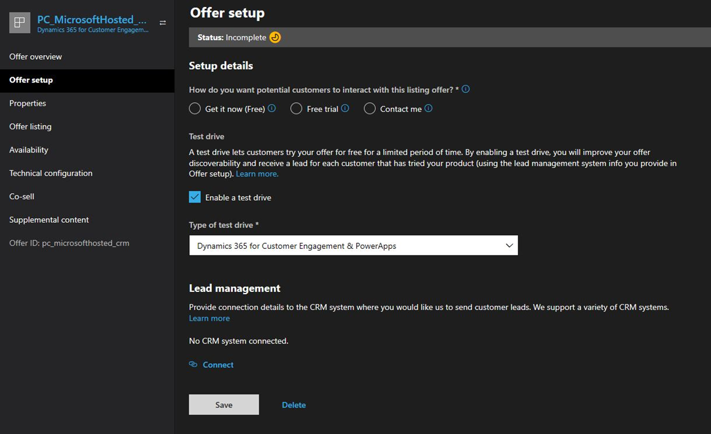
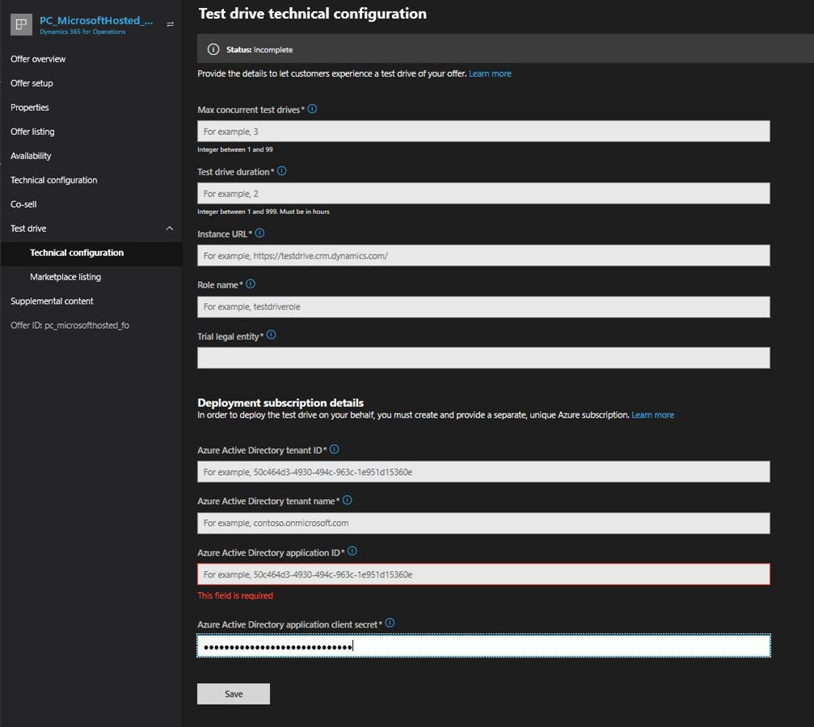
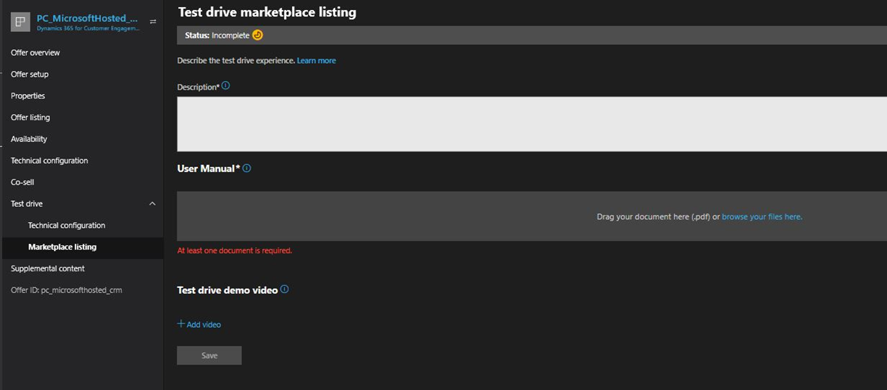
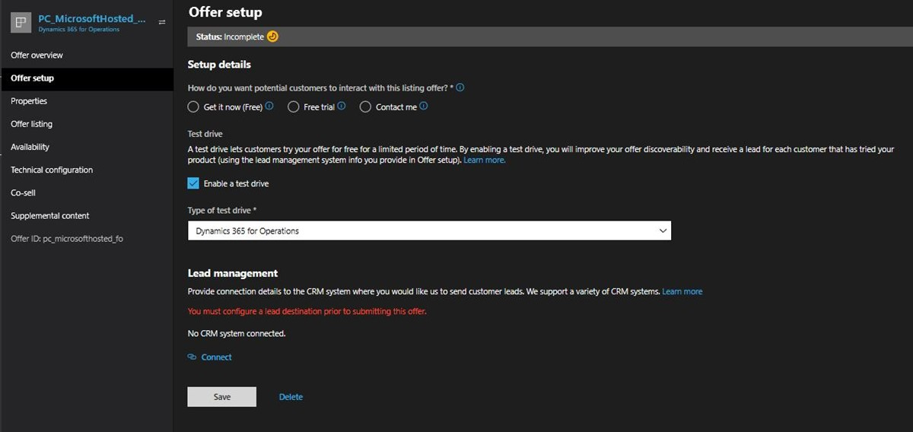

# Detailed configuration for hosted test drives

This article describes how to configure a hosted test drive for Dynamics 365 for Customer Engagement or Dynamics 365 for Operations.

## Configure for Dynamics 365 Customer Engagement

1. Sign in to [Partner Center](https://partner.microsoft.com/).
2. If you can't access the above link, you need to submit a request [here](https://appsource.microsoft.com/partners/list-an-app) to publish your application. Once we review the request, you will be granted access to start the publish process.
3. Find an existing **Dynamics 365 for Customer Engagement** offer or create a new **Dynamics 365 for Customer Engagement** offer.
4. Select the **Enable a test drive** check box and select a **Type of test drive** (see bullet below), then select **Save**.

    

    - **Type of test drive** – Choose **Microsoft Hosted (Dynamics 365 for Customer Engagement & PowerApps)**. This indicates that Microsoft will host and maintain the service that performs the test drive user provisioning and deprovisioning.

5. Grant Microsoft AppSource permission to provision and deprovision test drive users in your tenant using [these instructions](./test-drive-azure-subscription-setup.md). In this step, you will generate the **Azure AD App ID** and **Azure AD App Key** values mentioned below.
6. Complete these fields on the **Test drive technical configuration** page.

    

    - **Max concurrent test drives** – The number of concurrent users that can have an active test drive running at the same time. Each user will consume a Dynamics license while their test drive is active, so ensure you have at least this many Dynamics licenses available for test drive users. We recommended 3 to 5.
	- **Test drive duration** – The number of hours the user's test drive will be active. After the time has expired, the user will be deprovisioned from your tenant. We recommended 2-24 hours depending on the complexity of your app. The user can always request another test drive if they run out of time and want to access the test drive again.
	- **Instance URL** – The URL the test drive user will be sent to when they start the test drive. This is typically the URL of your Dynamics 365 instance on which your app and sample data is installed. Example value: `https://testdrive.crm.dynamics.com`.
	- **Instance web API URL** – The Web API URL for your Dynamics 365 Instance. Retrieve this value by signing into your Microsoft Dynamics 365 instance and navigating to **Setting** > **Customization** > **Developer Resources** > **Instance Web API** and copy the address (URL). Example value:

        :::image type="content" source="./media/test-drive/sample-web-api-url.png" alt-text="An example of Instance Web API.":::

	- **Role name** – The name of the custom Dynamics 365 security role you created for test drive or you can use an existing role. A new role should have minimum required privileges added to the role to sign into a Customer Engagement instance. Refer to [Minimum privileges required to sign into Microsoft Dynamics 365](https://community.dynamics.com/crm/b/crminogic/archive/2016/11/24/minimum-privileges-required-to-login-microsoft-dynamics-365). This is the role that will be assigned to users during their test drive. Example value: `testdriverole`.
	
        > [!IMPORTANT]
        > Ensure the security group check is not added. This allows the user to be synced to the Customer Engagement instance.

	- **Azure Active Directory tenant ID** – The ID of the Azure tenant for your Dynamics 365 instance. To retrieve this value, sign in to Azure portal and navigate to **Azure Active Directory** > **Properties** and copy the directory ID. Example value: 172f988bf-86f1-41af-91ab-2d7cd01112341.
	- **Azure Active Directory tenant name** – The name of the Azure Tenant for your Dynamics 365 Instance. Use the format `<tenantname>.onmicrosoft.com`. Example Value: `testdrive.onmicrosoft.com`.
	- **Azure Active Directory application ID** – The ID of the Azure Active Directory (AD) app you created in Step 5. Example value: `53852862-a2ae-4e43-9461-faa49650a096`.
	- **Azure Active Directory application client secret** – Secret for the Azure AD app created in Step 5. Example value: `IJUgaIOfq9b9LbUjeQmzNBW4VGn6grr1l/n3aMrnfdk=`.

7. Provide the marketplace listing details. Select **Language** to see further required fields.

    

    - **Description** – An overview of your test drive. This text will be shown to the user while the test drive is being provisioned. This field supports HTML if you want to provide formatted content.
    - **User manual** – A PDF user manual that helps test drive users understand how to use your app.
    - **Test drive demo video** – A video that showcases your app (optional).

## Configure for Dynamics 365 Operations

2. If you can't access the above link, you need to submit a request [here](https://appsource.microsoft.com/partners/list-an-app) to publish your application. Once we review the request, you will be granted access to start the publish process.
3. Find an existing **Dynamics 365 for Operations** offer or create a new **Dynamics 365 for Operations** offer.
4. Select the **Enable a test drive** check box and select a **Type of test drive** (see bullet below), then select **Save**.

    

    - **Type of test drive** – Choose **Dynamics 365 for Operations** option. This means Microsoft will host and maintain the service that performs the test drive user provisioning and deprovisioning.

5. Grant Microsoft AppSource permission to provision and deprovision test drive users in your tenant using [these instructions](https://github.com/Microsoft/AppSource/blob/master/Microsoft%20Hosted%20Test%20Drive/Setup-your-Azure-subscription-for-Dynamics365-Microsoft-Hosted-Test-Drives.md). In this step, you will generate the **Azure AD App ID** and **Azure AD App Key** values mentioned below.
6. Complete these fields on the **Test drive technical configuration** page.

    

    - **Max concurrent test drives** – The number of concurrent users that can have an active test drive running at the same time. Each user will consume a Dynamics license while their test drive is active, so ensure you have at least this many Dynamics licenses available for test drive users. We recommended 3 to 5.
	- **Test drive duration** – The number of hours the user's test drive will be active. After the time has expired, the user will be deprovisioned from your tenant. We recommended 2-24 hours depending on the complexity of your app. The user can always request another test drive if they run out of time and want to access the test drive again.
	- **Instance URL** – The URL the test drive user will be sent to when they start the test drive. This is typically the URL of your Dynamics 365 instance on which your app and sample data is installed. Example value: `https://testdrive.crm.dynamics.com`.
	- **Azure Active Directory tenant ID** – The ID of the Azure tenant for your Dynamics 365 instance. To retrieve this value, sign in to Azure portal and navigate to **Azure Active Directory** > **Properties** and copy the directory ID. Example value: 172f988bf-86f1-41af-91ab-2d7cd01112341.
	- **Azure Active Directory tenant name** – The name of the Azure Tenant for your Dynamics 365 Instance. Use the format `<tenantname>.onmicrosoft.com`. Example Value: `testdrive.onmicrosoft.com`.
	- **Azure Active Directory application ID** – The ID of the Azure Active Directory (AD) app you created in Step 5. Example value: `53852862-a2ae-4e43-9461-faa49650a096`.
	- **Azure Active Directory application client secret** – Secret for the Azure AD app created in Step 5. Example value: `IJUgaIOfq9b9LbUjeQmzNBW4VGn6grr1l/n3aMrnfdk=`.
    - **Trial Legal Entity** – Provide a Legal Entity to assign a trial user. You can create a new one at [Create or modify a legal entity](/dynamicsax-2012/appuser-itpro/create-or-modify-a-legal-entity).
    - **Role name** – The AOT name (Application Object Tree) of the custom Dynamics 365 security role you created for test drive. This is the role that will be assigned to users during their test drive.

        :::image type="content" source="./media/test-drive/security-config.png" alt-text="The security configuration page.":::

7. Provide the marketplace listing details. Select **Language** to see further required fields.

    

    - **Description** – An overview of your test drive. This text will be shown to the user while the test drive is being provisioned. This field supports HTML if you want to provide formatted content.
    - **User manual** – A PDF user manual that helps test drive users understand how to use your app.
    - **Test drive demo video** – A video that showcases your app (optional).

<!--
## Next steps

- [Set up your Azure subscription](test-drive-azure-subscription-setup.md) -->