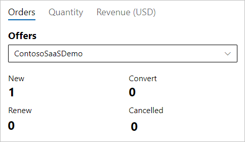
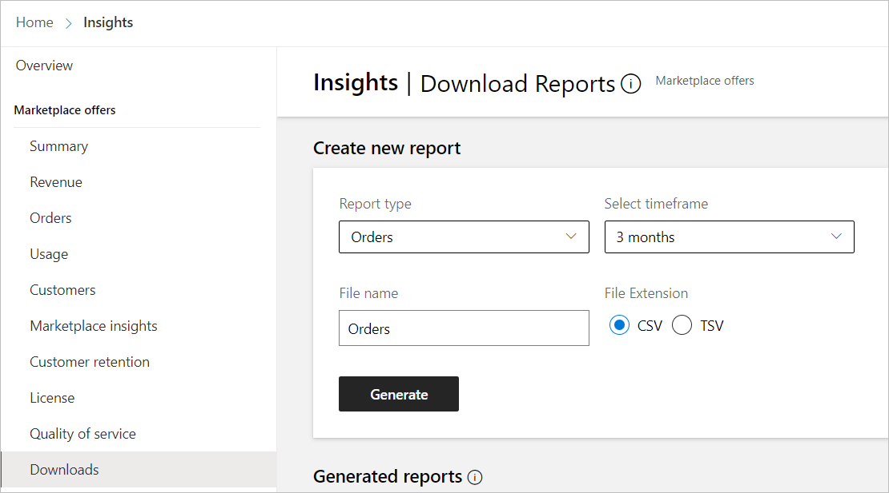
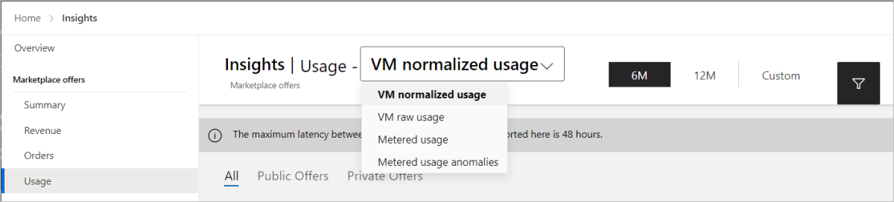

# Test a SaaS plan

This article explains how to test a software as a service (SaaS) offer in preview.

Here are some general guidelines to be aware of when you’re testing your offer.

- If your SaaS offer supports metered billing using the commercial marketplace metering service, review and follow the testing best practices detailed in [Marketplace metered billing APIs](./partner-center-portal/saas-metered-billing.md).
- Review and follow the testing instructions in [Implementing a webhook on the SaaS service](./partner-center-portal/pc-saas-fulfillment-webhook.md#development-and-testing) to ensure your offer is successfully integrated with the APIs.
- If the Offer validation step resulted in warnings, a **View validation report** link appears on the **Offer overview** page. Be sure to review the report and address the issues before you select the **Go live** button. Otherwise, certification will most likely fail and delay your offer from going Live.
- If you need to make changes after previewing and testing the offer, you can edit and resubmit to publish a new preview. For more information, see [Update an existing offer in the commercial marketplace](update-existing-offer.md).

> [!NOTE]
> In this example we will use the [SaaS Accelerator](https://go.microsoft.com/fwlink/?linkid=2190938) for the landing page.

## Verify the purchase of a private test plan

Publishers can use Commercial Marketplace to verify the purchase of a test plan.

1. Sign in to [Partner Center](https://partner.microsoft.com/dashboard/home).

1. On the Home page, select the **Insights** tile.

    [  ](./media/workspaces/partner-center-insights-tile.png#lightbox)

1. In the left menu, select **Orders**.

1. In the upper-right, select the filter icon and filter by **Offer Name**. The **Orders by offers** widget shows the number of subscriptions that have been purchased. You should notice that the number of new orders have increased.

    [  ](./media/review-publish-offer/subscriptions-purchased.png#lightbox)

    > [!NOTE]
    > It can take up to 48 hours before offer orders appear in the report.

1. In the left-nav, select **Downloads**.
1. From the **Report type** list, select **Orders**.
1. From the **Select timeframe** list, select **3 months**.
1. Under **File Extension**, select **CSV**.
1. Select **Generate**.

    [  ](./media/review-publish-offer/download-reports.png#lightbox)

1. Download the .CSV file and verify that the new subscription for your test plan is shown in the report.

## Send metered usage Event

If your test plan is configured to send usage events, it is important to test the metered plan usage by sending metered events to [Marketplace Metered API](marketplace-metering-service-apis.md). This is an example of how to send metered usage events using Postman.

When you test metered usage, we recommend that you send more than the number of usage events that are covered by the base fee and then verify that only the number of usage events that exceed the base fee are sent to Microsoft.

### Send a request

Using an API tool such as Postman, send a request body like the one shown in this example.

_Request body example:_

```json
{
   "resourceId": <guid>, // unique identifier of the resource against which usage is emitted. 
   "quantity": 5.0, // how many units were consumed for the date and hour specified in     effectiveStartTime, must be greater than 0 or a double integer 
   "dimension": "dim1", // custom dimension identifier 
   "effectiveStartTime": "2018-12-01T08:30:14", // time in UTC when the usage event occurred, from now and until 24 hours back 
   "planId": "plan1", // id of the plan purchased for the offer 
}
```

_Query parameters:_

| Parameter | Comment |
| ------------ | ------------- |
| resourceId | This will be your SaaS subscriptionId |
| quantity | You can enter 1 for quantity as the test value |
| dimension | Enter the name of the dimension defined in the metered plan |
| planId | Enter the metered plan ID |

### View the response

You should receive a response like the one shown in this example.

_Response payload example:_

```json
{
"usageEventId": <guid>, // unique identifier associated with the usage event in Microsoft records
"status": "Accepted" // this is the only value in case of single usage event 
"messageTime": "2020-01-12T13:19:35.3458658Z", // time in UTC this event was accepted
"resourceId": <guid>, // unique identifier of the resource against which usage is emitted. For SaaS it's the subscriptionId. 
"quantity": 5.0, // amount of emitted units as recorded by Microsoft "dimension": 
"dim1", // custom dimension identifier 
"effectiveStartTime": "2018-12-01T08:30:14", // time in UTC when the usage event occurred, as sent by the ISV
"planId": "plan1", // id of the plan purchased for the offer 
}
```

For more details about sending metered usage events, see [Marketplace metered billing APIs](marketplace-metering-service-apis.md).

## Verify metered usage information

1. On the Home page, select the **Insights** tile.

    [  ](./media/workspaces/partner-center-insights-tile.png#lightbox)

1. In the left menu, select **Usage**.

1. From the list at the top of the page, select **Metered usage**.

    [  ](./media/review-publish-offer/saas-metered-usage.png#lightbox)

1. From the **Offer alias** list, select your offer name.
1. From the **Meter ID** list, select a dimension (meter) Id you entered in the plan. The metered usage is shown in the Metered usage widget.

    > [!NOTE]
    > You should only see the metered usage above the base fee.

### Download report

> [!NOTE]
> It can take up to 48 hours before offer orders appear in the report.

1. In the left-nav, select **Downloads**.
1. From the **Report type** list, select **Usage**.
1. From the **Select timeframe** list, select **3 months**.
1. Under **File Extension**, select **CSV**.
1. Select **Generate**.

    [  ](./media/review-publish-offer/download-reports.png#lightbox)

1. Download the .CSV file and verify that the new subscription for your test plan is shown in the report.

## Next steps

When you complete your tests, you can do the following:
- [Unsubscribe from and deactivate your test plan](test-saas-unsubscribe.md).
- [Create a plan](create-new-saas-offer-plans.md) in your production offer with the prices you want to charge customers and [publish the production offer live](test-publish-saas-offer.md).
