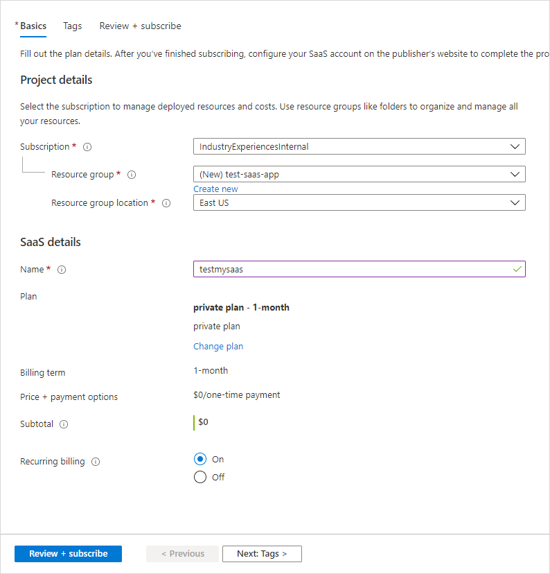
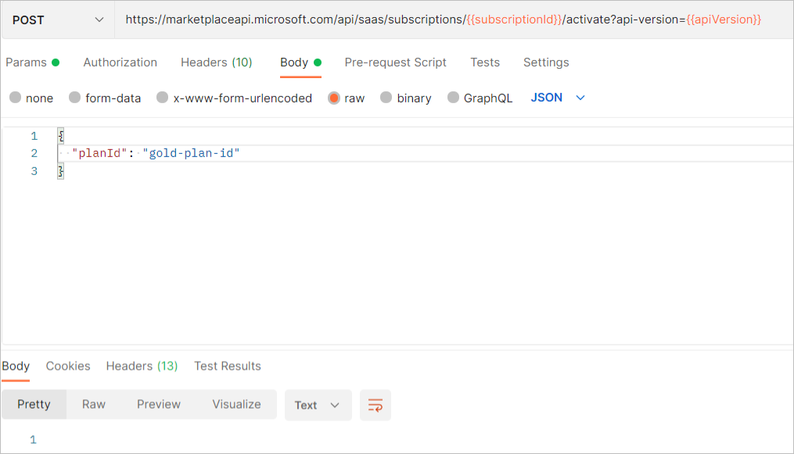

# Preview and subscribe to a SaaS offer in the commercial marketplace

This article explains how to use Partner Center to submit your SaaS offer for publishing, preview your offer, and subscribe to a plan. You must have already created an offer that you want to publish. For information about the overall process to test a SaaS, see [Test a SaaS plan overview](test-saas-overview.md).

> [!NOTE]
> We recommend that you create a separate test and development (DEV) offer as a low-risk way to test before you publish your production (PROD) offer. Follow these steps to create and test the DEV offer before you publish your (PROD) offer.

## Submit your offer for publishing

1. Sign in to [Partner Center](https://go.microsoft.com/fwlink/?linkid=2166002).

1. On the Home page, select the **Marketplace offers** tile.

    

1. In the **Offer alias** column, select the offer you want to publish.
1. In the upper-right corner of the portal, select **Review and publish**.
1. Make sure that the **Status** column for each page says **Complete**. The three possible statuses are as follows:

   - **Not started** – The page is incomplete.
   - **Incomplete** – The page is missing required information or has errors that need to be fixed. You'll need to go back to the page and update it.
   - **Complete** – The page is complete. All required data has been provided and there are no errors.

1. If any of the pages have a status other than **Complete**, select the page name, correct the issue, save the page, and then select **Review and publish** again to return to this page.
1. After all the pages are complete, in the **Notes for certification** box, provide testing instructions to the certification team to ensure that your app is tested correctly. Provide any supplementary notes helpful for understanding your app.
1. To start the publishing process for your offer, select **Publish**. The **Offer overview** page appears and shows the offer's **Publish status**.

Your offer's publish status will change as it moves through the publication process. For detailed information on this process, see [Validation and publishing steps](review-publish-offer.md#validation-and-publishing-steps).

## Preview and subscribe to your offer

When the offer is ready for your test in the preview environment, we’ll send you an email to request that you review and approve your offer preview. You can also refresh the **Offer overview** page in your browser to see if your offer has reached the Publisher sign-off phase. If it has, the **Go live** button and preview links will be available. There will be a link for either Microsoft AppSource preview, Azure Marketplace preview, Azure portal, or a combination of them depending on the options you chose when creating your offer. If you chose to sell your offer through Microsoft, anyone who has been added to the preview audience can test the acquisition and deployment of your offer to ensure it meets your requirements during this stage.

The following screenshot shows the **Offer overview** page for a SaaS offer, with two preview links under the **Go live** button. The validation steps you’ll see on this page vary depending on the selections you made when you created the offer.

> [!IMPORTANT]
> To validate the end-to-end purchase and setup flow, purchase your offer while it is in Preview. First notify Microsoft with a support ticket to ensure we don't process a charge. Otherwise, the customer account used for the purchase will be billed and invoiced. Publisher Payout will occur when the [criteria](/partner-center/payment-thresholds-methods-timeframes) are met and will be paid out per the [payout schedule](/partner-center/payout-policy-details) with the agency fee deducted from the purchase price.

If your offer is a _Contact Me_ listing, test that a lead is created as expected by providing the Contact Me details during preview.

Use the following steps to preview your offer.

1. Sign in to [Azure portal](https://ms.portal.azure.com/#home). Make sure you’re signed in to the Azure tenant you submitted the offer to.
1. In Partner Center, go to the **Offportal.azureage, and then select the **Azure portal preview** link under the **Go live** button.

## Subscribe to a test plan

1. In Azure portal, on the offer subscribe page of your test offer, from the **Plan** list, select the test plan you created earlier.
1. Select the **Subscribe** button.
1. Under **Project details**, from the **Subscription** list, select the SaaS test environment subscription.
1. Select an existing **Resource Group** or select **Create new** to create a new one.
1. Under **SaaS details**, enter a **Name** for the SaaS instance.
1. Leave **Recurring billing** set to **On**.

    

1. Select the **Review + subscribe** button.
1. The **Review + subscribe** page appears to finalize the subscription process.
1. Near the bottom of the page, select **Subscribe**. The Deployment progress screen appears.
1. Once the subscription is deployed, you’ll see the **Your SaaS subscription is Complete** message.

## Activate a subscription

As a publisher, you will be notified that you have a pending subscription. You can leverage the SaaS fulfillment APIs to activate the subscription.

1. Once someone subscribes to your offer, you’ll be notified of a new subscription.
1. Using Postman, you can post against the Activate a subscription API to activate the pending subscription by providing the `planId`.

    

Once activation is successful, you will receive status code 202 Accepted.

## Next step

- [Test a SaaS plan ](test-saas-plan.md)
