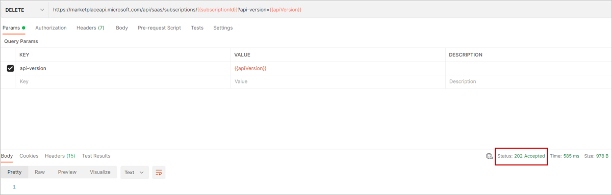
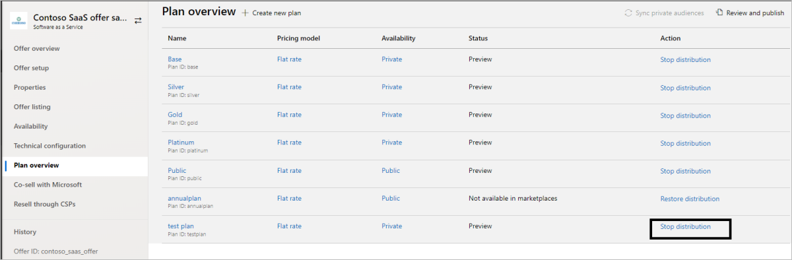
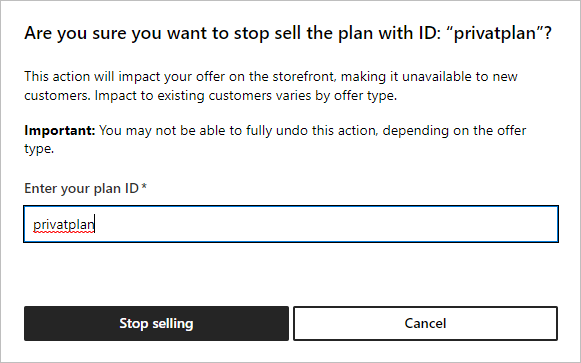

# Unsubscribe from and deactivate a test plan

When you’re done testing a plan, you can unsubscribe from and deactivate the plan.

## Unsubscribe from a plan

1. Publishers can unsubscribe a customer from the system, using the [Cancel Subscription API](./partner-center-portal/pc-saas-fulfillment-subscription-api.md#cancel-a-subscription).
1. Using Postman, send a **DELETE** API action against `subscriptionId`.
1. Once unsubscribe is successful, you will receive Status Code **202 Accepted**.

    

## Deactivate a test plan

Use these steps to deactivate a test plan after you’re done testing the plan.

> [!NOTE]
> If there is only one plan in your offer, you must create another plan before you can deactivate the test plan.

1. Sign in to [Partner Center](https://go.microsoft.com/fwlink/?linkid=2166002).

1. On the Home page, select the **Marketplace offers** tile.

    

1. On the Marketplace Offers page, select the offer that contains the plan you want to deactivate.
1. In the left-nav, select **Plan overview**.

    

1. For the plan you want to deactivate, in the **Action** column, select **Stop distribution**.

    

1. To confirm that you want to deactivate the plan, in the dialog box that appears, enter the **Plan ID** and select the **Stop selling** button.

    

Once you deactivate the plan, it will be no longer available in the marketplaces.

## Next Steps

- [Create a SaaS plan in your production offer](create-new-saas-offer-plans.md)
- [Access analytic reports for the commercial marketplace in Partner Center](analytics.md)
