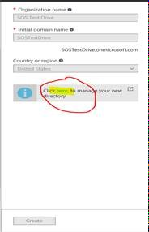
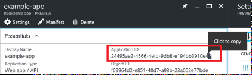
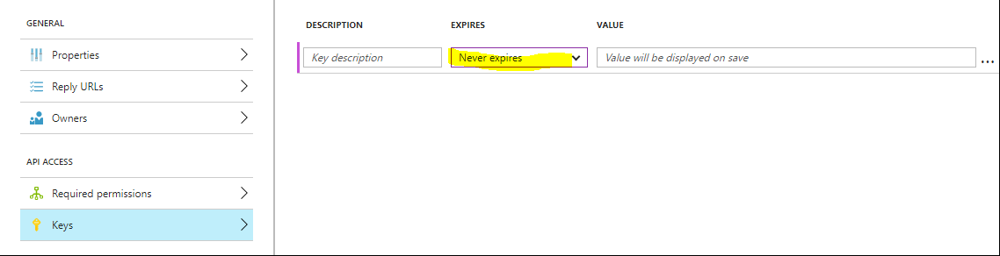

# Types of test drives

This article describes the three different types of test drives available on the Microsoft commercial marketplace: logic app, hosted test drive, or Azure Resource Manager. When you are ready to publish a test drive, see [Configure a test drive](test-drive.md).

## Logic app test drive

If you have an offer on AppSource, build your test drive to connect with a Dynamics AX/CRM instance or any other resource beyond just Azure. GitHub contains documentation for Logic App test drives for
[Operations](https://github.com/Microsoft/AppSource/blob/master/Setup-your-Azure-subscription-for-Dynamics365-Operations-Test-Drives.md) and [Customer Engagement](https://github.com/Microsoft/AppSource/wiki/Setting-up-Test-Drives-for-Dynamics-365-app).

## Hosted test drive

A hosted test drive removes the complexity of setup by Microsoft hosting and maintain the service that performs the test drive user provisioning and de-provisioning. Use this test drive when you have an offer on AppSource or are building a new one and want to offer a hosted test drive, which connects with a Dynamics 365 for Customer Engagement, Dynamics 365 for Finance and Operations, or Dynamics 365 Business Central instance.

## Azure Resource Manager test drive

Use this type of test drive if you have an offer on the Azure Marketplace or on AppSource but want to build a test drive with only Azure resources.

An Azure Resource Manager (Resource Manager) template is a coded container of Azure
resources that you design to best represent your solution. If you are unfamiliar with what a Resource Manager template is, read up on [understanding Resource Manager templates](https://docs.microsoft.com/azure/azure-resource-manager/resource-group-overview) and [authoring Resource Manager templates](https://docs.microsoft.com/azure/azure-resource-manager/resource-group-authoring-templates) to make sure you know how to build and test your own templates.

What test drive does is that it takes the provided Resource Manager template and makes a deployment of all the resources required from that Resource Manager template into a resource group.

If you choose to build an Azure Resource Manager test drive, the requirements are for you to:

- Build, test, and then upload your test drive resource manager template.
- Configure all required metadata and settings to enable your test drive.
- Republish your offer with test drive enabled.

### How to build an Azure Resource Manager test drive

Here is the process for building an Azure Resource Manager test drive:

1. Design what you want your customers to do in a flow diagram.
1. Define what experiences you would like your customers to build.
1. Based on the above definitions, decide what pieces and resources are needed for customers to accomplish such experience: for example, D365 instance, or a website with a database.
1. Build the design locally, and test the experience.
1. Package the experience in an ARM template deployment, and from there:
    1. Define what parts of the resources are input parameters;
    1. What variables are;
    1. What outputs are given to the customer experience.
1. Publish, test, and go live.

The most important part about building an Azure Resource Manager test drive is to define what scenario(s) you want your customers to experience. Are you a firewall product and you want to demo how well you handle script injection attacks? Are you a storage product and you want to demo how fast and easy your solution compresses files?

Make sure to spend a sufficient amount of time evaluating what are the best ways to show off your product. Specifically around all the required resources you would need, as it makes packaging the Resource Manager template sufficiently easier.

To continue with our firewall example, the architecture may be that you need a public IP URL for your service and another public IP URL for the website that your firewall is protecting. Each IP is deployed on a Virtual Machine and connected together with a network security group + network interface.

Once you have designed the desired package of resources, now comes the writing and building of the test drive resource manager template.

### Writing test drive resource manager templates

Test drive runs deployments in a fully automated mode, and because of that, test drive templates have some restrictions described below.

#### Parameters

Most templates have a set of parameters. Parameters define resource names, resources sizes (for example, types of storage accounts or virtual machine sizes), user names and passwords, DNS names and so on. When you deploy solutions using Azure portal, you can manually populate all these parameters, pick available DNS names or storage account names, and so on.


However, test drive works in a fully automatic mode, without human interaction, so it only supports a limited set of parameter categories. If a parameter in the test drive resource manager template doesn't fall into one of the supported categories, you must **replace this parameter with a variable or constant value.**

You can use any valid name for your parameters, test drive recognizes parameter category by using metadata-type value. You **must specify metadata-type for every template parameter**, otherwise your template will not pass validation:

```JSON
"parameters": {
  ...
  "username": {
    "type": "string",
    "metadata": {
      "type": "username"
    }
  },
  ...
}
```

> [!NOTE]
> All parameters are optional, so if you don't want to use any, you don't have to.

#### Accepted Parameter Metadata Types

| Metadata Type   | Parameter Type  | Description     | Sample Value    |
|---|---|---|---|
| **baseuri**     | string          | Base URI of your deployment package| https:\//\<\..\>.blob.core.windows.net/\<\..\> |
| **username**    | string          | New random user name.| admin68876      |
| **password**    | secure string    | New random password | Lp!ACS\^2kh     |
| **session id**   | string          | Unique test drive session ID (GUID)    | b8c8693e-5673-449c-badd-257a405a6dee |

##### baseuri

Test drive initializes this parameter with a **Base Uri** of your deployment package, so you can use this parameter to construct Uri of any file included into your package.

```JSON
"parameters": {
  ...
  "baseuri": {
    "type": "string",
    "metadata": {
      "type": "baseuri",
      "description": "Base Uri of the deployment package."
    }
  },
  ...
}
```

Inside your template, you can use this parameter to construct a Uri of any file from your test drive deployment package. The example below shows how to construct a Uri of the linked template:

```JSON
"templateLink": {
  "uri": "[concat(parameters('baseuri'),'templates/solution.json')]",
  "contentVersion": "1.0.0.0"
}
```

##### username

Test drive initializes this parameter with a new random user name:

```JSON
"parameters": {
  ...
  "username": {
    "type": "string",
    "metadata": {
      "type": "username",
      "description": "Solution admin name."
    }
  },
  ...
}
```

Sample value:

    admin68876

You can use either random or constant usernames for your solution.

##### password

Test drive initializes this parameter with a new random password:

```JSON
"parameters": {
  ...
  "password": {
    "type": "securestring",
    "metadata": {
      "type": "password",
      "description": "Solution admin password."
    }
  },
  ...
}
```

Sample value:

    Lp!ACS^2kh

You can use either random or constant passwords for your solution.

##### session ID

Test drive initialize this parameter with a unique GUID representing
Test drive session ID:

```JSON
"parameters": {
  ...
  "sessionid": {
    "type": "string",
    "metadata": {
      "type": "sessionid",
      "description": "Unique test drive session id."
    }
  },
  ...
}
```

Sample value:

    b8c8693e-5673-449c-badd-257a405a6dee

You can use this parameter to uniquely identify the test drive session, if it's necessary.

#### Unique Names

Some Azure resources, like storage accounts or DNS names, requires globally unique names.

This means that every time test drive deploys the resource manager template, it creates a **new resource group with a unique name** for all its' resources. Therefore it is required to use the [uniquestring](https://docs.microsoft.com/azure/azure-resource-manager/resource-group-template-functions#uniquestring) function concatenated with your variable names on resource group IDs to
generate random unique values:

```JSON
"variables": {
  ...
  "domainNameLabel": "[concat('contosovm',uniquestring(resourceGroup().id))]",
  "storageAccountName": "[concat('contosodisk',uniquestring(resourceGroup().id))]",
  ...
}
```

Make sure you concatenate your parameter/variable strings (`contosovm`) with a unique string output (`resourceGroup().id`), because this guarantees the uniqueness and reliability of each variable.

For example, most resource names cannot start with a digit, but unique string function can return a string, which starts with a digit. So, if you use raw unique string output, your deployments will fail.

You can find additional information about resource naming rules and
restrictions in [this article](/azure/cloud-adoption-framework/ready/azure-best-practices/naming-and-tagging).

#### Deployment Location

You can make you test drive available in different Azure regions. The idea is to allow a user to pick the closest region, to provide with the beast user experience.

When test drive creates an instance of the Lab, it always creates a resource group in the region chose by a user, and then executes your deployment template in this group context. So, your template should pick the deployment location from resource group:

```JSON
"variables": {
  ...
  "location": "[resourceGroup().location]",
  ...
}
```

And then use this location for every resource for a specific Lab instance:

```JSON
"resources": [
  {
    "type": "Microsoft.Storage/storageAccounts",
    "location": "[variables('location')]",
    ...
  },
  {
    "type": "Microsoft.Network/publicIPAddresses",
    "location": "[variables('location')]",
    ...
  },
  {
    "type": "Microsoft.Network/virtualNetworks",
    "location": "[variables('location')]",
    ...
  },
  {
    "type": "Microsoft.Network/networkInterfaces",
    "location": "[variables('location')]",
    ...
  },
  {
    "type": "Microsoft.Compute/virtualMachines",
    "location": "[variables('location')]",
    ...
  }
]
```

You need to make sure that your subscription is allowed to deploy all the resources you want to deploy in each of the regions you are selecting. As well, you need to make sure that your virtual machine images are available in all the regions you are going to enable, otherwise your deployment template will not work for some regions.

#### Outputs

Normally with resource manager templates, you can deploy without producing any output. This is because you know all the values you use to populate template parameters and you can always manually inspect properties of any resource.

For test drive resource manager templates however, it's important to return to test drive all the information, which is required to get an access to the lab (Website URIs, Virtual Machine host names, user names, and passwords). Make sure all your output names are readable because these variables are presented to the customer.

There are no any restrictions related to template outputs. Just remember, test drive converts all output values into **strings**, so if you send an object to the output, a user will see JSON string.

Example:

```JSON
"outputs": {
  "Host Name": {
    "type": "string",
    "value": "[reference(variables('pubIpId')).dnsSettings.fqdn]"
  },
  "User Name": {
    "type": "string",
    "value": "[parameters('adminName')]"
  },
  "Password": {
    "type": "string",
    "value": "[parameters('adminPassword')]"
  }
}
```

#### Subscription Limits

One more thing you should take into consideration is subscription and service limits. For example, if you want to deploy up to ten 4-core virtual machines, you need to make sure the subscription you use for your Lab allows you to use 40 cores.

You can find more information about Azure subscription and service limits in [this article](https://docs.microsoft.com/azure/azure-resource-manager/management/azure-subscription-service-limits). As multiple test drives can be taken at the same time, verify that your subscription can handle the \# of cores multiplied by the total number of concurrent test drives that can be taken.

#### What to upload

Test drive resource manager template is uploaded as a zip file, which can include various deployment artifacts, but needs to have one file named **main-template.json**. This file is Azure Resource Manager deployment template, and test drive uses it to instantiate a Lab.

If you have additional resources beyond this file, you can reference it as an external resource inside the template, or you can include the resource in the zip file.

During the publishing certification, test drive unzips your deployment package and puts its content into an internal test drive blob container. The container structure reflects the structure of your deployment package:

| package.zip                       | Test drive blob container         |
|---|---|
| `main-template.json`                | `https:\//\<\...\>.blob.core.windows.net/\<\...\>/main-template.json`  |
| `templates/solution.json`           | `https:\//\<\...\>.blob.core.windows.net/\<\...\>/templates/solution.json` |
| `scripts/warmup.ps1`                | `https:\//\<\...\>.blob.core.windows.net/\<\...\>/scripts/warmup.ps1`  |


We call a Uri of this blob container Base Uri. Every revision of your Lab has its own blob container, and, therefore, every revision of your Lab has its own Base Uri. Test drive can pass a Base Uri of your unzipped deployment package into your template through template parameters.

### Transforming template examples for test drive

The process from turning an architecture of resources into a test drive resource manager template can be daunting. In order to help make this process easier, see these examples of how to best [transform current deployment templates](transforming-examples-for-test-drive.md).

#### Test drive deployment subscription details

The final section to fill out is to be able to deploy the test drives automatically by connecting your Azure Subscription and Azure Active Directory (AD).


**Azure Subscription ID -** This grants access to Azure services and the Azure portal. The subscription is where resource usage is reported and services are billed. If you do not already have a **separate** Azure Subscription for test drives only, go ahead and make one. You can find Azure Subscription Ids by logging in to Azure portal and navigating to the Subscriptions on the left-side menu (such as `1a83645ac-1234-5ab6-6789-1h234g764ghty1`).


**Azure AD Tenant ID -** If you have a Tenant ID already available you can find it below in the Properties -\> Directory ID.


Otherwise, create a new tenant in Azure Active Directory.




**Azure AD App ID -** Next step is to create and register a new application. We will use this application to perform operations on your test drive instance.

1. Navigate to the newly created directory or already existing directory and select Azure Active directory in the filter pane.
2. Search "App registrations" and click on "Add"
3. Provide an application name.
4. Select the Type of as "Web app / API"
5. Provide any value in Sign-on URL, we won't be using that field.
6. Click create.
7. After the application has been created, go to Properties -\> Set the application as multi-tenant and hit Save.

Select **Save**. The last step is to copy the Application ID for this registered app and paste it in the test drive field here.



Given we are using the application to deploy to the subscription, we need to add the application as a contributor on the subscription. The instructions for these are as below:

1. Navigate to the Subscriptions blade and select the appropriate subscription that you are using for the test drive only.
1. Click **Access control (IAM)**.
1. Click the **Role assignments** tab.
    
1. Click **Add role assignment**.
1. Set the role as **Contributor**.
1. Type in the name of the Azure AD application and select the application to assign the role.
    
1. Select **Save**.

**Azure AD App Key -** Generate an authentication key. Under keys, add a Key Description, set the duration to never expire, then select **Save**. It is important to avoid having an expired key, which will break your test drive in production. Copy this value and paste it into your required test drive field.



## Next steps

Now that you have all of your test drive fields filled out, **Republish** your offer. Once your test drive has passed certification, test the customer experience in the preview of your offer: start a test drive in the UI, open your Azure subscription inside the Azure portal, and verify that your test drive is being deployed correctly.


It is important to note that you do not delete any test drive instances as they are provisioned for your customers, so the test drive service will automatically clean these Resource Groups up after a customer is finished with it.

Once you feel comfortable with your Preview offering, now it is time to **go live**! There is a final review process us once the offer is published to double-check the entire end to end experience. If we reject the offer, we will email the engineering contact for your offer explaining what needs to be fixed.

For best practices, FAQs, or to make your test drive more successful, see [Test drive marketing and best practices](marketing-and-best-practices.md).
