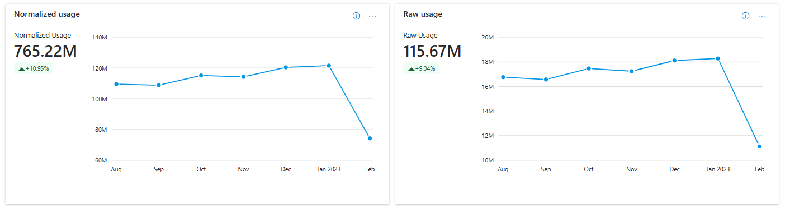

# Usage dashboard in commercial marketplace analytics

This article provides information on the Usage dashboard in Partner Center. This dashboard displays all virtual machine (VM) offers normalized usage, raw usage, and metered billing metrics in three separate tabs: VM Normalized usage, VM Raw usage, and metered billing usage.

>[!NOTE]
> For detailed definitions of analytics terminology, see [Commercial marketplace analytics terminology and common questions](./analytics-faq.yml).

## Usage dashboard

The [Usage dashboard](https://go.microsoft.com/fwlink/?linkid=2166106) displays the current orders for all your software as a service (SaaS) offers. You can view graphical representations of the following items:

- Usage trend
- Normalized usage by offers
- Normalized usage by other dimensions: VM Size, Sales Channels, and Offer Types
- Usage by geography
- Detailed usage table
- Orders page filters

> [!NOTE]
> The maximum latency between usage event generation and reporting in Partner Center is 48 hours.

## Elements of the Usage dashboard

The following sections describe how to use the Usage dashboard and how to read the data.

To access the Usage dashboard in Partner Center, under **Commercial Marketplace**, select **[Analyze](https://partner.microsoft.com/dashboard/commercial-marketplace/analytics/summary)** > **Usage**.

### Month range

You can find a month range selection at the top-right corner of each page. Customize the output of the **Usage** page graphs by selecting a month range based on the past 6 or 12 months, or by selecting a custom month range with a maximum duration of 12 months. The default month range (computation period) is six months.

:::image type="content" source="./media/usage-dashboard/month-filter.png" alt-text="Illustrates the Month filters on the Usage dashboard.":::

### Usage trend

In this section, you will find total usage hours and trend for all your offers that are consumed by your customers during the selected computation period. Metrics and growth trends are represented by a line chart. Show the value for each month by hovering over the line on the chart. The percentage value below the usage metrics in the widget represents the amount of growth or decline during the selected computation period.

There are two representations of usage hours: VM normalized usage and VM raw usage.

- Normalized usage hours are defined as the usage hours normalized to account for the number of VM cores ([number of VM cores] x [hours of raw usage]). VMs designated as "SHAREDCORE" use 1/6 (or 0.1666) as the [number of VM cores] multiplier.
- Raw usage hours are defined as the amount of time VMs have been running in terms of hours.

### Normalized usage by offers

This section provides the total usage hours and trend for your usage-based offers in Azure Marketplace. The Normalized usage by offers chart is described below.

- The **normalized usage by offers** stacked column chart displays a breakdown of normalized usage hours for the top five offers according to the selected computation period. The top five offers are displayed in a graph, while the rest are grouped in the **Rest All** category.
- The stacked column chart depicts a month-by-month growth trend for the selected date range. The month columns represent usage hours from the offers with the highest usage hours for the respective month. The line chart depicts the growth percentage trend plotted on the secondary Y-axis.
- You can select specific offers in the legend to display only those offers in the graph.

:::image type="content" source="./media/usage-dashboard/normalized-usage-offers.png" alt-text="Illustrates the normalized usage offers data on the Usage dashboard.":::

You can select any offer and a maximum of three SKUs of that offer to view the month-over-month usage trend for the offer and the selected SKUs.

:::image type="content" source="./media/usage-dashboard/normalized-usage-offers-sku.png" alt-text="Illustrates the normalized usage offers and sku data on the Usage dashboard.":::

### Orders by offers and SKUs

The **Orders by Offers and SKU** chart shows the measures and trends of all offers. Note the following:

- The top offers are displayed in the graph and the rest of the offers are grouped as **Rest All**.
- You can select specific offers in the legend to display only those offers in the graph.
- Hovering over a slice in the graph displays the number of orders and percentage of that offer compared to your total number of orders across all offers.
- The **orders by offers trend** displays month-by-month growth trends. The month column represents the number of orders by offer name. The line chart displays the growth percentage trend plotted on the z-axis.

:::image type="content" source="./media/usage-dashboard/orders-by-offers-and-skus.png" alt-text="Illustrates the Orders by offers and SKUs chart on the Usage dashboard.":::

You can select any offer and a maximum of three SKUs of that offer to view the month-over-month trend for the offer, SKUs, and seats.

:::image type="content" source="./media/usage-dashboard/orders-by-offers-and-skus-2.png" alt-text="Illustrates the Orders by offers and SKUs chart on the Usage dashboard. The Offer trend, SKUs trend, and Seats trend are shown.":::

#### Normalized usage by other dimensions: VM size, Sales channels, and Offer type

There are three tabs for the dimensions: VM size, Sales channels, and Offer type. You can see the usage metrics and month-over-month trend against each of these dimensions.

:::image type="content" source="./media/usage-dashboard/normalized-usage-other-dimensions.png" alt-text="Illustrates the Normalized usage other dimensions chart on the Usage dashboard.":::

### Usage by geography

For the selected computation period, the heatmap displays the total usage against geography dimension. The light to dark color on the map represents the low to high value of the customer count. Select a record in the table to zoom in on a country/region.

:::image type="content" source="./media/usage-dashboard/normalized-usage-country.png" alt-text="Illustrates the Normalized usage country chart on the Usage dashboard.":::

Note the following:

- You can move the map to view the exact location.
- You can zoom into a specific location.
- The heatmap has a supplementary grid to view the details of customer count, order count, and normalized usage hours in the specific location.
- You can search and select a country/region in the grid to zoom to the location in the map. Revert to the original view by selecting the **Home** button in the map.

### Usage details table

The **usage details** table displays a numbered list of the top 1,000 usage records sorted by usage. Note the following:

- Each column in the grid is sortable.
- The data can be extracted to a .TSV or .CSV file if the count of the records is less than 1,000.
- If records count is over 1,000, export data will be asynchronously placed in a downloads page that will be available for the next 30 days.
- Apply filters to **detailed usage data** to display only the data you are interested in. Filter data by country/region, sales channel, Marketplace license type, usage type, offer name, offer type, free trials, Marketplace subscription ID, customer ID, and company name.

_**Table 1: Dictionary of data terms**_

| Column name in user interface | Attribute name | Definition | Column name in programmatic access reports |
| ------------ | ------------- | ------------- | ------------- |
| Marketplace Subscription ID | Marketplace Subscription ID | The unique identifier associated with the Azure subscription the customer used to purchase your commercial marketplace offer. ID was formerly the Azure Subscription GUID. | MarketplaceSubscriptionId |
| MonthStartDate | Month Start Date | Month Start Date represents the month of Purchase. | MonthStartDate |
| Offer Type | Offer Type | The type of commercial marketplace offering. | OfferType |
| Azure License Type | Azure License Type | The type of licensing agreement used by customers to purchase Azure. Also known as the Channel. The possible values are:<ui><li>Cloud Solution Provider</li><li>Enterprise</li><li>Enterprise through Reseller</li><li>Pay as You Go</li></ul> | AzureLicenseType |
| Marketplace License Type | Marketplace License Type | The billing method of the commercial marketplace offer. The possible values are:<ul><li>Billed Through Azure</li><li>Bring Your Own License</li><li>Free</li><li>Microsoft as Reseller</li></ul> | MarketplaceLicenseType |
| SKU | SKU | The plan associated with the offer. | SKU |
| Customer Country | Customer Country/Region | The country/region name provided by the customer. Country/region could be different than the country/region in a customer's Azure subscription. | CustomerCountry |
| Is Preview SKU | Is Preview SKU | The value shows if you have tagged the SKU as "preview". Value will be "Yes" if the SKU has been tagged accordingly, and only Azure subscriptions authorized by you can deploy and use this image. Value will be "No" if the SKU has not been identified as "preview". | IsPreviewSKU |
| SKU Billing Type | SKU Billing Type | The Billing type associated with each SKU in the offer. The possible values are:<ul><li>Free</li><li>Paid</li></ul> | SKUBillingType |
| IsInternal | Deprecated | Deprecated | Deprecated |
| VM Size | Virtual Machine Size | For VM-based offer types, this entity signifies the size of the VM associated with the SKU of the offer. | VMSize |
| Cloud Instance Name | Cloud Instance Name | The Microsoft Cloud in which a VM deployment occurred. | CloudInstanceName |
| ServicePlanName | Deprecated | Deprecated (Same definition as SKU) | ServicePlanName |
| Offer Name | Offer Name | The name of the commercial marketplace offering. | OfferName |
| DeploymentMethod | Deprecated | Deprecated (Same definition as Offer type) | DeploymentMethod |
| Customer Company Name | Customer Company Name | The company name provided by the customer. The name could be different than the name in a customer's Azure subscription. | CustomerCompanyName |
| Usage Date | Usage Date | The date of usage event generation for usage-based assets. | UsageDate |
| IsMultisolution | Is Multisolution | Signifies whether the offer is a Multisolution offer type. | IsMultisolution |
| Is New Customer | Deprecated | Deprecated | IsNewCustomer |
| Core Size | Core Size | Number of cores associated with the VM-based offer. | CoreSize |
| Usage Type | Usage Type | Signifies whether the usage event associated with the offer is one of the following:<ul><li>Normalized usage</li><li>Raw usage</li><li>Metered usage</li></ul> | UsageType |
| Trial End Date | Trial End Date | The date the trial period for this order will end or has ended. | TrialEndDate |
| Customer Currency (CC) | Customer Currency | The currency used by the customer for the commercial marketplace transaction. | CustomerCurrencyCC |
| Price (CC) | Price | Unit price of the SKU shown in customer currency. | PriceCC |
| Payout Currency (PC) | Payout Currency | Publisher is paid for the usage events associated with the asset in the currency configured by the publisher. | PayoutCurrencyPC |
| Estimated Price (PC) | Estimated Price | Unit price of the SKU in the currency configured by the publisher. | EstimatedPricePC |
| Usage Reference | Usage Reference | A concatenated GUID that is used to connect the Usage Report (in commercial marketplace analytics) with the Payout transaction report. Usage Reference is connected with OrderId and LineItemId in the Payout transaction report. | UsageReference |
| Usage Unit | Usage Unit | Unit of consumption associated with the SKU. | UsageUnit |
| Customer ID | Customer ID | The unique identifier assigned to a customer. A customer may have zero or more Azure Marketplace subscriptions. | CustomerId |
| Billing Account ID | Billing Account ID | The identifier of the account on which billing is generated. Map **Billing Account ID** to **customerID** to connect your Payout Transaction Report with the Customer, Order, and Usage Reports. | BillingAccountId |
| Usage Quantity | Usage Quantity | The total usage units consumed by the asset that is deployed by the customer. This is based on Usage type item. For example, if the Usage Type is Normalized usage, then Usage Quantity is for Normalized Usage. | UsageQuantity |
| NormalizedUsage | Normalized Usage | The total normalized usage units consumed by the asset that is deployed by the customer. Normalized usage hours are defined as the usage hours normalized to account for the number of VM cores ([number of VM cores] x [hours of raw usage]). VMs designated as "SHAREDCORE" use 1/6 (or 0.1666) as the [number of VM cores] multiplier. | NormalizedUsage |
| MeteredUsage | Metered Usage | The total usage units consumed by the meters that are configured with the offer that is deployed by the customer. | MeteredUsage |
| RawUsage | Raw Usage | The total raw usage units consumed by the asset that is deployed by the customer. Raw usage hours are defined as the amount of time VMs have been running in terms of usage units. | RawUsage |
| Estimated Extended Charge (CC) | Estimated Extended Charge in Customer Currency | Signifies the charges associated with the usage. The column is the product of Price (CC) and Usage Quantity. | EstimatedExtendedChargeCC |
| Estimated Extended Charge (PC) | Estimated Extended Charge in Payout Currency | Signifies the charges associated with the usage. The column is the product of Estimated Price (PC) and Usage Quantity. | EstimatedExtended ChargePC |
| Meter Id | Meter Id | Signifies the meter ID for the offer. | MeterId |
| Partner Center Detected Anomaly | Partner Center Detected Anomaly | **Applicable for offers with custom meter dimensions**. Signifies whether the publisher reported overage usage for the offer’s custom meter dimension that was is flagged as an anomaly by Partner Center.The possible values are: <ul><li>0 (Not an anomaly)</li><li>1 (Anomaly)</li></ul>_If the publisher doesn’t have offers with custom meter dimensions, and exports this column through programmatic access, then the value will be null._ | PartnerCenterDetectedAnomaly |
| Publisher Marked Anomaly | Publisher Marked Anomaly | **Applicable for offers with custom meter dimensions**. Signifies whether the publisher acknowledged the overage usage by the customer for the offer’s custom meter dimension as genuine or false. The possible values are:<ul><li>0 (Publisher has marked it as not an anomaly)</li><li>1 (Publisher has marked it as an anomaly)</li></ul>_If the publisher doesn’t have offers with custom meter dimensions, and exports this column through programmatic access, then the value will be null._ | PublisherMarkedAnomaly |
| New Reported Usage | New Reported Usage | **Applicable for offers with custom meter dimensions**. For overage usage by the customer for the offer’s custom meter dimension identified as anomalous by the publisher. This field specifies the new overage usage reported by the publisher. _If the publisher doesn’t have offers with custom meter dimensions, and exports this column through programmatic access, then the value will be null._ | NewReportedUsage |
| Action Taken At | Action Taken At | **Applicable for offers with custom meter dimensions**. Specifies the time when the publisher acknowledged the overage usage by the customer for the offer’s custom meter dimension as genuine or false. _If the publisher doesn’t have offers with custom meter dimensions, and exports this column through programmatic access, then the value will be null._ | ActionTakenAt |
| Action Taken By | Action Taken By | **Applicable for offers with custom meter dimensions**. Specifies the person who acknowledged the overage usage by the customer for the offer’s custom meter dimension as genuine or false. _If the publisher doesn’t have offers with custom meter dimensions, and exports this column through programmatic access, then the value will be null._ | ActionTakenBy |
| Estimated Financial Impact (USD) | Estimated Financial Impact in USD | **Applicable for offers with custom meter dimensions**. When Partner Center flags an overage usage by the customer for the offer’s custom meter dimension as anomalous, the field specifies the estimated financial impact (in USD) of the anomalous overage usage. _If the publisher doesn’t have offers with custom meter dimensions, and exports this column through programmatic means, then the value will be null._ | EstimatedFinancialImpactUSD |
| N/A | Resource Id | The fully qualified ID of the resource, including the resource name and resource type. Note that this is a data field available in download reports only. Use the format:  /subscriptions/{guid}/resourceGroups/{resource-group-name}/{resource-provider-namespace}/{resource-type}/{resource-name} | N/A |
|||||

### Usage page filters

The **Usage** page filters are applied at the Orders page level. You can select one or multiple filters to render the chart for the criteria you choose to view and the data you want to see in the Usage orders data' grid / export. Filters are applied on the data extracted for the month range that you selected on the top-right corner of the Usage page.

The widgets and export report for VM Raw usage are similar to VM Normalized usage with the following distinctions:

- Normalized usage hours are defined as the usage hours normalized to account for the number of VM cores ([number of VM cores] x [hours of raw usage]). VMs designated as "SHAREDCORE" use 1/6 (or 0.1666) as the [number of VM cores] multiplier.
- Raw usage hours are defined as the amount of time VMs have been running in terms of usage units.

### Metered billing usage

The **Metered Usage** tab shows usage information for offer types where usage is measured by the per meter dimension. SaaS offer type overage is presented currently. The tab presents graphical representations of overage trends for SaaS metered billing usage:

- **Overage trend by meter dimension**: Displays the monthly overage trend for the selected meter dimension of an offer. The X-Axis represents the month and the Y-Axis represents the overage usage quantity. The unit of measurement of the custom meter is also displayed on the Y-Axis.

    :::image type="content" source="./media/usage-dashboard/metered-usage.png" alt-text="Illustrates the VM Normalized Usage chart on the Usage dashboard.":::

- **Overage trend by SKU**: Represents the trend of usage quantity of the selected meter dimension by SKU/plans. The top five plans with the highest amount of usage for the selected offer are displayed.

- **Overage trend by Customers**: The customer leader board represents a stacked listing of customers with the highest usage hours and are displayed on a _leader board_, ranked by the highest usage of the custom meter. Select a customer in the leader board to view the overage usage trend of a selected meter dimension.

    :::image type="content" source="./media/usage-dashboard/metered-usage-by-customers.png" alt-text="Illustrates the Metered Usage by Customers chart on the Usage dashboard.":::

If you have multiple offers that use custom meters, the metered billing usage report shows usage information for all your offers, according to their custom meter dimensions.

> [!TIP]
> You can use the download icon in the upper-right corner of any widget to download the data. You can provide feedback on each of the widgets by clicking on the “thumbs up” or “thumbs down” icon.

## Next steps

- For an overview of analytics reports available in the commercial marketplace, see [Access analytic reports for the commercial marketplace in Partner Center](analytics.md).
- For graphs, trends, and values of aggregate data that summarize marketplace activity for your offer, see [Summary Dashboard in commercial marketplace analytics](./summary-dashboard.md).
- For information about your orders in a graphical and downloadable format, see [Orders Dashboard in commercial marketplace analytics](./orders-dashboard.md)
- For virtual machine (VM) offers usage and metered billing metrics, see [Usage Dashboard in commercial marketplace analytics](usage-dashboard.md).
- For a list of your download requests over the last 30 days, see [Downloads dashboard in commercial marketplace analytics](downloads-dashboard.md).
- To see a consolidated view of customer feedback for offers on Azure Marketplace and Microsoft AppSource, see [Ratings & Reviews analytics dashboard in Partner Center](ratings-reviews.md).
- For frequently asked questions about commercial marketplace analytics and for a comprehensive dictionary of data terms, see [Commercial marketplace analytics terminology and common questions](./analytics-faq.yml).
