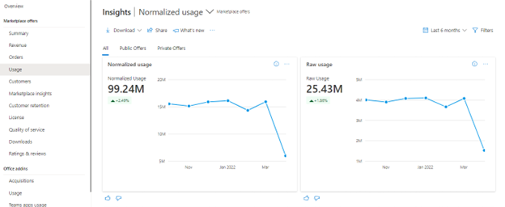
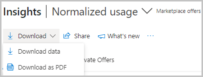
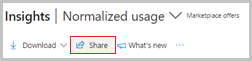
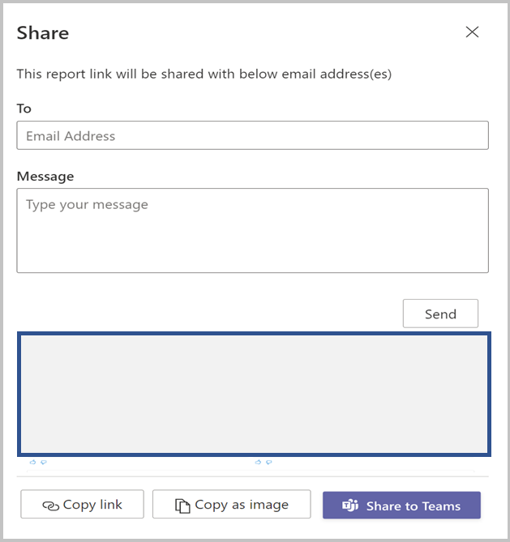
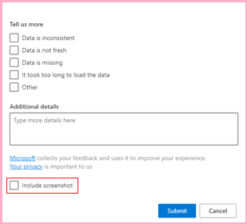
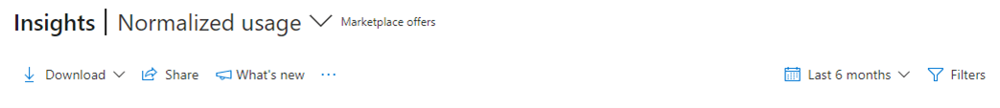
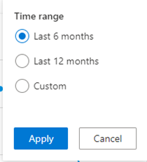
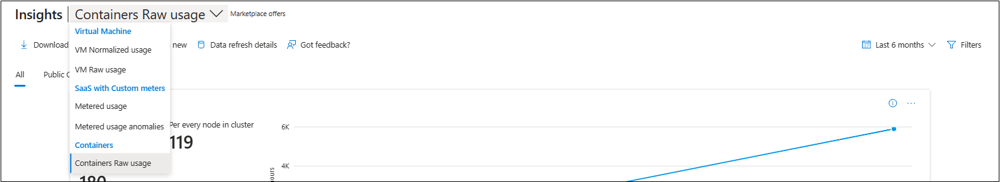
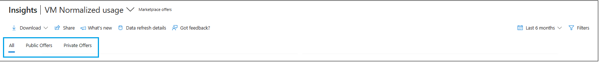
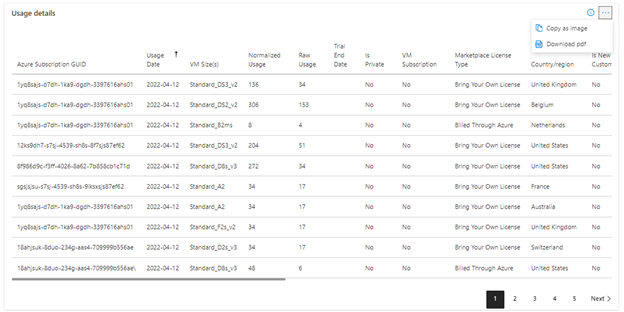

# Usage dashboard in commercial marketplace analytics

This article provides information on the Usage dashboard in Partner Center. This dashboard displays all virtual machine (VM) offers normalized usage, raw usage, and metered billing metrics in three separate tabs: VM Normalized usage, VM Raw usage, and metered billing usage.

>[!NOTE]
> For detailed definitions of analytics terminology, see [Commercial marketplace analytics terminology and common questions](./analytics-faq.yml).

## Usage dashboard

The [Usage dashboard](https://go.microsoft.com/fwlink/?linkid=2166106) displays the current orders for all your software as a service (SaaS) offers. You can view graphical representations of the following items:

- Usage trend
- Normalized usage by offers
- Normalized usage by other dimensions: VM Size, Sales Channels, and Offer Types
- Usage by geography
- Detailed usage table
- Orders page filters

> [!NOTE]
> The maximum latency between usage event generation and reporting in Partner Center is 48 hours.

## Access the Usage dashboard

1. Sign in to [Partner Center](https://partner.microsoft.com/dashboard/home).
1. On the Home page, select the **Insights** tile.

    

1. In the left menu, select **Usage**.

    

## Elements of the Usage dashboard

The following sections describe how to use the Usage dashboard and how to read the data.

### Download

You can download data for this dashboard by clicking on the Download option. To download snapshot of the dashboard, click on ‘Download as PDF’ option.

Alternatively, you can also navigate to the [Downloads](https://partner.microsoft.com/dashboard/insights/commercial-marketplace/analytics/downloads) dashboard and download the report.

### Share

You share the dashboard widgets data via email. Provide recipient email address and message to the email body. Share report URLs by 'Copy link' and 'Share to teams' option and the snapshot of charts data by 'Copy as image' option.

### What's new

You can view the recent updates and changes.

### About data refresh

Use this option to view the Data source and the Data refresh details like the frequency of data refresh.
### Got feedback

You can give instant feedback about the report/dashboard with a screenshot.

### Month range

You can find a month range selection at the top-right corner of each page. Customize the output of the **Usage** page graphs by selecting a month range based on the past 3, 6, or 12 months, or by selecting a custom month range with a maximum duration of 12 months. The default month range is six months.

### Usage page dashboard filters

The Usage page filters are applied at the Usage page level. You can select one or multiple filters to render the chart for the criteria you choose to view, the data you want to see in the Usage orders data grid/export. Filters are applied on the data extracted for the month range that you selected in the upper right corner of the Usage page.

- Sales Channel
- Is Free Trial
- Marketplace License Type
- Marketplace Subscription Id
- Customer Id
- Customer Company Name
- Country
- Offer Name
- VM subscription

Each filter is expandable with multiple options that you can select. Filter options are dynamic and based on the selected range.

The widgets and export report for VM Raw usage are like VM Normalized usage with the following distinctions:

- Normalized usage hours are defined as the usage hours normalized to account for the number of VM cores: [number of VM cores] X [hours of raw usage]. VMs designated as "SHAREDCORE" use 1/6th (or 0.1666) the [number of VM cores] multiplier.
- Raw usage hours are defined as the amount of time VMs have been running in terms of usage units. 

### Selector for Usage type

You can choose to analyze VM normalized usage, VM raw usage, Metered usage, and Metered usage anomalies from the dropdown picker at the top of the dashboard.

### Public and private offer

You can choose to view subscription and order details of public offers, private offers, or both by selecting the **Public Offers** sub-tab, **Private Offers** sub-tab, and the **All** sub-tab respectively.

### Usage trend

In this section, you will find total usage hours and trend for all your offers that are consumed by your customers during the selected computation period. Metrics and growth trends are represented by a line chart. Show the value for each month by hovering over the line on the chart. The percentage value below the usage metrics in the widget represents the amount of growth or decline during the selected computation period.

There are two representations of usage hours: VM normalized usage and VM raw usage.

- Normalized usage hours are defined as the usage hours normalized to account for the number of VM cores ([number of VM cores] x [hours of raw usage]). VMs designated as "SHAREDCORE" use 1/6 (or 0.1666) as the [number of VM cores] multiplier.
- Raw usage hours are defined as the amount of time VMs have been running in terms of hours.

Click the ellipsis (three dots '...') to copy the widget image, download aggregated widget data as a .csv file, or download the image as a pdf file for sharing purposes.

### Normalized usage by offers

This section provides the total usage hours and trend for your usage-based offers in Azure Marketplace. The Normalized usage by offers chart is described below.

- The **normalized usage by offers** stacked column chart displays a breakdown of normalized usage hours for the top five offers according to the selected computation period. The top five offers are displayed in a graph, while the rest are grouped in the **Rest All** category.
- The stacked column chart depicts a month-by-month growth trend for the selected date range. The month columns represent usage hours from the offers with the highest usage hours for the respective month. The line chart depicts the growth percentage trend plotted on the secondary Y-axis.
- You can select specific offers in the legend to display only those offers in the graph.

:::image type="content" source="./media/usage-dashboard/normalized-usage-offers.png" alt-text="Illustrates the normalized usage offers data on the Usage dashboard.":::

You can select any offer and a maximum of three SKUs of that offer to view the month-over-month usage trend for the offer and the selected SKUs.

:::image type="content" source="./media/usage-dashboard/normalized-usage-offers-sku.png" alt-text="Illustrates the normalized usage offers and sku data on the Usage dashboard.":::

### Orders by offers and SKUs

The **Orders by Offers and SKU** chart shows the measures and trends of all offers. Note the following:

- The top offers are displayed in the graph and the rest of the offers are grouped as **Rest All**.
- You can select specific offers in the legend to display only those offers in the graph.
- Hovering over a slice in the graph displays the number of orders and percentage of that offer compared to your total number of orders across all offers.
- The **orders by offers trend** displays month-by-month growth trends. The month column represents the number of orders by offer name. The line chart displays the growth percentage trend plotted on the z-axis.

:::image type="content" source="./media/usage-dashboard/orders-by-offers-and-skus.png" alt-text="Illustrates the Orders by offers and SKUs chart on the Usage dashboard.":::

You can select any offer and a maximum of three SKUs of that offer to view the month-over-month trend for the offer, SKUs, and seats.

:::image type="content" source="./media/usage-dashboard/orders-by-offers-and-skus-2.png" alt-text="Illustrates the Orders by offers and SKUs chart on the Usage dashboard. The Offer trend, SKUs trend, and Seats trend are shown.":::

#### Normalized usage by other dimensions: VM size, Sales channels, and Offer type

There are three tabs for the dimensions: VM size, Sales channels, and Offer type. You can see the usage metrics and month-over-month trend against each of these dimensions.

:::image type="content" source="./media/usage-dashboard/normalized-usage-other-dimensions.png" alt-text="Illustrates the Normalized usage other dimensions chart on the Usage dashboard.":::

### Usage by geography

For the selected computation period, the heatmap displays the total usage against geography dimension. The light to dark color on the map represents the low to high value of the customer count. Select a record in the table to zoom in on a country/region.

:::image type="content" source="./media/usage-dashboard/normalized-usage-country.png" alt-text="Illustrates the Normalized usage country chart on the Usage dashboard.":::

Note the following:

- You can move the map to view the exact location.
- You can zoom into a specific location.
- The heatmap has a supplementary grid to view the details of customer count, order count, and normalized usage hours in the specific location.
- You can search and select a country/region in the grid to zoom to the location in the map. Revert to the original view by selecting the **Home** button in the map.

### Usage page filters

The Usage page filters are applied at the Orders page level. You can select one or multiple filters to render the chart for the criteria you choose to view the data you want to see in the Usage orders data' grid / export. Filters are applied on the data extracted for the month range that you selected in the upper-right corner of the Usage page.

The widgets and export report for VM Raw usage are similar to VM Normalized usage with the following distinctions:

- Normalized usage hours are defined as the usage hours normalized to account for the number of VM cores: [number of VM cores] x [hours of raw usage]. VMs designated as "SHAREDCORE" use 1/6 (or 0.1666) the [number of VM cores] multiplier.
- Raw usage hours are defined as the amount of time VMs have been running in terms of usage units.

### Usage details table

The **usage details** table displays a numbered list of the top 500 usage records sorted by usage. Note the following:

- Each column in the grid is sortable.
- The data can be extracted to a '.TSV' or '.CSV' file if the number of the records is less than 500.
- If records count is over 500, export data will be asynchronously placed on a downloads page that will be available for the next 30 days.
- Apply filters to **detailed usage data** to display only the data you are interested in. Filter data by country/region, sales channel, Marketplace license type, usage type, offer name, offer type, free trials, Marketplace subscription ID, customer ID, and company name.

Click on the ellipsis (three dots '...') to copy the widget image, download the aggregated widget data as a .csv file, or download the image as a pdf for sharing purposes.

_**Table 1: Dictionary of data terms**_

| Column name in user interface | Attribute name | Definition | Column name in programmatic access reports |
| ------------ | ------------- | ------------- | ------------- |
| Marketplace Subscription ID | Marketplace Subscription ID | The unique identifier associated with the Azure subscription the customer used to purchase your commercial marketplace offer. ID was formerly the Azure Subscription GUID. | MarketplaceSubscriptionId |
| MonthStartDate | Month Start Date | Month Start Date represents the month of Purchase. | MonthStartDate |
| Offer Type | Offer Type | The type of commercial marketplace offering. | OfferType |
| Azure License Type | Azure License Type | The type of licensing agreement used by customers to purchase Azure. Also known as the Channel. The possible values are:<ul><li>Cloud Solution Provider</li><li>Enterprise</li><li>Enterprise through Reseller</li><li>Pay as You Go</li></ul> | AzureLicenseType |
| Marketplace License Type | Marketplace License Type | The billing method of the commercial marketplace offer. The possible values are:<ul><li>Billed Through Azure</li><li>Bring Your Own License</li><li>Free</li><li>Microsoft as Reseller</li></ul> | MarketplaceLicenseType |
| SKU | SKU | The plan associated with the offer. | SKU |
| Customer Country | Customer Country/Region | The country/region name provided by the customer. Country/region could be different than the country/region in a customer's Azure subscription. | CustomerCountry |
| Is Preview SKU | Is Preview SKU | The value shows if you have tagged the SKU as "preview". Value will be "Yes" if the SKU has been tagged accordingly, and only Azure subscriptions authorized by you can deploy and use this image. Value will be "No" if the SKU has not been identified as "preview". | IsPreviewSKU |
| SKU Billing Type | SKU Billing Type | The Billing type associated with each SKU in the offer. The possible values are:<ul><li>Free</li><li>Paid</li></ul> | SKUBillingType |
| VM Size | Virtual Machine Size | For VM-based offer types, this entity signifies the size of the VM associated with the SKU of the offer. | VMSize |
| Cloud Instance Name | Cloud Instance Name | The Microsoft Cloud in which a VM deployment occurred. | CloudInstanceName |
| Offer Name | Offer Name | The name of the commercial marketplace offering. | OfferName |
| Is Private Offer | Is Private Offer | Indicates whether a marketplace offer is a private or a public offer: <ul><li>0 value indicates false</li><li>1 value indicates true</li></ul> | IsPrivateOffer
| Customer name | Customer name | Name of the billed to customer | CustomerName |
| Customer Company Name | Customer Company Name | The company name provided by the customer. The name could be different than the name in a customer's Azure subscription. | CustomerCompanyName |
| Usage Date | Usage Date | The date of usage event generation for usage-based assets. | UsageDate |
| IsMultisolution | Is Multisolution | Signifies whether the offer is a Multisolution offer type. | IsMultisolution |
| Is New Customer | Deprecated | Deprecated | IsNewCustomer |
| Core Size | Core Size | Number of cores associated with the VM-based offer. | CoreSize |
| Usage Type | Usage Type | Signifies whether the usage event associated with the offer is one of the following:<ul><li>Normalized usage</li><li>Raw usage</li><li>Metered usage</li></ul> | UsageType |
| Trial End Date | Trial End Date | The date the trial period for this order will end or has ended. | TrialEndDate |
| Customer Currency (CC) | Customer Currency | The currency used by the customer for the commercial marketplace transaction. | CustomerCurrencyCC |
| Price (CC) | Price | Unit price of the SKU shown in customer currency. | PriceCC |
| Payout Currency (PC) | Payout Currency | Publisher is paid for the usage events associated with the asset in the currency configured by the publisher. | PayoutCurrencyPC |
| Estimated Price (PC) | Estimated Price | Unit price of the SKU in the currency configured by the publisher. | EstimatedPricePC |
| Usage Reference | Usage Reference | A concatenated GUID that is used to connect the Usage Report (in commercial marketplace analytics) with the Payout transaction report. Usage Reference is connected with OrderId and LineItemId in the Payout transaction report. | UsageReference |
| Usage Unit | Usage Unit | Unit of consumption associated with the SKU. | UsageUnit |
| Customer ID | Customer ID | The unique identifier assigned to a customer. A customer may have zero or more Azure Marketplace subscriptions. | CustomerId |
| Billing Account ID | Billing Account ID | The identifier of the account on which billing is generated. Map **Billing Account ID** to **customerID** to connect your Payout Transaction Report with the Customer, Order, and Usage Reports. | BillingAccountId |
| Usage Quantity | Usage Quantity | The total usage units consumed by the asset that is deployed by the customer. This is based on Usage type item. For example, if the Usage Type is Normalized usage, then Usage Quantity is for Normalized Usage. | UsageQuantity |
| NormalizedUsage | Normalized Usage | The total normalized usage units consumed by the asset that is deployed by the customer. Normalized usage hours are defined as the usage hours normalized to account for the number of VM cores ([number of VM cores] x [hours of raw usage]). VMs designated as "SHAREDCORE" use 1/6 (or 0.1666) as the [number of VM cores] multiplier. | NormalizedUsage |
| MeteredUsage | Metered Usage | The total usage units consumed by the meters that are configured with the offer that is deployed by the customer. | MeteredUsage |
| RawUsage | Raw Usage | The total raw usage units consumed by the asset that is deployed by the customer. Raw usage hours are defined as the amount of time VMs have been running in terms of usage units. | RawUsage |
| Estimated Extended Charge (CC) | Estimated Extended Charge in Customer Currency | Signifies the charges associated with the usage. The column is the product of Price (CC) and Usage Quantity. | EstimatedExtendedChargeCC |
| Estimated Extended Charge (PC) | Estimated Extended Charge in Payout Currency | Signifies the charges associated with the usage. The column is the product of Estimated Price (PC) and Usage Quantity. | EstimatedExtended ChargePC |
| Meter Id | Meter Id | **Applicable for offers with custom meter dimensions.** Signifies the meter ID for the offer. | MeterId |
| Metered Dimension | Metered Dimension | **Applicable for offers with custom meter dimensions.** Metered dimension of the custom meter. For example, user/device - billing unit | MeterDimension |
| Partner Center Detected Anomaly | Partner Center Detected Anomaly | **Applicable for offers with custom meter dimensions**. Signifies whether the publisher reported overage usage for the offer’s custom meter dimension that was is flagged as an anomaly by Partner Center. The possible values are: <ul><li>0 (Not an anomaly)</li><li>1 (Anomaly)</li></ul>_If the publisher doesn’t have offers with custom meter dimensions, and exports this column through programmatic access, then the value will be null._ | PartnerCenterDetectedAnomaly |
| Publisher Marked Anomaly | Publisher Marked Anomaly | **Applicable for offers with custom meter dimensions**. Signifies whether the publisher acknowledged the overage usage by the customer for the offer’s custom meter dimension as genuine or false. The possible values are:<ul><li>0 (Publisher has marked it as not an anomaly)</li><li>1 (Publisher has marked it as an anomaly)</li></ul>_If the publisher doesn’t have offers with custom meter dimensions, and exports this column through programmatic access, then the value will be null._ | PublisherMarkedAnomaly |
| New Reported Usage | New Reported Usage | **Applicable for offers with custom meter dimensions**. For overage usage by the customer for the offer’s custom meter dimension identified as anomalous by the publisher. This field specifies the new overage usage reported by the publisher. _If the publisher doesn’t have offers with custom meter dimensions, and exports this column through programmatic access, then the value will be null._ | NewReportedUsage |
| Action Taken At | Action Taken At | **Applicable for offers with custom meter dimensions**. Specifies the time when the publisher acknowledged the overage usage by the customer for the offer’s custom meter dimension as genuine or false. _If the publisher doesn’t have offers with custom meter dimensions, and exports this column through programmatic access, then the value will be null._ | ActionTakenAt |
| Action Taken By | Action Taken By | **Applicable for offers with custom meter dimensions**. Specifies the person who acknowledged the overage usage by the customer for the offer’s custom meter dimension as genuine or false. _If the publisher doesn’t have offers with custom meter dimensions, and exports this column through programmatic access, then the value will be null._ | ActionTakenBy |
| Estimated Financial Impact (USD) | Estimated Financial Impact in USD | **Applicable for offers with custom meter dimensions**. When Partner Center flags an overage usage by the customer for the offer’s custom meter dimension as anomalous, the field specifies the estimated financial impact (in USD) of the anomalous overage usage. _If the publisher doesn’t have offers with custom meter dimensions, and exports this column through programmatic means, then the value will be null._ | EstimatedFinancialImpactUSD |
| Asset Id | Asset Id | **Applicable for offers with custom meter dimensions**. The unique identifier of the customer's order subscription for your commercial marketplace service. Virtual machine usage-based offers are not associated with an order. | Asset Id |
| PlanId | PlanID | The display name of the plan entered when the offer was created in Partner Center. Note that PlanId was originally a number. | PlanID |
| Not available | Reference Id | A key to link transactions of usage-based offers with corresponding transactions in the orders report. For SaaS offers with custom meters, this key represents the AssetId. For VM software reservations, this key can be used for linking orders and usage reports. | ReferenceId |

## Next steps

- For an overview of analytics reports available in the commercial marketplace, see [Access analytic reports for the commercial marketplace in Partner Center](analytics.md).
- For graphs, trends, and values of aggregate data that summarize marketplace activity for your offer, see [Summary Dashboard in commercial marketplace analytics](./summary-dashboard.md).
- For information about your orders in a graphical and downloadable format, see [Orders Dashboard in commercial marketplace analytics](./orders-dashboard.md)
- For virtual machine (VM) offers usage and metered billing metrics, see [Usage Dashboard in commercial marketplace analytics](usage-dashboard.md).
- For a list of your download requests over the last 30 days, see [Downloads dashboard in commercial marketplace analytics](downloads-dashboard.md).
- To see a consolidated view of customer feedback for offers on Azure Marketplace and Microsoft AppSource, see [Ratings & Reviews analytics dashboard in Partner Center](ratings-reviews.md).
- For frequently asked questions about commercial marketplace analytics and for a comprehensive dictionary of data terms, see [Commercial marketplace analytics terminology and common questions](./analytics-faq.yml).
