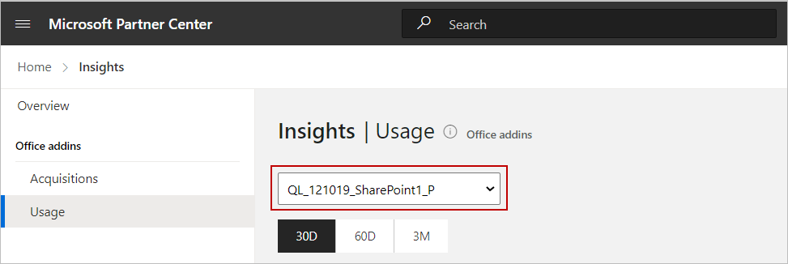

# View the usage report in Partner Center

The _Usage report_ in the Partner Center dashboard lets you see how many customers use your Microsoft 365 app after they acquire it from Microsoft AppSource.

In this report, a usage means a customer has successfully launched an app on any of the four Office apps (Word, Excel, PowerPoint, Outlook) and on any of the five platforms (Win32, Mac, Web, iOS, Android). If a customer launches an app on multiple platforms, it will be counted only once.

The service level agreement (SLA) for acquisitions data is currently four days.

## How to view the Usage report

1. Sign in to [Partner Center](https://partner.microsoft.com/dashboard/home). You can use the same username and password you use to manage Office Store products.

1. Select the **Insights** tile.

    :::image type="content" source="./media/office-store-workspaces/insights-tile.png" alt-text="Illustrates the Insights tile on the Partner Center home page.":::

1. In the left-menu, select **Usage**.

## Multiple apps

As a provider, if you have multiple apps listed on Microsoft AppSource, you can pick the app you want to view the usage for from the list near the upper-left corner of the page.

> [!NOTE]
> Usage of only one app at a time is displayed on the Usage dashboard.

## Time period

Near the top of the page, you can select the time period for which you want to see the usage. The default selection is 30D (30 days), but you can choose to show data for two or three months.

:::image type="content" source="./media/view-usage-report/usage-timeline.png" alt-text="Usage Timeline ":::

## Filters

Near the upper-right side of a page, you can apply different filters to filter all the data on this page by the following: 

- **Market**: The default filter is _All markets_, but you can limit the data by selecting a particular region.
- **Office Apps**: The default filter is _All Office Apps_, but you can limit the data by selecting a particular App.
- **Platform**: The default filter is _All platforms_, but you can limit the data by selecting a particular platform.

> [!Note]
> Currently, you can't choose multiple selections.

## Usage

The Usage chart (Devices tab) shows the number of daily active and new users (where a customer has successfully launched your app) over the selected period of time.

The Usage chart (Retention tab) shows DAU/MAU ratio, which is basically the number of distinct users who launched an app on a given day / number of distinct users who launched an app within the past 30 days from that day.

## Cohort Active Usage (90D)

The Cohort Active Usage (90D) chart shows how a group of users use your app week over week.

The week starts on Monday and ends on Sunday.

For example, for the week of June 1, 2020, the Week 1 usage is 5000, meaning 5000 distinct users launched an app successfully in that week. For the same week, if the Week 2 usage is 20%, that means that 1000 out of those 5000 users launched the same app successfully during the week of June 8.

Date filter doesn’t apply to this chart and it always shows cohort usage for 90 days.

## Device sessions

The Device sessions chart shows the usage over the selected period of time for each market in which your app is launched successfully.

You can view this data in a visual Map form, or toggle the setting to view it in Table form. Table form will show five markets at a time, sorted either alphabetically or by highest/lowest number of usages. You can also download the data to view information for all markets together.

> [!NOTE]
> Devices with unknown geographic locations are not recorded. Geographic locations for Outlook Web App are not available at this time.

## See also

- [View the acquisitions report in the dashboard](view-acquisitions-report.md#acquisitions-chart)
