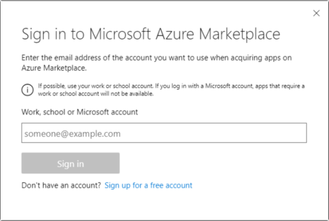
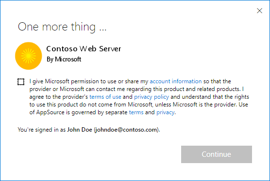

# What is a test drive?

A test drive is a great way to showcase your offer to potential customers by giving them the option to *try before you buy*, resulting in increased conversion and generation of highly qualified leads. A test drive brings your product to life in a real-world implementation scenario while also generating highly qualified leads.

Test drives are managed instances that deploy your solution or application on-demand for customers who request it. Once a test drive instance is assigned, it is available for use for a set amount of time, then deleted to create room for another customer.

As a publisher, you manage and configure the test drive settings in Partner Center. Technical configuration details vary depending on the type of offer you are working with. For detailed guidance, see the link under [Next step](#next-step) at the end of this topic.

Potential customers discover your test drive on the commercial marketplace. They provide their contact information and agree to your offer's terms and privacy policy, and then gain access your pre-configured environment to try it for a fixed period of time. Customers receive a hands-on, self-guided trial of your product's key features and benefits and you receive a valuable lead.

Wrote out above and suggest deleting from here...

The customer agrees to your Terms and Conditions and Privacy Policy:

 ...to here 

## How does it work?

As a publisher, you manage and configure the test drive settings within Partner Center. After setup, it becomes a managed instance that will be deployed on-demand for the customer requesting it. Once a test drive instance is assigned, it is available for use for a set amount of time, then deleted to create room for another customer.

## Types of test drives

No matter how complex your application, there's a Microsoft test drive for your product. There are different types of test drives available based on the type of product, scenario, and marketplace you are on.

There are different test drives available on the commercial marketplace for select offers:

- Azure Resource Manager
- Dynamics 365 logic app
- Power BI
- Hosted

For details on configuring these test drives, see the link under [Next step](#next-step) at the end of this topic.

### Azure Resource Manager

This deployment template contains all the Azure resources that comprise your solution. Products that fit this scenario use only Azure resources. (Dana: "Is this "deployment template" referring to a template they need to create a test drive, or the ARM template itself? If they need to create deployment templates for any test drive, then I think it needs to be clearer, maybe describe in the Wow it works section above. Either way, these two sentences are a bit unclear. Are we saying they don't need to create an additional template to run a test drive? What's the intent here?)

### Dynamics 365 logic app

This deployment template encompasses all complex solution architectures. <-- Delete? All Dynamics applications or custom products should use this type of test drive. If you have an offer on Microsoft AppSource, build your test drive to connect with a Dynamics AX/CRM instance or any other resource beyond just Azure. Microsoft hosts and maintains the test drive service (including provisioning and deployment).

- Use [Dynamics 365 for Business Central](https://docs.microsoft.com/azure/marketplace/partner-center-portal/create-new-operations-offer) for a Business Central enterprise resource planning system such as finance, operations, supply chain, and CRM.
- Use [Dynamics 365 for Customer Engagement](https://docs.microsoft.com/azure/marketplace/partner-center-portal/create-new-customer-engagement-offer) for a Customer Engagement system such as sales, service, project service, and field service.
- Use [Dynamics 365 for Operations](https://docs.microsoft.com/azure/marketplace/partner-center-portal/create-new-operations-offer) for a Finance and Operations enterprise resource planning system such as finance, operations, and manufacturing, supply chain.

Is a D365 app a "logic" app? Should title just be "Logic test drive"? Are D365 and Logic the same test drive? Because the tech config doc Logic app section has D365 links. Hosted test drive has no discussion on the tech config doc.

### Power BI

This is simply an embedded link to a custom-built dashboard. Any product that only demonstrates an interactive Power BI visual should use this type of test drive.

### Hosted test drive

A hosted test drive removes the complexity of setup by letting Microsoft host and maintain the service that performs the test drive user provisioning and de-provisioning. Use this type for AppSource offers to connect with a Dynamics 365 for Customer Engagement, Dynamics 365 for Finance and Operations, or Dynamics 365 Business Central instance. If this is related to Dynamics, should it come right after that section OR be a part of it? Also, in the next article it seems like all D365 test drives are "hosted". Clarify. Maybe this should go in the tech config topic?

## Transforming examples

The process of turning an architecture of resources into a test drive can be daunting. Check out these examples of how to best transform current architectures.

[Transform a website template into a test drive](https://github.com/Azure/AzureTestDrive/wiki/Transforming-Website-Deployment-Template-for-Test-Drive)

[Transform a virtual machine template into a test drive](https://github.com/Azure/AzureTestDrive/wiki/Transforming-Virtual-Machine-Deployment-Template-for-Test-Drive)

[Transform an existing Resource Manager template into a test drive](https://github.com/Azure/AzureTestDrive/wiki/Deploying-Existing-Solutions)

## Generate leads from your test drive

A commercial marketplace test drive is a great tool for marketers. We recommend you incorporate it in your go-to-market efforts when you launch to generate more leads for your business. For detailed guidance, see [Customer leads from your commercial marketplace offer](https://github.com/partner-center-portal/commercial-marketplace-get-customer-leads.md).

If you close a deal with a test drive lead, be sure to register it at Partner sales connect. Also, we would love to hear about your customer wins where a test drive played a role! How? And where is Sales Connect?

## Other resources

Additional test drive resources:

- [Technical best practices](https://github.com/Azure/AzureTestDrive/wiki/Test-Drive-Best-Practices) Dated 4/2017 and shares some suggestions with the Leads topic
- [Overview](https://assetsprod.microsoft.com/mpn/azure-marketplace-appsource-test-drives.pdf) (PDF; make sure your pop-up blocker is off) seems current, but is basically a summary of existing content in these test drive topics.

## Next step

- [Test drive technical configuration](test-drive-technical-configuration.md).
