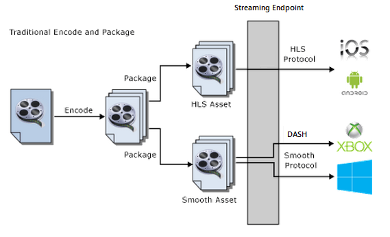
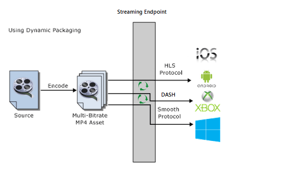

<properties 
	pageTitle="Dynamic Packaging Overview" 
	description="The topic gives and overview of dynamic packaging." 
	authors="Juliako" 
	manager="dwrede" 
	editor="" 
	services="media-services" 
	documentationCenter=""/>

<tags 
	ms.service="media-services" 
	ms.workload="media" 
	ms.tgt_pltfrm="na" 
	ms.devlang="na" 
	ms.topic="article" 
	ms.date="04/15/2015" 
	ms.author="juliako"/>

#Dynamic Packaging 

##Overview

Microsoft Azure Media Services can be used to deliver many media source file formats, media streaming formats, and content protection formats to a variety of client technologies (for example, iOS, XBOX, Silverlight, Windows 8). These clients understand different protocols, for example iOS requires an HTTP Live Streaming (HLS) V4 format and Silverlight and Xbox require Smooth Streaming. If you have a set of adaptive bitrate (multi-bitrate) MP4 (ISO Base Media 14496-12) files or a set of adaptive bitrate Smooth Streaming files that you want to serve to clients that understand MPEG DASH, HLS or Smooth Streaming, you should take advantage of Media Services dynamic packaging.  

With dynamic packaging all you need is to create an asset that contains a set of adaptive bitrate MP4 files or adaptive bitrate Smooth Streaming files. Then, based on the specified format in the manifest or fragment request, the On-Demand Streaming server will ensure that you receive the stream in the protocol you have chosen. As a result, you only need to store and pay for the files in single storage format and Media Services service will build and serve the appropriate response based on requests from a client.

The following diagram shows the traditional encoding and static packaging workflow.

The following diagram shows the dynamic packaging workflow.

>[AZURE.NOTE]To take advantage of dynamic packaging, you must first get at least one On-demand streaming unit for the streaming endpoint from which you plan to delivery your content. For more information, see [How to Scale Media Services](media-services-manage-origins.md#scale_streaming_endpoints).

##Common scenario

1. Upload an input file (called a mezzanine file). For example, H.264, MP4, or WMV (for the list of supported formats see Formats Supported by the Media Services Encoder).
 
1. Encode your mezzanine file to H.264 MP4 adaptive bitrate sets.
 
1. Publish the asset that contains the adaptive bitrate MP4 set by creating the On-Demand Locator.
 
1. Build the streaming URLs to access and stream your content.
 
>[AZURE.NOTE]Not all MP4 file formats are supported by dynamic packaging, for more information, see [Unsupported formats for dynamic packaging](media-services-dynamic-packaging-overview.md#unsupported_formats).

##Preparing assets for dynamic streaming

To prepare your asset for dynamic streaming you have two options: 

- Upload a master file and produce H.264 MP4 adaptive bitrate sets using the Azure Media Encoder.
- Upload existing adaptive bitrate sets and validate them using the Media Packager.

###Upload a master file and produce H.264 MP4 adaptive bitrate sets using the Azure Media Encoder

For information about how to upload and encode assets see the following articles:

Upload your files using **Azure Management Portal**, **.NET** or **REST API**.

[AZURE.INCLUDE [media-services-selector-upload-files](../includes/media-services-selector-upload-files.md)]

Encode with **Azure Media Encoder** using **Azure Management Portal**, **.NET**, or **REST API**.
 
[AZURE.INCLUDE [media-services-selector-encode](../includes/media-services-selector-encode.md)]

###Upload existing adaptive bitrate sets and validate them using the Media Packager

You would typically want to perform this task if you are uploading a set of adaptive bitrate MP4 files that were not encoded with Media Services Encoder. The [Validating Adaptive Bitrate MP4s Encoded with External Encoders](https://msdn.microsoft.com/library/azure/dn750842.aspx) topic shows how to achieve this task.

##Streaming your content to clients

Once you have the adaptive bitrate sets, you can publish your asset by creating an On-Demand locator and compose the streaming URLs for Smooth Steaming, MPEG DASH, HLS, and HDS (for Adobe PrimeTime/Access licensees only).

For information on how to create locators and use dynamic packaging to stream your content, see the following topics:

[Delivering Content to Customers Overview](media-services-deliver-content-overview.md). 

Configure asset delivery policy using **.NET** or **REST API**.

[AZURE.INCLUDE [media-services-selector-asset-delivery-policy](../includes/media-services-selector-asset-delivery-policy.md)]

Publish assets (by creating Locators) using **Azure Management Portal** or **.NET**.

[AZURE.INCLUDE [media-services-selector-publish](../includes/media-services-selector-publish.md)]

##Formats that are not supported by dynamic packaging

The following source file formats are not supported by dynamic packaging.

- Dolby digital plus mp4 files.
- Dolby digital plus smooth files.