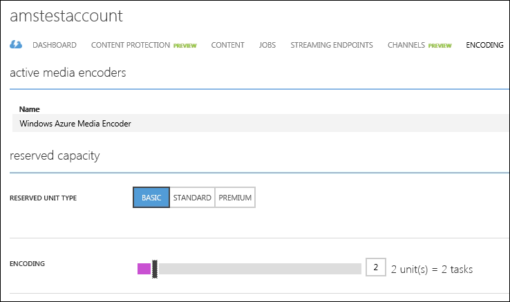

<properties urlDisplayName="How to scale" pageTitle="How to Scale a media service | Azure Documentation" metaKeywords="" description="Learn how to scale Media Services by specifying the number of On-Demand Streaming Reserved Units and Encoding Reserved Units that you would like your account to be provisioned with." metaCanonical="" services="media-services" documentationCenter="" title="How to Scale a Media Service" authors="juliako" solutions="" manager="dwrede" editor="" />

<tags ms.service="media-services" ms.workload="media" ms.tgt_pltfrm="na" ms.devlang="na" ms.topic="article" ms.date="09/26/2014" ms.author="juliako" />

#How to Scale a Media Service  

[WACOM.INCLUDE [disclaimer](../includes/disclaimer.md)]

You can scale Media Services by specifying the number of **On-Demand Streaming Reserved Units** and **Encoding Reserved Units** that you would like your account to be provisioned with. 

<h2>On-Demand Streaming Reserved Units</h2>

On-Demand Streaming reserved units provide you with both dedicated egress capacity that can be purchased in increments of 200 Mbps and  additional functionality which currently includes [dynamic packaging capabilities](http://go.microsoft.com/fwlink/?LinkId=276874). By default, on-demand streaming is configured in a shared-instance model for which server resources (for example, compute, egress capacity, etc.) are shared with all other users. To improve an on-demand streaming throughput, it is recommended to purchase On-Demand Streaming reserved units. 

To change the number of on-demand streaming reserved units, do the following:

1. In the [Management Portal](https://manage.windowsazure.com/), click **Media Services**. Then, click the name of the media service.

2. Select the STREAMING ENDPOINTS page. Then, click on the streaming endpoint that you want to modify.

3. To specify the number of streaming units, select the SCALE tab and move the **reserved capacity** slider.

	

4. Press the SAVE button to save your changes.

	The allocation of any new units of on-demand streaming takes around 20 minutes to complete. 

	 
	>[Azure.Note] Currently, going from any positive value of on-demand streaming units back to none, can disable on-demand streaming for up to an hour.

	>[Azure.Note] The highest number of units specified for the 24-hour period is used in calculating the cost. For information about pricing details, see [Media Services Pricing Details](http://go.microsoft.com/fwlink/?LinkId=275107).

<h2>Encoding Reserved Units</h2>

The number of provisioned encoding reserved units is equal to the number of media tasks that can be processed concurrently in a given account. For example, if your account has 5 reserved units, then 5 media tasks will be running concurrently as long as there are tasks to be processed. The remaining tasks will wait in the queue and will get picked up for processing sequentially as soon as a running task finishes. If an account does not have any reserved units provisioned, then tasks will be picked up sequentially. In this case, the wait time between one task finishing and the next one starting will depend on the availability of resources in the system.

To change the number of encoding reserved units, do the following:

1. In the [Management Portal](https://manage.windowsazure.com/), click **Media Services**. Then, click the name of the media service.

2. Select the ENCODING page. 
	
	The Encoding page enables you to select between three different types of encoding reserved units:  Basic, Standard and Premium (as shown below).

	

	You can change the number of reserved units for the selected RESERVED UNIT TYPE by using the ENCODING slider.  
	
	The main difference between reserver unit types is speed. For example, the same encoding job runs faster when you use the Standard reserved unit type compare to the Basic type. For more information, see the "Encoding Reserved Unit Types" blog written by [Milan Gada](http://azure.microsoft.com/blog/author/milanga/).

	>[Azure.Note] The following data centers to not offer the Premium reserved unit type: Singapore, Hong Kong, Osaka, Beijing, Shanghai.

3. Press the SAVE button to save your changes.

	The new encoding reserved units are allocated as soon as you press SAVE.

	>[Azure.Note] The highest number of units specified for the 24-hour period is used in calculating the cost.

<h2>Opening a Support Ticket</h2>

By default every Media Services account can scale to up to 25 Encoding and 5 On-Demand Streaming Reserved Units. You can request a higher limit by opening a support ticket.

To open a support ticket do the following: 

1. Log in to your Azure account at [Management Portal](http://manage.windowsazure.com).
2. Go to [Support](http://www.windowsazure.com/en-us/support/contact/).
3. Click on "Get Support".
4. Select your subscription.
5. Under support type select "Technical".
6. Click on "Create Ticket".
7. Select "Azure Media Services" in the product list presented on the next page.
8. Select "Media Processing" as "Problem type" and then select "Reservation Units" under category.
9. Click Continue.
10. Follow instructions on next page and then enter details about how many Encoding or On-Demand Streaming reserved units you need.
11. Click submit to open the ticket.

 

