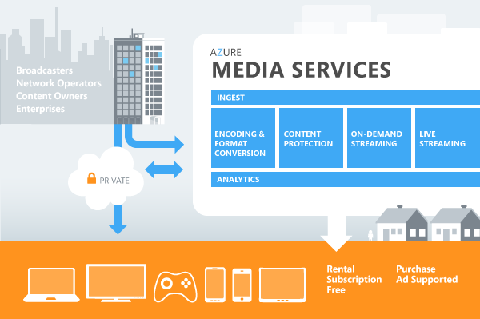

<properties 
	pageTitle="How to use Media Services (Java) - Azure feature guide" 
	description="Describes how to use Azure Media Services to perform common tasks including encoding, encrypting, and streaming resources." 
	services="media-services" 
	documentationCenter="java" 
	authors="rmcmurray" 
	manager="wpickett" 
	editor="jimbe"/>

<tags 
	ms.service="media-services" 
	ms.workload="media" 
	ms.tgt_pltfrm="na" 
	ms.devlang="na" 
	ms.topic="article" 
	ms.date="02/20/2015" 
	ms.author="robmcm"/>

#How to Use Media Services

This guide shows you how to start programming with Azure Media Services using Java. The guide includes a technical overview of Media Services, steps to configure your Azure account for Media Services, and code that shows how to accomplish typical programming tasks. 

##What is Media Services

Azure Media Services form an extensible media platform that integrates the best of the Microsoft Media Platform and third-party media components in Azure. Media Services provide a media pipeline in the cloud that enables industry partners to extend or replace component technologies. ISVs and media providers can use Media Services to build end-to-end media solutions. This overview describes the general architecture and common development scenarios for Media Services.

The following diagram illustrates the basic Media Services architecture.

###Media Services Feature Support
The current release of Media Services provides the following feature set for developing media applications in the cloud. 

- **Ingest**. Ingest operations bring assets into the system, for example by uploading them and encrypting them before they are placed into Azure Storage. By the RTM release, Media Services will offer integration with partner components to provide fast UDP (User Datagram Protocol) upload solutions.
- **Encode**. Encode operations include encoding, transforming and converting media assets. You can run encoding tasks in the cloud using the Media Encoder that is included in Media Services. Encoding options include the following:
   - Use the Azure Media Encoder and work with a range of standard codecs and formats, including industry-leading IIS Smooth Streaming, MP4, and conversion to Apple HTTP Live Streaming.
   - Convert entire libraries or individual files with total control over input and output.
   - A large set of supported file types, formats, and codecs (see [Supported File Types for Media Services][]).
   - Supported format conversions. Media Services enable you to convert ISO MP4 (.mp4) to Smooth Streaming File Format (PIFF 1.3) (.ismv; .isma). You can also convert Smooth Streaming File Format (PIFF) to Apple HTTP Live Streaming (.msu8, .ts).
- **Protect**. Protecting content means encrypting live streaming or on demand content for secure transport, storage, and delivery. Media Services provide a DRM technology-agnostic solution for protecting content.  Currently supported DRM technologies are Microsoft PlayReady Protection and MPEG Common Encryption. Support for additional DRM technologies will be available. 
- **Stream**. Streaming content involves sending it live or on demand to clients, or you can retrieve or download specific media files from the cloud. Media Services provide a format-agnostic solution for streaming content.  Media Services provide  streaming origin support for Smooth Streaming, Apple HTTP Live Streaming, and MP4 formats. Support for additional formats will be available. You can also seamlessly deliver streaming content by using Azure CDN or a third-party CDN, which enables the option  to scale to millions of users.   

###Media Services Development Scenarios
Media Services support several common media development scenarios as described in the following table. 
<table border="2" cellspacing="0" cellpadding="5" style="border: 2px solid #000000;">
  <thead>
    <tr>
       <th>Scenario</th>
       <th>Description</th>
    </tr>
  </thead>
  <tbody>
    <tr>
        <td>Building end-to-end workflows</td>
        <td>Build comprehensive media workflows entirely in the cloud. From uploading media to distributing content, Media Services provide a range of components that can be combined to handle specific application workflows. Current capabilities include upload, storage, encoding, format conversion, content protection, and on-demand streaming delivery.</td>
    </tr>
    <tr>
        <td>Building hybrid workflows</td>
        <td>You can integrate Media Services with existing tools and processes. For example, encode content on-site then upload to Media Services for transcoding into multiple formats and deliver through Azure CDN, or a third-party CDN. Media Services can be called individually via standard REST APIs for integration with external applications and services.</td>
    </tr>
    <tr>
        <td>Providing cloud support for media players</td>
        <td>You can create, manage, and deliver media across multiple devices (including iOS, Android, and Windows devices) and platforms.</td>
    </tr>
  </tbody>
</table>

###Media Services Client Development
Extend the reach of your Media Services solution by using SDKs and player frameworks to build media client applications. These clients are for developers who want to build Media Services applications that offer compelling user experiences across a range of devices and platforms. Depending on the devices that you want to build client applications for, there are options for SDKs and player frameworks available from Microsoft and other third-party partners.  

The following provides a list of available client SDKs and player frameworks.  For more information on these and other planned SDKs and player frameworks, and the functionality they can support, see [Media Services Client Development]. 

####Mac and PC client support  
For PCs and Macs you can target a streaming experience using Microsoft Silverlight or Adobe Open Source Media Framework.

-	[Smooth Streaming Client for Silverlight](http://www.iis.net/download/smoothclient)
-	[Microsoft Media Platform: Player Framework for Silverlight](http://smf.codeplex.com/documentation)
-	[Smooth Streaming Plugin for OSMF 2.0](http://go.microsoft.com/fwlink/?LinkId=275022). For information on how to use this plug-in, see [How to Use Smooth Streaming Plugin for Adobe Open Source Media Framework](http://go.microsoft.com/fwlink/?LinkId=275034).

####Windows 8 applications
For Windows 8, you can build Windows Store applications using any of the supported development languages and constructs like HTML, Javascript, XAML, C# and C+.

-	[Smooth Streaming Client SDK for Windows 8](http://go.microsoft.com/fwlink/?LinkID=246146). For more information on how to create a Windows Store application using this SDK, see [How to Build a Smooth Streaming Windows Store Application](http://go.microsoft.com/fwlink/?LinkId=271647). For information on how to create a smooth streaming player in HTML5, see [Walkthrough: Building Your First HTML5 Smooth Streaming Player](http://msdn.microsoft.com/library/jj573656.aspx).

-	[Microsoft Media Platform: Player Framework for Windows 8 Windows Store Applications](http://playerframework.codeplex.com/wikipage?title=Player%20Framework%20for%20Windows%208%20Metro%20Style%20Apps&referringTitle=Home)

####Xbox
Xbox supports Xbox LIVE applications that can consume Smooth Streaming content. The Xbox LIVE Application Development Kit (ADK) includes:

-	Smooth Streaming client for Xbox LIVE ADK
-	Microsoft Media Platform: Player Framework for Xbox LIVE ADK

####Embedded or dedicated devices
Devices such as connected TVs, set-top boxes, Blu-Ray players, OTT TV boxes, and mobile devices that have a custom application development framework and a custom media pipeline. Microsoft provides the following porting kits that can be licensed, and enables partners to port Smooth Streaming playback for the platform.

-	[Smooth Streaming Client Porting Kit](http://www.microsoft.com/mediaplatform/sspk.aspx)
-	[Microsoft PlayReady Device Porting Kit](http://www.microsoft.com/PlayReady/Licensing/device_technology.mspx)

####Windows Phone
Microsoft provides an SDK that can be used to build premium video applications for Windows Phone. 

-	[Smooth Streaming Client for Silverlight](http://www.iis.net/download/smoothclient)
-	[Microsoft Media Platform: Player Framework for Silverlight](http://smf.codeplex.com/documentation)

####iOS devices
For iOS devices including iPhone, iPod, and iPad, Microsoft ships an SDK that you can use to build applications for these platforms to deliver premium video content: Smooth Streaming SDK for iOS Devices with PlayReady.  The SDK is available only to licensees, so for more information, please [email Microsoft](mailto:askdrm@microsoft.com). For information on iOS development, see the [iOS Developer Center](https://developer.apple.com/devcenter/ios/index.action).

####Android devices
Several Microsoft partners ship SDKs for the Android platform that add the capability to play back Smooth Streaming on an Android device. Please [email Microsoft](mailto:sspkinfo@microsoft.com?subject=Partner%20SDKs%20for%20Android%20Devices) for more details on the partners.

##Setting Up an Azure Account for Media Services

To set up your Media Services account, use the Azure Management Portal. See the topic [How to Create a Media Services Account][]. After creating your account in the Management Portal, you are ready to set up your computer for Media Services development. 

##Setting up for Media Services development

This section contains general prerequisites for Media Services development using the Media Services SDK for Java.

###Prerequisites

-   A Media Services account in a new or existing Azure subscription. See the topic [How to Create a Media Services Account][].
-   The Azure Libraries for Java, which you can install from the [Azure Java Developer Center][].

##How to: Use Media Services with Java

The following code shows how to create an asset, upload a media file to the asset, run a job with a task to transform the asset, and download the output files of the transformed asset.

You'll need to set up a media services account before using this code. For information about setting up an account, see [How to Create a Media Services Account](http://www.windowsazure.com/manage/services/media-services/how-to-create-a-media-services-account/).

Substitute your values for the `clientId` and `clientSecret` variables. The code also relies on a locally stored file, `c:/media/MPEG4-H264.mp4`. You'll need to provide your own file to use. The code also requires an output folder, `c:/output`, which is where the output files will be downloaded.

	import java.io.*;
	import java.net.URI;
	import java.net.URISyntaxException;
	import java.security.NoSuchAlgorithmException;
	import java.util.EnumSet;
	import java.util.List;
	
	import com.microsoft.windowsazure.services.blob.client.*;
	import com.microsoft.windowsazure.services.core.Configuration;
	import com.microsoft.windowsazure.services.core.ServiceException;
	import com.microsoft.windowsazure.services.core.storage.StorageException;
	import com.microsoft.windowsazure.services.media.*;
	import com.microsoft.windowsazure.services.media.models.*;
	
	public class HelloMediaServices 
	{
	
	    private static MediaContract mediaService;
	    private static AssetInfo assetToEncode, encodedAsset;
	
	    public static void main(String[] args) 
	    {
	        try 
	        {
	
	            // Set up the MediaContract object to call into the media services.
	            Init();
	            
	            // Upload a local file to a media asset.
	            Upload();
	
	            // Transform the asset.
	            Transform();
	
	            // Retrieve the URL of the asset's transformed output.
	            Download();
	
	            // Delete all assets. 
	            // When you want to delete the assets that have been uploaded, 
	            // comment out the calls to Upload(), Transfer(), and Download(), 
	            // and uncomment the following call to Cleanup().
	            //Cleanup();
	
	            System.out.println("Application completed.");
	        }
	        catch (ServiceException se) 
	        {
	            System.out.println("ServiceException encountered.");
	            System.out.println(se.getMessage());
	        }
	        catch (Exception e) 
	        {
	            System.out.println("Exception encountered.");
	            System.out.println(e.getMessage());
	        }
	    }
	
	    // Initialize the server context to get programmatic access to the Media Services programming objects.
	    // The media services URI, OAuth URI and scope can be used exactly as shown.
	    // Substitute your media service account name and access key for the clientId and clientSecret variables.
	    // You can obtain your media service account name and access key from the Media Services section
	    // of the Azure Management portal, https://manage.windowsazure.com.
	    private static void Init() throws ServiceException 
	    {
	        String mediaServiceUri = "https://media.windows.net/API/";
	        String oAuthUri = "https://wamsprodglobal001acs.accesscontrol.windows.net/v2/OAuth2-13";
	        String clientId = "your_client_id";  // Use your media service account name.
	        String clientSecret = "your_client_secret"; // Use your media service access key. 
	        String scope = "urn:WindowsAzureMediaServices";
	
	        // Specify the configuration values to use with the MediaContract object.
	        Configuration configuration = MediaConfiguration
	                .configureWithOAuthAuthentication(mediaServiceUri, oAuthUri, clientId, clientSecret, scope);
	
	        // Create the MediaContract object using the specified configuration.
	        mediaService = MediaService.create(configuration);
	        
	    }
	
	    // Upload a media file to your Media Services account.
	    // This code creates an asset, an access policy (using Write access) and a locator, 
	    // and uses those objects to upload a local file to the asset.
	    private static void Upload() throws ServiceException, FileNotFoundException, NoSuchAlgorithmException 
	    {
	    	
	    	WritableBlobContainerContract uploader;
	    	
	    	AccessPolicyInfo uploadAccessPolicy;
	    	LocatorInfo uploadLocator = null;
	    	
	        // Create an asset.
	    	assetToEncode = mediaService.create(Asset.create().setName("myAsset").setAlternateId("altId"));
	        System.out.println("Created asset with id: " + assetToEncode.getId());
	
	        // Create an access policy that provides Write access for 15 minutes.
	        uploadAccessPolicy = mediaService.create(AccessPolicy.create("uploadAccessPolicy", 
	        		                                                     15.0, 
	        		                                                     EnumSet.of(AccessPolicyPermission.WRITE)));
	        System.out.println("Created upload access policy with id: "
	                + uploadAccessPolicy.getId());
	
	        // Create a locator using the access policy and asset.
	        // This will provide the location information needed to add files to the asset.
	        uploadLocator = mediaService.create(Locator.create(uploadAccessPolicy.getId(),
	        		assetToEncode.getId(), LocatorType.SAS));
	        System.out.println("Created upload locator with id: " + uploadLocator.getId());
	
	        // Create the blob writer using the locator.
	        uploader = mediaService.createBlobWriter(uploadLocator);
	
	        // The name of the file as it will exist in your Media Services account.
	        String fileName = "MPEG4-H264.mp4";  
	
	        // The local file that will be uploaded to your Media Services account.
	        InputStream input = new FileInputStream(new File("c:/media/" + fileName));
	
	        // Upload the local file to the asset.
	        uploader.createBlockBlob(fileName, input);
	
	        // Inform Media Services about the uploaded files.
	        mediaService.action(AssetFile.createFileInfos(assetToEncode.getId()));
	        System.out.println("File uploaded.");
	        
	       
	        System.out.println("Deleting upload locator and access policy.");
	        mediaService.delete(Locator.delete(uploadLocator.getId()));
	        mediaService.delete(AccessPolicy.delete(uploadAccessPolicy.getId()));
	        
	    }
	
	    // Create a job that contains a task to transform the asset.
	    // In this example, the asset will be transformed using the Azure Media Encoder.
	    private static void Transform() throws ServiceException, InterruptedException 
	    {
	        // Use the Azure Media Encoder, by specifying it by name.
	        // Retrieve the list of media processors that match this name.   	
	    	ListResult<MediaProcessorInfo> mediaProcessors = mediaService
	    			.list(MediaProcessor.list()
	    			.set("$filter", "Name eq 'Azure Media Encoder'"));
	    	
	    	// Use the latest version of the media processor.
	    	MediaProcessorInfo mediaProcessor = null;
	    	for (MediaProcessorInfo info : mediaProcessors)
	    	{
	    		if (null == mediaProcessor || info.getVersion().compareTo(mediaProcessor.getVersion()) > 0)
	    		{
	    			mediaProcessor = info;
	    		}
	    	}
	
	    	System.out.println("Using processor: " + mediaProcessor.getName() +
	    			" " + mediaProcessor.getVersion());
	
	        // Create a task with the specified media processor, in this case to transform the original asset to the H264 Broadband 720p preset.
	        // Information on the various configurations can be found at
	        // http://msdn.microsoft.com/library/windowsazure/jj129582.aspx.
	        // This example uses only one task, but others could be added.
	        Task.CreateBatchOperation task = Task.create(
	                mediaProcessor.getId(),
	                "<taskBody><inputAsset>JobInputAsset(0)</inputAsset><outputAsset>JobOutputAsset(0)</outputAsset></taskBody>")
	                .setConfiguration("H264 Broadband 720p").setName("MyTask");
	
	        // Create a job creator that specifies the asset, priority and task for the job. 
	        Job.Creator jobCreator = Job.create()
	            .setName("myJob")
	            .addInputMediaAsset(assetToEncode.getId())
	            .setPriority(2)
	            .addTaskCreator(task);
	
	        // Create the job within your Media Services account.
	        // Creating the job automatically schedules and runs it.
	        JobInfo jobInfo = mediaService.create(jobCreator);
	        String jobId = jobInfo.getId();
	        System.out.println("Created job with id: " + jobId);
	        // Check to see if the job has completed.
	        CheckJobStatus(jobId);
	        // Done with the job.
	
	        // Retrieve the output asset.
	        ListResult<AssetInfo> outputAssets = mediaService.list(Asset.list(jobInfo.getOutputAssetsLink()));
	        encodedAsset = outputAssets.get(0);
	    }
	
	    // Download the output assets of the transformed asset.
	    private static void Download() throws ServiceException, URISyntaxException, FileNotFoundException, StorageException, IOException 
	    {
	    	
	    	AccessPolicyInfo downloadAccessPolicy = null;
	
	        downloadAccessPolicy =
	                mediaService.create(AccessPolicy.create("Download", 15.0, EnumSet.of(AccessPolicyPermission.READ)));
	        System.out.println("Created download access policy with id: "
	                + downloadAccessPolicy.getId());
	    	
	    	LocatorInfo downloadLocator = null;
	        downloadLocator = mediaService.create(
	        		Locator.create(downloadAccessPolicy.getId(), encodedAsset.getId(), LocatorType.SAS));
	        System.out.println("Created download locator with id: " + downloadLocator.getId());        
	
	        System.out.println("Accessing the output files of the encoded asset.");
	        // Iterate through the files associated with the encoded asset.
	        for(AssetFileInfo assetFile: mediaService.list(AssetFile.list(encodedAsset.getAssetFilesLink())))
	        {
	            String fileName = assetFile.getName();
	            
	            System.out.print("Downloading file: " + fileName + ". ");
	            String locatorPath = downloadLocator.getPath();
	            int startOfSas = locatorPath.indexOf("?");
	
	            String blobPath = locatorPath + fileName;
	            if (startOfSas >= 0) 
	            {
	                blobPath = locatorPath.substring(0, startOfSas) + "/" + fileName + locatorPath.substring(startOfSas);
	            }
	            URI baseuri = new URI(blobPath);
	            CloudBlobClient blobClient;
	            blobClient = new CloudBlobClient(baseuri);
	            
	            // Ensure that you have a c:\output folder, or modify the path specified in the following statement.
	            String localFileName = "c:/output/" + fileName;
	            
	            CloudBlockBlob sasBlob;
	            sasBlob = new CloudBlockBlob(baseuri, blobClient);
	            File fileTarget = new File(localFileName);
	            
	            sasBlob.download(new FileOutputStream(fileTarget));
	            System.out.println("Download complete.");
	            
	        }
	
	        System.out.println("Deleting download locator and access policy.");
	        mediaService.delete(Locator.delete(downloadLocator.getId()));
	        mediaService.delete(AccessPolicy.delete(downloadAccessPolicy.getId()));
	      
	    }
	    
	    // Remove all assets from your Media Services account.
	    // You could instead remove assets by name or ID, etc., but for 
	    // simplicity this example removes all of them.
	    private static void Cleanup() throws ServiceException 
	    {
	        // Retrieve a list of all assets.
	        List<AssetInfo> assets = mediaService.list(Asset.list());
	
	        // Iterate through the list, deleting each asset.
	        for (AssetInfo asset: assets)
	        {
	        	System.out.println("Deleting asset named " + asset.getName() + " (" + asset.getId() + ")");
	            mediaService.delete(Asset.delete(asset.getId()));
	        }
	    }
	
	    // Helper function to check to on the status of the job.
	    private static void CheckJobStatus(String jobId) throws InterruptedException, ServiceException
	    {
	        int maxRetries = 12; // Number of times to retry. Small jobs often take 2 minutes.
	        JobState jobState = null;
	        while (maxRetries > 0) 
	        {
	            Thread.sleep(10000);  // Sleep for 10 seconds, or use another interval.
	            // Determine the job state.
	            jobState = mediaService.get(Job.get(jobId)).getState();
	            System.out.println("Job state is " + jobState);
	
	            if (jobState == JobState.Finished || 
	                jobState == JobState.Canceled || 
	                jobState == JobState.Error) 
	            {
	                // The job is done.
	                break;
	            }
	            // The job is not done. Sleep and loop if max retries 
	            // has not been reached.
	            maxRetries--;
	        }
	  
	    }
	
	}

The assets that you create are stored in Azure storage. However, use only the Azure media services APIs (not Azure storage APIs) to add, update, or delete assets.

###Determining which media processors are available

The code above used a media processor by accessing it via a specific media processor name (and if there was more than one version, it would use the latest version). To determine which media processors are available, you could use the following code.

    for (MediaProcessorInfo mediaProcessor:  mediaService.list(MediaProcessor.list()))
    {
        System.out.print(mediaProcessor.getName() + ", ");
        System.out.print(mediaProcessor.getId() + ", ");  
        System.out.print(mediaProcessor.getVendor() + ", ");  
        System.out.println(mediaProcessor.getVersion());  
    }

Alternatively, the following code shows how to retrieve the ID of a media processor by name.

    String mediaProcessorName = "Storage Decryption"; 
    EntityListOperation<MediaProcessorInfo> operation;
    MediaProcessorInfo processor;

    operation = MediaProcessor.list();
    operation.getQueryParameters().putSingle("$filter", "Name eq '" + mediaProcessorName + "'");
    processor = mediaService.list(operation).get(0); 
    System.out.println("Processor named " + mediaProcessorName + 
                       " has ID of " + processor.getId());

###Canceling a job
Should you need to cancel a job that hasn't finished processing, the following code shows how to cancel a job by job ID.

    mediaService.action(Job.cancel(jobId));

##Additional Resources

For Media Services Javadoc documentation, see [Azure Libraries for Java documentation][].

<!-- URLs. -->

  [How to Create a Media Services Account]: http://go.microsoft.com/fwlink/?linkid=256662
  [Azure Java Developer Center]: http://www.windowsazure.com/develop/java/
  [Azure Libraries for Java documentation]: http://dl.windowsazure.com/javadoc/
  [Media Services Client Development]: http://msdn.microsoft.com/library/windowsazure/dn223283.aspx

